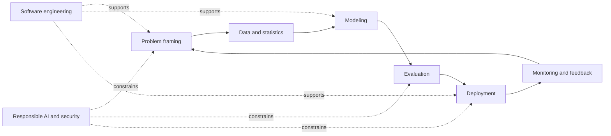
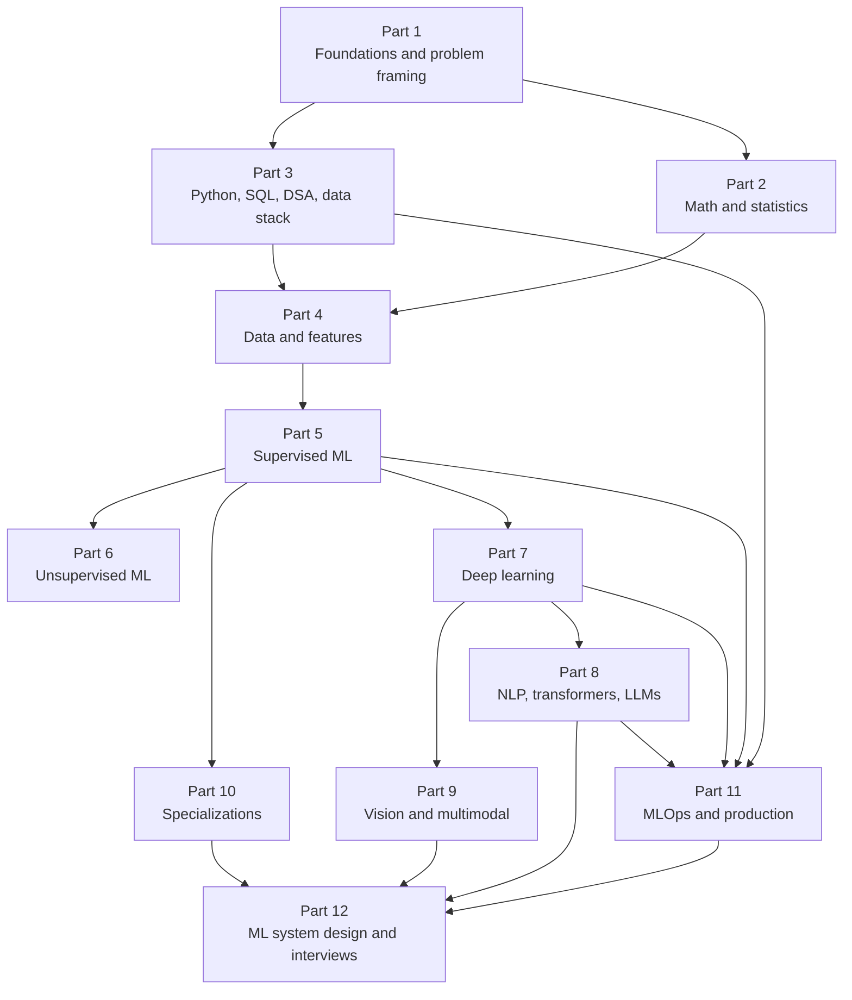
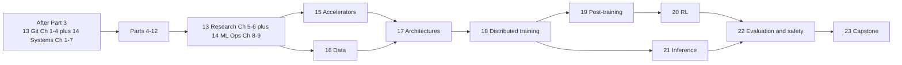

# Complete AI/ML Roadmap: Beginner to Senior Interview Readiness

## 1. What this roadmap optimizes for

This is not merely a sequence of courses. It develops four abilities in
parallel:

1. **Theory:** understand why methods work, not just their APIs.
2. **Implementation:** translate an idea into correct, testable code.
3. **Experimentation:** design trustworthy experiments and interpret results.
4. **Production judgment:** build a reliable system around an imperfect model.

At SDE-II/SDE-III level, knowing model names is insufficient. Interviewers
expect trade-off analysis, system boundaries, failure modes, measurement,
reliability, and communication. The destination therefore looks like this:



## 2. Role map

AI/ML job titles overlap. Use the roadmap's common core, then emphasize the
competencies in the role you want.

| Role | Primary work | Strongest interview emphasis |
|---|---|---|
| Software engineer on an ML product | APIs, services, data flows, inference integration | DSA, distributed systems, model-serving basics, reliability |
| ML engineer | Training/inference pipelines and production models | ML fundamentals, coding, data pipelines, MLOps, ML system design |
| Applied AI/LLM engineer | RAG, agents, evaluations, model APIs, fine-tuning | LLM internals, retrieval, evals, safety, latency/cost, backend engineering |
| Data scientist | Analysis, experimentation, prediction, business decisions | statistics, SQL, metrics, experiment design, modeling, communication |
| Research/applied scientist | New methods and rigorous model improvement | mathematics, papers, experimental rigor, deep specialization |
| Data engineer for ML | Dependable datasets and feature pipelines | SQL, batch/stream processing, storage, quality, lineage, distributed systems |

The full path supports ML engineering and applied AI. For research scientist
roles, add graduate-level probability, optimization, and paper reproduction.

## 3. Dependency map



Parts 2 and 3 should be studied partly in parallel: mathematics explains the
models, while programming turns understanding into durable skill.

## 4. The roadmap

### [Part 1 — AI/ML foundations and problem framing](part-01-foundations/README.md)

**Goal:** develop the vocabulary and decision process used throughout ML.

**Topics**

- AI vs ML vs deep learning vs generative AI
- Rules, search, optimization, statistics, and learned systems
- Features, labels, examples, models, parameters, hyperparameters, inference
- Supervised, unsupervised, semi-supervised, self-supervised, reinforcement,
  online, and active learning
- Classification, regression, ranking, recommendation, forecasting, generation,
  anomaly detection, clustering, and dimensionality reduction
- Turning a product goal into an ML problem
- Population, samples, assumptions, splits, data leakage, and distribution shift
- Baselines, loss functions, offline metrics, online metrics, and guardrails
- Generalization, underfitting, overfitting, bias/variance, and regularization
- The end-to-end ML lifecycle, monitoring, feedback loops, fairness, and safety

**Deliverable:** write a one-page design for a spam classifier, including its
label, data split, baseline, metrics, constraints, risks, and monitoring plan.

**Exit criteria:** you can defend whether a problem needs ML, formulate it,
choose an initial metric, spot obvious leakage, and describe the lifecycle.

### [Part 2 — Mathematical and statistical foundations](part-02-mathematics/README.md)

**Goal:** read ML equations fluently and reason about uncertainty.

**Topics**

- Arithmetic review, functions, logs, exponentials, summations, and notation
- Vectors, matrices, tensors, dot products, norms, projections, rank, inverse
- Eigenvalues/eigenvectors, eigendecomposition, SVD, and positive-definite matrices
- Derivatives, partial derivatives, gradients, Jacobians, Hessians, chain rule
- Gradient descent, stochastic optimization, constrained optimization, convexity
- Sets, combinatorics, conditional probability, Bayes' theorem, independence
- Random variables, expectation, variance, covariance, common distributions
- Sampling, estimators, bias, variance, likelihood, MLE, MAP
- Confidence intervals, hypothesis tests, p-values, power, multiple testing
- Correlation vs causation, confounding, randomized experiments, A/B testing
- Information theory: entropy, cross-entropy, KL divergence, mutual information

**Implement from scratch:** vector operations, linear regression with gradient
descent, common distributions, confidence intervals, and an A/B test analyzer.

**Exit criteria:** derive linear/logistic regression objectives, explain maximum
likelihood, calculate common probabilities, and critique an experiment.

### [Part 3 — Python, SQL, DSA, and the data stack](part-03-python-data-stack/README.md)

**Goal:** become a strong engineer who can manipulate data and write dependable
ML software.

**Topics**

- Python syntax, object model, mutability, iterators/generators, decorators,
  context managers, typing, dataclasses, exceptions, packaging, environments
- Testing, logging, profiling, debugging, numerical correctness, clean APIs
- NumPy arrays, shapes, broadcasting, vectorization, memory layout
- pandas or Polars: joins, grouping, windows, missing data, time data
- Visualization with Matplotlib/Seaborn/Plotly
- SQL joins, aggregation, subqueries, CTEs, windows, query planning, indexes
- Data structures, complexity, arrays, strings, hashes, trees, heaps, graphs
- Sorting, binary search, recursion, dynamic programming, graph traversal
- Linux, Git, HTTP, REST/gRPC, Docker, concurrency, and cloud fundamentals

**Projects:** a tested mini dataframe utility, an EDA CLI, and 75–150 targeted
DSA/SQL problems depending on current software-engineering experience.

**Exit criteria:** write vectorized data transformations, complex SQL, tested
Python packages, and medium-level DSA solutions with explicit complexity.

### [Part 4 — Data preparation and feature engineering](part-04-data-and-features/README.md)

**Goal:** turn raw, imperfect observations into a reproducible training dataset.

**Topics**

- Data collection, schemas, provenance, labeling, weak supervision, annotation QA
- EDA: distributions, relationships, segments, outliers, missingness mechanisms
- Deduplication, imputation, scaling, encoding, transformations, discretization
- Text, image, categorical, geospatial, temporal, and interaction features
- Feature selection, feature extraction, feature crosses, embeddings
- Class imbalance: resampling, cost weighting, thresholding, focal loss
- Leakage-safe pipelines, point-in-time correctness, offline/online consistency
- Data versioning, lineage, contracts, validation, privacy, retention

**Project:** construct a reproducible dataset and feature pipeline from messy raw
data, with schema tests and a written leakage audit.

### [Part 5 — Classical supervised learning](part-05-supervised-learning/README.md)

**Goal:** understand the major model families deeply enough to derive, implement,
tune, compare, and debug them.

**Topics**

- Linear regression, polynomial/basis expansion, Ridge, Lasso, Elastic Net
- Logistic regression, softmax regression, calibration, decision thresholds
- k-nearest neighbors and the curse of dimensionality
- Naive Bayes and generative vs discriminative classifiers
- Decision trees: splitting criteria, pruning, instability
- Bagging, random forests, extremely randomized trees
- Boosting: AdaBoost, gradient boosting, XGBoost/LightGBM/CatBoost concepts
- Support vector machines, margins, kernels
- Model selection, cross-validation, hyperparameter search, ensembling
- Explainability: global/local importance, permutation, partial dependence, SHAP

**From-scratch implementations:** linear regression, logistic regression, k-NN,
decision tree, a small random forest, and gradient boosting.

**Project:** compare several models on a nontrivial tabular problem using a
leakage-safe pipeline, experiment tracking, calibration, and error analysis.

### [Part 6 — Unsupervised and representation learning](part-06-unsupervised-learning/README.md)

**Goal:** find structure without ordinary target labels and understand the limits
of the structures discovered.

**Topics**

- Distance/similarity metrics and high-dimensional geometry
- k-means, hierarchical clustering, DBSCAN/HDBSCAN, Gaussian mixtures and EM
- Cluster validation and why clusters may not represent real-world categories
- PCA derivation, SVD connection, t-SNE and UMAP interpretation limits
- Density estimation, isolation forests, one-class methods, anomaly evaluation
- Matrix factorization and latent representations

**Project:** a customer/usage segmentation or anomaly detection study with
stability analysis and a clear statement of what the clusters do not prove.

### [Part 7 — Deep learning foundations](part-07-deep-learning/README.md)

**Goal:** understand and implement the machinery behind modern neural networks.

**Topics**

- Perceptrons, multilayer networks, activations, universal approximation
- Computational graphs and backpropagation derivation
- Initialization, normalization, vanishing/exploding gradients
- SGD, momentum, Adam/AdamW, schedules, regularization, dropout
- Training loops, batching, mixed precision, checkpoints, reproducibility
- CNNs: convolution, receptive fields, pooling, residual connections
- Sequence models: RNN, LSTM, GRU, encoder-decoder, attention
- Embeddings, metric learning, contrastive learning
- Hardware basics: CPU/GPU memory, throughput, data/model parallel concepts
- PyTorch: tensors, autograd, modules, datasets, distributed training concepts

**From scratch:** scalar autograd or tiny neural-net library and a multilayer
classifier. **Framework project:** train and diagnose a CNN or sequence model.

### [Part 8 — NLP, transformers, and LLM applications](part-08-nlp-transformers-llms/README.md)

**Goal:** understand transformer-based models and build evaluated LLM systems.

**Topics**

- Text normalization, tokenization, bag-of-words, TF-IDF, word embeddings
- Attention, self-attention, multi-head attention, positional representations
- Transformer encoder/decoder, masked and causal objectives
- Pretraining, instruction tuning, preference optimization, inference decoding
- Scaling, context windows, KV cache, quantization, batching, speculative ideas
- Prompt design as interface design; structured outputs and tool use
- Embeddings, semantic search, chunking, hybrid retrieval, reranking, RAG
- Fine-tuning, parameter-efficient methods, when not to fine-tune
- LLM evaluation: golden sets, rubric/judge limits, factuality, task metrics
- Hallucinations, prompt injection, data exfiltration, permissions, guardrails
- Agents: state, plans, tools, memory, idempotency, human approval, observability

**Projects:** an evaluated RAG service and a tool-using workflow with traces,
permission boundaries, retries, and adversarial tests.

### [Part 9 — Computer vision and multimodal learning](part-09-vision-multimodal/README.md)

**Goal:** build a foundation in image/video tasks and multimodal representations.

**Topics**

- Images, color, resizing, interpolation, augmentation, normalization
- CNN architectures, transfer learning, detection, segmentation
- Vision transformers, patch representations, self-supervised vision
- Contrastive image-text learning, multimodal encoders/decoders
- Detection/segmentation metrics, annotation and class imbalance
- Diffusion-model intuition and generative image evaluation

**Project:** a transfer-learned classifier, detector, or segmenter with error
slices, augmentation ablation, and an inference API.

### [Part 10 — Domain specializations](part-10-specializations/README.md)

Choose one or two only after Parts 1–7.

| Track | Core topics | Representative project |
|---|---|---|
| Recommenders/search/ranking | collaborative filtering, learning to rank, retrieval, exploration | two-stage recommendation system |
| Time series | backtesting, seasonality, ARIMA/ETS, ML forecasting, hierarchies | leakage-safe forecasting service |
| Anomaly/fraud | rare events, delayed labels, graph signals, cost-sensitive decisions | fraud decision pipeline |
| Causal ML/experimentation | potential outcomes, confounding, uplift, heterogeneous effects | treatment-effect analysis |
| Reinforcement learning | MDPs, Bellman equations, value/policy methods, off-policy risk | small controlled RL environment |
| Graph ML | graph features, message passing, GNNs, link prediction | graph-based prediction system |

### [Part 11 — MLOps and production ML](part-11-mlops-production/README.md)

**Goal:** make models reproducible, scalable, observable, safe, and maintainable.

**Topics**

- Reproducibility, experiment tracking, artifact/model registries
- Batch, streaming, and online data pipelines; orchestration and backfills
- Feature stores and point-in-time joins
- Training pipelines, validation gates, continuous training, lineage
- Batch vs online inference; synchronous vs asynchronous serving
- Serialization, containers, autoscaling, CPU/GPU scheduling
- Latency, throughput, availability, cost, caching, batching, fallbacks
- Model rollout: shadow, canary, champion/challenger, A/B test, rollback
- Monitoring data quality, drift, labels, model quality, service health, cost
- CI/CD/CT, testing models and data, reproducible incident response
- Cloud and distributed-systems concepts used by ML platforms

**Project:** deploy one earlier model with an API, automated tests, container,
metrics, a simulated drift monitor, and a rollback runbook.

### [Part 12 — ML system design, responsible AI, and interviews](part-12-system-design-interviews/README.md)

**Goal:** integrate product, data, modeling, systems, and organizational judgment.

**Topics**

- Requirement clarification and success/guardrail metrics
- Data and label design, architecture, training, serving, and feedback loops
- Scale estimation: QPS, bandwidth, storage, compute, latency budgets, cost
- Reliability: failure modes, fallbacks, graceful degradation, incidents
- Privacy, security, abuse, fairness, transparency, governance
- Designs for feed ranking, ads, search, recommendations, spam, fraud, ETA,
  forecasting, semantic search, RAG, moderation, and generative features
- ML fundamentals drills, coding, SQL, behavioral stories, project deep dives
- Senior signals: ownership, ambiguity, technical strategy, trade-offs, influence

**Capstone:** write and defend a production ML design document, implement a
vertical slice, load test it, define SLOs and monitoring, and present a postmortem
for an intentionally injected failure.

## 5. Recommended pacing

Actual time depends much more on prior programming and mathematics than on
intelligence. Use mastery checks, not the calendar, to decide when to advance.

| Pace | Weekly effort | Common completion range for Parts 1–12 |
|---|---:|---:|
| Sustainable alongside a full-time job | 8–10 hours | 12–18 months |
| Focused | 15–20 hours | 8–12 months |
| Intensive | 30–40 hours | 5–8 months |

A good weekly allocation is:

| Activity | Share |
|---|---:|
| Concepts and derivations | 25% |
| Implementation and projects | 40% |
| Exercises, active recall, and interview drills | 20% |
| Review, writing, and error-log repair | 15% |

Do not postpone projects until all theory is complete. Each part has a deliverable
because implementation exposes shallow understanding quickly.

## 6. The mastery ladder

Use five levels for every major concept:

| Level | Evidence |
|---:|---|
| 1 — Recognize | You understand the term when you see it. |
| 2 — Explain | You can teach it in plain language without notes. |
| 3 — Apply | You can choose and use it in a new problem. |
| 4 — Diagnose | You can find why it failed and design a useful experiment. |
| 5 — Design | You can compare alternatives under scale, safety, and cost constraints. |

SDE-II interviews usually require levels 3–4 in relevant areas. SDE-III
interviews frequently probe level 5: ambiguity, cross-component trade-offs,
operability, organizational impact, and long-term evolution.

## 7. Portfolio plan

Prefer three deep, finished projects over ten notebooks. A strong portfolio has:

1. **Classical ML:** messy data, meaningful baseline, reproducible pipeline,
   model comparison, calibration/error analysis.
2. **Specialization:** an LLM/RAG, vision, recommender, forecasting, or fraud
   project with domain-specific evaluation.
3. **Production capstone:** service plus pipeline, tests, monitoring, deployment
   strategy, architecture document, and cost/latency analysis.

For every project, retain:

- problem statement and non-goals;
- data card and leakage audit;
- experiment table and error analysis;
- architecture diagram and API/data contracts;
- tests, reproducible setup, model card, monitoring, and runbook;
- a short account of a failed approach and what it taught you.

## 8. Interview preparation runs throughout

Do not wait for Part 12. Maintain four parallel logs:

```text
Concept log   — definitions, derivations, and trade-offs you can explain
Error log     — mistakes, root causes, corrected mental models
Story bank    — ownership, conflict, failure, ambiguity, impact, mentorship
Design bank   — one-page designs and estimates for common ML products
```

A senior-quality answer normally follows this chain:

```text
Clarify goal -> state assumptions -> propose baseline -> choose metrics
-> design data/model/system -> analyze trade-offs -> cover failure modes
-> define rollout and monitoring -> describe future evolution
```

## 9. What not to do

- Do not start with model APIs while skipping problem formulation and data.
- Do not use the test set repeatedly during model development.
- Do not equate a high offline metric with product value.
- Do not put every tool or framework on a résumé after one tutorial.
- Do not ignore DSA and software design when targeting engineering roles.
- Do not build an LLM demo without evaluation, security boundaries, and cost.
- Do not memorize system-design diagrams; derive them from requirements.
- Do not claim causality from predictive correlations or observational segments.

## 10. Immediate next step

Begin [Part 1: AI/ML foundations and problem framing](part-01-foundations/README.md).
Its capstone is deliberately small but complete: a design dossier for a spam
classifier that exercises terminology, framing, splitting, evaluation,
generalization, production thinking, and responsible AI.

All twelve parts are available from the [curriculum navigator](README.md). Work
through them sequentially, using each workbook and project as an exit gate.

## 11. Parts 13–23: advanced AI/ML engineering sequence

The advanced material is a continuation of the numbered curriculum, organized by
topic and prerequisites. It is not a separate audience-labelled track.

| Part | Topic and purpose | Required artifact |
|---:|---|---|
| 13 | [Git, collaboration, research engineering, and reproducibility](part-13-research-git/README.md): general Git through experimental lineage | clean-checkout reproduction and Git recovery report |
| 14 | [Linux, Docker, Compose, Kubernetes, and Slurm](part-14-containers-clusters/README.md): general systems through ML cluster operations | non-root image and cluster failure runbook |
| 15 | [Accelerators, kernels, compilation, and profiling](part-15-accelerators-kernels/README.md): device architecture and measured optimization | correctness-checked kernel/profile report |
| 16 | [Foundation-model data and tokenization](part-16-foundation-model-data/README.md): rights, manifests, dedup, filters, decontamination, mixture and loading | versioned corpus slice and data card |
| 17 | [Architectures and scaling](part-17-architectures-scaling/README.md): dense/MoE/long-context/multimodal accounting and ablations | architecture compute/memory decision memo |
| 18 | [Training optimization and distributed systems](part-18-training-distributed/README.md): numerics, precision, parallelism, checkpoints and failure recovery | equivalence/scaling/failure-injection report |
| 19 | [Fine-tuning and post-training](part-19-fine-tuning-post-training/README.md): SFT, PEFT, preferences, RLHF, DPO, GRPO, RLAIF, and distillation | mask-tested post-training study |
| 20 | [Reinforcement learning](part-20-reinforcement-learning/README.md): MDPs through deep, offline, model-based, safe, and LM RL | multi-algorithm implementation and seed study |
| 21 | [High-performance inference](part-21-inference-systems/README.md): KV systems, scheduling, quantization, routing, capacity and reliability | realistic open-loop benchmark and capacity plan |
| 22 | [Evaluation, safety, security, and interpretability](part-22-evaluation-safety/README.md): valid measurement and adversarial release gates | evaluation spec, red-team report and scorecard |
| 23 | [Technology selection and capstone](part-23-technology-capstone/README.md): integrate and defend the full stack | end-to-end system, design doc and interview defense |

### Recommended two-pass reading order

General Git, Linux, Docker, Kubernetes, and Slurm are foundational rather than a
late specialization:

1. after Part 3, read Part 13 Chapters 1–4 and Part 14 Chapters 1–7;
2. continue Parts 4–12 with those engineering foundations;
3. after Part 12, read Part 13 Chapters 5–6 and Part 14 Chapters 8–9;
4. study Parts 15 and 16 in parallel, then 17 → 18 → 19 → 20;
5. Part 21 requires 15, 17, and 18 and may run alongside 19–20;
6. finish with Parts 22 and 23.



The [strict coverage audit](01-advanced-curriculum-coverage-audit.md) gives role-
specific depth expectations and practical evidence. These Parts are not a shortcut
around mathematics, software engineering, classical ML, or small-scale projects.
