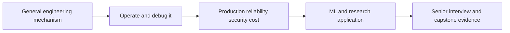

# Critical Audit — General Software Engineering Foundations for AI/ML

## 1. Verdict

The earlier curriculum had correct concepts but insufficient general-purpose depth:
Git, Linux, networking, containers, Kubernetes, Slurm, cloud, delivery, security and
observability were compressed into surveys or introduced through ML-specific use
cases. That was not an ideal learning order.

After revision, the notes provide a strong general software-engineering foundation
for SDE-II/SDE-III, ML engineer, research engineer, platform engineer, and applied
AI roles. General mechanisms now precede domain application:

This is curriculum sufficiency, not proof of mastery. A reader must complete labs,
write/debug systems, participate in reviews/incidents, and defend decisions.

## 2. Ruthless standard used

A subject is not “covered” because its name appears. Adequate notes need:

1. purpose and mental model;
2. vocabulary and state/components;
3. basic operations from scratch;
4. internals sufficient to predict behavior;
5. debugging evidence and failure modes;
6. security, reliability and production implications;
7. alternatives/trade-offs;
8. hands-on lab and exit questions;
9. ML/domain application only after general concepts.

## 3. Coverage matrix

| General subject | Foundation | Deep/application continuation | Current judgment |
|---|---|---|---|
| Python/programming | Part 3 Chapters 1 and 8 | all implementation Parts | strong professional foundation |
| Data structures/algorithms | Part 3 Chapter 4 | system-design/coding workbooks | strong interview foundation; practice required |
| SQL/data manipulation | Part 3 Chapters 2–3 | Parts 4, 11, 16 | strong analytics/ML foundation |
| Computer architecture/OS | Part 3 Chapter 6 | Parts 14–15, 18, 21 | sufficient for ML/SDE roles; not kernel engineering |
| Linux/shell | Part 14 Chapters 1–2 | container/cluster chapters | detailed beginner-to-operations path |
| Networking/TLS/HTTP/APIs | Part 3 Chapters 5–7 | Parts 11–12, 21–22 | detailed service-engineering foundation |
| Concurrency/distributed basics | Part 3 Chapters 5–6 | Parts 11–12, 18, 21 | sufficient foundation plus advanced application |
| Git/version control | Part 13 Chapters 1–4 | Chapters 5–6 research/ML | detailed general-to-research sequence |
| Testing/packaging | Part 3 Chapters 7–8 | Parts 11, 13, 23 | strong; requires implementation practice |
| CI/CD and releases | Part 3 Chapter 7; Part 13 Chapter 3 | Parts 11, 14, 21, 23 | production-oriented coverage |
| Docker/containers | Part 14 Chapters 3–5 | Chapters 8–9 and Parts 18/21 | detailed architecture-to-ML sequence |
| Kubernetes | Part 14 Chapter 6 | Chapters 8–9; Parts 11/18/21 | full fundamentals and ML operations |
| Slurm/HPC | Part 14 Chapter 7 | Chapters 8–9; Part 18 | general scheduler/HPC plus distributed ML |
| Cloud/IAM/IaC | Part 3 Chapter 7 | Parts 11–12, 23 | provider-neutral professional foundation |
| Observability/SRE | Part 3 Chapter 7 | Parts 11, 14, 18, 21 | strong metrics/logs/traces/SLO/incident path |
| Security/privacy | Part 3 Chapter 7 | Parts 8, 11–14, 21–22 | threat-model and system-boundary coverage |
| Databases/storage/queues/caches | Part 3 Chapters 5–7 | Parts 11–12, 16, 21 | sufficient system-design foundation |
| ML training/optimization | Parts 2, 5, 7 | Parts 15, 17–20 | detailed mathematical and systems coverage |
| Fine-tuning/RL/evaluation | Parts 8, 10 | Parts 19–22 | detailed domain-specific coverage |

## 4. Git adequacy check

The Git sequence now covers:

- why version control and distributed repositories exist;
- install/help/config scopes and identity versus authentication;
- init/clone, working tree, untracked/tracked, index, `HEAD`, commits;
- status/diff/add/patch/commit/log/show/history search;
- ignore/attributes, text/binary/line endings and large-file boundaries;
- branches, fast-forward/three-way merge, conflicts, stash, tags;
- objects (blob/tree/commit/tag), refs, reflog and reachability;
- remotes, fetch/pull/push, upstreams, ref tracking and authentication;
- pull requests, review, CI, protected branches and merge queues;
- merge/rebase/squash/revert/cherry-pick and force-with-lease;
- trunk/release/fork/monorepo/multirepo/submodule/subtree/package trade-offs;
- bisect, blame limitations, worktrees, recovery and secret incidents;
- signed releases, provenance, research lineage and ML artifacts.

Verdict: enough conceptual and operational depth for general professional use and
senior interviews. Mastery requires the two-clone collaboration lab and recovery
lab; reading commands is not enough.

## 5. Docker/container adequacy check

The sequence now covers:

- container purpose, VM comparison, namespaces/cgroups/capabilities/security;
- OCI roles and Docker client/daemon/context architecture;
- image/container/registry/repository/tag/digest distinctions;
- pull/create/run/start/stop/remove, attach/exec/logs/inspect/stats;
- command/entrypoint/environment/user/workdir/signal/PID 1 behavior;
- Dockerfile layers/cache/context, multi-stage builds and `.dockerignore`;
- named volumes, bind mounts, tmpfs, writable layer and backup/restore;
- bridge/user-defined/host/none networking, DNS and port publishing;
- Docker Compose configuration, lifecycle, health/dependency and debugging;
- resource limits, non-root/rootless, socket risk and runtime hardening;
- registries, credentials, SBOM, scanning, signing and provenance;
- GPU host-driver/runtime compatibility and distributed workload concerns;
- Kubernetes/Slurm placement, storage, network and failure integration.

Verdict: enough general architecture, daily operation, production practice and ML
application depth. It does not replace vendor/runtime release notes or production
on-call experience.

## 6. “Other technologies” adequacy check

The [technology reference](part-23-technology-capstone/01-technology-reference.md)
is a selection guide, while the numbered Parts teach mechanisms. Representative
tools include Python/NumPy/pandas/Polars/scikit-learn, PyTorch/JAX/TensorFlow,
Git/Docker/Kubernetes/Slurm, CUDA/ROCm/Triton/NCCL, FSDP/DeepSpeed/Megatron,
Arrow/Parquet/Spark/Ray/Kafka/table formats, Hydra/orchestrators, MLflow/W&B,
PEFT/TRL, vLLM/SGLang/TensorRT-LLM, OpenTelemetry/Prometheus/Grafana/DCGM,
CI/security/supply-chain tools, and evaluation ecosystems.

No static curriculum can exhaust every library, managed service, proprietary lab
platform or future release. The correct completeness target is full category/
mechanism coverage, representative hands-on tools, selection criteria, failure
modes and ability to migrate—not a résumé glossary.

## 7. Known limits and when to add another track

Add specialized study for roles centered on:

- kernel development, Linux kernel/eBPF or storage engine internals;
- compiler construction beyond ML graph/kernel compilation;
- database implementation/consensus formalism beyond system-design foundations;
- frontend/mobile/game/embedded/real-time systems;
- enterprise network administration and advanced cryptography;
- a specific cloud-provider certification or regulated-industry control framework;
- research-scientist-level mathematics/theory in one narrow domain.

These are legitimate specialties but not all prerequisites for AI/ML engineering.

## 8. Evidence required before claiming competence

1. Create/recover/collaborate in Git without destructive guessing.
2. Build, network, persist, secure, debug, publish and promote a container image.
3. Trace and diagnose DNS → TCP → TLS → HTTP failures.
4. Build CI/CD with untrusted-code boundaries and immutable artifacts.
5. Deploy a service with SLOs, load test, dashboards, rollback and incident drill.
6. Run a Kubernetes Job/Deployment and explain scheduling, probes, RBAC and storage.
7. Submit/observe/recover a Slurm job/array and verify resource/task mapping.
8. Connect code/data/config/environment/evaluator identities to one ML result.
9. Complete the Part 23 end-to-end capstone and defend changed constraints.

## 9. Final conclusion

The notes are now sufficiently broad and deep as a structured foundation from
beginner through advanced AI/ML engineering and SDE-II/SDE-III interviews. The
remaining risk is passive reading. Every major subject includes labs, debugging or
exit gates specifically to convert knowledge into evidence.

