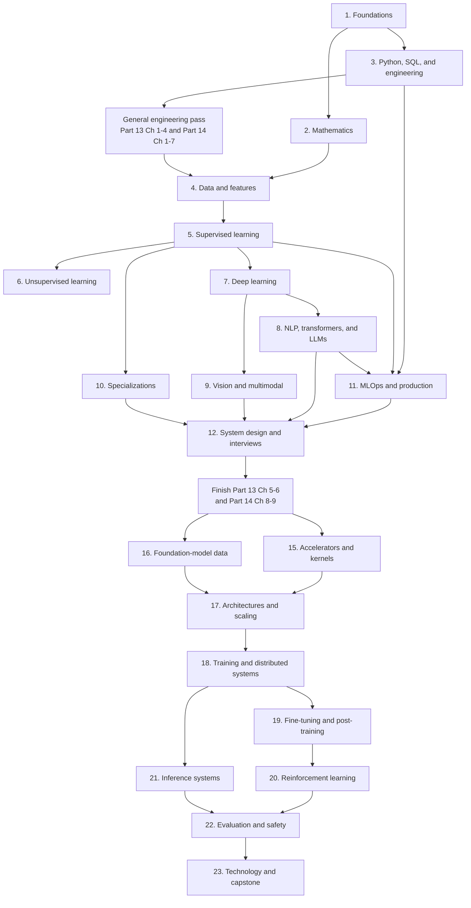

# AI/ML Curriculum Navigator

This is the central index for the complete beginner-to-senior AI/ML curriculum.
Start with Part 1; Parts 2 and 3 can be learned together. After Part 3, take the
general-engineering pass through Part 13 Chapters 1–4 and Part 14 Chapters 1–7,
then return to Parts 4–12. After Part 12, complete the remaining chapters of Parts
13–14 and continue through Parts 15–23. Each topic moves from intuition to
implementation, failure analysis, production trade-offs, and interview practice.

## Curriculum map

## All parts

| Part | Notes | Main outcome |
|---:|---|---|
| 1 | [AI/ML foundations and problem framing](part-01-foundations/README.md) | Frame a problem, define data and metrics, identify leakage and failure risks |
| 2 | [Mathematics and statistics](part-02-mathematics/README.md) | Read and derive the equations behind common ML methods |
| 3 | [Python, SQL, DSA, and data stack](part-03-python-data-stack/README.md) | Write dependable, efficient data and ML software |
| 4 | [Data preparation and feature engineering](part-04-data-and-features/README.md) | Build reproducible, leakage-safe datasets and features |
| 5 | [Supervised learning](part-05-supervised-learning/README.md) | Train, compare, calibrate, and explain predictive models |
| 6 | [Unsupervised and representation learning](part-06-unsupervised-learning/README.md) | Discover structure and evaluate unlabeled representations responsibly |
| 7 | [Deep learning](part-07-deep-learning/README.md) | Derive, train, debug, and serve neural networks |
| 8 | [NLP, transformers, and LLM applications](part-08-nlp-transformers-llms/README.md) | Build evaluated RAG and tool-using language systems |
| 9 | [Computer vision and multimodal learning](part-09-vision-multimodal/README.md) | Build and evaluate modern image and multimodal pipelines |
| 10 | [Specialized ML domains](part-10-specializations/README.md) | Learn recommenders, time series, fraud, causal ML, RL, and graph ML |
| 11 | [MLOps and production ML](part-11-mlops-production/README.md) | Operate reproducible, scalable, monitored ML services |
| 12 | [ML system design and senior interviews](part-12-system-design-interviews/README.md) | Design and defend end-to-end ML systems under real constraints |
| 13 | [Git, collaboration, research engineering, and reproducibility](part-13-research-git/README.md) | Use Git professionally and produce reviewable, lineage-complete experiments |
| 14 | [Linux, Docker, Compose, Kubernetes, and Slurm](part-14-containers-clusters/README.md) | Operate general container platforms and scheduled ML workloads |
| 15 | [Accelerators, kernels, compilation, and profiling](part-15-accelerators-kernels/README.md) | Measure and optimize device workloads without breaking correctness |
| 16 | [Foundation-model data and tokenization](part-16-foundation-model-data/README.md) | Build governed, deduplicated, decontaminated, deterministic corpora |
| 17 | [Foundation-model architectures and scaling](part-17-architectures-scaling/README.md) | Account for model compute/memory and design matched ablations |
| 18 | [Training optimization and distributed systems](part-18-training-distributed/README.md) | Train stably across devices with scalable recovery and checkpoints |
| 19 | [Fine-tuning and post-training](part-19-fine-tuning-post-training/README.md) | Select and operate SFT, PEFT, preference, RL, and distillation methods |
| 20 | [Reinforcement learning](part-20-reinforcement-learning/README.md) | Derive, implement, evaluate, and debug value/policy/advanced RL |
| 21 | [High-performance inference systems](part-21-inference-systems/README.md) | Meet quality, latency, throughput, reliability, and cost goals |
| 22 | [Evaluation, safety, security, and interpretability](part-22-evaluation-safety/README.md) | Build valid measurement and adversarial release gates |
| 23 | [Technology selection and end-to-end capstone](part-23-technology-capstone/README.md) | Integrate the full stack and defend it at senior interview depth |

Read the [complete roadmap](00-roadmap.md) for detailed scope, prerequisites,
pacing, projects, role guidance, and mastery criteria.

For foundation-model roles, read the [strict coverage audit](01-advanced-curriculum-coverage-audit.md)
after the roadmap. It distinguishes general ML readiness from research scientist,
research engineer, training infrastructure, post-training, and inference roles.
The [general engineering coverage audit](02-general-engineering-coverage-audit.md)
critically checks Git, Linux, Docker, networking, CI/CD, cloud, Kubernetes, Slurm,
observability, security, and other non-ML foundations.

## A repeatable study loop

For each chapter:

1. Read for intuition and rewrite the central idea in your own words.
2. Reproduce formulas or algorithms without looking, explaining every symbol.
3. Implement a small version and test edge cases.
4. Answer the chapter interview questions aloud.
5. Record misconceptions in an error log and revisit them after several days.
6. Apply the idea in the part project before progressing.

## Formula and diagram compatibility

The notes do not depend on dollar-delimited LaTeX. Equations use native MathML
or readable Unicode/HTML formula panels, and diagrams use fenced Mermaid blocks.
This keeps formulas readable in ordinary Markdown previews, including previews
without MathJax or a LaTeX extension. If a viewer cannot draw Mermaid, the text
and tables surrounding each diagram still describe the same logic.

## Suggested checkpoints

| Checkpoint | You should be able to do |
|---|---|
| After Parts 1–3 | Frame a simple ML problem, explain core math, manipulate data, and write tested code |
| After Parts 4–6 | Build a leakage-safe classical ML project and defend its evaluation |
| After Parts 7–9 | Train/debug neural models and build an evaluated language or vision application |
| After Parts 10–11 | Specialize and deploy a reproducible, monitored service |
| After Part 12 | Lead a 45–60 minute ML system-design discussion and defend trade-offs |
| After Parts 13–18 | Run reproducible, containerized, profiled, restartable training with trustworthy data lineage |
| After Parts 19–22 | Post-train, serve, evaluate, red-team, and capacity-plan a model system |
| After Part 23 | Defend an end-to-end capstone and senior technology decisions with evidence |

## Interview practice rule

Do not memorize isolated answers. Practice changing one constraint at a time:
ten times more traffic, delayed labels, one unavailable feature, a stricter
latency SLO, a protected user slice regression, an adaptive attacker, or a cost
reduction target. Strong SDE-II/SDE-III answers remain coherent when the
requirements move.
