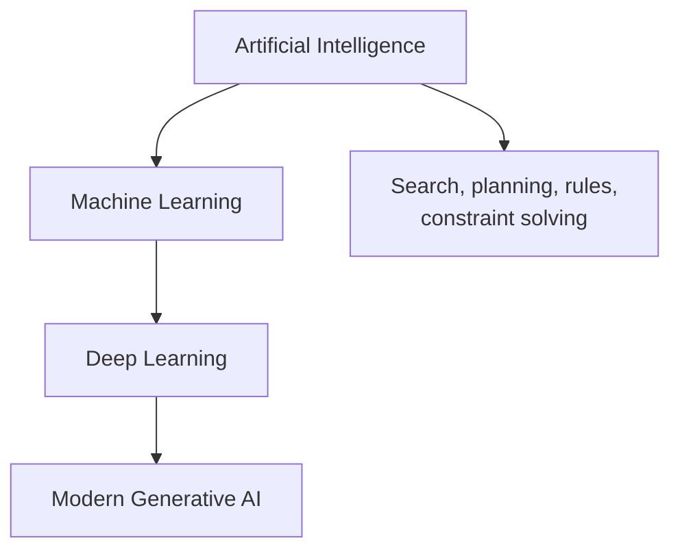

# Chapter 1 — The AI/ML Mental Model

## 1. Intelligence as a system property

An intelligent product observes some context, produces an output or action, and
is judged by its consequences. The implementation might use rules, search,
optimization, statistics, machine learning, or several of them together.

```
context/state -> computation -> prediction/decision/content -> consequence
```

“Uses AI” says little about how the system works. A route planner may use graph
search, a fraud product may combine rules with a learned risk score, and a coding
assistant may combine an LLM with retrieval, parsers, permission checks, and
ordinary software.

### Artificial intelligence (AI)

AI is the broad field of building machines that perform tasks associated with
perception, reasoning, language, planning, decision-making, or learning. AI
includes machine learning but is not limited to it.

### Machine learning (ML)

ML constructs behavior from data or experience instead of specifying every
case manually. A model learns a mapping, representation, probability
distribution, or policy that performs well according to an objective.

### Deep learning (DL)

Deep learning is ML using neural networks with multiple representation-learning
layers. “Deep” refers to the composition of transformations, not to the model
possessing deep human understanding.

### Generative AI

Generative AI produces new content—text, images, audio, video, code, structured
data—typically by learning aspects of a data distribution. It contrasts with a
purely discriminative system that only chooses a label or predicts a value,
although one model can support both behaviors.



The nesting is useful but simplified: not every generative model must be a deep
network, and AI systems commonly combine boxes from multiple branches.

## 2. Programmed rules versus learned behavior

Traditional software encodes the mapping explicitly:

<math display="block" xmlns="http://www.w3.org/1998/Math/MathML"><semantics><mrow><mtext mathvariant="normal">rules</mtext><mo>+</mo><mtext mathvariant="normal">input</mtext><mo>→</mo><mtext mathvariant="normal">output</mtext><mi>.</mi></mrow></semantics></math>

Supervised ML uses examples to infer a useful mapping:

<math display="block" xmlns="http://www.w3.org/1998/Math/MathML"><semantics><mrow><mtext mathvariant="normal">inputs</mtext><mo>+</mo><mtext mathvariant="normal">desired outputs</mtext><mo>+</mo><mtext mathvariant="normal">learning algorithm</mtext><mo>→</mo><mtext mathvariant="normal">model</mtext><mi>.</mi></mrow></semantics></math>

At inference time:

<math display="block" xmlns="http://www.w3.org/1998/Math/MathML"><semantics><mrow><mtext mathvariant="normal">model</mtext><mo>+</mo><mtext mathvariant="normal">new input</mtext><mo>→</mo><mtext mathvariant="normal">prediction</mtext><mi>.</mi></mrow></semantics></math>

Example: a manual spam filter can flag a message containing a fixed phrase. A
learned classifier can combine thousands of weak signals. Rules are transparent
and deterministic but brittle under complex variation. ML adapts to patterns but
can inherit bias, exploit unintended correlations, drift, and fail probabilistically.

Most production systems are **hybrids**:

```
hard safety rules -> learned score -> policy/threshold -> business rules
                  -> human review for uncertain/high-impact cases
```

Use deterministic code for inviolable constraints (“never transfer more than the
account limit”) and models for uncertain pattern recognition (“how suspicious is
this transfer?”).

## 3. The basic objects of supervised ML

Suppose we predict whether an email is spam.

| Object | Meaning | Spam example |
|----|----|----|
| Example/instance | one unit about which a prediction is made | one email at its arrival time |
| Feature <math display="inline" xmlns="http://www.w3.org/1998/Math/MathML"><semantics><msub><mi>x</mi><mi>j</mi></msub></semantics></math> | a measured input available to the model | sender age, token counts |
| Feature vector <math display="inline" xmlns="http://www.w3.org/1998/Math/MathML"><semantics><mi>x</mi></semantics></math> | all input features for one example | numeric representation of the email |
| Label/target <math display="inline" xmlns="http://www.w3.org/1998/Math/MathML"><semantics><mi>y</mi></semantics></math> | desired truth | spam = 1, legitimate = 0 |
| Model <math display="inline" xmlns="http://www.w3.org/1998/Math/MathML"><semantics><msub><mi>f</mi><mi>θ</mi></msub></semantics></math> | parameterized mapping | classifier producing spam probability |
| Prediction <math display="inline" xmlns="http://www.w3.org/1998/Math/MathML"><semantics><mover><mi>y</mi><mo accent="true">̂</mo></mover></semantics></math> | output for an example | <math display="inline" xmlns="http://www.w3.org/1998/Math/MathML"><semantics><mrow><mi>P</mi><mo stretchy="false" form="prefix">(</mo><mi>y</mi><mo>=</mo><mn>1</mn><mo>∣</mo><mi>x</mi><mo stretchy="false" form="postfix">)</mo><mo>=</mo><mn>0.92</mn></mrow></semantics></math> |
| Loss <math display="inline" xmlns="http://www.w3.org/1998/Math/MathML"><semantics><mrow><mi>ℓ</mi><mo stretchy="false" form="prefix">(</mo><mi>y</mi><mo>,</mo><mover><mi>y</mi><mo accent="true">̂</mo></mover><mo stretchy="false" form="postfix">)</mo></mrow></semantics></math> | training-time error for one example | log loss |
| Metric | evaluation summary | recall at 99.9% legitimate-mail precision |

A model can be written:

<math display="block" xmlns="http://www.w3.org/1998/Math/MathML"><semantics><mrow><mover><mi>y</mi><mo accent="true">̂</mo></mover><mo>=</mo><msub><mi>f</mi><mi>θ</mi></msub><mo stretchy="false" form="prefix">(</mo><mi>x</mi><mo stretchy="false" form="postfix">)</mo><mi>.</mi></mrow></semantics></math>

- <math display="inline" xmlns="http://www.w3.org/1998/Math/MathML"><semantics><mi>f</mi></semantics></math> is a family of functions, such as linear models or decision trees.
- <math display="inline" xmlns="http://www.w3.org/1998/Math/MathML"><semantics><mi>θ</mi></semantics></math> contains **parameters** learned from data, such as weights.
- <math display="inline" xmlns="http://www.w3.org/1998/Math/MathML"><semantics><mi>x</mi></semantics></math> contains information available at prediction time.
- <math display="inline" xmlns="http://www.w3.org/1998/Math/MathML"><semantics><mover><mi>y</mi><mo accent="true">̂</mo></mover></semantics></math> may be a value, probability, score, ranking, sequence, or action.

### Parameter versus hyperparameter

A **parameter** is learned by the training algorithm: a regression weight, tree
split, or neural-network weight. A **hyperparameter** configures the training or
model family: tree depth, regularization strength, learning rate, or number of
layers. Hyperparameters are chosen using training/validation procedures, never by
repeatedly optimizing against the final test set.

The boundary can depend on the method. A Bayesian method may treat a value as a
random variable to infer, whereas another pipeline may configure it manually.
The useful question is: *which process chooses this value and from which data?*

### Training versus inference

**Training** estimates parameters from data, usually by reducing an objective.
**Inference** uses the fitted model on a new input. In deep learning, “inference”
usually means prediction/serving; in statistics, the word can also mean drawing
conclusions about an unknown population. Clarify the context.

## 4. Learning as objective optimization

For supervised learning, the ideal goal is small error on future data from the
real environment. Let <math display="inline" xmlns="http://www.w3.org/1998/Math/MathML"><semantics><mrow><mo stretchy="false" form="prefix">(</mo><mi>X</mi><mo>,</mo><mi>Y</mi><mo stretchy="false" form="postfix">)</mo></mrow></semantics></math> be a random future example drawn from distribution
<math display="inline" xmlns="http://www.w3.org/1998/Math/MathML"><semantics><mi>P</mi></semantics></math>. The **population risk** is:

<math display="block" xmlns="http://www.w3.org/1998/Math/MathML"><semantics><mrow><mi>R</mi><mo stretchy="false" form="prefix">(</mo><mi>θ</mi><mo stretchy="false" form="postfix">)</mo><mo>=</mo><msub><mi mathvariant="double-struck">𝔼</mi><mrow><mo stretchy="false" form="prefix">(</mo><mi>X</mi><mo>,</mo><mi>Y</mi><mo stretchy="false" form="postfix">)</mo><mo>∼</mo><mi>P</mi></mrow></msub><mrow><mo stretchy="true" form="prefix">[</mo><mi>ℓ</mi><mrow><mo stretchy="true" form="prefix">(</mo><mi>Y</mi><mo>,</mo><msub><mi>f</mi><mi>θ</mi></msub><mo stretchy="false" form="prefix">(</mo><mi>X</mi><mo stretchy="false" form="postfix">)</mo><mo stretchy="true" form="postfix">)</mo></mrow><mo stretchy="true" form="postfix">]</mo></mrow><mi>.</mi></mrow></semantics></math>

We do not know the full population distribution, so we minimize an estimate on
the training sample, called **empirical risk**:

<math display="block" xmlns="http://www.w3.org/1998/Math/MathML"><semantics><mrow><msub><mover><mi>R</mi><mo accent="true">̂</mo></mover><mi>n</mi></msub><mo stretchy="false" form="prefix">(</mo><mi>θ</mi><mo stretchy="false" form="postfix">)</mo><mo>=</mo><mfrac><mn>1</mn><mi>n</mi></mfrac><munderover><mo>∑</mo><mrow><mi>i</mi><mo>=</mo><mn>1</mn></mrow><mi>n</mi></munderover><mi>ℓ</mi><mrow><mo stretchy="true" form="prefix">(</mo><msub><mi>y</mi><mi>i</mi></msub><mo>,</mo><msub><mi>f</mi><mi>θ</mi></msub><mo stretchy="false" form="prefix">(</mo><msub><mi>x</mi><mi>i</mi></msub><mo stretchy="false" form="postfix">)</mo><mo stretchy="true" form="postfix">)</mo></mrow><mi>.</mi></mrow></semantics></math>

Often we add regularization <math display="inline" xmlns="http://www.w3.org/1998/Math/MathML"><semantics><mrow><mi mathvariant="normal">Ω</mi><mo stretchy="false" form="prefix">(</mo><mi>θ</mi><mo stretchy="false" form="postfix">)</mo></mrow></semantics></math>:

<math display="block" xmlns="http://www.w3.org/1998/Math/MathML"><semantics><mrow><msup><mi>θ</mi><mo>*</mo></msup><mo>=</mo><mrow><mi mathvariant="normal">arg</mi><mo>&#8289;</mo></mrow><munder><mi mathvariant="normal">min</mi><mi>θ</mi></munder><mrow><mo stretchy="true" form="prefix">[</mo><mfrac><mn>1</mn><mi>n</mi></mfrac><munderover><mo>∑</mo><mrow><mi>i</mi><mo>=</mo><mn>1</mn></mrow><mi>n</mi></munderover><mi>ℓ</mi><mrow><mo stretchy="true" form="prefix">(</mo><msub><mi>y</mi><mi>i</mi></msub><mo>,</mo><msub><mi>f</mi><mi>θ</mi></msub><mo stretchy="false" form="prefix">(</mo><msub><mi>x</mi><mi>i</mi></msub><mo stretchy="false" form="postfix">)</mo><mo stretchy="true" form="postfix">)</mo></mrow><mo>+</mo><mi>λ</mi><mi mathvariant="normal">Ω</mi><mo stretchy="false" form="prefix">(</mo><mi>θ</mi><mo stretchy="false" form="postfix">)</mo><mo stretchy="true" form="postfix">]</mo></mrow><mi>.</mi></mrow></semantics></math>

Read <math display="inline" xmlns="http://www.w3.org/1998/Math/MathML"><semantics><mrow><mrow><mi mathvariant="normal">arg</mi><mo>&#8289;</mo></mrow><mi mathvariant="normal">min</mi></mrow></semantics></math> as “the parameter value that makes the expression smallest.”
<math display="inline" xmlns="http://www.w3.org/1998/Math/MathML"><semantics><mi>λ</mi></semantics></math> controls how much the learning process prefers simpler or otherwise
constrained parameters. Training loss is a proxy; the real goal is useful,
safe performance on future product outcomes.

## 5. Learning paradigms

### 5.1 Supervised learning

Training data contains input–target pairs <math display="inline" xmlns="http://www.w3.org/1998/Math/MathML"><semantics><mrow><mo stretchy="false" form="prefix">(</mo><mi>x</mi><mo>,</mo><mi>y</mi><mo stretchy="false" form="postfix">)</mo></mrow></semantics></math>. Learn to predict <math display="inline" xmlns="http://www.w3.org/1998/Math/MathML"><semantics><mi>y</mi></semantics></math> for new
<math display="inline" xmlns="http://www.w3.org/1998/Math/MathML"><semantics><mi>x</mi></semantics></math>.

- Classification: choose a discrete category.
- Regression: predict a continuous quantity.
- Ranking: order candidates by relevance or utility.
- Structured prediction: predict related outputs, such as a tag per token.

Examples: spam classification, delivery-time prediction, search ranking.

### 5.2 Unsupervised learning

No ordinary target label is provided. The algorithm seeks structure in inputs:
clusters, low-dimensional representations, densities, or unusual observations.

Examples: compress high-dimensional measurements; group similar usage patterns;
identify outliers. A discovered cluster is a mathematical grouping, not proof of
a meaningful human category.

### 5.3 Semi-supervised learning

Use a small labeled set plus a larger unlabeled set. This is valuable when raw
examples are abundant but expert labels are expensive. Pseudo-labeling and
consistency regularization are common ideas. Incorrect pseudo-labels can reinforce
errors.

### 5.4 Self-supervised learning

Create a training signal from the data itself. A language model predicts hidden
or next tokens; a vision system may learn whether transformed views originate
from the same image. The “labels” are automatically constructed rather than
human-annotated. It is often used for pretraining representations, followed by
fine-tuning or prompting.

### 5.5 Reinforcement learning (RL)

An agent interacts with an environment. At state <math display="inline" xmlns="http://www.w3.org/1998/Math/MathML"><semantics><msub><mi>s</mi><mi>t</mi></msub></semantics></math>, it chooses action <math display="inline" xmlns="http://www.w3.org/1998/Math/MathML"><semantics><msub><mi>a</mi><mi>t</mi></msub></semantics></math>,
receives reward <math display="inline" xmlns="http://www.w3.org/1998/Math/MathML"><semantics><msub><mi>r</mi><mi>t</mi></msub></semantics></math>, and moves to a new state. It learns a **policy** that aims
to maximize expected cumulative reward, often discounted:

<math display="block" xmlns="http://www.w3.org/1998/Math/MathML"><semantics><mrow><msub><mi>G</mi><mi>t</mi></msub><mo>=</mo><munderover><mo>∑</mo><mrow><mi>k</mi><mo>=</mo><mn>0</mn></mrow><mo accent="false">∞</mo></munderover><msup><mi>γ</mi><mi>k</mi></msup><msub><mi>r</mi><mrow><mi>t</mi><mo>+</mo><mi>k</mi><mo>+</mo><mn>1</mn></mrow></msub><mo>,</mo><mspace width="2.0em"></mspace><mn>0</mn><mo>≤</mo><mi>γ</mi><mo>≤</mo><mn>1</mn><mi>.</mi></mrow></semantics></math>

RL differs from ordinary supervised learning because actions affect future data,
rewards may be delayed, and exploration can be costly or unsafe.

### 5.6 Active learning

The learner selects which examples should be labeled, often targeting uncertain
or representative cases. It can reduce labeling cost, but naïve uncertainty
sampling may overfocus on outliers or miss unknown regions.

### 5.7 Online, batch, and continual learning

- **Batch/offline learning:** train periodically on a collected dataset.
- **Online learning:** update parameters incrementally as observations arrive.
- **Continual learning:** retain and expand capabilities across changing tasks or
  distributions while avoiding catastrophic forgetting.

Online **inference** and online **learning** are different. A service can produce
predictions instantly while its model is retrained only weekly.

## 6. Task taxonomy

| Task | Output | Example | Typical metric family |
|----|----|----|----|
| Binary classification | one of two classes or a score | fraud/not fraud | precision, recall, PR-AUC, log loss |
| Multiclass classification | one of <math display="inline" xmlns="http://www.w3.org/1998/Math/MathML"><semantics><mi>K</mi></semantics></math> classes | document topic | accuracy, macro-F1, cross-entropy |
| Multilabel classification | any subset of labels | image tags | per-label/micro/macro F1 |
| Regression | continuous value | delivery minutes | MAE, RMSE, quantile loss |
| Ranking | ordered candidates | search results | NDCG, MRR, recall@K |
| Recommendation | items or ranking | movies/products | recall@K, NDCG, online engagement |
| Forecasting | future sequence/value | next week's demand | backtested MAE/WAPE/quantile loss |
| Clustering | group assignment | behavior segments | stability, silhouette plus domain validation |
| Dimensionality reduction | compact representation | 500 features to 20 | reconstruction or downstream quality |
| Anomaly detection | unusualness score | equipment fault | precision/recall under sparse labels |
| Generation | new sequence/content | summary or code | task-specific quality, factuality, human rubric |
| Policy learning | action distribution | resource allocation | expected reward plus safety constraints |

One product can contain several tasks. Search commonly uses retrieval to get a
few hundred candidates and ranking to order the final list. A support assistant
may classify intent, retrieve documents, generate a response, and classify its
safety before display.

## 7. Discriminative versus generative modeling

A discriminative model learns a boundary or conditional relationship such as:

<math display="block" xmlns="http://www.w3.org/1998/Math/MathML"><semantics><mrow><mi>P</mi><mo stretchy="false" form="prefix">(</mo><mi>Y</mi><mo>∣</mo><mi>X</mi><mo stretchy="false" form="postfix">)</mo><mi>.</mi></mrow></semantics></math>

A generative probabilistic model learns how observed data could be produced,
such as <math display="inline" xmlns="http://www.w3.org/1998/Math/MathML"><semantics><mrow><mi>P</mi><mo stretchy="false" form="prefix">(</mo><mi>X</mi><mo>,</mo><mi>Y</mi><mo stretchy="false" form="postfix">)</mo></mrow></semantics></math> or <math display="inline" xmlns="http://www.w3.org/1998/Math/MathML"><semantics><mrow><mi>P</mi><mo stretchy="false" form="prefix">(</mo><mi>X</mi><mo stretchy="false" form="postfix">)</mo></mrow></semantics></math>, enabling sampling or conditional generation.

Via Bayes' theorem:

<math display="block" xmlns="http://www.w3.org/1998/Math/MathML"><semantics><mrow><mi>P</mi><mo stretchy="false" form="prefix">(</mo><mi>Y</mi><mo>∣</mo><mi>X</mi><mo stretchy="false" form="postfix">)</mo><mo>=</mo><mfrac><mrow><mi>P</mi><mo stretchy="false" form="prefix">(</mo><mi>X</mi><mo>∣</mo><mi>Y</mi><mo stretchy="false" form="postfix">)</mo><mi>P</mi><mo stretchy="false" form="prefix">(</mo><mi>Y</mi><mo stretchy="false" form="postfix">)</mo></mrow><mrow><mi>P</mi><mo stretchy="false" form="prefix">(</mo><mi>X</mi><mo stretchy="false" form="postfix">)</mo></mrow></mfrac><mi>.</mi></mrow></semantics></math>

Naive Bayes is a classic generative classifier because it models <math display="inline" xmlns="http://www.w3.org/1998/Math/MathML"><semantics><mrow><mi>P</mi><mo stretchy="false" form="prefix">(</mo><mi>X</mi><mo>∣</mo><mi>Y</mi><mo stretchy="false" form="postfix">)</mo></mrow></semantics></math>
and <math display="inline" xmlns="http://www.w3.org/1998/Math/MathML"><semantics><mrow><mi>P</mi><mo stretchy="false" form="prefix">(</mo><mi>Y</mi><mo stretchy="false" form="postfix">)</mo></mrow></semantics></math>. Logistic regression directly models <math display="inline" xmlns="http://www.w3.org/1998/Math/MathML"><semantics><mrow><mi>P</mi><mo stretchy="false" form="prefix">(</mo><mi>Y</mi><mo>∣</mo><mi>X</mi><mo stretchy="false" form="postfix">)</mo></mrow></semantics></math> and is
discriminative. Modern language models learn a factorization of sequence
probability:

<math display="block" xmlns="http://www.w3.org/1998/Math/MathML"><semantics><mrow><mi>P</mi><mo stretchy="false" form="prefix">(</mo><msub><mi>x</mi><mn>1</mn></msub><mo>,</mo><mi>…</mi><mo>,</mo><msub><mi>x</mi><mi>T</mi></msub><mo stretchy="false" form="postfix">)</mo><mo>=</mo><munderover><mo>∏</mo><mrow><mi>t</mi><mo>=</mo><mn>1</mn></mrow><mi>T</mi></munderover><mi>P</mi><mo stretchy="false" form="prefix">(</mo><msub><mi>x</mi><mi>t</mi></msub><mo>∣</mo><msub><mi>x</mi><mn>1</mn></msub><mo>,</mo><mi>…</mi><mo>,</mo><msub><mi>x</mi><mrow><mi>t</mi><mo>−</mo><mn>1</mn></mrow></msub><mo stretchy="false" form="postfix">)</mo><mi>.</mi></mrow></semantics></math>

This equation says the probability of a sequence can be decomposed into a
product of next-token probabilities conditioned on previous tokens.

## 8. Prediction, decision, and policy are not the same

A model may estimate risk:

<math display="block" xmlns="http://www.w3.org/1998/Math/MathML"><semantics><mrow><mi>s</mi><mo stretchy="false" form="prefix">(</mo><mi>x</mi><mo stretchy="false" form="postfix">)</mo><mo>=</mo><mi>P</mi><mo stretchy="false" form="prefix">(</mo><mi>Y</mi><mo>=</mo><mn>1</mn><mo>∣</mo><mi>X</mi><mo>=</mo><mi>x</mi><mo stretchy="false" form="postfix">)</mo><mi>.</mi></mrow></semantics></math>

A product then chooses an action using that score, costs, constraints, and rules:

<math display="block" xmlns="http://www.w3.org/1998/Math/MathML"><semantics><mrow><mi>a</mi><mo>=</mo><mi>π</mi><mo stretchy="false" form="prefix">(</mo><mi>s</mi><mo stretchy="false" form="prefix">(</mo><mi>x</mi><mo stretchy="false" form="postfix">)</mo><mo>,</mo><mtext mathvariant="normal">context</mtext><mo>,</mo><mtext mathvariant="normal">constraints</mtext><mo stretchy="false" form="postfix">)</mo><mi>.</mi></mrow></semantics></math>

For fraud, the same score may lead to:

- approve when risk is low;
- request extra authentication when risk is moderate;
- queue human review for high-value ambiguous transactions;
- decline when risk and expected cost are sufficiently high.

Keeping score and policy separate makes thresholds easier to update, lets policy
use context not allowed in model training, and supports differentiated actions.

## 9. Correlation, prediction, and causation

- **Correlation:** variables move together statistically.
- **Prediction:** one set of observations helps estimate another on unseen cases.
- **Causation:** changing one factor would change the outcome, all else suitably
  controlled.

A feature can be predictive without being causal. Umbrella use predicts rain but
does not cause it. This is acceptable for some stable predictive tasks, but a
policy intervention needs causal reasoning. For example, customers receiving
retention calls may churn more because high-risk customers were selected for the
call; observational data does not prove calls cause churn.

## 10. Common misconceptions

### “More data always beats a better algorithm”

Only if the data is relevant, sufficiently representative, correctly labeled,
legal to use, and adds signal. More duplicated, biased, stale, or leaky data can
make a model worse or merely increase cost.

### “A 95% accurate model is good”

Not enough information. If only 1% of cases are positive, always predicting
negative is 99% accurate. Utility depends on the confusion costs, threshold,
segments, calibration, and product outcome.

### “The model learns facts”

A model fits statistical structure encoded in its training process. Its output
may be uncertain, stale, context-sensitive, or unsupported. A fluent generated
answer is not evidence of truth.

### “Unsupervised means there is no supervision”

The training signal may be implicit or constructed. Model selection still uses
human choices, objectives, preprocessing, and evaluation criteria.

### “The most complex model is best”

The best choice satisfies quality, latency, cost, interpretability, data, safety,
and maintenance requirements. A calibrated logistic regression can be superior
to a large neural network in a low-data, high-governance setting.

## 11. Interview-ready summary

When asked “What is machine learning?” a strong answer has three layers:

1.  **Definition:** ML learns useful behavior or structure from data rather than
    explicitly programming every case.
2.  **Mathematical view:** select a function <math display="inline" xmlns="http://www.w3.org/1998/Math/MathML"><semantics><msub><mi>f</mi><mi>θ</mi></msub></semantics></math> and learn parameters by
    minimizing an empirical objective that should generalize to future data.
3.  **Engineering qualification:** the model is one component; problem framing,
    data validity, decision policy, evaluation, deployment, monitoring, and safety
    determine whether the product succeeds.

## 12. Check your understanding

1.  Is a shortest-path algorithm ML? Why or why not?
2.  Give a product that combines rules, optimization, and ML.
3.  In a credit-risk system, identify <math display="inline" xmlns="http://www.w3.org/1998/Math/MathML"><semantics><mi>x</mi></semantics></math>, <math display="inline" xmlns="http://www.w3.org/1998/Math/MathML"><semantics><mi>y</mi></semantics></math>, <math display="inline" xmlns="http://www.w3.org/1998/Math/MathML"><semantics><msub><mi>f</mi><mi>θ</mi></msub></semantics></math>, <math display="inline" xmlns="http://www.w3.org/1998/Math/MathML"><semantics><mover><mi>y</mi><mo accent="true">̂</mo></mover></semantics></math>, a parameter,
    a hyperparameter, and the final decision policy.
4.  Why can low training loss coexist with a bad product?
5.  Explain self-supervision without saying “the data labels itself.”
6.  Why is an online prediction service not necessarily an online learner?
7.  Give a predictive feature that should not be interpreted causally.
8.  When might a simple rule be preferable to ML?
