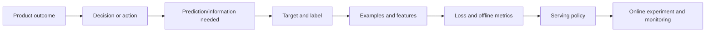

# Chapter 2 — Problem Framing and Objectives

## 1. Begin with a decision, not a model

“Build an AI churn model” starts too late. The real questions are:

- Which outcome should improve?
- Which decision or workflow can change that outcome?
- Who or what makes the decision?
- What information is available at that exact moment?
- What mistakes are possible and what does each mistake cost?
- How quickly must the output arrive?
- How will the action alter future observations?

The core chain is:



Example: “reduce support cost” is not yet an ML task.

1.  Outcome: reduce average resolution time without lowering satisfaction.
2.  Decision: route each new case to the best queue.
3.  Prediction: estimate issue category, urgency, and likely expertise needed.
4.  Target: resolved issue category and service-level breach within 24 hours.
5.  Features: information present when the ticket arrives.
6.  Action: recommend a queue; allow human override for uncertain cases.
7.  Evaluation: routing accuracy is secondary to resolution time and satisfaction.

## 2. Should this use ML at all?

ML is promising when:

- the desired mapping is too complex or variable for manageable rules;
- representative examples or useful feedback can be obtained;
- patterns persist long enough to learn and deploy;
- errors can be measured and tolerated or safely handled;
- the prediction changes a real decision;
- expected value justifies data, compute, operational, and governance costs.

Prefer rules, search, optimization, analytics, or ordinary software when:

- behavior is completely specified by stable logic;
- exact correctness is mandatory and the rules are known;
- cases are extremely rare and useful labels cannot be obtained;
- the environment changes faster than learning/deployment;
- no action follows from the prediction;
- failures create unacceptable harm without a safe review or fallback path;
- the true requirement is data access, workflow automation, or a better UI.

### The ML appropriateness checklist

| Dimension | Question | Warning sign |
|----|----|----|
| Value | What measurable outcome changes? | “We need AI because competitors have it.” |
| Actionability | Which decision consumes the output? | No owner or workflow changes. |
| Learnability | Does available information contain signal? | Target depends on unknowable future randomness. |
| Data | Can representative, legal, timely examples be built? | Labels are absent, biased, or years delayed. |
| Evaluation | Can success and harmful failure be measured? | Only subjective demo reactions exist. |
| Operations | Can it meet latency, scale, cost, and reliability? | Prototype depends on unavailable compute/data. |
| Safety | Can high-impact errors be prevented or reviewed? | Fully automatic irreversible action. |
| Maintenance | Who owns drift, retraining, and incidents? | The project ends at deployment. |

An SDE-III-quality response is allowed to recommend *not* using ML, or to propose
a staged hybrid system. Technical maturity is choosing the simplest dependable
mechanism that creates value.

## 3. Translate a vague goal into a precise formulation

Use the following specification.

### 3.1 Prediction unit

What exactly is one example?

- one email at receipt time;
- one user at the end of each day;
- one user–item pair when a feed is requested;
- one store–product pair for a particular future week;
- one transaction before authorization.

Ambiguous units produce duplicates, misaligned labels, and invalid splits.

### 3.2 Prediction time

State time <math display="inline" xmlns="http://www.w3.org/1998/Math/MathML"><semantics><msub><mi>t</mi><mn>0</mn></msub></semantics></math> at which the system must output. Every feature must be available
by <math display="inline" xmlns="http://www.w3.org/1998/Math/MathML"><semantics><msub><mi>t</mi><mn>0</mn></msub></semantics></math>, not merely stored somewhere eventually. Event-time availability and
ingestion-time availability are different.

```
past observation window             prediction       label window
|---------------------------------------|-------------------|
t0 - 30 days                            t0             t0 + 7 days
features                                score          outcome observed
```

### 3.3 Observation window

Which past interval creates features? Example: transaction counts over the 1
hour, 1 day, and 30 days before authorization. The window must end no later than
the prediction time.

### 3.4 Prediction horizon

How far into the future is predicted? “Will the customer churn?” is incomplete.
“Will an active customer cancel within the next 30 days?” is testable.

Long horizons may provide more intervention time but usually reduce predictability.

### 3.5 Target and label

The **target** is the ideal quantity we want. The **label** is its observed
operational encoding. They can differ.

- Target: fraudulent intent.
- Possible label: chargeback filed within 60 days.
- Problem: many frauds never become chargebacks; some legitimate disputes do.

The label mechanism should specify:

- exact positive and negative definitions;
- outcome/label window;
- delay before the label is mature;
- ambiguous, censored, reversed, or missing outcomes;
- who or what generated the label;
- known biases and quality checks.

### 3.6 Inputs/features

List information permitted and available at <math display="inline" xmlns="http://www.w3.org/1998/Math/MathML"><semantics><msub><mi>t</mi><mn>0</mn></msub></semantics></math>. Also list explicitly forbidden
features due to leakage, privacy, fairness, security, licensing, cost, or serving
unavailability.

### 3.7 Model output

Choose the output needed by the consumer:

- hard category;
- probability or risk score;
- numeric estimate or prediction interval;
- ranked candidate list;
- embedding;
- generated content plus citations/structured fields;
- action recommendation with uncertainty.

A probability is often more flexible than a hard class because downstream
policies can use different thresholds.

### 3.8 Action and consumer

Name the consuming service or person. Specify actions, review, override,
fallback, and how uncertainty changes behavior.

### 3.9 Feedback and outcome

What happens after the action? Blocking a transaction prevents us from observing
whether it would have generated a chargeback. Recommending an item changes what
the user can click. The system's action changes its future training data; this is
a **feedback loop** and a causal measurement problem.

## 4. Target quality and proxy objectives

The true product goal is often delayed or unobservable, so teams optimize a proxy:

| True goal | Proxy | Possible failure |
|----|----|----|
| Helpful recommendations | clicks | clickbait, low long-term satisfaction |
| Productive support | shorter tickets | premature closure |
| Safe community | reported-content rate | reporting bias and adversarial reports |
| Good generated answers | user thumbs-up | sparse feedback, politeness bias |
| Successful hiring | historical hiring decision | reproduces prior selection bias |

Goodhart's law, informally: when a measure becomes a target, optimization can make
it stop being a good measure. A proxy should be validated against the real goal,
paired with guardrails, and periodically challenged.

### Multi-objective framing

A ranking system rarely maximizes only relevance. One scalarized objective could
be:

> **Scalarized utility**  
> J = w<sub>r</sub> · relevance + w<sub>q</sub> · quality
> + w<sub>d</sub> · diversity − w<sub>h</sub> · harm
> − w<sub>c</sub> · cost

Here each `w` is a chosen weight expressing the relative value of that term.

But a weighted sum can hide unacceptable regressions. Treat non-negotiable
requirements as constraints or guardrail gates:

<math display="block" xmlns="http://www.w3.org/1998/Math/MathML"><semantics><mrow><munder><mi mathvariant="normal">max</mi><mi>θ</mi></munder><mspace width="0.222em"></mspace><mtext mathvariant="normal">expected utility</mtext><mo stretchy="false" form="prefix">(</mo><mi>θ</mi><mo stretchy="false" form="postfix">)</mo><mspace width="1.0em"></mspace><mtext mathvariant="normal">subject to</mtext><mspace width="1.0em"></mspace><mrow><mo stretchy="true" form="prefix">{</mo><mtable><mtr><mtd columnalign="left" style="text-align: left"><mi>P</mi><mo stretchy="false" form="prefix">(</mo><mtext mathvariant="normal">harm</mtext><mo stretchy="false" form="postfix">)</mo><mo>≤</mo><mi>ϵ</mi><mo>,</mo></mtd></mtr><mtr><mtd columnalign="left" style="text-align: left"><mi>p</mi><mn>99</mn><mrow><mspace width="0.333em"></mspace><mtext mathvariant="normal"> latency</mtext></mrow><mo>≤</mo><mn>200</mn><mrow><mspace width="0.333em"></mspace><mtext mathvariant="normal"> ms</mtext></mrow><mo>,</mo></mtd></mtr><mtr><mtd columnalign="left" style="text-align: left"><mtext mathvariant="normal">cost/request</mtext><mo>≤</mo><mi>c</mi><mo>,</mo></mtd></mtr><mtr><mtd columnalign="left" style="text-align: left"><mtext mathvariant="normal">availability</mtext><mo>≥</mo><mn>99.9</mn><mi>%</mi><mi>.</mi></mtd></mtr></mtable></mrow></mrow></semantics></math>

This separates tradeable improvements from hard limits.

## 5. Loss, metric, product KPI, and guardrail

These are related but distinct.

| Layer | Purpose | Spam example |
|----|----|----|
| Training loss | differentiable/optimizable signal | binary cross-entropy |
| Offline metric | compare models on held-out data | recall at 99.9% precision |
| Decision policy | convert score into action | quarantine if score <math display="inline" xmlns="http://www.w3.org/1998/Math/MathML"><semantics><mrow><mo>&gt;</mo><mi>t</mi></mrow></semantics></math> |
| Product KPI | measure user/business outcome | unwanted inbox messages per user |
| Guardrail | prevent unacceptable regression | legitimate quarantine rate, p99 latency |

A model can improve log loss but not change any decisions at the deployed
threshold. It can improve an offline metric while hurting product outcomes due to
shift, latency, user response, or metric misalignment.

### Loss examples

For binary classification, with <math display="inline" xmlns="http://www.w3.org/1998/Math/MathML"><semantics><mrow><mi>y</mi><mo>∈</mo><mo stretchy="false" form="prefix">{</mo><mn>0</mn><mo>,</mo><mn>1</mn><mo stretchy="false" form="postfix">}</mo></mrow></semantics></math> and predicted probability
<math display="inline" xmlns="http://www.w3.org/1998/Math/MathML"><semantics><mrow><mi>p</mi><mo>=</mo><mi>P</mi><mo stretchy="false" form="prefix">(</mo><mi>Y</mi><mo>=</mo><mn>1</mn><mo>∣</mo><mi>x</mi><mo stretchy="false" form="postfix">)</mo></mrow></semantics></math>, binary cross-entropy is:

<math display="block" xmlns="http://www.w3.org/1998/Math/MathML"><semantics><mrow><mi>ℓ</mi><mo stretchy="false" form="prefix">(</mo><mi>y</mi><mo>,</mo><mi>p</mi><mo stretchy="false" form="postfix">)</mo><mo>=</mo><mi>−</mi><mrow><mo stretchy="true" form="prefix">[</mo><mi>y</mi><mi mathvariant="normal">log</mi><mi>p</mi><mo>+</mo><mo stretchy="false" form="prefix">(</mo><mn>1</mn><mo>−</mo><mi>y</mi><mo stretchy="false" form="postfix">)</mo><mi mathvariant="normal">log</mi><mo stretchy="false" form="prefix">(</mo><mn>1</mn><mo>−</mo><mi>p</mi><mo stretchy="false" form="postfix">)</mo><mo stretchy="true" form="postfix">]</mo></mrow><mi>.</mi></mrow></semantics></math>

It heavily penalizes confident wrong probabilities. If <math display="inline" xmlns="http://www.w3.org/1998/Math/MathML"><semantics><mrow><mi>y</mi><mo>=</mo><mn>1</mn></mrow></semantics></math>, the loss becomes
<math display="inline" xmlns="http://www.w3.org/1998/Math/MathML"><semantics><mrow><mi>−</mi><mrow><mi mathvariant="normal">log</mi><mo>&#8289;</mo></mrow><mi>p</mi></mrow></semantics></math>; predicting <math display="inline" xmlns="http://www.w3.org/1998/Math/MathML"><semantics><mrow><mi>p</mi><mo>=</mo><mn>0.99</mn></mrow></semantics></math> is good, while <math display="inline" xmlns="http://www.w3.org/1998/Math/MathML"><semantics><mrow><mi>p</mi><mo>=</mo><mn>0.01</mn></mrow></semantics></math> is very costly.

For regression, squared error is:

<math display="block" xmlns="http://www.w3.org/1998/Math/MathML"><semantics><mrow><mi>ℓ</mi><mo stretchy="false" form="prefix">(</mo><mi>y</mi><mo>,</mo><mover><mi>y</mi><mo accent="true">̂</mo></mover><mo stretchy="false" form="postfix">)</mo><mo>=</mo><mo stretchy="false" form="prefix">(</mo><mi>y</mi><mo>−</mo><mover><mi>y</mi><mo accent="true">̂</mo></mover><msup><mo stretchy="false" form="postfix">)</mo><mn>2</mn></msup><mi>.</mi></mrow></semantics></math>

Absolute error is:

<math display="block" xmlns="http://www.w3.org/1998/Math/MathML"><semantics><mrow><mi>ℓ</mi><mo stretchy="false" form="prefix">(</mo><mi>y</mi><mo>,</mo><mover><mi>y</mi><mo accent="true">̂</mo></mover><mo stretchy="false" form="postfix">)</mo><mo>=</mo><mo stretchy="false" form="prefix">|</mo><mi>y</mi><mo>−</mo><mover><mi>y</mi><mo accent="true">̂</mo></mover><mo stretchy="false" form="prefix">|</mo><mi>.</mi></mrow></semantics></math>

Squared error penalizes large errors more strongly and is sensitive to outliers.
The loss determines what behavior training rewards.

## 6. Cost-sensitive decisions and thresholds

Suppose a model estimates calibrated fraud probability <math display="inline" xmlns="http://www.w3.org/1998/Math/MathML"><semantics><mi>p</mi></semantics></math>. Consider two actions:
approve or block.

Let:

- <math display="inline" xmlns="http://www.w3.org/1998/Math/MathML"><semantics><msub><mi>C</mi><mrow><mi>F</mi><mi>P</mi></mrow></msub></semantics></math> = cost of blocking a legitimate transaction (false positive),
- <math display="inline" xmlns="http://www.w3.org/1998/Math/MathML"><semantics><msub><mi>C</mi><mrow><mi>F</mi><mi>N</mi></mrow></msub></semantics></math> = cost of approving a fraudulent transaction (false negative).

Ignoring other costs:

<math display="block" xmlns="http://www.w3.org/1998/Math/MathML"><semantics><mtable><mtr><mtd columnalign="right" style="text-align: right; padding-right: 0"><mi mathvariant="double-struck">𝔼</mi><mo stretchy="false" form="prefix">[</mo><mi>C</mi><mo>∣</mo><mtext mathvariant="normal">block</mtext><mo stretchy="false" form="postfix">]</mo></mtd><mtd columnalign="left" style="text-align: left; padding-left: 0"><mo>=</mo><mo stretchy="false" form="prefix">(</mo><mn>1</mn><mo>−</mo><mi>p</mi><mo stretchy="false" form="postfix">)</mo><msub><mi>C</mi><mrow><mi>F</mi><mi>P</mi></mrow></msub><mo>,</mo></mtd></mtr><mtr><mtd columnalign="right" style="text-align: right; padding-right: 0"><mi mathvariant="double-struck">𝔼</mi><mo stretchy="false" form="prefix">[</mo><mi>C</mi><mo>∣</mo><mtext mathvariant="normal">approve</mtext><mo stretchy="false" form="postfix">]</mo></mtd><mtd columnalign="left" style="text-align: left; padding-left: 0"><mo>=</mo><mi>p</mi><msub><mi>C</mi><mrow><mi>F</mi><mi>N</mi></mrow></msub><mi>.</mi></mtd></mtr></mtable></semantics></math>

Block when:

<math display="block" xmlns="http://www.w3.org/1998/Math/MathML"><semantics><mrow><mo stretchy="false" form="prefix">(</mo><mn>1</mn><mo>−</mo><mi>p</mi><mo stretchy="false" form="postfix">)</mo><msub><mi>C</mi><mrow><mi>F</mi><mi>P</mi></mrow></msub><mo>&lt;</mo><mi>p</mi><msub><mi>C</mi><mrow><mi>F</mi><mi>N</mi></mrow></msub><mspace width="1.0em"></mspace><mo>⇔</mo><mspace width="1.0em"></mspace><mi>p</mi><mo>&gt;</mo><mfrac><msub><mi>C</mi><mrow><mi>F</mi><mi>P</mi></mrow></msub><mrow><msub><mi>C</mi><mrow><mi>F</mi><mi>P</mi></mrow></msub><mo>+</mo><msub><mi>C</mi><mrow><mi>F</mi><mi>N</mi></mrow></msub></mrow></mfrac><mi>.</mi></mrow></semantics></math>

If <math display="inline" xmlns="http://www.w3.org/1998/Math/MathML"><semantics><msub><mi>C</mi><mrow><mi>F</mi><mi>P</mi></mrow></msub></semantics></math> is USD 5 and <math display="inline" xmlns="http://www.w3.org/1998/Math/MathML"><semantics><msub><mi>C</mi><mrow><mi>F</mi><mi>N</mi></mrow></msub></semantics></math> is USD 95, the simplified optimal threshold is <math display="inline" xmlns="http://www.w3.org/1998/Math/MathML"><semantics><mn>0.05</mn></semantics></math>.
Real systems add transaction amount, authentication options, review capacity,
customer value, legal requirements, uncertainty, and non-monetary harm. The
formula's value is demonstrating that **0.5 is not a universal threshold**.

## 7. Baselines are mandatory

A baseline answers “better than what?” and catches unnecessary complexity.

### Types of baseline

1.  **No-skill baseline:** majority class, mean/median regression prediction,
    random ranking.
2.  **Current-system baseline:** existing rules, human workflow, or deployed model.
3.  **Simple learned baseline:** logistic/linear regression, shallow tree, TF-IDF
    classifier.
4.  **Heuristic baseline:** recency/popularity ranking, keyword rule.
5.  **Oracle or upper-bound analysis:** performance if a difficult subproblem were
    perfect; useful for estimating potential, not deployable.

The first production version may deliberately be a rule or simple model. It
validates data, instrumentation, workflow, and value before investing in complex
modeling.

## 8. Constraints and non-functional requirements

Model selection is constrained optimization. Document:

- **Latency:** average is insufficient; specify p50/p95/p99 and deadline behavior.
- **Throughput:** average and peak requests/second; batch sizes.
- **Availability:** desired SLO and allowed degraded behavior.
- **Cost:** training, inference, storage, labeling, annotation, human review.
- **Freshness:** how recent must features, predictions, and models be?
- **Interpretability:** who needs which explanation and for what decision?
- **Privacy:** collection purpose, access, retention, deletion, residency.
- **Fairness:** affected groups, harms, relevant slices, mitigation.
- **Security/abuse:** adversarial inputs, extraction, poisoning, prompt injection.
- **Human factors:** review capacity, automation bias, appeal and override paths.
- **Reproducibility/auditability:** artifacts, data versions, decision records.

An offline accuracy improvement that requires 10× latency may be unusable. A
smaller model can win because it meets the whole contract.

## 9. Feasibility before model building

Perform three small studies.

### Data feasibility

- Count examples and label maturity over time.
- Inspect label prevalence and ambiguous outcomes.
- Check feature availability at prediction time.
- Compare training data with expected serving population.
- Estimate missingness, duplicates, and segment coverage.

### Offline feasibility

- Build a non-ML and simple model baseline.
- Test a temporal holdout.
- Examine performance on important slices.
- Estimate whether errors contain learnable signal.

### Product feasibility

- Identify the consuming workflow and owner.
- Instrument the current baseline first.
- Estimate impact if offline improvement transfers.
- Design a safe rollout and rollback.
- Check human review and operational load.

## 10. Worked framing example: transaction fraud

### Vague request

“Use AI to stop fraud.”

### Refined formulation

| Field | Definition |
|----|----|
| Product goal | reduce fraud loss while preserving legitimate payment success |
| Prediction unit | one authorization attempt |
| Prediction time | before the authorization response, with 80 ms model budget |
| Target | whether the transaction represents unauthorized fraud |
| Operational label | mature fraud/chargeback determination within 60 days |
| Inputs | amount, merchant, device/account history available before authorization |
| Forbidden inputs | future chargeback fields, post-decision review result, unsupported sensitive attributes |
| Output | calibrated risk score plus reason codes/quality flags |
| Actions | approve, step-up authentication, human review, or decline |
| Baseline | existing rules and simple logistic model |
| Offline metrics | cost-weighted loss; recall at bounded legitimate decline rate; calibration |
| Product KPI | fraud dollars per payment volume and legitimate approval rate |
| Guardrails | p99 latency, system availability, segment harm, review queue load |
| Split | forward-chaining time split; grouped checks for linked accounts/devices |
| Rollout | shadow, then small policy experiment, then gradual ramp with kill switch |
| Monitoring | feature health, score/action rates, latency, delayed performance, drift |

### Hidden difficulties

1.  Labels arrive late and may be noisy.
2.  Declined transactions have no ordinary outcome label: **selective labels**.
3.  Attackers adapt to the policy: adversarial/non-stationary environment.
4.  A feature may be present in historical tables but unavailable within 80 ms.
5.  Review capacity constrains how many cases can be escalated.
6.  Fraud recall can rise simply by declining more legitimate activity.

This is why “Which algorithm?” is not the first important question.

## 11. Worked framing example: customer churn

### Ambiguity audit

“Predict churn” hides choices:

- contractual cancellation vs inactivity;
- user, household, or subscription as the example;
- daily, weekly, or one-time scoring;
- 7-, 30-, or 90-day horizon;
- which users are eligible for intervention;
- whether the action is a discount, message, or service improvement;
- whether the business wants risk prediction or **incremental treatment effect**.

A high-risk customer might churn regardless of receiving an offer. Another may
stay regardless. For limited incentives, the ideal target may be **uplift**:

<math display="block" xmlns="http://www.w3.org/1998/Math/MathML"><semantics><mrow><mi>τ</mi><mo stretchy="false" form="prefix">(</mo><mi>x</mi><mo stretchy="false" form="postfix">)</mo><mo>=</mo><mi mathvariant="double-struck">𝔼</mi><mo stretchy="false" form="prefix">[</mo><mi>Y</mi><mo stretchy="false" form="prefix">(</mo><mn>1</mn><mo stretchy="false" form="postfix">)</mo><mo>−</mo><mi>Y</mi><mo stretchy="false" form="prefix">(</mo><mn>0</mn><mo stretchy="false" form="postfix">)</mo><mo>∣</mo><mi>X</mi><mo>=</mo><mi>x</mi><mo stretchy="false" form="postfix">]</mo><mo>,</mo></mrow></semantics></math>

the expected difference between outcome under treatment and no treatment. We
cannot observe both potential outcomes for the same person, so this requires
causal assumptions or randomized experiments. Risk prediction and intervention
targeting are not automatically the same problem.

## 12. A reusable ML problem statement template

```
Product goal:
Decision/action to improve:
Decision maker or consuming service:
Why ML may be appropriate:
Non-ML/current baseline:

Prediction unit:
Prediction timestamp:
Observation window:
Prediction horizon:
Target concept:
Operational label and label delay:
Allowed/forbidden features:
Model output and uncertainty:

Training loss:
Offline selection metric:
Product KPI:
Guardrails:
Important evaluation slices:

Latency/throughput/availability/cost:
Privacy/fairness/security requirements:
Fallback, human review, and appeal:
Rollout and experiment plan:
Monitoring and retraining triggers:
Known risks, assumptions, and non-goals:
```

## 13. Senior interview signals

A senior candidate:

- clarifies outcome and decision before suggesting architectures;
- offers an instrumented baseline and incremental rollout;
- distinguishes target, observable label, loss, metric, KPI, and guardrail;
- reasons in timelines to prevent future leakage;
- treats thresholds as product-policy choices based on costs and capacity;
- identifies how actions affect future labels;
- asks about latency, scale, review load, privacy, abuse, and failure fallback;
- separates “predict who is at risk” from “choose whom to treat”; and
- explains assumptions and proposes tests instead of pretending certainty.

## 14. Check your understanding

1.  Frame “recommend useful jobs to a candidate” using the template.
2.  Give three reasons an accurate model may not improve the product KPI.
3.  Explain target versus label using content toxicity.
4.  Why is a predicted probability usually more useful than a hard label?
5.  Derive the simplified cost-optimal threshold for two actions.
6.  Provide a proxy metric and a guardrail for a short-video recommender.
7.  Distinguish churn-risk prediction from uplift modeling.
8.  When would a current rules engine be a more important baseline than majority
    class prediction?
