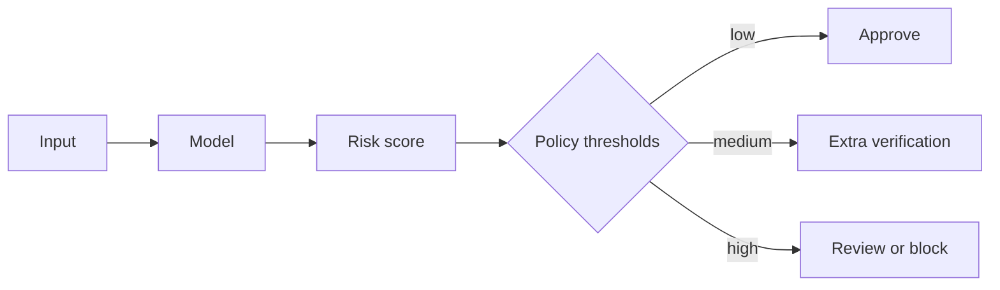

# Chapter 4 — Evaluation and Metrics

## 1. Evaluation is a claim with conditions

“The model scored 0.91” is incomplete. A meaningful result states:

- metric and exact definition;
- dataset, time range, split, sampling, and prevalence;
- decision threshold or top-<math display="inline" xmlns="http://www.w3.org/1998/Math/MathML"><semantics><mi>K</mi></semantics></math>;
- baseline and uncertainty;
- important segment/slice results;
- operational constraints such as latency and cost;
- whether the result is offline, shadow, experimental, or fully online.

Evaluation should answer a decision: whether to continue, select a model, choose
a threshold, launch, ramp, or roll back.

## 2. From score to decision

A binary classifier often emits a continuous score <math display="inline" xmlns="http://www.w3.org/1998/Math/MathML"><semantics><mrow><mi>s</mi><mo stretchy="false" form="prefix">(</mo><mi>x</mi><mo stretchy="false" form="postfix">)</mo></mrow></semantics></math> or probability <math display="inline" xmlns="http://www.w3.org/1998/Math/MathML"><semantics><mrow><mi>p</mi><mo stretchy="false" form="prefix">(</mo><mi>x</mi><mo stretchy="false" form="postfix">)</mo></mrow></semantics></math>.
A threshold <math display="inline" xmlns="http://www.w3.org/1998/Math/MathML"><semantics><mi>t</mi></semantics></math> creates a hard decision:

<math display="block" xmlns="http://www.w3.org/1998/Math/MathML"><semantics><mrow><mover><mi>y</mi><mo accent="true">̂</mo></mover><mo>=</mo><mrow><mo stretchy="true" form="prefix">{</mo><mtable><mtr><mtd columnalign="left" style="text-align: left"><mn>1</mn><mo>,</mo></mtd><mtd columnalign="left" style="text-align: left"><mi>s</mi><mo stretchy="false" form="prefix">(</mo><mi>x</mi><mo stretchy="false" form="postfix">)</mo><mo>≥</mo><mi>t</mi><mo>,</mo></mtd></mtr><mtr><mtd columnalign="left" style="text-align: left"><mn>0</mn><mo>,</mo></mtd><mtd columnalign="left" style="text-align: left"><mi>s</mi><mo stretchy="false" form="prefix">(</mo><mi>x</mi><mo stretchy="false" form="postfix">)</mo><mo>&lt;</mo><mi>t</mi><mi>.</mi></mtd></mtr></mtable></mrow></mrow></semantics></math>

Changing <math display="inline" xmlns="http://www.w3.org/1998/Math/MathML"><semantics><mi>t</mi></semantics></math> changes the errors without retraining the model. A model, a threshold,
and an action policy are distinct artifacts.



## 3. Binary classification: confusion matrix

| Actual / predicted |  Predicted positive |  Predicted negative |
|--------------------|--------------------:|--------------------:|
| Actual positive    |  True Positive (TP) | False Negative (FN) |
| Actual negative    | False Positive (FP) |  True Negative (TN) |

- **TP:** correctly detected positive.
- **FP:** false alarm; Type I error in a classical testing context.
- **FN:** missed positive; Type II error in a classical testing context.
- **TN:** correctly rejected negative.

Always define “positive.” For disease screening, disease is usually positive. For
spam filtering, spam may be positive. The positive class need not be “good.”

### 3.1 Accuracy and error rate

<math display="block" xmlns="http://www.w3.org/1998/Math/MathML"><semantics><mrow><mtext mathvariant="normal">Accuracy</mtext><mo>=</mo><mfrac><mrow><mi>T</mi><mi>P</mi><mo>+</mo><mi>T</mi><mi>N</mi></mrow><mrow><mi>T</mi><mi>P</mi><mo>+</mo><mi>T</mi><mi>N</mi><mo>+</mo><mi>F</mi><mi>P</mi><mo>+</mo><mi>F</mi><mi>N</mi></mrow></mfrac><mo>,</mo></mrow></semantics></math>

<math display="block" xmlns="http://www.w3.org/1998/Math/MathML"><semantics><mrow><mtext mathvariant="normal">Error rate</mtext><mo>=</mo><mn>1</mn><mo>−</mo><mtext mathvariant="normal">Accuracy</mtext><mo>=</mo><mfrac><mrow><mi>F</mi><mi>P</mi><mo>+</mo><mi>F</mi><mi>N</mi></mrow><mi>N</mi></mfrac><mi>.</mi></mrow></semantics></math>

Accuracy treats all examples and mistakes equally. It is interpretable when
classes and error costs are reasonably balanced. It is misleading with rare
events or asymmetric harm.

### 3.2 Precision / positive predictive value

<math display="block" xmlns="http://www.w3.org/1998/Math/MathML"><semantics><mrow><mtext mathvariant="normal">Precision</mtext><mo>=</mo><mfrac><mrow><mi>T</mi><mi>P</mi></mrow><mrow><mi>T</mi><mi>P</mi><mo>+</mo><mi>F</mi><mi>P</mi></mrow></mfrac><mi>.</mi></mrow></semantics></math>

Of predicted positives, how many truly are positive? Use when false alarms are
costly—for example, automatic content removal or legitimate-email quarantine.

### 3.3 Recall / sensitivity / true positive rate

<math display="block" xmlns="http://www.w3.org/1998/Math/MathML"><semantics><mrow><mtext mathvariant="normal">Recall</mtext><mo>=</mo><mtext mathvariant="normal">TPR</mtext><mo>=</mo><mfrac><mrow><mi>T</mi><mi>P</mi></mrow><mrow><mi>T</mi><mi>P</mi><mo>+</mo><mi>F</mi><mi>N</mi></mrow></mfrac><mi>.</mi></mrow></semantics></math>

Of actual positives, how many were detected? Use when missed positives are costly,
as in serious-disease screening or fraud detection.

### 3.4 Specificity / true negative rate

<math display="block" xmlns="http://www.w3.org/1998/Math/MathML"><semantics><mrow><mtext mathvariant="normal">Specificity</mtext><mo>=</mo><mtext mathvariant="normal">TNR</mtext><mo>=</mo><mfrac><mrow><mi>T</mi><mi>N</mi></mrow><mrow><mi>T</mi><mi>N</mi><mo>+</mo><mi>F</mi><mi>P</mi></mrow></mfrac><mi>.</mi></mrow></semantics></math>

Of actual negatives, how many were correctly rejected?

### 3.5 False positive and false negative rates

<math display="block" xmlns="http://www.w3.org/1998/Math/MathML"><semantics><mrow><mtext mathvariant="normal">FPR</mtext><mo>=</mo><mfrac><mrow><mi>F</mi><mi>P</mi></mrow><mrow><mi>F</mi><mi>P</mi><mo>+</mo><mi>T</mi><mi>N</mi></mrow></mfrac><mo>=</mo><mn>1</mn><mo>−</mo><mtext mathvariant="normal">specificity</mtext><mo>,</mo></mrow></semantics></math>

<math display="block" xmlns="http://www.w3.org/1998/Math/MathML"><semantics><mrow><mtext mathvariant="normal">FNR</mtext><mo>=</mo><mfrac><mrow><mi>F</mi><mi>N</mi></mrow><mrow><mi>F</mi><mi>N</mi><mo>+</mo><mi>T</mi><mi>P</mi></mrow></mfrac><mo>=</mo><mn>1</mn><mo>−</mo><mtext mathvariant="normal">recall</mtext><mi>.</mi></mrow></semantics></math>

Do not confuse FPR with <math display="inline" xmlns="http://www.w3.org/1998/Math/MathML"><semantics><mrow><mn>1</mn><mo>−</mo><mtext mathvariant="normal">precision</mtext></mrow></semantics></math>. The denominators differ:

- FPR is among actual negatives.
- false discovery proportion <math display="inline" xmlns="http://www.w3.org/1998/Math/MathML"><semantics><mrow><mi>F</mi><mi>P</mi><mi>/</mi><mo stretchy="false" form="prefix">(</mo><mi>T</mi><mi>P</mi><mo>+</mo><mi>F</mi><mi>P</mi><mo stretchy="false" form="postfix">)</mo></mrow></semantics></math> is among predicted positives.

### 3.6 Negative predictive value

<math display="block" xmlns="http://www.w3.org/1998/Math/MathML"><semantics><mrow><mtext mathvariant="normal">NPV</mtext><mo>=</mo><mfrac><mrow><mi>T</mi><mi>N</mi></mrow><mrow><mi>T</mi><mi>N</mi><mo>+</mo><mi>F</mi><mi>N</mi></mrow></mfrac><mi>.</mi></mrow></semantics></math>

Of predicted negatives, how many truly are negative?

### 3.7 F-score

The F1 score is the harmonic mean of precision and recall:

<math display="block" xmlns="http://www.w3.org/1998/Math/MathML"><semantics><mrow><msub><mi>F</mi><mn>1</mn></msub><mo>=</mo><mn>2</mn><mfrac><mrow><mtext mathvariant="normal">precision</mtext><mo>⋅</mo><mtext mathvariant="normal">recall</mtext></mrow><mrow><mtext mathvariant="normal">precision</mtext><mo>+</mo><mtext mathvariant="normal">recall</mtext></mrow></mfrac><mo>=</mo><mfrac><mrow><mn>2</mn><mi>T</mi><mi>P</mi></mrow><mrow><mn>2</mn><mi>T</mi><mi>P</mi><mo>+</mo><mi>F</mi><mi>P</mi><mo>+</mo><mi>F</mi><mi>N</mi></mrow></mfrac><mi>.</mi></mrow></semantics></math>

The harmonic mean becomes low if either component is low. Generalized <math display="inline" xmlns="http://www.w3.org/1998/Math/MathML"><semantics><msub><mi>F</mi><mi>β</mi></msub></semantics></math>:

<math display="block" xmlns="http://www.w3.org/1998/Math/MathML"><semantics><mrow><msub><mi>F</mi><mi>β</mi></msub><mo>=</mo><mo stretchy="false" form="prefix">(</mo><mn>1</mn><mo>+</mo><msup><mi>β</mi><mn>2</mn></msup><mo stretchy="false" form="postfix">)</mo><mfrac><mrow><mtext mathvariant="normal">precision</mtext><mo>⋅</mo><mtext mathvariant="normal">recall</mtext></mrow><mrow><msup><mi>β</mi><mn>2</mn></msup><mo>⋅</mo><mtext mathvariant="normal">precision</mtext><mo>+</mo><mtext mathvariant="normal">recall</mtext></mrow></mfrac><mi>.</mi></mrow></semantics></math>

<math display="inline" xmlns="http://www.w3.org/1998/Math/MathML"><semantics><mrow><mi>β</mi><mo>&gt;</mo><mn>1</mn></mrow></semantics></math> emphasizes recall; <math display="inline" xmlns="http://www.w3.org/1998/Math/MathML"><semantics><mrow><mi>β</mi><mo>&lt;</mo><mn>1</mn></mrow></semantics></math> emphasizes precision. F-scores ignore TN
and do not encode real monetary or safety costs. They are summaries, not universal
utility functions.

### 3.8 Balanced accuracy

<math display="block" xmlns="http://www.w3.org/1998/Math/MathML"><semantics><mrow><mtext mathvariant="normal">Balanced accuracy</mtext><mo>=</mo><mfrac><mrow><mtext mathvariant="normal">TPR</mtext><mo>+</mo><mtext mathvariant="normal">TNR</mtext></mrow><mn>2</mn></mfrac><mi>.</mi></mrow></semantics></math>

This gives the two classes equal weight despite prevalence, but a product's actual
cost structure may still differ.

## 4. Worked confusion-matrix example

Suppose 10,000 messages contain 200 spam messages. At one threshold:

- TP = 180,
- FN = 20,
- FP = 98,
- TN = 9,702.

Then:

<math display="block" xmlns="http://www.w3.org/1998/Math/MathML"><semantics><mrow><mtext mathvariant="normal">Accuracy</mtext><mo>=</mo><mfrac><mrow><mn>180</mn><mo>+</mo><mn>9702</mn></mrow><mn>10000</mn></mfrac><mo>=</mo><mn>98.82</mn><mi>%</mi><mo>,</mo></mrow></semantics></math>

<math display="block" xmlns="http://www.w3.org/1998/Math/MathML"><semantics><mrow><mtext mathvariant="normal">Precision</mtext><mo>=</mo><mfrac><mn>180</mn><mrow><mn>180</mn><mo>+</mo><mn>98</mn></mrow></mfrac><mo>≈</mo><mn>64.75</mn><mi>%</mi><mo>,</mo></mrow></semantics></math>

<math display="block" xmlns="http://www.w3.org/1998/Math/MathML"><semantics><mrow><mtext mathvariant="normal">Recall</mtext><mo>=</mo><mfrac><mn>180</mn><mn>200</mn></mfrac><mo>=</mo><mn>90</mn><mi>%</mi><mo>,</mo></mrow></semantics></math>

<math display="block" xmlns="http://www.w3.org/1998/Math/MathML"><semantics><mrow><mtext mathvariant="normal">FPR</mtext><mo>=</mo><mfrac><mn>98</mn><mn>9800</mn></mfrac><mo>=</mo><mn>1</mn><mi>%</mi><mi>.</mi></mrow></semantics></math>

Despite 98.82% accuracy, more than one third of quarantined messages are
legitimate. Whether that is acceptable depends on the action. A warning label may
tolerate it; irreversible deletion probably cannot.

The always-not-spam classifier has 98% accuracy but 0% spam recall. This shows
why a baseline and the full error structure matter.

## 5. Threshold curves

Lowering the positive threshold usually predicts more positives:

- TP tends to increase and FN decrease: recall rises;
- FP tends to increase and TN decrease: precision often falls and FPR rises.

The exact behavior depends on tied scores and data, but the trade-off is central.

### ROC curve and ROC-AUC

The receiver operating characteristic curve plots:

<math display="block" xmlns="http://www.w3.org/1998/Math/MathML"><semantics><mrow><mi>y</mi><mo>=</mo><mtext mathvariant="normal">TPR</mtext><mo>,</mo><mspace width="2.0em"></mspace><mi>x</mi><mo>=</mo><mtext mathvariant="normal">FPR</mtext></mrow></semantics></math>

over thresholds. ROC-AUC has a ranking interpretation: the probability that a
random positive receives a higher score than a random negative, with handling
for ties.

Advantages:

- threshold-independent ranking summary;
- not directly changed by class prevalence under stable class-conditional scores;
- useful for comparing discrimination.

Limitations:

- can look impressive with extremely rare positives even when precision is poor;
- weights threshold regions the product may never use;
- says nothing about probability calibration;
- aggregate AUC can hide segment failures.

### Precision–recall curve and average precision/PR-AUC

Plot precision versus recall over thresholds. It focuses on positive-class
retrieval and is often more informative for rare events. Its baseline depends on
positive prevalence: a random ranking has expected precision approximately equal
to prevalence.

Be precise about “PR-AUC”: software libraries may compute trapezoidal area or
average precision differently. Record the implementation.

### Partial and operating-point metrics

A product may care only about a narrow region, such as recall subject to
precision <math display="inline" xmlns="http://www.w3.org/1998/Math/MathML"><semantics><mrow><mo>≥</mo><mn>99.9</mn><mi>%</mi></mrow></semantics></math>, or TPR when FPR <math display="inline" xmlns="http://www.w3.org/1998/Math/MathML"><semantics><mrow><mo>≤</mo><mn>0.1</mn><mi>%</mi></mrow></semantics></math>. Report that constraint directly
rather than choosing by global AUC.

## 6. Probabilistic evaluation and calibration

Discrimination asks whether positives rank above negatives. **Calibration** asks
whether predicted probabilities match observed frequencies.

For a calibrated model, among cases predicted near 0.7, about 70% should be
positive (under the evaluated distribution and grouping).

Two models can have equal ROC-AUC but different calibration. Cost-based threshold
formulas require probabilities that are reasonably calibrated.

### Log loss

For binary labels:

<math display="block" xmlns="http://www.w3.org/1998/Math/MathML"><semantics><mrow><mtext mathvariant="normal">LogLoss</mtext><mo>=</mo><mi>−</mi><mfrac><mn>1</mn><mi>n</mi></mfrac><munderover><mo>∑</mo><mrow><mi>i</mi><mo>=</mo><mn>1</mn></mrow><mi>n</mi></munderover><mrow><mo stretchy="true" form="prefix">[</mo><msub><mi>y</mi><mi>i</mi></msub><mi mathvariant="normal">log</mi><msub><mi>p</mi><mi>i</mi></msub><mo>+</mo><mo stretchy="false" form="prefix">(</mo><mn>1</mn><mo>−</mo><msub><mi>y</mi><mi>i</mi></msub><mo stretchy="false" form="postfix">)</mo><mi mathvariant="normal">log</mi><mo stretchy="false" form="prefix">(</mo><mn>1</mn><mo>−</mo><msub><mi>p</mi><mi>i</mi></msub><mo stretchy="false" form="postfix">)</mo><mo stretchy="true" form="postfix">]</mo></mrow><mi>.</mi></mrow></semantics></math>

It is a **proper scoring rule**: in expectation, honest probabilities minimize
the score. It strongly punishes confident mistakes.

### Brier score

<math display="block" xmlns="http://www.w3.org/1998/Math/MathML"><semantics><mrow><mtext mathvariant="normal">Brier</mtext><mo>=</mo><mfrac><mn>1</mn><mi>n</mi></mfrac><munderover><mo>∑</mo><mrow><mi>i</mi><mo>=</mo><mn>1</mn></mrow><mi>n</mi></munderover><mo stretchy="false" form="prefix">(</mo><msub><mi>p</mi><mi>i</mi></msub><mo>−</mo><msub><mi>y</mi><mi>i</mi></msub><msup><mo stretchy="false" form="postfix">)</mo><mn>2</mn></msup><mi>.</mi></mrow></semantics></math>

Lower is better. It measures probability error and has useful calibration/
refinement decompositions, though scale depends on prevalence.

### Reliability diagram

Group predictions into bins and compare average predicted probability with actual
positive fraction. Caveats: result depends on binning and sparse bins have large
uncertainty. Also inspect calibration by important segment and time.

### Calibration methods

Platt/sigmoid scaling, isotonic regression, and temperature scaling learn a
mapping from raw scores/logits to probabilities. Fit this mapping on held-out
calibration data, not on the final test set. Calibration can drift when prevalence
or relationships change.

## 7. Multiclass and multilabel evaluation

### Multiclass

Exactly one of <math display="inline" xmlns="http://www.w3.org/1998/Math/MathML"><semantics><mi>K</mi></semantics></math> classes is correct. A confusion matrix is <math display="inline" xmlns="http://www.w3.org/1998/Math/MathML"><semantics><mrow><mi>K</mi><mo>×</mo><mi>K</mi></mrow></semantics></math>.

- top-1 accuracy: highest-scored class is correct;
- top-<math display="inline" xmlns="http://www.w3.org/1998/Math/MathML"><semantics><mi>k</mi></semantics></math> accuracy: true class appears among <math display="inline" xmlns="http://www.w3.org/1998/Math/MathML"><semantics><mi>k</mi></semantics></math> highest scores;
- multiclass cross-entropy:

<math display="block" xmlns="http://www.w3.org/1998/Math/MathML"><semantics><mrow><mtext mathvariant="normal">CE</mtext><mo>=</mo><mi>−</mi><mfrac><mn>1</mn><mi>n</mi></mfrac><munderover><mo>∑</mo><mrow><mi>i</mi><mo>=</mo><mn>1</mn></mrow><mi>n</mi></munderover><munderover><mo>∑</mo><mrow><mi>k</mi><mo>=</mo><mn>1</mn></mrow><mi>K</mi></munderover><msub><mi>y</mi><mrow><mi>i</mi><mi>k</mi></mrow></msub><mrow><mi mathvariant="normal">log</mi><mo>&#8289;</mo></mrow><msub><mi>p</mi><mrow><mi>i</mi><mi>k</mi></mrow></msub><mo>,</mo></mrow></semantics></math>

where <math display="inline" xmlns="http://www.w3.org/1998/Math/MathML"><semantics><msub><mi>y</mi><mrow><mi>i</mi><mi>k</mi></mrow></msub></semantics></math> is 1 only for the true class.

### Multilabel

An example can have several labels (an image can contain “dog,” “person,” and
“car”). Each label may have its own threshold. Exact-match accuracy is very harsh;
per-label, example-based, and micro/macro metrics expose different behavior.

### Micro, macro, and weighted averaging

- **Micro:** pool all TP/FP/FN counts; frequent classes dominate.
- **Macro:** compute metric per class and average equally; exposes rare-class
  weakness but can be noisy.
- **Weighted macro:** class metric weighted by support; between the two but can
  again hide minority classes.

Report class-level results for high-impact categories rather than relying only on
one average.

## 8. Regression metrics

Let residual/error be <math display="inline" xmlns="http://www.w3.org/1998/Math/MathML"><semantics><mrow><msub><mi>e</mi><mi>i</mi></msub><mo>=</mo><msub><mi>y</mi><mi>i</mi></msub><mo>−</mo><msub><mover><mi>y</mi><mo accent="true">̂</mo></mover><mi>i</mi></msub></mrow></semantics></math>.

### Mean absolute error (MAE)

<math display="block" xmlns="http://www.w3.org/1998/Math/MathML"><semantics><mrow><mtext mathvariant="normal">MAE</mtext><mo>=</mo><mfrac><mn>1</mn><mi>n</mi></mfrac><munderover><mo>∑</mo><mrow><mi>i</mi><mo>=</mo><mn>1</mn></mrow><mi>n</mi></munderover><mo stretchy="false" form="prefix">|</mo><msub><mi>e</mi><mi>i</mi></msub><mo stretchy="false" form="prefix">|</mo><mi>.</mi></mrow></semantics></math>

- same units as the target;
- each unit of error contributes linearly;
- more robust to outliers than RMSE;
- the conditional median minimizes expected absolute error.

### Mean squared error (MSE) and root MSE

<math display="block" xmlns="http://www.w3.org/1998/Math/MathML"><semantics><mrow><mtext mathvariant="normal">MSE</mtext><mo>=</mo><mfrac><mn>1</mn><mi>n</mi></mfrac><munderover><mo>∑</mo><mrow><mi>i</mi><mo>=</mo><mn>1</mn></mrow><mi>n</mi></munderover><msubsup><mi>e</mi><mi>i</mi><mn>2</mn></msubsup><mo>,</mo><mspace width="2.0em"></mspace><mtext mathvariant="normal">RMSE</mtext><mo>=</mo><msqrt><mtext mathvariant="normal">MSE</mtext></msqrt><mi>.</mi></mrow></semantics></math>

- RMSE returns to target units;
- large errors are penalized strongly;
- sensitive to outliers;
- the conditional mean minimizes expected squared error.

Do not say RMSE “always penalizes errors more” than MAE by comparing numeric
values across arbitrary units. Its squared objective changes relative weighting.

### Mean absolute percentage error (MAPE)

<math display="block" xmlns="http://www.w3.org/1998/Math/MathML"><semantics><mrow><mtext mathvariant="normal">MAPE</mtext><mo>=</mo><mfrac><mrow><mn>100</mn><mi>%</mi></mrow><mi>n</mi></mfrac><munderover><mo>∑</mo><mrow><mi>i</mi><mo>=</mo><mn>1</mn></mrow><mi>n</mi></munderover><mrow><mo stretchy="true" form="prefix">|</mo><mfrac><mrow><msub><mi>y</mi><mi>i</mi></msub><mo>−</mo><msub><mover><mi>y</mi><mo accent="true">̂</mo></mover><mi>i</mi></msub></mrow><msub><mi>y</mi><mi>i</mi></msub></mfrac><mo stretchy="true" form="postfix">|</mo></mrow><mi>.</mi></mrow></semantics></math>

MAPE is undefined at <math display="inline" xmlns="http://www.w3.org/1998/Math/MathML"><semantics><mrow><msub><mi>y</mi><mi>i</mi></msub><mo>=</mo><mn>0</mn></mrow></semantics></math>, explodes near zero, and is asymmetric. It can bias
forecasts downward. Do not use it mechanically.

### Symmetric MAPE (sMAPE)

A common version is:

<math display="block" xmlns="http://www.w3.org/1998/Math/MathML"><semantics><mrow><mtext mathvariant="normal">sMAPE</mtext><mo>=</mo><mfrac><mrow><mn>100</mn><mi>%</mi></mrow><mi>n</mi></mfrac><munderover><mo>∑</mo><mrow><mi>i</mi><mo>=</mo><mn>1</mn></mrow><mi>n</mi></munderover><mfrac><mrow><mn>2</mn><mo stretchy="false" form="prefix">|</mo><msub><mi>y</mi><mi>i</mi></msub><mo>−</mo><msub><mover><mi>y</mi><mo accent="true">̂</mo></mover><mi>i</mi></msub><mo stretchy="false" form="prefix">|</mo></mrow><mrow><mo stretchy="false" form="prefix">|</mo><msub><mi>y</mi><mi>i</mi></msub><mo stretchy="false" form="prefix">|</mo><mi>+</mi><mo stretchy="false" form="prefix">|</mo><msub><mover><mi>y</mi><mo accent="true">̂</mo></mover><mi>i</mi></msub><mo stretchy="false" form="prefix">|</mo></mrow></mfrac><mi>.</mi></mrow></semantics></math>

Definitions vary, and zero/near-zero behavior remains awkward. State the formula.

### <math display="inline" xmlns="http://www.w3.org/1998/Math/MathML"><semantics><msup><mi>R</mi><mn>2</mn></msup></semantics></math> / coefficient of determination

<math display="block" xmlns="http://www.w3.org/1998/Math/MathML"><semantics><mrow><msup><mi>R</mi><mn>2</mn></msup><mo>=</mo><mn>1</mn><mo>−</mo><mfrac><mrow><munder><mo>∑</mo><mi>i</mi></munder><mo stretchy="false" form="prefix">(</mo><msub><mi>y</mi><mi>i</mi></msub><mo>−</mo><msub><mover><mi>y</mi><mo accent="true">̂</mo></mover><mi>i</mi></msub><msup><mo stretchy="false" form="postfix">)</mo><mn>2</mn></msup></mrow><mrow><munder><mo>∑</mo><mi>i</mi></munder><mo stretchy="false" form="prefix">(</mo><msub><mi>y</mi><mi>i</mi></msub><mo>−</mo><mover><mi>y</mi><mo accent="true">‾</mo></mover><msup><mo stretchy="false" form="postfix">)</mo><mn>2</mn></msup></mrow></mfrac><mi>.</mi></mrow></semantics></math>

It compares squared error with predicting the evaluation-set mean <math display="inline" xmlns="http://www.w3.org/1998/Math/MathML"><semantics><mover><mi>y</mi><mo accent="true">‾</mo></mover></semantics></math>.

- <math display="inline" xmlns="http://www.w3.org/1998/Math/MathML"><semantics><mrow><msup><mi>R</mi><mn>2</mn></msup><mo>=</mo><mn>1</mn></mrow></semantics></math>: perfect predictions;
- <math display="inline" xmlns="http://www.w3.org/1998/Math/MathML"><semantics><mrow><msup><mi>R</mi><mn>2</mn></msup><mo>=</mo><mn>0</mn></mrow></semantics></math>: equal to that mean baseline on the evaluated data;
- <math display="inline" xmlns="http://www.w3.org/1998/Math/MathML"><semantics><mrow><msup><mi>R</mi><mn>2</mn></msup><mo>&lt;</mo><mn>0</mn></mrow></semantics></math>: worse than the baseline.

It is not “percentage of each prediction explained,” and out-of-sample <math display="inline" xmlns="http://www.w3.org/1998/Math/MathML"><semantics><msup><mi>R</mi><mn>2</mn></msup></semantics></math> can
be negative.

### Quantile/pinball loss

For quantile level <math display="inline" xmlns="http://www.w3.org/1998/Math/MathML"><semantics><mrow><mi>τ</mi><mo>∈</mo><mo stretchy="false" form="prefix">(</mo><mn>0</mn><mo>,</mo><mn>1</mn><mo stretchy="false" form="postfix">)</mo></mrow></semantics></math> and residual <math display="inline" xmlns="http://www.w3.org/1998/Math/MathML"><semantics><mrow><mi>u</mi><mo>=</mo><mi>y</mi><mo>−</mo><mover><mi>y</mi><mo accent="true">̂</mo></mover></mrow></semantics></math>:

<math display="block" xmlns="http://www.w3.org/1998/Math/MathML"><semantics><mrow><msub><mi>ρ</mi><mi>τ</mi></msub><mo stretchy="false" form="prefix">(</mo><mi>u</mi><mo stretchy="false" form="postfix">)</mo><mo>=</mo><mrow><mo stretchy="true" form="prefix">{</mo><mtable><mtr><mtd columnalign="left" style="text-align: left"><mi>τ</mi><mi>u</mi><mo>,</mo></mtd><mtd columnalign="left" style="text-align: left"><mi>u</mi><mo>≥</mo><mn>0</mn><mo>,</mo></mtd></mtr><mtr><mtd columnalign="left" style="text-align: left"><mo stretchy="false" form="prefix">(</mo><mi>τ</mi><mo>−</mo><mn>1</mn><mo stretchy="false" form="postfix">)</mo><mi>u</mi><mo>,</mo></mtd><mtd columnalign="left" style="text-align: left"><mi>u</mi><mo>&lt;</mo><mn>0</mn><mi>.</mi></mtd></mtr></mtable></mrow></mrow></semantics></math>

This supports asymmetric costs and prediction intervals. A 0.9-quantile demand
forecast can support inventory decisions where understocking is expensive.

### Always slice regression errors

Report bias (mean signed error), error quantiles, and metrics by target magnitude,
time, geography, product type, or other operational segment. The average can hide
systematic underprediction of high-impact cases.

## 9. Ranking, retrieval, and recommendation metrics

### Precision@K

<math display="block" xmlns="http://www.w3.org/1998/Math/MathML"><semantics><mrow><mtext mathvariant="normal">Precision@K</mtext><mo>=</mo><mfrac><mrow><mi>#</mi><mrow><mspace width="0.333em"></mspace><mtext mathvariant="normal"> relevant items in top K</mtext></mrow></mrow><mi>K</mi></mfrac><mi>.</mi></mrow></semantics></math>

### Recall@K

<math display="block" xmlns="http://www.w3.org/1998/Math/MathML"><semantics><mrow><mtext mathvariant="normal">Recall@K</mtext><mo>=</mo><mfrac><mrow><mi>#</mi><mrow><mspace width="0.333em"></mspace><mtext mathvariant="normal"> relevant items in top K</mtext></mrow></mrow><mrow><mi>#</mi><mrow><mspace width="0.333em"></mspace><mtext mathvariant="normal"> relevant items available</mtext></mrow></mrow></mfrac><mi>.</mi></mrow></semantics></math>

### Reciprocal rank and MRR

For query <math display="inline" xmlns="http://www.w3.org/1998/Math/MathML"><semantics><mi>q</mi></semantics></math>, reciprocal rank is <math display="inline" xmlns="http://www.w3.org/1998/Math/MathML"><semantics><mrow><mn>1</mn><mi>/</mi><mi>r</mi><mi>a</mi><mi>n</mi><msub><mi>k</mi><mi>q</mi></msub></mrow></semantics></math> of the first relevant result. Mean
reciprocal rank:

<math display="block" xmlns="http://www.w3.org/1998/Math/MathML"><semantics><mrow><mtext mathvariant="normal">MRR</mtext><mo>=</mo><mfrac><mn>1</mn><mi>Q</mi></mfrac><munderover><mo>∑</mo><mrow><mi>q</mi><mo>=</mo><mn>1</mn></mrow><mi>Q</mi></munderover><mfrac><mn>1</mn><mrow><mi>r</mi><mi>a</mi><mi>n</mi><msub><mi>k</mi><mi>q</mi></msub></mrow></mfrac><mi>.</mi></mrow></semantics></math>

It focuses on the first relevant result.

### DCG and NDCG

For graded relevance <math display="inline" xmlns="http://www.w3.org/1998/Math/MathML"><semantics><mrow><mi>r</mi><mi>e</mi><msub><mi>l</mi><mi>i</mi></msub></mrow></semantics></math> at position <math display="inline" xmlns="http://www.w3.org/1998/Math/MathML"><semantics><mi>i</mi></semantics></math>:

<math display="block" xmlns="http://www.w3.org/1998/Math/MathML"><semantics><mrow><mtext mathvariant="normal">DCG@K</mtext><mo>=</mo><munderover><mo>∑</mo><mrow><mi>i</mi><mo>=</mo><mn>1</mn></mrow><mi>K</mi></munderover><mfrac><mrow><msup><mn>2</mn><mrow><mi>r</mi><mi>e</mi><msub><mi>l</mi><mi>i</mi></msub></mrow></msup><mo>−</mo><mn>1</mn></mrow><mrow><msub><mrow><mi mathvariant="normal">log</mi><mo>&#8289;</mo></mrow><mn>2</mn></msub><mo stretchy="false" form="prefix">(</mo><mi>i</mi><mo>+</mo><mn>1</mn><mo stretchy="false" form="postfix">)</mo></mrow></mfrac><mi>.</mi></mrow></semantics></math>

Normalize by ideal ordering:

<math display="block" xmlns="http://www.w3.org/1998/Math/MathML"><semantics><mrow><mtext mathvariant="normal">NDCG@K</mtext><mo>=</mo><mfrac><mtext mathvariant="normal">DCG@K</mtext><mtext mathvariant="normal">IDCG@K</mtext></mfrac><mi>.</mi></mrow></semantics></math>

NDCG rewards highly relevant items near the top. Its result depends on relevance
labels, candidate set, cutoff, and discount convention.

### Offline recommendation caveat

Logged feedback reflects the old exposure policy. Treating every unclicked or
unshown item as irrelevant introduces exposure and position bias. Offline ranking
improvement must ultimately be validated with a controlled online experiment.

## 10. Forecast evaluation

Forecasting requires backtesting that respects time:

```
train ----> validate horizon 1
train --------> validate horizon 2
train ------------> validate horizon 3
```

Use rolling or expanding windows. Evaluate by forecast horizon, season, item
volume, intermittency, and business cost. Compare against naïve baselines such as
last value and seasonal last value. A random split is generally invalid.

Weighted absolute percentage error is often used at aggregate level:

<math display="block" xmlns="http://www.w3.org/1998/Math/MathML"><semantics><mrow><mtext mathvariant="normal">WAPE</mtext><mo>=</mo><mfrac><mrow><munder><mo>∑</mo><mi>i</mi></munder><mo stretchy="false" form="prefix">|</mo><msub><mi>y</mi><mi>i</mi></msub><mo>−</mo><msub><mover><mi>y</mi><mo accent="true">̂</mo></mover><mi>i</mi></msub><mo stretchy="false" form="prefix">|</mo></mrow><mrow><munder><mo>∑</mo><mi>i</mi></munder><mo stretchy="false" form="prefix">|</mo><msub><mi>y</mi><mi>i</mi></msub><mo stretchy="false" form="prefix">|</mo></mrow></mfrac><mo>,</mo></mrow></semantics></math>

but it can still hide item-level problems and is undefined when total actual is
zero.

## 11. Generative and LLM system evaluation

Open-ended output rarely has one sufficient automatic metric. Evaluate the
**system task**, not only the base model.

### Build a representative evaluation set

Include:

- common tasks weighted like production;
- difficult but important edge cases;
- slices by user, language, document/source, and request type;
- adversarial and safety cases;
- cases requiring refusal or escalation;
- changed/temporal data to test freshness.

Avoid test contamination: do not continuously hand-edit prompts against a small
visible benchmark and then report it as an unbiased result.

### Evaluation dimensions

| Dimension | Example measurement |
|----|----|
| Task success | exact match, executable result, workflow completion |
| Factuality/grounding | claims supported by approved sources |
| Retrieval | answer-bearing document recall@K, ranking NDCG |
| Relevance | rubric-based human or calibrated evaluator judgment |
| Safety | policy violation and over-refusal rates by category |
| Robustness | paraphrases, injection attempts, malformed tool results |
| Tool use | correct tool, arguments, sequencing, and permission handling |
| Reliability | parse errors, timeouts, fallback and retry success |
| Performance | p50/p95/p99 latency, tokens, compute, monetary cost |

LLM-as-judge can scale comparisons but may have position, verbosity, self-
preference, and domain biases. Validate judge agreement against expert human
ratings, randomize answer order, use explicit rubrics, and retain deterministic
task checks wherever possible.

## 12. Offline versus online evaluation

### Offline

Fast, repeatable evaluation on held-out historical/labeled data. Useful for model
selection and catching regressions. It cannot fully reproduce user response,
feedback loops, unseen shift, or operational failures.

### Shadow mode

Run the new system on live inputs without using its decisions. This tests latency,
features, reliability, cost, and score distributions. Because actions do not
change, it cannot measure the causal effect of those actions.

### A/B experiment

Randomly assign eligible units to control and treatment. Compare product outcomes
and guardrails. Choose the randomization unit to avoid interference (user,
session, household, region, etc.), predefine primary metrics, and run long enough
to cover relevant cycles.

### Canary/ramp

Gradually expose a small traffic percentage to manage operational risk. A canary
is a rollout mechanism; randomization and analysis determine whether it is also a
valid experiment.

## 13. Statistical uncertainty

A sample metric is an estimate. Report uncertainty, especially for rare events
and small slices.

For a simple sample proportion <math display="inline" xmlns="http://www.w3.org/1998/Math/MathML"><semantics><mover><mi>p</mi><mo accent="true">̂</mo></mover></semantics></math> under independent Bernoulli assumptions,
an approximate standard error is:

<math display="block" xmlns="http://www.w3.org/1998/Math/MathML"><semantics><mrow><mi>S</mi><mi>E</mi><mo stretchy="false" form="prefix">(</mo><mover><mi>p</mi><mo accent="true">̂</mo></mover><mo stretchy="false" form="postfix">)</mo><mo>=</mo><msqrt><mfrac><mrow><mover><mi>p</mi><mo accent="true">̂</mo></mover><mo stretchy="false" form="prefix">(</mo><mn>1</mn><mo>−</mo><mover><mi>p</mi><mo accent="true">̂</mo></mover><mo stretchy="false" form="postfix">)</mo></mrow><mi>n</mi></mfrac></msqrt><mi>.</mi></mrow></semantics></math>

A rough 95% interval is <math display="inline" xmlns="http://www.w3.org/1998/Math/MathML"><semantics><mrow><mover><mi>p</mi><mo accent="true">̂</mo></mover><mo>±</mo><mn>1.96</mn><mi>S</mi><mi>E</mi></mrow></semantics></math>, but Wilson or exact intervals behave
better for small counts/extreme proportions. Dependencies require grouped or
cluster-aware methods.

Bootstrap intervals resample evaluation units and recompute the metric. Resample
at the independent unit (for example users, not individual events) and preserve
temporal structure when needed.

When comparing models, use **paired** evaluation because both predict the same
examples. Bootstrap metric differences or use appropriate paired tests. A tiny
mean improvement with a wide interval is not established progress.

### Multiple comparisons

Trying hundreds of variants increases the chance of an apparent winner due to
noise. Track experiments, limit unprincipled searching, use a final holdout, and
consider correction or confirmation for high-stakes claims.

## 14. Slice-based evaluation

Aggregate performance can hide large failures. Define slices before launch:

- product-critical segments;
- underrepresented groups;
- geographies/languages/devices;
- new versus returning entities;
- low versus high target magnitude;
- missing-feature patterns;
- traffic source and time;
- known safety or attack categories.

Use both absolute performance and sample size/uncertainty. Avoid drawing sweeping
conclusions from tiny slices. Slice definitions must be lawful, ethical, and tied
to meaningful risk hypotheses.

## 15. Metric selection recipe

1.  Describe the action and cost of each error.
2.  Choose a metric family matching output and product use.
3.  Set an operating constraint: precision, recall, FPR, capacity, or cost.
4.  Include calibration if probabilities feed decisions.
5.  Evaluate on a deployment-simulating split and real prevalence.
6.  Compare against the current and simple baselines.
7.  Add slices, uncertainty, latency, cost, and safety guardrails.
8.  Predefine online KPI and experiment/rollout logic.
9.  Confirm that the metric cannot be trivially gamed.

## 16. Interview traps

- Picking accuracy for rare-event detection without discussing prevalence.
- Saying PR-AUC is always better than ROC-AUC; each answers a different summary
  question and operating-point metrics may be better than both.
- Confusing calibration with discrimination.
- Choosing threshold 0.5 without costs, prevalence, calibration, or capacity.
- Reporting F1 when true negative performance or asymmetric costs matter.
- Using MAPE with zeros/near-zero actuals.
- Treating offline recommendation clicks as unbiased relevance labels.
- Reporting only averages without slices and confidence.
- Assuming improved offline loss guarantees a KPI improvement.

## 17. Check your understanding

1.  Given TP=40, FP=10, FN=60, TN=890, calculate precision, recall, FPR,
    specificity, F1, and accuracy.
2.  Why can ROC-AUC remain high while deployed precision is unacceptable?
3.  Construct two classifiers with the same accuracy but very different harm.
4.  Explain discrimination versus calibration using risk scores.
5.  When would MAE be preferable to RMSE? When would quantile loss be preferable?
6.  Why may a 1% NDCG gain fail in an A/B test?
7.  Design an evaluation suite for a document-grounded support assistant.
8.  What would you report alongside a metric on only 25 positive examples?
