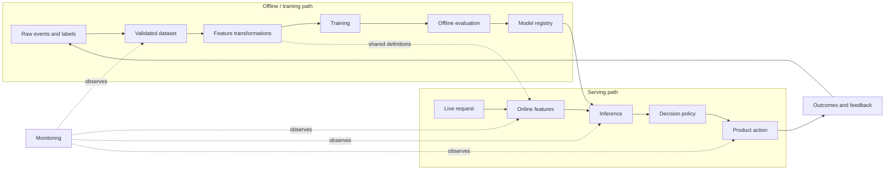
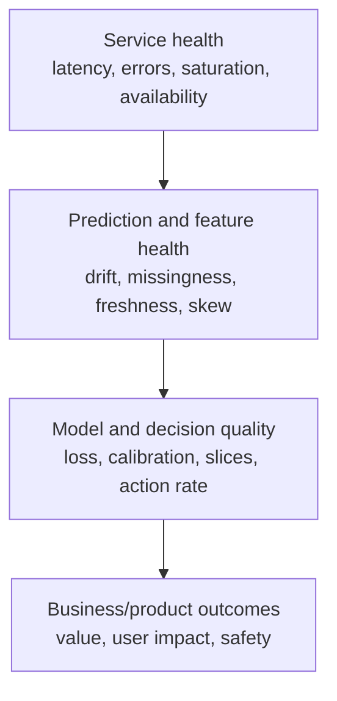

# Chapter 6 — Production Lifecycle and Responsible AI

## 1. Production ML is a changing software system

A trained model file is not a product. Production behavior depends on data,
features, code, policies, services, users, and feedback:

Model quality can remain unchanged while the product fails because a feature is
stale, an enum changed, the wrong artifact deployed, latency timed out, or the
decision policy changed.

## 2. The end-to-end lifecycle

### Stage 1: define and instrument

- Write the prediction unit/time, target, action, metrics, constraints, risks.
- Instrument the current workflow and baseline before launching ML.
- Define stable event schemas, entity IDs, timestamps, and outcome logging.
- Decide who owns the product decision and incident response.

### Stage 2: collect and validate data

- Create point-in-time correct features and mature labels.
- Version sources, transformations, splits, and schemas.
- Run structural, statistical, semantic, privacy, and leakage checks.
- Document selection effects and intended population.

### Stage 3: train and evaluate

- Start with a simple baseline.
- Use reproducible pipelines and track code/data/config/artifacts.
- Evaluate metrics, slices, calibration, robustness, latency, and cost.
- Perform error analysis and ablations.

### Stage 4: validate the artifact

Before registry promotion:

- verify model signature, dependencies, and serialization;
- test input schema and edge cases;
- reproduce expected held-out metrics;
- compare with current champion using predefined gates;
- scan for forbidden features/security issues;
- create model documentation and rollback-compatible versioning.

### Stage 5: deploy safely

- Test offline/online feature parity.
- Shadow on live traffic.
- Canary or A/B test with kill switch and fallback.
- Ramp gradually while watching service and product guardrails.
- Record exactly which model, features, policy, and experiment served each case.

### Stage 6: monitor and respond

- Observe infrastructure, data, predictions/actions, labels, product outcomes,
  safety, and cost.
- Alert on actionable symptoms with owners and runbooks.
- Diagnose before retraining automatically.
- Roll back model/policy or degrade safely when necessary.

### Stage 7: learn and govern

- Incorporate mature feedback with selection-bias awareness.
- Reassess labels, metrics, slices, threats, and relevance.
- Retire stale artifacts/data and preserve audit records.
- Periodically ask whether ML should still be used.

## 3. Batch, streaming, and online inference

### Batch inference

Score many examples periodically and store predictions.

Good for: weekly churn lists, nightly recommendations, demand forecasts.

Advantages:

- high throughput and simpler operations;
- predictable cost;
- rich offline features;
- easy retries/backfills.

Limitations:

- stale predictions between runs;
- storage and synchronization;
- cannot react immediately.

### Online/synchronous inference

Score during a request.

Good for: fraud authorization, live ranking, interactive assistance.

Advantages: fresh context and immediate decisions.

Limitations: strict latency/availability, feature access, scaling, and fallback
requirements.

### Streaming/asynchronous inference

Consume events and produce/update predictions continuously without blocking the
original request. Good for anomaly alerts or near-real-time features. Requires
event ordering, watermark, duplication, retry, and idempotency design.

### Hybrid pattern

Precompute expensive candidate sets/embeddings/features in batch, then apply a
small online ranker using fresh context. Many recommender, search, and RAG systems
use this pattern.

## 4. Training–serving skew

Training–serving skew means the feature computation or input distribution differs
between offline training and live serving.

Causes:

- different code paths/languages;
- mismatched defaults, units, time zones, or category mappings;
- online data delay not simulated offline;
- training joins use corrected/revised values unavailable online;
- missing feature fallback differs;
- preprocessing artifact/version mismatch.

Mitigations:

- shared transformation definitions where feasible;
- feature registry and ownership;
- point-in-time historical retrieval;
- log served feature vectors (subject to privacy);
- compare offline recomputation with online values;
- schema contracts and freshness tests;
- integration tests using production-like requests;
- version model and feature definitions together.

“Use the same code” helps but is not sufficient when underlying stores, clocks, or
availability semantics differ.

## 5. Reliability, latency, and capacity

### Service-level concepts

- **SLI:** measured indicator, e.g. successful predictions within 150 ms.
- **SLO:** target, e.g. 99.9% over 28 days.
- **SLA:** external contractual commitment, often with consequences.
- **Error budget:** tolerated unreliability implied by an SLO.

Average latency hides tail behavior. Report p50, p95, p99 and timeout rate.

Approximate concurrent in-flight requests via Little's Law:

<math display="block" xmlns="http://www.w3.org/1998/Math/MathML"><semantics><mrow><mi>L</mi><mo>=</mo><mi>λ</mi><mi>W</mi><mo>,</mo></mrow></semantics></math>

where <math display="inline" xmlns="http://www.w3.org/1998/Math/MathML"><semantics><mi>L</mi></semantics></math> is average in-flight work, <math display="inline" xmlns="http://www.w3.org/1998/Math/MathML"><semantics><mi>λ</mi></semantics></math> is throughput, and <math display="inline" xmlns="http://www.w3.org/1998/Math/MathML"><semantics><mi>W</mi></semantics></math> is average
time in system. At 1,000 requests/s and 0.1 s average latency, about 100 requests
are in flight on average, before burst/headroom considerations.

### Latency budget

For a synchronous product:

<math display="block" xmlns="http://www.w3.org/1998/Math/MathML"><semantics><mrow><msub><mi>T</mi><mrow><mi>t</mi><mi>o</mi><mi>t</mi><mi>a</mi><mi>l</mi></mrow></msub><mo>=</mo><msub><mi>T</mi><mrow><mi>n</mi><mi>e</mi><mi>t</mi><mi>w</mi><mi>o</mi><mi>r</mi><mi>k</mi></mrow></msub><mo>+</mo><msub><mi>T</mi><mrow><mi>f</mi><mi>e</mi><mi>a</mi><mi>t</mi><mi>u</mi><mi>r</mi><mi>e</mi></mrow></msub><mo>+</mo><msub><mi>T</mi><mrow><mi>q</mi><mi>u</mi><mi>e</mi><mi>u</mi><mi>e</mi></mrow></msub><mo>+</mo><msub><mi>T</mi><mrow><mi>m</mi><mi>o</mi><mi>d</mi><mi>e</mi><mi>l</mi></mrow></msub><mo>+</mo><msub><mi>T</mi><mrow><mi>p</mi><mi>o</mi><mi>l</mi><mi>i</mi><mi>c</mi><mi>y</mi></mrow></msub><mo>+</mo><msub><mi>T</mi><mrow><mi>r</mi><mi>e</mi><mi>s</mi><mi>p</mi><mi>o</mi><mi>n</mi><mi>s</mi><mi>e</mi></mrow></msub><mi>.</mi></mrow></semantics></math>

Optimize the whole path, not only matrix multiplication. Remote feature lookup or
queueing may dominate model compute.

### Failure behavior

Define per dependency:

- timeout and bounded retries;
- idempotency and duplicate handling;
- circuit breaker/backpressure;
- cache or stale-but-safe data policy;
- simpler model, rules, or default fallback;
- fail-open versus fail-closed based on harm;
- overload/load-shedding behavior;
- kill switch and rollback time objective.

A shopping recommendation can fail open to popularity. A critical safety block
may need a conservative fail-closed or human-review path. Context determines it.

## 6. Deployment strategies

| Strategy | What it does | What it reveals | Key caveat |
|----|----|----|----|
| Offline replay | run on historical/logged inputs | correctness, rough performance | cannot reproduce live feedback |
| Shadow | live inference, no action | skew, latency, cost, score distribution | no action impact |
| Canary | expose small traffic fraction | operational and early product risk | traffic may not be randomized/representative |
| A/B test | randomized control/treatment | causal product impact | needs power, guardrails, interference control |
| Champion/challenger | compare current and candidate | relative quality over time | outcome attribution must be valid |
| Blue/green | two environments, switch routing | rapid rollback | double capacity/cost during transition |

Model, threshold, feature version, and policy may need separate rollouts. A new
threshold can materially change outcomes even with the same model.

## 7. Monitoring stack

### 7.1 Service health

- request volume and traffic mix;
- success, error, timeout, retry, fallback rates;
- p50/p95/p99 latency;
- CPU/GPU/memory, queue depth, saturation;
- dependency and cache behavior;
- cost per request and total spend.

These metrics are fast and actionable but do not prove prediction quality.

### 7.2 Data and feature health

- schema violations and unknown categories;
- null/default/out-of-range rates;
- freshness and event delay;
- distribution summaries and drift distances;
- offline/online skew;
- segment coverage;
- label volume, prevalence, delay, and maturity.

Compare against an appropriate reference window and account for expected
seasonality. Alerting on every statistically detectable difference at huge scale
creates noise.

### 7.3 Prediction and action health

- score/output distributions;
- class/action/abstention rates;
- threshold margin and uncertainty;
- response length/token/tool usage for generative systems;
- policy reason codes and human override rate;
- comparison with shadow/champion models.

Sudden score changes can reveal incidents before labels arrive.

### 7.4 Model quality

When mature labels arrive:

- task metrics at the deployed operating point;
- calibration and cost-weighted outcomes;
- confusion matrix and error categories;
- performance by time and important slice;
- counterfactual/selection-aware estimates when actions obscure labels.

Join predictions to outcomes using stable IDs and record model/policy versions.

### 7.5 Product, safety, and fairness

- primary product KPI and guardrails;
- complaints, appeals, overrides, escalation;
- harm-policy violation and over-blocking/refusal;
- access and outcome measures for affected slices;
- downstream workload, e.g. review queue wait time;
- long-term effects such as retention or ecosystem quality.

## 8. Drift metrics and their limits

For numeric/categorical distributions, common tools include:

- summary/quantile changes;
- population stability index (PSI);
- KL or Jensen–Shannon divergence;
- Kolmogorov–Smirnov statistic for continuous distributions;
- classifier-based drift detection.

For discrete distributions <math display="inline" xmlns="http://www.w3.org/1998/Math/MathML"><semantics><mi>P</mi></semantics></math> and <math display="inline" xmlns="http://www.w3.org/1998/Math/MathML"><semantics><mi>Q</mi></semantics></math>:

<math display="block" xmlns="http://www.w3.org/1998/Math/MathML"><semantics><mrow><msub><mi>D</mi><mrow><mi>K</mi><mi>L</mi></mrow></msub><mo stretchy="false" form="prefix">(</mo><mi>P</mi><mo stretchy="false" form="postfix">∥</mo><mi>Q</mi><mo stretchy="false" form="postfix">)</mo><mo>=</mo><munder><mo>∑</mo><mi>x</mi></munder><mi>P</mi><mo stretchy="false" form="prefix">(</mo><mi>x</mi><mo stretchy="false" form="postfix">)</mo><mrow><mi mathvariant="normal">log</mi><mo>&#8289;</mo></mrow><mfrac><mrow><mi>P</mi><mo stretchy="false" form="prefix">(</mo><mi>x</mi><mo stretchy="false" form="postfix">)</mo></mrow><mrow><mi>Q</mi><mo stretchy="false" form="prefix">(</mo><mi>x</mi><mo stretchy="false" form="postfix">)</mo></mrow></mfrac><mi>.</mi></mrow></semantics></math>

KL divergence is asymmetric and becomes problematic where <math display="inline" xmlns="http://www.w3.org/1998/Math/MathML"><semantics><mrow><mi>Q</mi><mo stretchy="false" form="prefix">(</mo><mi>x</mi><mo stretchy="false" form="postfix">)</mo><mo>=</mo><mn>0</mn></mrow></semantics></math> but <math display="inline" xmlns="http://www.w3.org/1998/Math/MathML"><semantics><mrow><mi>P</mi><mo stretchy="false" form="prefix">(</mo><mi>x</mi><mo stretchy="false" form="postfix">)</mo><mo>&gt;</mo><mn>0</mn></mrow></semantics></math>.
Jensen–Shannon divergence is symmetric and bounded under a fixed log base:

<math display="block" xmlns="http://www.w3.org/1998/Math/MathML"><semantics><mrow><msub><mi>D</mi><mrow><mi>J</mi><mi>S</mi></mrow></msub><mo stretchy="false" form="prefix">(</mo><mi>P</mi><mo>,</mo><mi>Q</mi><mo stretchy="false" form="postfix">)</mo><mo>=</mo><mfrac><mn>1</mn><mn>2</mn></mfrac><msub><mi>D</mi><mrow><mi>K</mi><mi>L</mi></mrow></msub><mo stretchy="false" form="prefix">(</mo><mi>P</mi><mo stretchy="false" form="postfix">∥</mo><mi>M</mi><mo stretchy="false" form="postfix">)</mo><mo>+</mo><mfrac><mn>1</mn><mn>2</mn></mfrac><msub><mi>D</mi><mrow><mi>K</mi><mi>L</mi></mrow></msub><mo stretchy="false" form="prefix">(</mo><mi>Q</mi><mo stretchy="false" form="postfix">∥</mo><mi>M</mi><mo stretchy="false" form="postfix">)</mo><mo>,</mo><mspace width="1.0em"></mspace><mi>M</mi><mo>=</mo><mfrac><mn>1</mn><mn>2</mn></mfrac><mo stretchy="false" form="prefix">(</mo><mi>P</mi><mo>+</mo><mi>Q</mi><mo stretchy="false" form="postfix">)</mo><mi>.</mi></mrow></semantics></math>

These numbers do not directly say whether product quality changed. A high-volume
irrelevant feature can drift harmlessly; a subtle relationship change can damage
quality without obvious marginal drift. Connect drift to performance and an
actionable runbook.

## 9. Retraining strategy

### Schedule-based

Retrain daily/weekly/monthly. Simple and predictable, but may retrain unnecessarily
or react too slowly.

### Data/quality-triggered

Retrain when enough mature new labels accumulate or quality/drift crosses a
validated threshold. More adaptive but requires robust detectors and safeguards.

### Continuous/online update

Update frequently. Useful in fast-changing settings but raises risks of poisoning,
instability, reproducibility loss, and rapid propagation of label/pipeline bugs.

Retraining should be a controlled candidate-generation process, not blind
promotion. Validate data, compare with the champion, pass gates, deploy gradually,
and preserve rollback. A pipeline incident is fixed by repairing the pipeline,
not by teaching a new model to accept corrupt inputs.

## 10. Feedback loops

### Direct feedback loop

Predictions influence actions, which influence outcomes and future labels.

Example: recommended content receives exposure, producing clicks, which cause it
to be recommended more. Popularity can amplify regardless of intrinsic quality.

### Selective outcomes

When the system blocks or rejects cases, the counterfactual outcome is unobserved.
A fraud model does not see whether blocked payments would have become fraud.

### Human-in-the-loop loop

Reviewers may defer to model scores (**automation bias**), making labels less
independent. If they review only high-score cases, training data narrows.

Mitigations include carefully bounded exploration, randomized audits, delayed
outcomes, policy logging, inverse-propensity/counterfactual methods, independent
annotation samples, and causal experiments. These methods require assumptions and
often domain/legal review.

## 11. Responsible AI begins at problem definition

Responsible AI is not a fairness check added after training. It covers whether
the task should exist, data rights, affected people, error consequences,
transparency, security, human control, monitoring, and recourse.

### Questions to ask

1.  Who benefits and who can be harmed?
2.  Is the target legitimate and is the label a biased historical decision?
3.  Is data collected and used with appropriate purpose, permission, and retention?
4.  Which errors affect access, opportunity, safety, dignity, or finances?
5.  Can a person understand, challenge, correct, or appeal a decision?
6.  Can the system safely abstain or defer?
7.  How can users or attackers manipulate it?
8.  Who owns monitoring, incidents, and retirement?

## 12. Fairness concepts and trade-offs

Let <math display="inline" xmlns="http://www.w3.org/1998/Math/MathML"><semantics><mi>A</mi></semantics></math> be a protected/sensitive group attribute, <math display="inline" xmlns="http://www.w3.org/1998/Math/MathML"><semantics><mi>Y</mi></semantics></math> the true outcome, and
<math display="inline" xmlns="http://www.w3.org/1998/Math/MathML"><semantics><mover><mi>Y</mi><mo accent="true">̂</mo></mover></semantics></math> the decision.

### Demographic parity / selection-rate parity

<math display="block" xmlns="http://www.w3.org/1998/Math/MathML"><semantics><mrow><mi>P</mi><mo stretchy="false" form="prefix">(</mo><mover><mi>Y</mi><mo accent="true">̂</mo></mover><mo>=</mo><mn>1</mn><mo>∣</mo><mi>A</mi><mo>=</mo><mi>a</mi><mo stretchy="false" form="postfix">)</mo><mo>=</mo><mi>P</mi><mo stretchy="false" form="prefix">(</mo><mover><mi>Y</mi><mo accent="true">̂</mo></mover><mo>=</mo><mn>1</mn><mo>∣</mo><mi>A</mi><mo>=</mo><mi>b</mi><mo stretchy="false" form="postfix">)</mo><mi>.</mi></mrow></semantics></math>

Groups receive positive decisions at equal rates. This may be relevant for access
but ignores actual outcome differences and label validity.

### Equal opportunity

<math display="block" xmlns="http://www.w3.org/1998/Math/MathML"><semantics><mrow><mi>P</mi><mo stretchy="false" form="prefix">(</mo><mover><mi>Y</mi><mo accent="true">̂</mo></mover><mo>=</mo><mn>1</mn><mo>∣</mo><mi>Y</mi><mo>=</mo><mn>1</mn><mo>,</mo><mi>A</mi><mo>=</mo><mi>a</mi><mo stretchy="false" form="postfix">)</mo><mo>=</mo><mi>P</mi><mo stretchy="false" form="prefix">(</mo><mover><mi>Y</mi><mo accent="true">̂</mo></mover><mo>=</mo><mn>1</mn><mo>∣</mo><mi>Y</mi><mo>=</mo><mn>1</mn><mo>,</mo><mi>A</mi><mo>=</mo><mi>b</mi><mo stretchy="false" form="postfix">)</mo><mi>.</mi></mrow></semantics></math>

Equal true-positive rates among those truly positive.

### Equalized odds

Requires both TPR and FPR equality across groups:

<math display="block" xmlns="http://www.w3.org/1998/Math/MathML"><semantics><mrow><mover><mi>Y</mi><mo accent="true">̂</mo></mover><mo>⟂</mo><mi>A</mi><mo>∣</mo><mi>Y</mi><mi>.</mi></mrow></semantics></math>

### Predictive parity

Equal positive predictive value:

<math display="block" xmlns="http://www.w3.org/1998/Math/MathML"><semantics><mrow><mi>P</mi><mo stretchy="false" form="prefix">(</mo><mi>Y</mi><mo>=</mo><mn>1</mn><mo>∣</mo><mover><mi>Y</mi><mo accent="true">̂</mo></mover><mo>=</mo><mn>1</mn><mo>,</mo><mi>A</mi><mo>=</mo><mi>a</mi><mo stretchy="false" form="postfix">)</mo><mo>=</mo><mi>P</mi><mo stretchy="false" form="prefix">(</mo><mi>Y</mi><mo>=</mo><mn>1</mn><mo>∣</mo><mover><mi>Y</mi><mo accent="true">̂</mo></mover><mo>=</mo><mn>1</mn><mo>,</mo><mi>A</mi><mo>=</mo><mi>b</mi><mo stretchy="false" form="postfix">)</mo><mi>.</mi></mrow></semantics></math>

### Calibration within groups

At the same predicted score, observed outcome frequencies match within each group.

When base rates differ, several desirable fairness conditions generally cannot all
hold simultaneously except in special cases (such as perfect prediction). There
is no context-free “fairness metric.” Selection requires a normative and legal
decision grounded in the use, harms, label validity, and intervention.

Do not simply remove a sensitive attribute and declare fairness. Proxies may remain,
and the attribute may be needed to audit outcomes. Access must be controlled and
lawful.

### Fairness analysis quality

- state why groups and metrics are relevant;
- include uncertainty and intersectional slices where support permits;
- examine label/data/process bias, not only model metrics;
- analyze thresholds and actual downstream actions;
- involve domain, legal, policy, and affected-stakeholder expertise;
- monitor after deployment and provide recourse.

## 13. Privacy and data governance

Principles:

- **purpose limitation:** use data for a defined legitimate purpose;
- **data minimization:** collect only what is necessary;
- **access control:** least privilege and auditable access;
- **retention/deletion:** keep data only as long as required and propagate deletion;
- **lineage:** know which models/datasets contain which sources;
- **security:** encryption, secret handling, isolation, incident response;
- **documentation:** licenses, consent/authority, residency, intended use.

De-identification is not a universal guarantee; quasi-identifiers can re-identify
people. Embeddings and trained models can also expose information under some
attacks. Privacy-preserving tools such as differential privacy or federated
learning address particular threat models with utility/complexity trade-offs; the
name alone does not make a system private.

## 14. Security and abuse

### Classical ML threats

- **poisoning:** manipulate training data/labels;
- **evasion/adversarial input:** craft inputs to avoid or force a decision;
- **model extraction:** imitate behavior through queries;
- **membership inference:** infer whether a record was in training;
- **feature manipulation:** game visible signals;
- **supply chain:** malicious artifacts, dependencies, or data sources.

### Generative/agentic system threats

- prompt injection in user/retrieved content;
- data exfiltration through tools or context;
- insecure output passed to code/SQL/shell/UI;
- excessive permissions and confused-deputy behavior;
- unsafe autonomous actions;
- denial of service/cost amplification;
- poisoned knowledge sources or tool responses.

Treat model output as untrusted input. Enforce authorization in deterministic
code at the tool/resource boundary; validate structured arguments; sandbox risky
execution; scope credentials; require human approval for consequential actions;
log and rate-limit; test adversarially; and make operations idempotent/reversible
where possible.

“The prompt says not to” is not a security boundary.

## 15. Human oversight

Human-in-the-loop is not automatically safe. A usable review design specifies:

- which cases are reviewed and why;
- context and explanations reviewers receive;
- queue capacity, SLA, fatigue, and expertise;
- independent judgment versus model-score anchoring;
- override, escalation, disagreement, and appeal;
- reviewer quality and consistency;
- how review labels enter future training;
- what happens when the queue is unavailable.

Route by both risk and uncertainty. High risk with low uncertainty may get a clear
policy action; ambiguous high-impact cases need review. Random audits help measure
cases outside the model-selected queue.

## 16. Documentation artifacts

### Dataset/data card

Origin, purpose, collection, schema, label process, population, splits, quality,
privacy, licenses, limitations, and prohibited uses.

### Model card

Model/version, intended use and users, training/evaluation data, metrics/slices,
threshold/calibration, limitations, ethical/safety considerations, dependencies,
and monitoring.

### System design document

Requirements, alternatives, architecture, APIs/schemas, estimates, reliability,
security/privacy, rollout, observability, ownership, cost, and open questions.

### Runbook

Alert meaning, diagnosis queries/dashboards, safe mitigations, rollback/fallback,
owners/escalation, and recovery verification.

Documentation is part of the control system, not paperwork after the fact.

## 17. Incident example: score distribution collapses

At 09:10, fraud scores become nearly zero and approvals rise.

Senior diagnosis sequence:

1.  **Protect users/business:** apply safe fallback/rules or roll back; freeze ramp.
2.  **Establish scope:** models, regions, versions, start time, affected actions.
3.  **Check service changes:** deployment/config/feature-version timeline.
4.  **Inspect feature health:** freshness, missing/default rates, schema, units.
5.  **Compare online/offline:** logged served vector versus recomputation.
6.  **Likely cause:** upstream counter field changed seconds to milliseconds,
    failed range validation, and saturated a transformation.
7.  **Repair and validate:** fix contract, replay affected inputs, canary again.
8.  **Assess impact:** fraud exposure, customer outcomes, required notifications.
9.  **Prevent recurrence:** schema/range contract, versioned unit, integration test,
    score-distribution alert, dependency ownership.

Do not begin by retraining. The model may be healthy while its inputs are broken.

## 18. SDE-II versus SDE-III interview expectations

### Strong SDE-II behavior

- builds clear training and serving paths;
- defines interfaces, storage, deployment, metrics, and common failures;
- reasons about latency/throughput and proposes practical fallbacks;
- protects against leakage/skew and supports reproducibility;
- communicates trade-offs and tests.

### Strong SDE-III behavior

Additionally:

- clarifies ambiguous product and organizational ownership;
- estimates scale/cost and identifies the dominant bottleneck;
- defines SLOs, error budgets, rollout gates, and incident strategy;
- considers multi-region/evolution/migration and operational load;
- integrates privacy, fairness, abuse, and human recourse into architecture;
- separates immediate baseline, medium-term system, and longer-term evolution;
- knows what should remain deterministic and where ML uncertainty is acceptable;
- drives alignment across product, data, ML, platform, security, policy, and ops.

## 19. Check your understanding

1.  Design the fallback path for an online recommendation service and a credit
    decision service. Why should they differ?
2.  Give four causes of training–serving skew and a test for each.
3.  Why might retraining on fresh data worsen a production incident?
4.  Distinguish shadow, canary, and A/B testing.
5.  Which signals can be monitored before delayed labels mature?
6.  Explain why demographic parity, equalized odds, and predictive parity may
    conflict when base rates differ.
7.  Design safe tool permissions for an LLM-based support agent issuing refunds.
8.  What extra dimensions turn an SDE-II ML design answer into an SDE-III answer?
