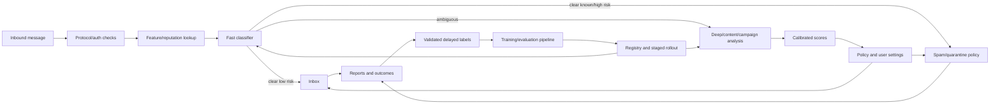

# Chapter 7 — Interview Workbook and Part 1 Capstone

## 1. How to use this workbook

For each question:

1.  answer aloud without notes;
2.  write assumptions and formulas;
3.  compare with the guide—not exact wording;
4.  record the missing link in an error log;
5.  retry after one day, one week, and one month.

Interviewers often begin with a definition and then change assumptions. A durable
answer includes purpose, mechanism, trade-offs, failure modes, and an example.

## 2. Foundation formula sheet

### Learning objective

<math display="block" xmlns="http://www.w3.org/1998/Math/MathML"><semantics><mrow><msup><mi>θ</mi><mo>*</mo></msup><mo>=</mo><mrow><mi mathvariant="normal">arg</mi><mo>&#8289;</mo></mrow><munder><mi mathvariant="normal">min</mi><mi>θ</mi></munder><mrow><mo stretchy="true" form="prefix">[</mo><mfrac><mn>1</mn><mi>n</mi></mfrac><munderover><mo>∑</mo><mrow><mi>i</mi><mo>=</mo><mn>1</mn></mrow><mi>n</mi></munderover><mi>ℓ</mi><mo stretchy="false" form="prefix">(</mo><msub><mi>y</mi><mi>i</mi></msub><mo>,</mo><msub><mi>f</mi><mi>θ</mi></msub><mo stretchy="false" form="prefix">(</mo><msub><mi>x</mi><mi>i</mi></msub><mo stretchy="false" form="postfix">)</mo><mo stretchy="false" form="postfix">)</mo><mo>+</mo><mi>λ</mi><mi mathvariant="normal">Ω</mi><mo stretchy="false" form="prefix">(</mo><mi>θ</mi><mo stretchy="false" form="postfix">)</mo><mo stretchy="true" form="postfix">]</mo></mrow><mi>.</mi></mrow></semantics></math>

### Binary cross-entropy

<math display="block" xmlns="http://www.w3.org/1998/Math/MathML"><semantics><mrow><mi>ℓ</mi><mo stretchy="false" form="prefix">(</mo><mi>y</mi><mo>,</mo><mi>p</mi><mo stretchy="false" form="postfix">)</mo><mo>=</mo><mi>−</mi><mo stretchy="false" form="prefix">[</mo><mi>y</mi><mrow><mi mathvariant="normal">log</mi><mo>&#8289;</mo></mrow><mi>p</mi><mo>+</mo><mo stretchy="false" form="prefix">(</mo><mn>1</mn><mo>−</mo><mi>y</mi><mo stretchy="false" form="postfix">)</mo><mrow><mi mathvariant="normal">log</mi><mo>&#8289;</mo></mrow><mo stretchy="false" form="prefix">(</mo><mn>1</mn><mo>−</mo><mi>p</mi><mo stretchy="false" form="postfix">)</mo><mo stretchy="false" form="postfix">]</mo><mi>.</mi></mrow></semantics></math>

### Confusion metrics

<math display="block" xmlns="http://www.w3.org/1998/Math/MathML"><semantics><mtable><mtr><mtd columnalign="right" style="text-align: right; padding-right: 0"><mtext mathvariant="normal">Accuracy</mtext></mtd><mtd columnalign="left" style="text-align: left; padding-left: 0"><mo>=</mo><mfrac><mrow><mi>T</mi><mi>P</mi><mo>+</mo><mi>T</mi><mi>N</mi></mrow><mrow><mi>T</mi><mi>P</mi><mo>+</mo><mi>T</mi><mi>N</mi><mo>+</mo><mi>F</mi><mi>P</mi><mo>+</mo><mi>F</mi><mi>N</mi></mrow></mfrac><mo>,</mo></mtd></mtr><mtr><mtd columnalign="right" style="text-align: right; padding-right: 0"><mtext mathvariant="normal">Precision</mtext></mtd><mtd columnalign="left" style="text-align: left; padding-left: 0"><mo>=</mo><mfrac><mrow><mi>T</mi><mi>P</mi></mrow><mrow><mi>T</mi><mi>P</mi><mo>+</mo><mi>F</mi><mi>P</mi></mrow></mfrac><mo>,</mo></mtd></mtr><mtr><mtd columnalign="right" style="text-align: right; padding-right: 0"><mtext mathvariant="normal">Recall/TPR</mtext></mtd><mtd columnalign="left" style="text-align: left; padding-left: 0"><mo>=</mo><mfrac><mrow><mi>T</mi><mi>P</mi></mrow><mrow><mi>T</mi><mi>P</mi><mo>+</mo><mi>F</mi><mi>N</mi></mrow></mfrac><mo>,</mo></mtd></mtr><mtr><mtd columnalign="right" style="text-align: right; padding-right: 0"><mtext mathvariant="normal">Specificity/TNR</mtext></mtd><mtd columnalign="left" style="text-align: left; padding-left: 0"><mo>=</mo><mfrac><mrow><mi>T</mi><mi>N</mi></mrow><mrow><mi>T</mi><mi>N</mi><mo>+</mo><mi>F</mi><mi>P</mi></mrow></mfrac><mo>,</mo></mtd></mtr><mtr><mtd columnalign="right" style="text-align: right; padding-right: 0"><mtext mathvariant="normal">FPR</mtext></mtd><mtd columnalign="left" style="text-align: left; padding-left: 0"><mo>=</mo><mfrac><mrow><mi>F</mi><mi>P</mi></mrow><mrow><mi>F</mi><mi>P</mi><mo>+</mo><mi>T</mi><mi>N</mi></mrow></mfrac><mo>,</mo></mtd></mtr><mtr><mtd columnalign="right" style="text-align: right; padding-right: 0"><msub><mi>F</mi><mn>1</mn></msub></mtd><mtd columnalign="left" style="text-align: left; padding-left: 0"><mo>=</mo><mfrac><mrow><mn>2</mn><mi>T</mi><mi>P</mi></mrow><mrow><mn>2</mn><mi>T</mi><mi>P</mi><mo>+</mo><mi>F</mi><mi>P</mi><mo>+</mo><mi>F</mi><mi>N</mi></mrow></mfrac><mi>.</mi></mtd></mtr></mtable></semantics></math>

### Regression metrics

<math display="block" xmlns="http://www.w3.org/1998/Math/MathML"><semantics><mrow><mtext mathvariant="normal">MAE</mtext><mo>=</mo><mfrac><mn>1</mn><mi>n</mi></mfrac><munder><mo>∑</mo><mi>i</mi></munder><mo stretchy="false" form="prefix">|</mo><msub><mi>y</mi><mi>i</mi></msub><mo>−</mo><msub><mover><mi>y</mi><mo accent="true">̂</mo></mover><mi>i</mi></msub><mo stretchy="false" form="prefix">|</mo><mo>,</mo><mspace width="2.0em"></mspace><mtext mathvariant="normal">RMSE</mtext><mo>=</mo><msqrt><mrow><mfrac><mn>1</mn><mi>n</mi></mfrac><munder><mo>∑</mo><mi>i</mi></munder><mo stretchy="false" form="prefix">(</mo><msub><mi>y</mi><mi>i</mi></msub><mo>−</mo><msub><mover><mi>y</mi><mo accent="true">̂</mo></mover><mi>i</mi></msub><msup><mo stretchy="false" form="postfix">)</mo><mn>2</mn></msup></mrow></msqrt><mo>,</mo></mrow></semantics></math>

<math display="block" xmlns="http://www.w3.org/1998/Math/MathML"><semantics><mrow><msup><mi>R</mi><mn>2</mn></msup><mo>=</mo><mn>1</mn><mo>−</mo><mfrac><mrow><munder><mo>∑</mo><mi>i</mi></munder><mo stretchy="false" form="prefix">(</mo><msub><mi>y</mi><mi>i</mi></msub><mo>−</mo><msub><mover><mi>y</mi><mo accent="true">̂</mo></mover><mi>i</mi></msub><msup><mo stretchy="false" form="postfix">)</mo><mn>2</mn></msup></mrow><mrow><munder><mo>∑</mo><mi>i</mi></munder><mo stretchy="false" form="prefix">(</mo><msub><mi>y</mi><mi>i</mi></msub><mo>−</mo><mover><mi>y</mi><mo accent="true">‾</mo></mover><msup><mo stretchy="false" form="postfix">)</mo><mn>2</mn></msup></mrow></mfrac><mi>.</mi></mrow></semantics></math>

### Ranking metrics

<math display="block" xmlns="http://www.w3.org/1998/Math/MathML"><semantics><mrow><mtext mathvariant="normal">Precision@K</mtext><mo>=</mo><mfrac><mrow><mi>#</mi><mtext mathvariant="normal">relevant in top K</mtext></mrow><mi>K</mi></mfrac><mo>,</mo><mspace width="2.0em"></mspace><mtext mathvariant="normal">Recall@K</mtext><mo>=</mo><mfrac><mrow><mi>#</mi><mtext mathvariant="normal">relevant in top K</mtext></mrow><mrow><mi>#</mi><mtext mathvariant="normal">relevant available</mtext></mrow></mfrac><mo>,</mo></mrow></semantics></math>

<math display="block" xmlns="http://www.w3.org/1998/Math/MathML"><semantics><mrow><mtext mathvariant="normal">NDCG@K</mtext><mo>=</mo><mfrac><mrow><munderover><mo>∑</mo><mrow><mi>i</mi><mo>=</mo><mn>1</mn></mrow><mi>K</mi></munderover><mo stretchy="false" form="prefix">(</mo><msup><mn>2</mn><mrow><mi>r</mi><mi>e</mi><msub><mi>l</mi><mi>i</mi></msub></mrow></msup><mo>−</mo><mn>1</mn><mo stretchy="false" form="postfix">)</mo><mi>/</mi><msub><mrow><mi mathvariant="normal">log</mi><mo>&#8289;</mo></mrow><mn>2</mn></msub><mo stretchy="false" form="prefix">(</mo><mi>i</mi><mo>+</mo><mn>1</mn><mo stretchy="false" form="postfix">)</mo></mrow><mtext mathvariant="normal">ideal DCG@K</mtext></mfrac><mi>.</mi></mrow></semantics></math>

### Simplified two-action cost threshold

<math display="block" xmlns="http://www.w3.org/1998/Math/MathML"><semantics><mrow><mi>p</mi><mo>&gt;</mo><mfrac><msub><mi>C</mi><mrow><mi>F</mi><mi>P</mi></mrow></msub><mrow><msub><mi>C</mi><mrow><mi>F</mi><mi>P</mi></mrow></msub><mo>+</mo><msub><mi>C</mi><mrow><mi>F</mi><mi>N</mi></mrow></msub></mrow></mfrac></mrow></semantics></math>

when <math display="inline" xmlns="http://www.w3.org/1998/Math/MathML"><semantics><mi>p</mi></semantics></math> is calibrated and these are the only two conditional costs.

## 3. Level 1 — Rapid foundation questions

Try to answer each in 30–90 seconds.

### Q1. AI versus ML versus deep learning?

**Answer guide:** AI is the broad field of systems performing perception,
reasoning, language, planning, or intelligent action. ML is an AI approach that
learns useful behavior/structure from data or experience. Deep learning is ML
using multilayer neural networks to learn representations. A production AI system
can mix learned models with rules, search, optimization, tools, and humans.

### Q2. What is supervised learning?

**Answer guide:** Given input–target pairs <math display="inline" xmlns="http://www.w3.org/1998/Math/MathML"><semantics><mrow><mo stretchy="false" form="prefix">(</mo><msub><mi>x</mi><mi>i</mi></msub><mo>,</mo><msub><mi>y</mi><mi>i</mi></msub><mo stretchy="false" form="postfix">)</mo></mrow></semantics></math>, learn a function
<math display="inline" xmlns="http://www.w3.org/1998/Math/MathML"><semantics><mrow><msub><mi>f</mi><mi>θ</mi></msub><mo stretchy="false" form="prefix">(</mo><mi>x</mi><mo stretchy="false" form="postfix">)</mo></mrow></semantics></math> whose outputs generalize to unseen examples. Classification,
regression, and ranking are common tasks. Training typically minimizes empirical
loss plus regularization; evaluation uses held-out data that represents deployment.

### Q3. Parameter versus hyperparameter?

**Answer guide:** Parameters are learned during fitting—weights or tree splits.
Hyperparameters configure the family/training—regularization strength, tree depth,
learning rate. Hyperparameters are selected using training/validation procedures;
the final test set should not drive repeated choices.

### Q4. Feature versus label?

**Answer guide:** Features are inputs legitimately available at prediction time.
The label is an observed encoding of the desired target. A label may be delayed,
noisy, selective, or merely a proxy; this distinction is a common source of bad
framing.

### Q5. Training versus inference?

**Answer guide:** Training estimates parameters using data and an objective.
Inference applies the fitted artifact to new inputs. Online inference does not
imply online learning; a low-latency service may use a model retrained weekly.

### Q6. Loss versus evaluation metric?

**Answer guide:** The loss supplies the optimization signal, often per example
and differentiable. An evaluation metric compares held-out behavior in terms
closer to the task. They may differ: train with log loss, select by recall subject
to a precision constraint, and validate product impact using an online KPI.

### Q7. Metric versus product KPI versus guardrail?

**Answer guide:** Offline metric assesses model behavior on held-out data. Product
KPI measures the real outcome, such as fraud dollars lost. Guardrails bound
unacceptable regressions, such as legitimate decline rate, latency, or safety.

### Q8. Why have train, validation, and test sets?

**Answer guide:** Fit parameters on training; use validation for repeated model,
feature, hyperparameter, calibration, and threshold choices; use an untouched test
set to estimate the final selection process. Reusing the test set turns it into
validation and biases the reported score.

### Q9. What is data leakage?

**Answer guide:** Information unavailable or illegitimate for the intended
prediction enters features/training/evaluation, producing optimistic offline
performance. Categories include target/future leakage, preprocessing fitted on
held-out data, duplicates/entities crossing splits, and repeated test-set tuning.

### Q10. Why use a temporal split?

**Answer guide:** If deployment predicts later events, training on the past and
testing on the future better simulates data freshness, drift, and availability.
Random splits can let near-simultaneous patterns or future regimes leak backward.

### Q11. Overfitting versus underfitting?

**Answer guide:** Underfitting fails even on training patterns—training and
validation quality are both poor. Overfitting fits sample-specific noise or
shortcuts—training quality is strong but validation transfer is weaker. Always
also inspect leakage and distribution mismatch.

### Q12. Bias versus variance?

**Answer guide:** Statistical bias is systematic error of the average learned
function relative to the true relationship; variance is sensitivity to which
training sample was drawn. More capacity often reduces approximation bias but can
increase variance; data, regularization, structure, and ensembling affect the
balance.

### Q13. What is regularization?

**Answer guide:** Any mechanism that constrains/preferences solutions to improve
generalization or desired structure: L1/L2 penalties, tree depth, weight sharing,
augmentation, dropout, early stopping, or even targeted data. Too much can
underfit.

### Q14. Precision versus recall?

**Answer guide:** Precision asks how many predicted positives are true
<math display="inline" xmlns="http://www.w3.org/1998/Math/MathML"><semantics><mrow><mi>T</mi><mi>P</mi><mi>/</mi><mo stretchy="false" form="prefix">(</mo><mi>T</mi><mi>P</mi><mo>+</mo><mi>F</mi><mi>P</mi><mo stretchy="false" form="postfix">)</mo></mrow></semantics></math>; recall asks how many actual positives are detected <math display="inline" xmlns="http://www.w3.org/1998/Math/MathML"><semantics><mrow><mi>T</mi><mi>P</mi><mi>/</mi><mo stretchy="false" form="prefix">(</mo><mi>T</mi><mi>P</mi><mo>+</mo><mi>F</mi><mi>N</mi><mo stretchy="false" form="postfix">)</mo></mrow></semantics></math>.
Choose/constraint them based on false-positive and false-negative consequences,
prevalence, threshold, and action.

### Q15. Why can accuracy fail on imbalanced data?

**Answer guide:** With 1% positives, always predicting negative is 99% accurate
but detects none. Examine the confusion matrix, precision–recall, operating-point
cost, calibration, and segment performance.

### Q16. ROC-AUC versus PR-AUC?

**Answer guide:** ROC summarizes TPR versus FPR and ranking discrimination across
thresholds. PR focuses on precision versus recall and is often more revealing for
rare positives. Neither selects the production operating point or measures
calibration; report relevant constrained metrics.

### Q17. What is calibration?

**Answer guide:** Predicted probabilities agree with observed frequencies—for
example, about 70% positives among cases scored near 0.7. It differs from ranking;
a model can rank well but be poorly calibrated. Evaluate by time and segment.

### Q18. Covariate shift versus concept drift?

**Answer guide:** Covariate shift changes <math display="inline" xmlns="http://www.w3.org/1998/Math/MathML"><semantics><mrow><mi>P</mi><mo stretchy="false" form="prefix">(</mo><mi>X</mi><mo stretchy="false" form="postfix">)</mo></mrow></semantics></math> while assuming <math display="inline" xmlns="http://www.w3.org/1998/Math/MathML"><semantics><mrow><mi>P</mi><mo stretchy="false" form="prefix">(</mo><mi>Y</mi><mo>∣</mo><mi>X</mi><mo stretchy="false" form="postfix">)</mo></mrow></semantics></math>
stable. Concept drift changes <math display="inline" xmlns="http://www.w3.org/1998/Math/MathML"><semantics><mrow><mi>P</mi><mo stretchy="false" form="prefix">(</mo><mi>Y</mi><mo>∣</mo><mi>X</mi><mo stretchy="false" form="postfix">)</mo></mrow></semantics></math> itself. Feature drift need not harm
quality; concept drift can harm it without large marginal feature changes.

### Q19. Shadow versus canary versus A/B test?

**Answer guide:** Shadow runs live inference without acting, testing compatibility,
latency, and distributions. Canary exposes a small traffic portion to manage risk.
A/B randomly assigns eligible units to estimate causal product impact. These can
be combined, but they answer different questions.

### Q20. What should an ML production system monitor?

**Answer guide:** Service health, data/schema/freshness, online–offline skew,
scores/actions, mature-label quality and calibration, slices, product/safety
guardrails, feedback/review behavior, and cost. Each alert needs ownership and an
actionable runbook.

## 4. Level 2 — Follow-up and trade-off questions

Answer each in 3–5 minutes.

### Q21. Your validation score improved but production quality fell. Diagnose.

**Structured answer:**

1.  Confirm metric definitions, model/feature/policy versions, and launch timeline.
2.  Check service errors, timeouts, fallbacks, and actual traffic assignment.
3.  Compare logged online features with point-in-time offline recomputation.
4.  Inspect schema, units, freshness, missingness, score and action distributions.
5.  Check whether validation split/population/prevalence differs from production.
6.  Check threshold/calibration and whether policy or capacity changed.
7.  Analyze product slices, user response, feedback loops, and delayed labels.
8.  Mitigate via rollback/fallback before longer analysis if harm is ongoing.

### Q22. The fraud model has high ROC-AUC but catches little fraud. Why?

**Answer guide:** The deployed threshold may be too strict, risk outputs may be
miscalibrated, evaluation prevalence/cases may differ, or review/decline capacity
may constrain actions. Global AUC can be high while ranking is weak in the
extreme-low-FPR region. Report recall at the permitted legitimate decline/FPR,
cost by amount, calibration, and segment/temporal results.

### Q23. Should sensitive attributes be removed from training?

**Answer guide:** There is no universal answer. Removing them does not remove
proxies or historical process bias; retaining them may be necessary for auditing
or certain corrective methods but raises legal/privacy/access requirements. Begin
with the use, applicable law/policy, causal/data process, relevant fairness harm,
and governance. Restrict access and always evaluate downstream decisions.

### Q24. When is a simple model better than a deep model?

**Answer guide:** When data is limited/tabular, latency/cost or interpretability
dominates, the mapping is simple, a reliable baseline already meets requirements,
or maintenance/risk outweighs the marginal gain. Compare on held-out quality,
calibration, robustness, slices, latency, cost, and operability—not complexity.

### Q25. How do you select a classification threshold?

**Answer guide:** Use held-out/calibration data representative of production.
Define action-specific FP/FN costs or constraints, prevalence, probabilities,
review capacity, and segment/safety requirements. Inspect threshold curves and
choose expected utility subject to guardrails. Confirm prospectively, version the
threshold separately, and monitor it under drift.

### Q26. More training data arrived. Should you retrain immediately?

**Answer guide:** Validate provenance, label maturity, selection under the current
policy, schema and shift. Determine whether enough independent signal exists.
Retrain reproducibly, compare with the champion on temporal/slice metrics, pass
quality and operational gates, shadow/canary, and retain rollback. Fresh poisoned
or policy-biased data can degrade the model.

### Q27. Users complain even though average quality is stable. What next?

**Answer guide:** Complaints may concentrate in a high-impact slice or error type.
Verify complaint logging, link cases to model/policy versions, analyze slices and
error taxonomy, check severity rather than just frequency, review appeal/override
data, and inspect recent shifts. Aggregate averages can hide regression and rare
harm.

### Q28. When can human review make training data worse?

**Answer guide:** Reviewers see only model-selected cases, anchor on model scores,
operate under queue pressure, or follow changing guidelines. This creates
selection, confirmation, and temporal bias. Use blinded/random audits, measure
agreement, version guidelines, control shown information, retain uncertainty, and
model the selection mechanism.

### Q29. Why not optimize the business KPI directly as the loss?

**Answer guide:** It may be delayed, sparse, noisy, non-differentiable, affected by
policy and other systems, or dangerous to explore. Use a learnable proxy/loss but
validate alignment with online experiments and guardrails. If the proxy is gamed,
revisit formulation rather than only tuning the model.

### Q30. How would you know whether more data or a better model is needed?

**Answer guide:** Inspect learning curves, label quality, error taxonomy, train–
validation gap, capacity/optimization checks, temporal/domain results, and
ablation. If validation improves steadily with representative data and a variance
gap exists, data may help. If both errors plateau with systematic patterns, revisit
features/formulation/capacity. Targeted data for important error categories is
more useful than indiscriminate volume.

## 5. Level 3 — Senior design prompts

Use this response outline:

```
Goal/non-goals -> decision and prediction time -> baseline -> data/label/split
-> loss/offline metrics/KPI/guardrails -> architecture -> estimates
-> rollout/fallback -> monitoring/feedback -> safety/privacy/fairness
-> trade-offs and evolution
```

### Prompt A: Design a spam and phishing protection system

Probe areas: multilayer rules/models, sender/domain reputation, text/URL features,
rare attacks, user-specific preferences, adversarial adaptation, false-positive
harm, quarantine versus delete, delayed/user labels, latency, explainability,
appeal and incident response.

### Prompt B: Design feed ranking

Probe areas: retrieval/ranking stages, logged exposure bias, short- versus long-
term utility, diversity/freshness, creator ecosystem, exploration, feature
freshness, latency, online experiment unit, harmful engagement, feedback loops.

### Prompt C: Design fraudulent-payment detection

Probe areas: 50–100 ms latency, graph/velocity features, delayed/selective labels,
calibrated score plus multiple actions, amount-weighted cost, review capacity,
adversarial drift, fallbacks, regulatory/appeal issues.

### Prompt D: Design a document-grounded support assistant

Probe areas: permissions, document ingestion/chunking/retrieval/reranking,
citations, prompt injection, tenant isolation, tool authorization, evaluation set,
factuality/refusal/task completion, latency/token cost, human escalation, freshness,
traces and rollback.

### Prompt E: Predict delivery time

Probe areas: prediction timestamps/horizons, route/traffic features, censoring and
cancellations, MAE versus asymmetric/quantile loss, calibration intervals,
geography/time splits, new regions, online freshness, downstream customer promise.

## 6. Calculation drills with solutions

### Drill 1: confusion metrics

A detector evaluates 2,000 events: 100 positives and 1,900 negatives. It catches
80 positives and incorrectly flags 38 negatives.

Calculate TP, FN, FP, TN, precision, recall, FPR, specificity, accuracy, and F1.

<details>
<summary>Solution</summary>

<math display="block" xmlns="http://www.w3.org/1998/Math/MathML"><semantics><mrow><mi>T</mi><mi>P</mi><mo>=</mo><mn>80</mn><mo>,</mo><mspace width="0.222em"></mspace><mi>F</mi><mi>N</mi><mo>=</mo><mn>20</mn><mo>,</mo><mspace width="0.222em"></mspace><mi>F</mi><mi>P</mi><mo>=</mo><mn>38</mn><mo>,</mo><mspace width="0.222em"></mspace><mi>T</mi><mi>N</mi><mo>=</mo><mn>1862</mn><mi>.</mi></mrow></semantics></math>

<math display="block" xmlns="http://www.w3.org/1998/Math/MathML"><semantics><mrow><mtext mathvariant="normal">Precision</mtext><mo>=</mo><mfrac><mn>80</mn><mn>118</mn></mfrac><mo>≈</mo><mn>67.80</mn><mi>%</mi><mo>,</mo><mspace width="2.0em"></mspace><mtext mathvariant="normal">Recall</mtext><mo>=</mo><mfrac><mn>80</mn><mn>100</mn></mfrac><mo>=</mo><mn>80</mn><mi>%</mi><mi>.</mi></mrow></semantics></math>

<math display="block" xmlns="http://www.w3.org/1998/Math/MathML"><semantics><mrow><mtext mathvariant="normal">FPR</mtext><mo>=</mo><mfrac><mn>38</mn><mn>1900</mn></mfrac><mo>=</mo><mn>2</mn><mi>%</mi><mo>,</mo><mspace width="2.0em"></mspace><mtext mathvariant="normal">Specificity</mtext><mo>=</mo><mn>98</mn><mi>%</mi><mi>.</mi></mrow></semantics></math>

<math display="block" xmlns="http://www.w3.org/1998/Math/MathML"><semantics><mrow><mtext mathvariant="normal">Accuracy</mtext><mo>=</mo><mfrac><mrow><mn>80</mn><mo>+</mo><mn>1862</mn></mrow><mn>2000</mn></mfrac><mo>=</mo><mn>97.1</mn><mi>%</mi><mi>.</mi></mrow></semantics></math>

<math display="block" xmlns="http://www.w3.org/1998/Math/MathML"><semantics><mrow><msub><mi>F</mi><mn>1</mn></msub><mo>=</mo><mfrac><mn>160</mn><mrow><mn>160</mn><mo>+</mo><mn>38</mn><mo>+</mo><mn>20</mn></mrow></mfrac><mo>=</mo><mfrac><mn>160</mn><mn>218</mn></mfrac><mo>≈</mo><mn>73.39</mn><mi>%</mi><mi>.</mi></mrow></semantics></math>

The high accuracy hides that nearly one third of alerts are false positives.

</details>

### Drill 2: expected cost threshold

Blocking a legitimate payment costs USD 8; approving a fraudulent one costs
USD 192. Under the simplified calibrated two-action assumptions, derive the
threshold.

<details>
<summary>Solution</summary>

<math display="block" xmlns="http://www.w3.org/1998/Math/MathML"><semantics><mrow><mi>t</mi><mo>=</mo><mfrac><msub><mi>C</mi><mrow><mi>F</mi><mi>P</mi></mrow></msub><mrow><msub><mi>C</mi><mrow><mi>F</mi><mi>P</mi></mrow></msub><mo>+</mo><msub><mi>C</mi><mrow><mi>F</mi><mi>N</mi></mrow></msub></mrow></mfrac><mo>=</mo><mfrac><mn>8</mn><mrow><mn>8</mn><mo>+</mo><mn>192</mn></mrow></mfrac><mo>=</mo><mn>0.04</mn><mi>.</mi></mrow></semantics></math>

Block when <math display="inline" xmlns="http://www.w3.org/1998/Math/MathML"><semantics><mrow><mi>p</mi><mo>&gt;</mo><mn>4</mn><mi>%</mi></mrow></semantics></math>. In reality, cost depends on amount/customer/action and extra
authentication creates a third action, so this is only the foundational model.

</details>

### Drill 3: regression comparison

Targets are <math display="inline" xmlns="http://www.w3.org/1998/Math/MathML"><semantics><mrow><mo stretchy="false" form="prefix">[</mo><mn>2</mn><mo>,</mo><mn>4</mn><mo>,</mo><mn>9</mn><mo stretchy="false" form="postfix">]</mo></mrow></semantics></math> and predictions <math display="inline" xmlns="http://www.w3.org/1998/Math/MathML"><semantics><mrow><mo stretchy="false" form="prefix">[</mo><mn>3</mn><mo>,</mo><mn>4</mn><mo>,</mo><mn>5</mn><mo stretchy="false" form="postfix">]</mo></mrow></semantics></math>. Calculate MAE and RMSE.

<details>
<summary>Solution</summary>

Residual magnitudes are <math display="inline" xmlns="http://www.w3.org/1998/Math/MathML"><semantics><mrow><mo stretchy="false" form="prefix">[</mo><mn>1</mn><mo>,</mo><mn>0</mn><mo>,</mo><mn>4</mn><mo stretchy="false" form="postfix">]</mo></mrow></semantics></math>.

<math display="block" xmlns="http://www.w3.org/1998/Math/MathML"><semantics><mrow><mtext mathvariant="normal">MAE</mtext><mo>=</mo><mfrac><mrow><mn>1</mn><mo>+</mo><mn>0</mn><mo>+</mo><mn>4</mn></mrow><mn>3</mn></mfrac><mo>=</mo><mfrac><mn>5</mn><mn>3</mn></mfrac><mo>≈</mo><mn>1.667</mn><mi>.</mi></mrow></semantics></math>

<math display="block" xmlns="http://www.w3.org/1998/Math/MathML"><semantics><mrow><mtext mathvariant="normal">RMSE</mtext><mo>=</mo><msqrt><mfrac><mrow><msup><mn>1</mn><mn>2</mn></msup><mo>+</mo><msup><mn>0</mn><mn>2</mn></msup><mo>+</mo><msup><mn>4</mn><mn>2</mn></msup></mrow><mn>3</mn></mfrac></msqrt><mo>=</mo><msqrt><mfrac><mn>17</mn><mn>3</mn></mfrac></msqrt><mo>≈</mo><mn>2.380</mn><mi>.</mi></mrow></semantics></math>

The error of 4 contributes 16 to squared error, showing RMSE's emphasis on large
errors.

</details>

### Drill 4: precision under prevalence change

A detector has TPR 90% and FPR 1%. Estimate precision when prevalence is 10%,
then when prevalence is 1%.

<details>
<summary>Solution</summary>

Using Bayes/counts:

<math display="block" xmlns="http://www.w3.org/1998/Math/MathML"><semantics><mrow><mtext mathvariant="normal">Precision</mtext><mo>=</mo><mfrac><mrow><mi>T</mi><mi>P</mi><mi>R</mi><mo>⋅</mo><mi>π</mi></mrow><mrow><mi>T</mi><mi>P</mi><mi>R</mi><mo>⋅</mo><mi>π</mi><mo>+</mo><mi>F</mi><mi>P</mi><mi>R</mi><mo>⋅</mo><mo stretchy="false" form="prefix">(</mo><mn>1</mn><mo>−</mo><mi>π</mi><mo stretchy="false" form="postfix">)</mo></mrow></mfrac><mi>.</mi></mrow></semantics></math>

At <math display="inline" xmlns="http://www.w3.org/1998/Math/MathML"><semantics><mrow><mi>π</mi><mo>=</mo><mn>0.10</mn></mrow></semantics></math>:

<math display="block" xmlns="http://www.w3.org/1998/Math/MathML"><semantics><mrow><mfrac><mrow><mn>0.9</mn><mo>⋅</mo><mn>0.1</mn></mrow><mrow><mn>0.9</mn><mo>⋅</mo><mn>0.1</mn><mo>+</mo><mn>0.01</mn><mo>⋅</mo><mn>0.9</mn></mrow></mfrac><mo>=</mo><mfrac><mn>0.09</mn><mn>0.099</mn></mfrac><mo>≈</mo><mn>90.91</mn><mi>%</mi><mi>.</mi></mrow></semantics></math>

At <math display="inline" xmlns="http://www.w3.org/1998/Math/MathML"><semantics><mrow><mi>π</mi><mo>=</mo><mn>0.01</mn></mrow></semantics></math>:

<math display="block" xmlns="http://www.w3.org/1998/Math/MathML"><semantics><mrow><mfrac><mrow><mn>0.9</mn><mo>⋅</mo><mn>0.01</mn></mrow><mrow><mn>0.9</mn><mo>⋅</mo><mn>0.01</mn><mo>+</mo><mn>0.01</mn><mo>⋅</mo><mn>0.99</mn></mrow></mfrac><mo>=</mo><mfrac><mn>0.009</mn><mn>0.0189</mn></mfrac><mo>≈</mo><mn>47.62</mn><mi>%</mi><mi>.</mi></mrow></semantics></math>

Even with unchanged TPR/FPR, precision drops sharply as positives become rarer.
This is why test prevalence and production prevalence matter.

</details>

### Drill 5: ranking

For one query, top five relevance labels are <math display="inline" xmlns="http://www.w3.org/1998/Math/MathML"><semantics><mrow><mo stretchy="false" form="prefix">[</mo><mn>1</mn><mo>,</mo><mn>0</mn><mo>,</mo><mn>1</mn><mo>,</mo><mn>0</mn><mo>,</mo><mn>1</mn><mo stretchy="false" form="postfix">]</mo></mrow></semantics></math> and there are six
relevant items overall. Calculate Precision@5 and Recall@5.

<details>
<summary>Solution</summary>

There are three relevant results in the top five:

<math display="block" xmlns="http://www.w3.org/1998/Math/MathML"><semantics><mrow><mi>P</mi><mi>@</mi><mn>5</mn><mo>=</mo><mfrac><mn>3</mn><mn>5</mn></mfrac><mo>=</mo><mn>0.6</mn><mo>,</mo><mspace width="2.0em"></mspace><mi>R</mi><mi>@</mi><mn>5</mn><mo>=</mo><mfrac><mn>3</mn><mn>6</mn></mfrac><mo>=</mo><mn>0.5</mn><mi>.</mi></mrow></semantics></math>

</details>

## 7. Leakage investigation drills

For each feature, decide whether it is valid for the stated timestamp and explain
what audit is needed.

### Scenario 1

Predict 30-day churn at midnight on January 1. Feature: number of support tickets
from December 1 through January 7.

**Answer:** future leakage; the window extends past prediction time. End the
feature at or before January 1, accounting for ingestion availability.

### Scenario 2

Predict payment fraud before authorization. Feature: merchant's historical fraud
rate computed from the entire two-year dataset.

**Answer:** likely label aggregation leakage. Compute a smoothed point-in-time
rate using only labels mature before each authorization.

### Scenario 3

Standardize numeric columns using the mean and variance of all data, then perform
five-fold CV.

**Answer:** preprocessing contamination. Fit the scaler inside each training fold
and apply it to that fold's validation partition.

### Scenario 4

Randomly split individual video frames for an object classifier.

**Answer:** entity/near-duplicate contamination. Split by video or collection
session, and possibly by location/time depending on desired generalization.

### Scenario 5

Use customer ID as a feature when serving future transactions for existing
customers.

**Answer:** not automatically leakage because IDs are available, but it invites
memorization, cold-start failure, high cardinality, and entity overlap inflation.
Evaluate both new events for known customers and entirely new customers; prefer
meaningful history features where possible.

## 8. Capstone — Spam protection design dossier

### Task

Create a 3–6 page design for a service that keeps spam/phishing out of user inboxes
while avoiding loss of legitimate mail. Assume a global consumer email product.

Your submission must contain:

1.  problem goal, non-goals, and action policy;
2.  prediction unit/time, target, operational label, and label delay;
3.  data sources, feature availability, split, and leakage audit;
4.  baseline, training objective, offline metrics, KPI, and guardrails;
5.  training/serving architecture;
6.  scale assumptions and latency/fallback plan;
7.  rollout, experiment, monitoring, and retraining;
8.  privacy, fairness/accessibility, security, adversarial behavior, and recourse;
9.  three major risks and mitigations;
10. immediate, medium-term, and future evolution.

Do your version before reading the reference design.

## 9. Reference capstone design

### 9.1 Goal and non-goals

**Goal:** reduce inbox spam/phishing exposure and user harm while bounding the
rate of legitimate mail placed in spam/quarantine. Meet the delivery latency and
availability contract.

**Non-goals for v1:** perfect semantic understanding, automatic irreversible
deletion, and fully personalized models for new users.

### 9.2 Prediction and actions

- Unit: one inbound message for one recipient at final delivery decision.
- Time: after allowed mail/authentication/content metadata is available, before
  inbox placement.
- Output: spam/phishing risk scores, reason category, uncertainty/quality flags.
- Actions: inbox, warning banner, spam folder, quarantine/review for enterprise or
  high-risk cases; never silently delete in v1.
- User control: “not spam,” “report spam/phishing,” sender allow/block controls,
  accessible explanation and recovery path.

### 9.3 Target and labels

Ideal target: whether the message is unwanted/malicious for this recipient under
the product policy at delivery time.

Labels combine:

- high-confidence security intelligence;
- user spam/not-spam reports after delay;
- sampled expert adjudication;
- known campaigns/traps with careful representativeness treatment.

Known label issues:

- reports are selective and subjective;
- users may mark legitimate newsletters as spam;
- model-hidden messages receive different feedback;
- attacks and policies change;
- “not reported” is not a clean negative.

Use confidence/label-source fields, adjudication, maturity windows, and randomized
audits rather than collapsing all signals naïvely.

### 9.4 Data and features

Candidate inputs available before placement:

- permitted authentication/protocol results;
- sender/domain/IP reputation computed point-in-time;
- sending velocity and campaign-level aggregates;
- headers/routing anomalies;
- URL/domain and attachment metadata/scanner results;
- content representation where permitted;
- recipient–sender interaction/history subject to privacy controls;
- language, missingness, and feature-quality flags.

Forbidden or audited carefully:

- outcomes/reports after placement;
- full-dataset reputation aggregates;
- post-delivery actions;
- private content beyond defined purpose/authority;
- raw identity fields enabling unsupported profiling.

### 9.5 Split

- Primary forward temporal split: train on mature earlier messages, validate on a
  later period, and test on the most recent mature period.
- Group campaigns/templates and near-duplicates to prevent copies crossing splits.
- Hold out selected sender/domain/campaign groups to measure novel attack
  generalization.
- Slice by language, geography where lawful, mail type, new sender, attachment,
  authentication state, and user activity.
- Maintain a protected final test and a rotating future evaluation window.

### 9.6 Baseline and models

Baseline layers:

1.  current blocklists/authentication/security rules;
2.  keyword/URL/reputation heuristic;
3.  simple calibrated linear classifier on sparse/aggregate features.

Candidate system is an ensemble/cascade:

- deterministic protocol and known-threat rules;
- inexpensive high-recall model;
- more expensive content/campaign model only for ambiguous cases;
- policy layer selects action based on score, user/enterprise settings, and harm.

This cascade controls cost/latency while retaining defense in depth.

### 9.7 Objectives and metrics

- Training: weighted cross-entropy or suitable calibrated classification
  objective; weights justified by sampling/cost.
- Offline: spam/phishing recall at strict legitimate-message false-positive or
  precision constraints; PR curve; log loss/calibration; campaign-level and slice
  metrics; cost-weighted analysis.
- KPI: unwanted/malicious inbox messages per active user, report rate interpreted
  with exposure, and confirmed harm.
- Guardrails: legitimate-mail spam placement and delayed delivery, recovery rate,
  complaint/appeal, p99 latency, availability, compute cost, and slice regressions.

Thresholds differ by action: a banner has a lower threshold than quarantine.
Evaluate at real prevalence and account for user-report selection.

### 9.8 Architecture



Log message decision ID, model/feature/policy versions, scores, action, reason,
latency, and later feedback with privacy-safe retention.

### 9.9 Scale and reliability assumptions

State illustrative rather than invented “facts”: e.g., design for 100k peak
messages/s globally, p99 incremental classification latency under 150 ms, and a
99.99% delivery-path availability goal. Refine with interviewer input.

Reliability:

- regionally replicated stateless inference;
- caches for reputation with bounded staleness;
- timeouts/circuit breakers for expensive analysis;
- if deep model fails, use fast model plus conservative policy;
- if feature service fails, use quality flags, rules, and safe defaults;
- never block the entire mail flow on a noncritical optional component;
- idempotent processing and decision IDs for retry/deduplication;
- load shedding prioritizes known high-risk/ambiguous analysis.

Security rules may require fail-closed behavior for known malware, while optional
personalization can fail open. Fallback is per threat/action, not global.

### 9.10 Rollout and online validation

1.  Replay a recent point-in-time sample.
2.  Shadow live traffic and compare features/scores/latency with the champion.
3.  Adversarial/red-team testing and legitimate critical-sender test suite.
4.  Canary internal/test populations with immediate kill switch.
5.  Randomized experiment at recipient/account unit where appropriate; monitor
    cross-user/campaign interference.
6.  Gradually ramp by region/language while holding guardrails.
7.  Keep champion artifact and policy ready for independent rollback.

### 9.11 Monitoring

- Service: traffic, errors, timeouts, cache, p99 latency, resource/cost.
- Data: schema, missing/default, feature freshness, new categories, reputation
  coverage, language/source mix.
- Prediction: score/action/reason distributions, model disagreement, abstention/
  fallback, campaign concentration.
- Quality: mature-label recall/precision/calibration, legitimate quarantine,
  campaign detection delay, important slices.
- Product: inbox spam exposure, reports, not-spam recovery, complaints, safety.
- Adversarial: sudden template mutations, probing, reputation manipulation,
  poisoned feedback, coordinated false reports.

Alerts link to runbooks. A score collapse triggers safe policy fallback and input
health investigation before retraining.

### 9.12 Feedback and retraining

- Keep raw report source and confidence; do not blindly treat all reports as truth.
- Audit randomly sampled inbox/spam-folder cases to reduce selection blindness.
- Cluster/cap repeated campaign examples so duplicates do not dominate training.
- Retrain on a controlled schedule or validated trigger; compare with champion on
  a forward window and novel-campaign holdouts.
- Version label policy, data, model, calibration, and thresholds.
- Use human security review for emerging high-impact campaigns.

### 9.13 Responsible AI and abuse

- Privacy: minimize content retention, strict access, purpose limitation, deletion
  propagation, regional/legal requirements.
- Access/fairness: evaluate languages, regions, assistive formats, small/new
  senders, and underrepresented legitimate mail sources with adequate samples.
- Security: poisoning, adversarial obfuscation, domain/IP churn, malicious
  attachments, model extraction/probing, coordinated reports.
- Transparency/recourse: show spam folder/reason category, allow recovery/report,
  protect users from unsafe links during appeal.
- Human review: capacity, safe tooling, sensitive-content exposure controls,
  disagreement and escalation.

### 9.14 Evolution

- **Immediate:** instrument current rules, data quality, simple calibrated model,
  safe spam-folder action.
- **Medium term:** campaign graph signals, cascaded content model, personalized
  thresholds, robust temporal evaluation, automated canary gates.
- **Long term:** quicker adaptation to novel campaigns, privacy-preserving
  personalization, better counterfactual feedback measurement, multilingual and
  multimodal defenses.

Every stage earns complexity by measurable benefit under guardrails.

## 10. Capstone scoring rubric

Score each 0–4.

| Dimension | 0 | 2 | 4 |
|----|----|----|----|
| Framing | vague “classify spam” | basic target/action | timestamp, label proxy, actions, non-goals, feedback |
| Data | dataset named | features/split listed | point-in-time audit, grouping, label bias, slices, versioning |
| Evaluation | accuracy only | precision/recall | constrained operating metric, calibration, KPI, guardrails, uncertainty |
| Architecture | model API only | training + serving | hybrid/cascade, contracts, estimates, skew prevention, evolution |
| Reliability | absent | retry/monitoring | SLO, tail latency, per-failure fallback, rollback/runbooks |
| Safety/governance | absent | generic privacy | concrete threats, access, fairness slices, recourse, human design |
| Senior judgment | one final design | some trade-offs | baseline-first stages, assumptions, ownership, cost, failure analysis |

Target at least 20/28 before moving on. A score below 3 in framing, data, or
evaluation should be repaired first.

## 11. Part 1 completion checklist

- [ ] I can explain all core terms without notes.
- [ ] I can write the empirical risk objective and explain every symbol.
- [ ] I can formulate a vague business request using a prediction timestamp.
- [ ] I distinguish target, label, loss, metric, KPI, and guardrail.
- [ ] I can choose random, stratified, group, time, or domain splits deliberately.
- [ ] I can identify target, temporal, preprocessing, entity, and test leakage.
- [ ] I calculate confusion-matrix and basic regression metrics by hand.
- [ ] I can explain ROC/PR trade-offs and probability calibration.
- [ ] I can diagnose underfitting, overfitting, shift, skew, and metric mismatch.
- [ ] I can describe batch/online inference, rollout, fallbacks, and monitoring.
- [ ] I include privacy, fairness, security, human review, and recourse concretely.
- [ ] I completed and orally defended the capstone.

When these are true, proceed to Part 2 (mathematics/statistics) and Part 3
(Python/SQL/engineering) in parallel.
