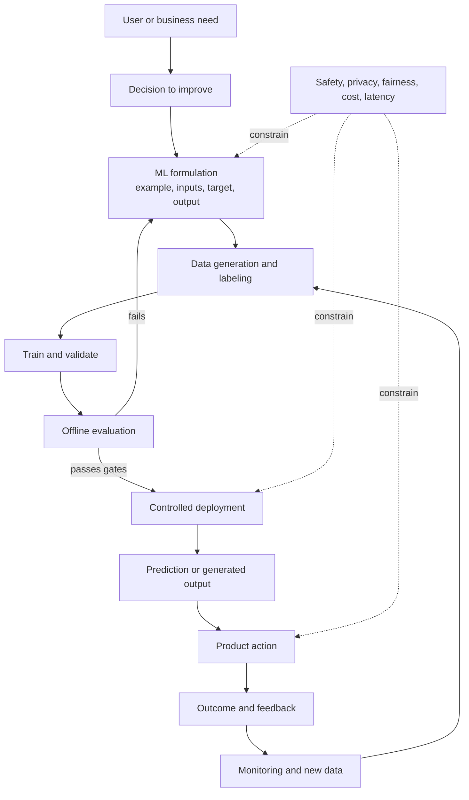

# Part 1 — AI/ML Foundations and Problem Framing

## Purpose

This part builds the mental model used by every later algorithm and system.
After completing it, you should be able to look at a vague request such as
“use AI to reduce payment fraud” and turn it into a measurable, testable, safe
engineering proposal.

No prior ML knowledge is assumed. Small amounts of algebra appear, but every
symbol is explained. The full mathematical treatment comes in Part 2.

## Three reading depths

The same notes support different starting points:

| Reader | First pass | Second pass | Evidence of mastery |
|---|---|---|---|
| Complete beginner | Read intuition, examples, diagrams, and “why it matters” sections | Learn notation and calculate small examples | Explain each idea in ordinary language and finish Level 1 questions |
| Intermediate learner | Read every section and reproduce formulas/metrics | Perform leakage audits and error analysis | Complete calculation drills and the capstone without copying |
| Advanced/interview reader | Skim definitions; focus on assumptions, failure modes, trade-offs, and production sections | Challenge each design under scale, shift, safety, and cost | Defend alternatives and Level 3 prompts aloud |

Do not skip the beginner explanation merely because you have used an API. Senior
interviews often expose gaps in definitions, assumptions, and measurement.

## Portable formula format

Equations use native MathML or readable Unicode formula panels rather than
extension-dependent math delimiters. Modern browser-based Markdown previews
render MathML directly. Each formula is followed by a verbal interpretation
and, where useful, a numerical example.

## Learning objectives

By the end, you should be able to:

1.  distinguish AI, ML, deep learning, and generative AI;
2.  identify the learning paradigm and task type in a product scenario;
3.  define examples, features, labels, predictions, parameters, and objectives;
4.  decide whether ML is appropriate and propose a non-ML baseline;
5.  transform a business goal into a target, dataset, loss, metric, and constraint;
6.  design train/validation/test splits without common forms of leakage;
7.  calculate and select classification and regression metrics;
8.  explain generalization, overfitting, bias/variance, regularization, and shift;
9.  describe training, serving, monitoring, retraining, and feedback loops; and
10. give structured, senior-level answers to foundation interview questions.

## Chapter map

| Order | Chapter | Core question |
|---:|----|----|
| 1 | [The AI/ML mental model](01-ai-ml-mental-model.md) | What exactly is being learned? |
| 2 | [Problem framing and objectives](02-problem-framing-and-objectives.md) | What should the system predict or decide? |
| 3 | [Data, splitting, leakage, and shift](03-data-splits-leakage-and-shift.md) | What evidence may the model legitimately learn from? |
| 4 | [Evaluation and metrics](04-evaluation-and-metrics.md) | How will we know whether it is useful? |
| 5 | [Generalization and model behavior](05-generalization-and-model-behavior.md) | Why does a model fail on unseen data? |
| 6 | [Production lifecycle and responsible AI](06-production-lifecycle-and-responsible-ai.md) | What surrounds the model in a real system? |
| 7 | [Interview workbook and capstone](07-interview-workbook.md) | Can you apply and communicate the foundation? |
| Appendix | [Glossary](08-glossary.md) | What does each foundational term mean? |

## The unifying picture

The important insight is that the model is only one box. A perfect model inside
a poorly framed, leaky, unsafe, or unreliable system is a failed product.

## Suggested study plan

Use 10–14 days at 1.5–2 hours per day, or move faster if you already have an
engineering background.

| Session | Work                                                       |
|--------:|------------------------------------------------------------|
|     1–2 | Chapter 1; build a one-page vocabulary map from memory     |
|     3–4 | Chapter 2; frame three ordinary products as ML problems    |
|     5–6 | Chapter 3; audit example datasets for leakage              |
|     7–8 | Chapter 4; calculate metrics by hand and choose thresholds |
|       9 | Chapter 5; interpret learning curves and failure modes     |
|      10 | Chapter 6; sketch a training/serving architecture          |
|   11–12 | Workbook questions without notes                           |
|   13–14 | Capstone, review, and repair weak areas                    |

## Conventions used in formulas

| Symbol | Meaning |
|----|----|
| <math display="inline" xmlns="http://www.w3.org/1998/Math/MathML"><semantics><mi>x</mi></semantics></math> | one input/example, usually a vector of features |
| <math display="inline" xmlns="http://www.w3.org/1998/Math/MathML"><semantics><msub><mi>x</mi><mi>j</mi></msub></semantics></math> | the <math display="inline" xmlns="http://www.w3.org/1998/Math/MathML"><semantics><mi>j</mi></semantics></math>-th feature of an example |
| <math display="inline" xmlns="http://www.w3.org/1998/Math/MathML"><semantics><mi>y</mi></semantics></math> | true target/label |
| <math display="inline" xmlns="http://www.w3.org/1998/Math/MathML"><semantics><mover><mi>y</mi><mo accent="true">̂</mo></mover></semantics></math> | model prediction, read “y-hat” |
| <math display="inline" xmlns="http://www.w3.org/1998/Math/MathML"><semantics><msub><mi>f</mi><mi>θ</mi></msub></semantics></math> | model/function controlled by parameters <math display="inline" xmlns="http://www.w3.org/1998/Math/MathML"><semantics><mi>θ</mi></semantics></math> |
| <math display="inline" xmlns="http://www.w3.org/1998/Math/MathML"><semantics><mi>n</mi></semantics></math> | number of examples |
| <math display="inline" xmlns="http://www.w3.org/1998/Math/MathML"><semantics><mi>d</mi></semantics></math> | number of features/dimensions |
| <math display="inline" xmlns="http://www.w3.org/1998/Math/MathML"><semantics><mi mathvariant="script">𝒟</mi></semantics></math> | dataset or data-generating distribution, depending on context |
| <math display="inline" xmlns="http://www.w3.org/1998/Math/MathML"><semantics><mi>L</mi></semantics></math> or <math display="inline" xmlns="http://www.w3.org/1998/Math/MathML"><semantics><mi>ℓ</mi></semantics></math> | loss function |
| <math display="inline" xmlns="http://www.w3.org/1998/Math/MathML"><semantics><mi mathvariant="double-struck">𝔼</mi></semantics></math> | expectation, a probability-weighted average |
| <math display="inline" xmlns="http://www.w3.org/1998/Math/MathML"><semantics><mo>∑</mo></semantics></math> | summation |

For a supervised dataset with <math display="inline" xmlns="http://www.w3.org/1998/Math/MathML"><semantics><mi>n</mi></semantics></math> examples and <math display="inline" xmlns="http://www.w3.org/1998/Math/MathML"><semantics><mi>d</mi></semantics></math> features:

<math display="block" xmlns="http://www.w3.org/1998/Math/MathML"><semantics><mrow><mi mathvariant="script">𝒟</mi><mo>=</mo><mo stretchy="false" form="prefix">{</mo><mo stretchy="false" form="prefix">(</mo><msub><mi>x</mi><mi>i</mi></msub><mo>,</mo><msub><mi>y</mi><mi>i</mi></msub><mo stretchy="false" form="postfix">)</mo><msubsup><mo stretchy="false" form="postfix">}</mo><mrow><mi>i</mi><mo>=</mo><mn>1</mn></mrow><mi>n</mi></msubsup><mo>,</mo><mspace width="2.0em"></mspace><msub><mi>x</mi><mi>i</mi></msub><mo>∈</mo><msup><mi mathvariant="double-struck">ℝ</mi><mi>d</mi></msup><mi>.</mi></mrow></semantics></math>

Read this as: “the dataset contains pairs <math display="inline" xmlns="http://www.w3.org/1998/Math/MathML"><semantics><mrow><mo stretchy="false" form="prefix">(</mo><msub><mi>x</mi><mi>i</mi></msub><mo>,</mo><msub><mi>y</mi><mi>i</mi></msub><mo stretchy="false" form="postfix">)</mo></mrow></semantics></math> indexed from 1 through
<math display="inline" xmlns="http://www.w3.org/1998/Math/MathML"><semantics><mi>n</mi></semantics></math>; each input <math display="inline" xmlns="http://www.w3.org/1998/Math/MathML"><semantics><msub><mi>x</mi><mi>i</mi></msub></semantics></math> is a <math display="inline" xmlns="http://www.w3.org/1998/Math/MathML"><semantics><mi>d</mi></semantics></math>-dimensional real-valued vector.” Categorical or
text features need not literally begin as real numbers; the mathematical model
eventually represents them numerically.

## Mastery rule

Before moving to Part 2, complete the capstone and answer at least 80% of the
Level 1/2 interview questions without notes. Do not memorize exact wording.
Explain the causal chain behind each answer.
