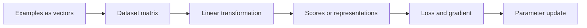

# Chapter 2 — Linear Algebra and Geometry

## 1. Why ML is full of linear algebra

An ML dataset is often a matrix, an example is a vector, embeddings are vectors,
neural layers multiply matrices, and many objectives are geometric. Linear algebra
lets one expression operate on entire batches efficiently.



## 2. Scalars, vectors, matrices, and tensors

- Scalar a ∈ ℝ: one number.
- Vector x ∈ ℝᵈ: ordered d numbers.
- Matrix A ∈ ℝᵐˣⁿ: m rows and n columns.
- Tensor: array with zero or more axes; a scalar is a rank-0 tensor in programming
  terminology, not to be confused with matrix rank.

Column-vector convention:

```text
        ┌ x₁ ┐
x =     │ x₂ │      x ∈ ℝᵈ
        │ ⋮  │
        └ xd ┘
```

In code, a one-dimensional array with shape `(d,)` is neither explicitly a row
nor column. Operations and broadcasting determine behavior. Make shapes visible.

## 3. Vector operations

For x, y ∈ ℝᵈ and scalar c:

> x + y = [x₁ + y₁, …, x<sub>d</sub> + y<sub>d</sub>]  
> cx = [cx₁, …, cx<sub>d</sub>]

### Dot product

> x · y = xᵀy = Σ<sub>j=1</sub><sup>d</sup> x<sub>j</sub>y<sub>j</sub>

Three interpretations:

1. weighted sum: wᵀx combines features with weights;
2. geometry: ‖x‖₂ ‖y‖₂ cos θ;
3. projection alignment: positive means similar direction, zero orthogonal,
   negative opposing direction.

Example x = [1, 2], y = [3, −1]: xᵀy = 3 − 2 = 1.

### Norm and cosine similarity

> ‖x‖₂ = √(xᵀx)  
> cos(x, y) = (xᵀy)/(‖x‖₂‖y‖₂), for nonzero vectors

Cosine similarity ignores magnitude. Two embeddings in the same direction have
cosine 1 even if one is 100 times longer. Normalizing vectors makes cosine equal
to their dot product.

### Hadamard product

Elementwise multiplication:

> x ⊙ y = [x₁y₁, …, x<sub>d</sub>y<sub>d</sub>]

This is not the dot product: it returns a vector rather than a scalar.

### Outer product

For x ∈ ℝᵐ and y ∈ ℝⁿ:

> xyᵀ ∈ ℝᵐˣⁿ, with entry (i, j) = x<sub>i</sub>y<sub>j</sub>

Outer products appear in covariance, gradients, attention, and rank-one updates.

## 4. Matrix operations and dimensions

### Addition and scalar multiplication

Matrices must have the same shape for ordinary addition. Operations apply entrywise.

### Transpose

Aᵀ swaps rows and columns:

```text
A = [1 2 3]       Aᵀ = [1 4]
    [4 5 6]            [2 5]
                       [3 6]
```

Rules:

> (Aᵀ)ᵀ = A  
> (A + B)ᵀ = Aᵀ + Bᵀ  
> (AB)ᵀ = BᵀAᵀ

Order reverses in the last identity.

### Matrix multiplication

If A ∈ ℝᵐˣⁿ and B ∈ ℝⁿˣᵖ, then AB ∈ ℝᵐˣᵖ:

> (AB)<sub>ij</sub> = Σ<sub>k=1</sub><sup>n</sup> A<sub>ik</sub>B<sub>kj</sub>

Shape rule:

```text
(m × n) @ (n × p) -> (m × p)
         ^ inner dimensions must match
```

Matrix multiplication is generally not commutative: AB ≠ BA. It is associative:
(AB)C = A(BC), but the computational cost can differ dramatically depending on
parenthesization.

### Linear transformation

A matrix A maps x to Ax. Geometrically it can rotate, reflect, scale, shear,
project, or combine directions. It preserves linear combinations:

> A(cx + dy) = cAx + dAy

An affine transformation adds a bias: Ax + b.

## 5. Identity, inverse, and systems of equations

Identity matrix I has ones on the diagonal and satisfies AI = IA = A.

A square matrix A is invertible if an A⁻¹ exists such that:

> A⁻¹A = AA⁻¹ = I

Then Ax = b implies x = A⁻¹b. In numerical code, do **not** usually compute the
inverse explicitly; solve the system with a stable factorization:

```python
x = np.linalg.solve(A, b)      # preferred
# x = np.linalg.inv(A) @ b     # avoid when only solving
```

Reasons: explicit inverse is slower, uses more memory, and often accumulates more
numerical error.

### Types of solutions to Ax = b

- unique solution: columns are independent and rank supports it;
- no solution: b lies outside the column space;
- infinitely many: redundant directions leave free variables.

Least squares finds the x whose Ax is closest to b when exact equality is
impossible.

## 6. Linear combinations, span, basis, and dimension

A linear combination of v₁, …, v<sub>k</sub> is:

> c₁v₁ + c₂v₂ + … + c<sub>k</sub>v<sub>k</sub>

Their **span** is all possible linear combinations.

Vectors are linearly independent if:

> c₁v₁ + … + c<sub>k</sub>v<sub>k</sub> = 0

implies every c<sub>i</sub> = 0. Otherwise at least one vector is redundant.

A **basis** is an independent spanning set. The number of basis vectors is the
space's dimension. Coordinates depend on the basis; the underlying vector does not.

### Column space and null space

- Col(A): all Ax values; span of A's columns.
- Null(A): all x satisfying Ax = 0.

For A with n columns:

> rank(A) + nullity(A) = n

This rank–nullity theorem says input directions either affect the output or are
collapsed to zero (with a suitable decomposition).

## 7. Rank

Rank is the number of independent rows/columns and the dimension of the column
space. For A ∈ ℝᵐˣⁿ:

> rank(A) ≤ min(m, n)

Full column rank means rank n; full row rank means rank m.

Why rank matters:

- redundant features create collinearity;
- invertibility of a square matrix requires full rank;
- low-rank approximations compress data/models;
- matrix factorization represents interactions in latent dimensions;
- rank-deficient normal equations have non-unique solutions.

Numerical rank depends on a tolerance because singular values can be tiny rather
than exactly zero.

## 8. Determinant

For a 2 × 2 matrix:

```text
A = [a b]       det(A) = ad − bc
    [c d]
```

Geometrically |det(A)| is the factor by which A scales area/volume; the sign
indicates orientation. A square matrix is invertible exactly when det(A) ≠ 0 in
exact arithmetic.

Rules:

> det(AB) = det(A)det(B)  
> det(Aᵀ) = det(A)  
> det(A⁻¹) = 1/det(A)

Do not use a small determinant alone to assess numerical stability; determinant
scales with dimension and units. Condition number/singular values are more useful.

## 9. Orthogonality and orthonormal bases

x and y are orthogonal when xᵀy = 0. A set is orthonormal when every vector has
norm 1 and distinct vectors are orthogonal.

For an orthogonal square matrix Q:

> QᵀQ = QQᵀ = I, therefore Q⁻¹ = Qᵀ

Orthogonal transformations preserve dot products, distances, and norms. They are
numerically attractive because they do not amplify error purely by scaling.

## 10. Projection

Projection of b onto nonzero vector a:

> proj<sub>a</sub>(b) = a · (aᵀb)/(aᵀa)

If a has unit norm, this becomes a(aᵀb).

The residual r = b − proj<sub>a</sub>(b) is orthogonal to a.

For a full-column-rank matrix A, projection onto its column space is:

> P = A(AᵀA)⁻¹Aᵀ  
> b̂ = Pb

Conceptually this explains least squares. Numerically, QR or SVD is preferable to
forming (AᵀA)⁻¹ because normal equations square the condition number.

### Least squares normal equations

Minimize:

> ‖Ax − b‖₂²

At the optimum, residual b − Ax is orthogonal to every column of A:

> Aᵀ(Ax − b) = 0  
> AᵀAx = Aᵀb

If A has full column rank:

> x̂ = (AᵀA)⁻¹Aᵀb

This is a derivation, not the recommended implementation.

## 11. Eigenvalues and eigenvectors

A nonzero vector v is an eigenvector of square A if applying A only scales its
direction:

> Av = λv

λ is its eigenvalue. Rearranging:

> (A − λI)v = 0

Nonzero solutions require det(A − λI) = 0, the characteristic equation.

Interpretation:

- |λ| > 1 expands that direction;
- |λ| < 1 contracts it;
- λ < 0 also reverses direction;
- λ = 0 collapses it;
- complex values can encode rotation/oscillation.

Not every matrix has a full real eigenbasis. Symmetric real matrices do: their
eigenvalues are real and eigenvectors can be orthonormal.

### Eigendecomposition

If A has enough independent eigenvectors:

> A = VΛV⁻¹

where columns of V are eigenvectors and Λ is diagonal. For symmetric A:

> A = QΛQᵀ

This exposes repeated application Aᵏ = VΛᵏV⁻¹ and connects to stability,
covariance, PCA, graph methods, and dynamical systems.

## 12. Quadratic forms and positive semidefinite matrices

A quadratic form is:

> q(x) = xᵀAx

A symmetric A is:

- positive definite (PD) if xᵀAx > 0 for every nonzero x;
- positive semidefinite (PSD) if xᵀAx ≥ 0;
- indefinite if the form can be positive or negative.

For symmetric matrices:

- PD ⇔ all eigenvalues > 0;
- PSD ⇔ all eigenvalues ≥ 0.

Covariance matrices are PSD because for any vector a:

> aᵀΣa = Var(aᵀX) ≥ 0

PD Hessians imply local strict convexity; PSD kernels/covariances are foundational
in optimization and probabilistic models.

## 13. Singular value decomposition (SVD)

Every real m × n matrix has an SVD:

> A = UΣVᵀ

- U: orthonormal left singular vectors;
- V: orthonormal right singular vectors;
- Σ: nonnegative singular values σ₁ ≥ σ₂ ≥ … on its diagonal.

Geometric sequence:

```text
input --Vᵀ rotation/reflection--> coordinates
      --Σ axis scaling----------> stretched/compressed coordinates
      --U rotation/reflection---> output
```

Relationships:

> AᵀA = VΣ²Vᵀ  
> AAᵀ = UΣ²Uᵀ

Thus right singular vectors are eigenvectors of AᵀA and squared singular values
are its eigenvalues.

### Rank-k approximation

Keep the k largest singular values/vectors:

> A<sub>k</sub> = U<sub>k</sub>Σ<sub>k</sub>V<sub>k</sub>ᵀ

The Eckart–Young result says this is the best rank-k approximation under Frobenius
and spectral norms. Applications: compression, denoising, latent semantic analysis,
collaborative filtering, and stable least squares.

### Pseudoinverse

With nonzero singular values inverted:

> A⁺ = VΣ⁺Uᵀ

It gives a least-squares/minimum-norm solution even when A is rectangular or rank
deficient. Tiny singular values amplify noise, motivating truncation or
regularization.

## 14. PCA through linear algebra

Given centered data matrix X, sample covariance is proportional to XᵀX. PCA finds
orthonormal directions maximizing projected variance.

First principal direction:

> maximize ‖Xv‖₂² subject to ‖v‖₂ = 1

The solution is the eigenvector of XᵀX with largest eigenvalue, equivalently the
first right singular vector of X.

Explained variance ratio of component j:

> EVR<sub>j</sub> = λ<sub>j</sub> / Σ<sub>k</sub> λ<sub>k</sub>

Important details:

- center features first;
- scale features when units/variance should not dominate;
- component signs are arbitrary;
- PCA is linear and unsupervised; high variance is not always predictive signal;
- fit PCA only on training data to avoid contamination.

## 15. Matrix norms and conditioning

### Frobenius norm

> ‖A‖<sub>F</sub> = √(Σ<sub>i,j</sub> A<sub>ij</sub>²)

It treats all entries as one long vector.

### Spectral/operator 2-norm

> ‖A‖₂ = σ<sub>max</sub>(A)

It is the maximum factor by which A stretches a vector in L2 norm.

### Condition number

For invertible A:

> κ₂(A) = σ<sub>max</sub>/σ<sub>min</sub>

Large κ means small input/rounding perturbations can cause large solution changes.
It does not mean every calculation fails, but it warns that the problem is
ill-conditioned. Scaling, regularization, better features, or a different
factorization can help.

## 16. Sparse matrices and embeddings

Text/count/graph features may contain millions of dimensions but few nonzeros.
Sparse storage records values and indices, reducing memory and computation.
Accidentally converting to dense can exhaust memory.

An embedding maps an entity/token/item to a dense vector e ∈ ℝᵈ. Geometry is
learned for an objective: distance or cosine similarity is meaningful only to the
extent training and evaluation validate it. Nearest neighbors can also reflect
frequency, bias, or hubness in high dimensions.

## 17. Tensors, broadcasting, and batch dimensions

Example shapes:

- tabular batch: `(batch, features)`;
- image batch: `(batch, channels, height, width)` or channels-last;
- token representations: `(batch, sequence, hidden)`;
- attention scores: `(batch, heads, query_length, key_length)`.

Broadcasting conceptually stretches singleton/missing axes without copying, when
shape rules allow. It is powerful and a major source of silent bugs.

Example:

```text
X: (32, 128)
b:      (128,)
X + b -> (32, 128)    # same bias added to every row
```

But `(32, 128) + (32,)` is invalid or may align differently than intended.
Document semantic axis names, not just numbers.

## 18. Computational patterns

- Vector–vector dot: Θ(d).
- Dense matrix–vector m × n: Θ(mn).
- Dense matrix multiplication m × n by n × p: classical Θ(mnp).
- Storing dense m × n: Θ(mn).
- SVD: expensive; exact cost depends on dimensions/algorithm, and truncated
  randomized methods help when only top components are needed.

Performance is often memory-bound. Prefer optimized BLAS kernels, batch operations,
contiguous layouts where appropriate, and profiling over hand-written loops.

## 19. Interview derivations

### Why covariance is PSD

For covariance matrix Σ and any a:

> aᵀΣa = aᵀ E[(X − μ)(X − μ)ᵀ] a  
> = E[(aᵀ(X − μ))²]  
> = Var(aᵀX) ≥ 0

### Why orthogonal matrices preserve norm

> ‖Qx‖₂² = (Qx)ᵀ(Qx) = xᵀQᵀQx = xᵀx = ‖x‖₂²

### Why normal equations arise

The residual at the closest point in Col(A) must be perpendicular to the column
space. Therefore Aᵀ(b − Ax) = 0, giving AᵀAx = Aᵀb.

## 20. Checks and exercises

### Beginner

1. Multiply a 2 × 3 matrix by a 3-vector and annotate every dimension.
2. Calculate dot product, cosine, L1, and L2 distance for two small vectors.
3. Explain matrix multiplication as row–column dot products.
4. Determine whether [1, 2] and [2, 4] are independent.

### Intermediate

1. Project b = [3, 4] onto a = [1, 0]. Verify the residual is orthogonal.
2. Solve a 2 × 2 linear system by elimination and compare with the inverse formula.
3. Prove (AB)ᵀ = BᵀAᵀ using entries.
4. Center a tiny dataset and compute its covariance matrix.

### Advanced/interview

1. Why does forming AᵀA worsen conditioning?
2. Compare eigendecomposition and SVD: domain, existence, and uses.
3. Explain rank, numerical rank, and the effect of tiny singular values.
4. How would you compute top-k components for a huge sparse matrix?
5. Find a broadcasting bug that passes shape checks but changes semantics.

