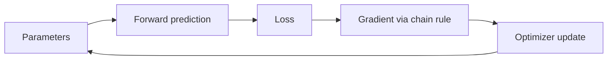

# Chapter 3 — Calculus and Optimization

## 1. What calculus does in ML

Calculus measures how outputs change when inputs or parameters change.

- Derivative: local change for one input.
- Partial derivative: change with respect to one variable while others are fixed.
- Gradient: all first partial derivatives of a scalar objective.
- Jacobian: first derivatives of a vector-valued function.
- Hessian: second derivatives/curvature of a scalar objective.
- Chain rule: propagate sensitivity through composed operations.

Training usually repeats:



## 2. Limits and continuity

A limit describes the value f(x) approaches as x approaches a point:

> lim<sub>x→a</sub> f(x) = L

It does not require f(a) to equal L or even be defined. A function is continuous
at a when:

1. f(a) exists;
2. the limit exists;
3. the limit equals f(a).

Continuity does not guarantee differentiability. |x| is continuous at zero but
has no unique derivative there.

## 3. Derivative from first principles

For scalar f:

> f′(x) = lim<sub>h→0</sub> [f(x + h) − f(x)] / h

Interpretations:

- slope of the tangent line;
- instantaneous change in output per input change;
- best local linear approximation:

> f(x + Δx) ≈ f(x) + f′(x)Δx

### Derive f(x) = x²

> f′(x) = lim [((x + h)² − x²)/h]  
> = lim [(2xh + h²)/h]  
> = lim [2x + h]  
> = 2x

The derivative is a function; at x = 3, slope is 6.

## 4. Core derivative rules

For constants c and differentiable f, g:

> d(c)/dx = 0  
> d(xⁿ)/dx = nxⁿ⁻¹  
> d(cf)/dx = c f′  
> d(f + g)/dx = f′ + g′  
> d(fg)/dx = f′g + fg′  
> d(f/g)/dx = (f′g − fg′)/g², when g ≠ 0

Common derivatives:

| Function | Derivative |
|---|---|
| eˣ | eˣ |
| log x | 1/x for x > 0 |
| sin x | cos x |
| cos x | −sin x |
| σ(x) | σ(x)(1 − σ(x)) |
| tanh x | 1 − tanh²x |
| ReLU(x) | 0 for x < 0; 1 for x > 0; convention at 0 |

## 5. Chain rule

If y = f(u) and u = g(x):

> dy/dx = (dy/du)(du/dx) = f′(g(x))g′(x)

Example y = (3x + 1)²:

- outer derivative: 2u;
- inner derivative: 3;
- result: 6(3x + 1).

### Computational graph view

For z = wx + b, p = σ(z), and binary log loss L(y, p), local derivatives multiply
backward. Backpropagation is efficient reverse-mode chain rule with reused
intermediate values; it is not a different kind of mathematics.

## 6. Partial derivatives and gradients

For f(x, y) = x² + 3xy + y²:

> ∂f/∂x = 2x + 3y  
> ∂f/∂y = 3x + 2y

The gradient collects them:

> ∇f(x, y) = [∂f/∂x, ∂f/∂y]ᵀ

The gradient points in the direction of steepest local increase under Euclidean
geometry. The negative gradient is steepest local decrease.

Directional derivative for unit direction u:

> D<sub>u</sub>f = ∇fᵀu

Cauchy–Schwarz shows this is largest when u aligns with ∇f.

## 7. Jacobian and Hessian

For vector function f: ℝⁿ → ℝᵐ, the Jacobian J ∈ ℝᵐˣⁿ contains:

> J<sub>ij</sub> = ∂f<sub>i</sub>/∂x<sub>j</sub>

It is the best local linear map:

> f(x + Δx) ≈ f(x) + JΔx

For scalar f: ℝⁿ → ℝ, Hessian H ∈ ℝⁿˣⁿ:

> H<sub>ij</sub> = ∂²f/(∂x<sub>i</sub>∂x<sub>j</sub>)

Second-order approximation:

> f(x + Δ) ≈ f(x) + ∇f(x)ᵀΔ + ½ΔᵀH(x)Δ

Hessian eigenvalues describe local curvature directions:

- all positive: locally convex/minimum-like;
- all negative: locally concave/maximum-like;
- mixed signs: saddle;
- near zero: flat direction.

In large neural networks, constructing the full Hessian is usually infeasible;
Hessian-vector products and first-order methods are more practical.

## 8. Matrix calculus essentials

Choose a consistent column-vector convention.

Useful identities:

> ∇<sub>w</sub>(aᵀw) = a  
> ∇<sub>w</sub>(wᵀw) = 2w  
> ∇<sub>w</sub>(wᵀAw) = (A + Aᵀ)w  
> if A is symmetric: ∇(wᵀAw) = 2Aw

For least squares with X ∈ ℝⁿˣᵈ:

> J(w) = (1/n) ‖Xw − y‖₂²

Gradient:

> ∇J(w) = (2/n) Xᵀ(Xw − y)

Shape audit:

```text
Xw − y:    (n × d)(d × 1) − (n × 1) = (n × 1)
Xᵀresidual: (d × n)(n × 1)            = (d × 1)
```

Setting the gradient to zero gives the normal equations.

## 9. Derivative of sigmoid and logistic loss

Sigmoid:

> σ(z) = 1/(1 + e⁻ᶻ)

Derivative:

> σ′(z) = σ(z)(1 − σ(z))

For one binary example with p = σ(z):

> L = −[y log p + (1 − y)log(1 − p)]

A crucial simplification:

> ∂L/∂z = p − y

For z = wᵀx + b:

> ∂L/∂w = (p − y)x  
> ∂L/∂b = p − y

For n examples, average the contributions. This “prediction minus target” gradient
is a core result for logistic regression and softmax cross-entropy.

### Stable implementation from logits

Computing p then log(p) can overflow/underflow for extreme z. Binary cross-entropy
from logits can be written stably using softplus:

> L(z, y) = max(z, 0) − yz + log(1 + exp(−|z|))

Use trusted `with_logits` library functions.

## 10. Optimization vocabulary

- objective: quantity being minimized/maximized;
- feasible set: allowed parameter values;
- local minimum: no nearby point is better;
- global minimum: no feasible point anywhere is better;
- stationary point: gradient is zero; can be min, max, or saddle;
- convex set: line segment between any two points remains inside;
- convex function: graph lies below chords over a convex domain.

For differentiable convex f:

> f(y) ≥ f(x) + ∇f(x)ᵀ(y − x)

Any local minimum of a convex function is global. Strict convexity usually gives a
unique minimizer, though details depend on the domain.

Strong convexity provides a quadratic lower bound and faster/stabler convergence
guarantees. Smoothness bounds how quickly gradients can change.

## 11. Gradient descent

Update:

> θ<sub>t+1</sub> = θ<sub>t</sub> − η∇J(θ<sub>t</sub>)

η is the learning rate.

- too small: slow progress;
- too large: oscillation/divergence;
- useful rates depend on curvature and scale.

For a quadratic with elongated contours, descent zigzags across steep directions
while moving slowly along shallow directions. Feature standardization, momentum,
preconditioning, or second-order information improves conditioning.

## 12. Batch, stochastic, and mini-batch gradients

### Full-batch

Use all n examples per update. Exact gradient for the finite dataset, stable but
expensive and infrequent on large data.

### Stochastic gradient descent (SGD)

Use one sampled example. Cheap and noisy; noise can help exploration but requires
careful schedules.

### Mini-batch SGD

Use B examples. Efficient on vector hardware and balances noise/throughput.

If samples are unbiased:

> E[g<sub>batch</sub>] = ∇J

Gradient variance generally decreases with batch size, but examples may be
correlated, and very large batches can reduce update frequency and alter
generalization/optimization behavior.

## 13. Momentum and adaptive optimizers

### Momentum

One common convention:

> v<sub>t</sub> = βv<sub>t−1</sub> + g<sub>t</sub>  
> θ<sub>t+1</sub> = θ<sub>t</sub> − ηv<sub>t</sub>

It accumulates directions that persist and dampens oscillating directions.
Conventions differ in scaling; inspect the framework.

### RMSProp intuition

Maintain an exponential average of squared gradients and divide updates by their
root scale. Coordinates with consistently large gradients receive smaller
effective steps.

### Adam

Adam combines first- and second-moment exponential averages with bias correction:

> m<sub>t</sub> = β₁m<sub>t−1</sub> + (1 − β₁)g<sub>t</sub>  
> v<sub>t</sub> = β₂v<sub>t−1</sub> + (1 − β₂)g<sub>t</sub>²  
> m̂<sub>t</sub> = m<sub>t</sub>/(1 − β₁ᵗ)  
> v̂<sub>t</sub> = v<sub>t</sub>/(1 − β₂ᵗ)  
> θ<sub>t+1</sub> = θ<sub>t</sub> − η m̂<sub>t</sub>/(√v̂<sub>t</sub> + ε)

Adam is convenient and often fast but not universally superior. SGD with momentum
can generalize better in some regimes.

### AdamW and weight decay

For adaptive optimizers, decoupled weight decay (AdamW) is not identical to adding
an L2 term to the loss because coordinate-wise adaptation changes the penalty's
effect. Know which mechanism a library implements.

## 14. Learning-rate schedules

- constant then decay;
- step/exponential decay;
- cosine decay;
- warmup then decay;
- cyclical/one-cycle schedules;
- reduce on plateau.

Warmup avoids unstable early updates in large/deep models. A schedule is a
hyperparameter and should be evaluated with a fixed budget and reliable validation.

## 15. Newton and quasi-Newton methods

Newton update in multiple dimensions:

> θ<sub>t+1</sub> = θ<sub>t</sub> − H(θ<sub>t</sub>)⁻¹∇J(θ<sub>t</sub>)

It accounts for curvature and can converge rapidly near a well-behaved optimum.
But forming/inverting H costs too much for large models and can be unsafe when H
is indefinite or ill-conditioned.

Quasi-Newton methods such as BFGS/L-BFGS approximate inverse curvature from
gradient history. L-BFGS is useful for medium-scale smooth deterministic
objectives but less common for huge stochastic deep-learning workloads.

## 16. Constraints and Lagrange multipliers

For minimize f(x) subject to g(x) = 0, define:

> ℒ(x, λ) = f(x) + λg(x)

At a regular constrained optimum:

> ∇f(x) + λ∇g(x) = 0, and g(x) = 0

Geometrically, the objective gradient aligns with the constraint boundary normal;
there is no feasible first-order descent direction.

For inequality constraints, Karush–Kuhn–Tucker (KKT) conditions add primal
feasibility, dual feasibility, stationarity, and complementary slackness. They are
necessary under constraint qualifications and sufficient for suitable convex
problems—not magic for arbitrary non-convex problems.

## 17. Nondifferentiability and subgradients

L1 penalty |x| is nondifferentiable at zero. A subgradient at zero can be any
value in [−1, 1]. Subgradient/proximal methods handle such objectives.

The proximal operator for L1 yields soft-thresholding, explaining exact zeros in
Lasso solutions. Tree models and discrete decisions are not ordinarily trained by
simple gradients; specialized optimization or surrogate objectives are used.

## 18. Automatic differentiation

### Forward mode

Propagates derivatives with values; efficient when inputs are few and outputs many.

### Reverse mode

Propagates adjoints backward; efficient for one scalar loss and millions of
parameters. Backpropagation is reverse-mode automatic differentiation on a
computational graph.

Memory is needed for forward activations. Gradient checkpointing trades extra
recomputation for less memory. In-place mutation can invalidate saved values.

### Gradient checking

Central finite difference for coordinate j:

> ∂f/∂θ<sub>j</sub> ≈ [f(θ + h e<sub>j</sub>) − f(θ − h e<sub>j</sub>)]/(2h)

Use double precision, small problems, and a sensible h. Too large gives truncation
error; too small gives cancellation. Disable stochastic components. Gradient
checking diagnoses implementation, not model quality.

## 19. Optimization diagnostics

| Symptom | Possible cause | Checks/actions |
|---|---|---|
| Loss becomes NaN/∞ | overflow, log zero, exploding update, corrupt input | inspect first bad batch, logits, gradient norm, dtype, stable loss |
| Loss constant | no gradient, frozen/detached params, tiny rate, saturated activation | verify parameter change, gradient flow, overfit one batch |
| Loss oscillates | rate too large, poor scaling, tiny/noisy batch | lower rate, normalize, larger batch, momentum |
| Training improves, validation worsens | overfitting | regularize, early stop, data/error audit |
| Very slow | rate too small, ill-conditioning, input pipeline bottleneck | profiler, scaling, schedule, optimizer |
| Different seeds diverge | instability/small data/non-determinism | repeated runs, initialization, batch order, deterministic diagnostics |
| Huge gradient norm | exploding gradients/outlier | inspect inputs, clipping, normalization, architecture |

### Gradient clipping

Global norm clipping rescales g when ‖g‖ exceeds threshold c:

> g ← g · min(1, c/‖g‖)

It prevents catastrophic steps but can conceal a deeper instability. Log the
clipping rate.

## 20. Optimization versus generalization

Lower training loss does not always mean better held-out performance. Optimizers,
batch size, schedules, and stopping time impose implicit biases. Training may
reach different parameter solutions with equal loss but different robustness.

Separate questions:

1. Did optimization minimize the intended training objective?
2. Does that objective reflect the target problem?
3. Does the chosen solution generalize under deployment shift?
4. Can it serve within system constraints?

## 21. Exercises

### Beginner

1. Derive derivatives of x³, log x, and e²ˣ.
2. Use the chain rule on log(1 + eˣ).
3. Compute a two-variable gradient and take one gradient-descent step.
4. Explain why a zero gradient need not mean minimum.

### Intermediate

1. Derive the least-squares gradient from summation and matrix forms.
2. Derive ∂L/∂z = p − y for sigmoid cross-entropy.
3. Implement finite-difference checking for a small logistic model.
4. Compare full-batch and mini-batch convergence on the same dataset.

### Advanced/interview

1. Explain why conditioning affects gradient descent and normal equations.
2. Compare SGD, momentum, Adam, and L-BFGS under data/compute constraints.
3. Explain reverse-mode complexity for scalar loss with many parameters.
4. What is the difference between L2 regularization and AdamW weight decay?
5. Diagnose a model that trains in float32 but produces NaNs in float16.

