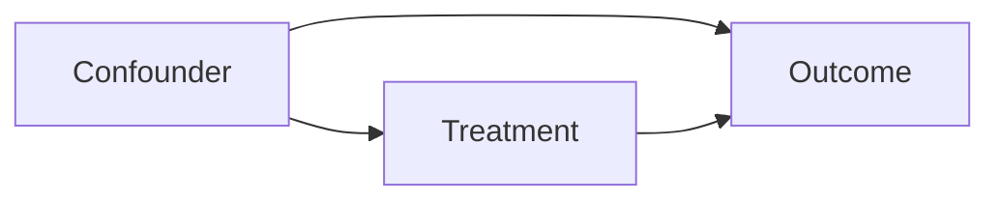

# Chapter 6 — Hypothesis Testing, Experiments, Causality, and Information

## 1. Estimation before testing

Start with:

- effect definition and units;
- point estimate;
- uncertainty interval;
- practical importance;
- assumptions and data quality.

A binary “significant/not significant” label hides magnitude and uncertainty.
Statistical significance is not product, scientific, or safety significance.

## 2. Hypotheses and test statistics

- Null hypothesis H₀: reference claim, often no difference.
- Alternative H₁: competing claim.
- Test statistic T: function of data measuring evidence direction/magnitude.
- Null distribution: behavior of T if H₀ and assumptions hold.

A test should be chosen from design and estimand, not after seeing which gives a
desired result.

### One- versus two-sided

- Two-sided: detect positive or negative differences.
- One-sided: detect only a prespecified direction.

Use one-sided only when the opposite direction would truly lead to the same action
as no effect and the direction was chosen before observing data. Harm guardrails
often remain two-sided or one-sided in the harmful direction.

## 3. p-value: exact meaning

The p-value is the probability, assuming H₀ and test assumptions, of observing a
test statistic at least as incompatible with H₀ as the actual one.

It is **not**:

- P(H₀ is true ∣ data);
- probability results occurred “by chance”;
- probability the result replicates;
- effect size;
- probability treatment is better.

A small p-value can come from a tiny unimportant effect with huge n. A large
p-value can reflect low power rather than evidence of no meaningful effect.

## 4. Type I/II errors and power

| Reality / decision | Reject H₀ | Do not reject H₀ |
|---|---|---|
| H₀ true | Type I error, probability α | correct non-rejection |
| H₁ true | correct rejection, power 1 − β | Type II error, probability β |

- α is set by procedure, commonly 0.05, not discovered from data.
- β depends on true effect, variance, sample size, design, and test.
- power = 1 − β.

Failing to reject H₀ is not proving H₀. Equivalence/non-inferiority designs are
needed to establish that differences are within a meaningful margin.

## 5. Effect sizes

### Difference in means

> Δ = μtreatment − μcontrol

### Relative lift

> lift = (μT − μC)/μC

Relative lift becomes unstable when baseline is near zero and can sound large for
small absolute changes. Report both.

### Risk difference, risk ratio, odds ratio

For binary outcome rates pT, pC:

> risk difference = pT − pC  
> risk ratio = pT/pC  
> odds ratio = [pT/(1 − pT)] / [pC/(1 − pC)]

Odds ratio is not risk ratio; they diverge for common outcomes.

### Standardized mean difference

> d = (x̄T − x̄C)/pooled SD

Useful across scales but product decisions usually need original units.

## 6. Common tests and assumptions

### z/t tests for means

Welch’s t-test compares two independent means without assuming equal variance.
Paired t-test analyzes within-pair differences; pairing increases power when valid.

Assumptions concern independent units and approximate sampling distribution; raw
data need not be perfectly normal for large samples, but heavy tails/clusters can
still matter.

### Proportion tests

Large-sample z tests compare rates. Use exact or improved methods for small counts/
extreme probabilities. Unit dependence invalidates row-level formulas.

### Chi-square tests

Test association in contingency tables using expected counts. Sparse cells need
exact/alternative methods. Association is not causation.

### Nonparametric/rank tests

Mann–Whitney/Wilcoxon compare distribution/rank behavior; they are not always
simply “tests of medians.” Interpret the actual estimand under assumptions.

### Permutation tests

Use randomization/exchangeability to build the null distribution. Preserve design
units, strata, clusters, and pairing.

## 7. Multiple comparisons

With m independent true-null tests at α = 0.05, chance of at least one false
positive is:

> 1 − (1 − 0.05)ᵐ

For m = 20, this is about 64%, not 5%.

### Family-wise error rate (FWER)

- Bonferroni: test each at α/m; simple and conservative.
- Holm: step-down improvement controlling FWER.

### False discovery rate (FDR)

Benjamini–Hochberg controls expected fraction of false discoveries among declared
discoveries under conditions. Appropriate for exploratory large-scale testing,
not interchangeable with FWER.

Multiple variants, metrics, slices, stopping times, and model seeds all create
researcher degrees of freedom even if only one final p-value is shown.

## 8. Power and sample size intuition

For a difference in means with balanced groups, required sample size roughly grows:

> n per group ∝ variance · (critical-value terms)² / minimum-effect²

Consequences:

- halving the detectable effect needs roughly 4× sample size;
- reducing variance improves power;
- rare binary outcomes require many units;
- clustering reduces effective sample size;
- attrition/noncompliance need allowance.

Define minimum detectable/practically important effect before the experiment.
Power calculations depend on baseline variance/rate and should include sensitivity
analysis.

## 9. A/B experiment design

### Step 1: define the decision and estimand

Example: average treatment effect on 28-day retained users among eligible new
users assigned to the experiment.

### Step 2: choose randomization unit

User, session, household, device, seller, geography, or time cluster. It must limit
contamination and align with analysis. Randomizing sessions while treatment changes
long-term user behavior creates cross-arm exposure.

### Step 3: eligibility and assignment

Define before exposure. Assignment should be stable, auditable, and independent of
outcomes. Use deterministic hashing with experiment salt when appropriate.

### Step 4: metrics

- one/few primary metrics;
- guardrails for harm, reliability, and ecosystem effects;
- diagnostic secondary metrics;
- exact windows, denominators, missing-data, and outlier rules.

### Step 5: duration/sample

Cover weekly/seasonal cycles and delayed outcomes. Avoid stopping when p first
crosses 0.05 unless using a valid sequential design.

### Step 6: analysis plan

Specify unit, estimand, covariates, variance estimator, multiple testing, exclusions,
and segment hypotheses before unblinding.

## 10. Experiment health checks

### Sample ratio mismatch (SRM)

Observed allocation differs more than expected from configured ratio. It may signal
assignment, logging, eligibility, filtering, or bot problems. Do not trust outcome
analysis until explained.

### Pre-treatment balance

Randomization balances in expectation, not perfectly in every sample. Check major
pre-treatment variables for implementation issues, without using a garden of
balance p-values to selectively modify analysis.

### Exposure and contamination

Track assigned, eligible, exposed, and analyzed counts. Cross-device identity,
shared households, network effects, caching, or seller behavior can contaminate.

### Logging invariants

Event uniqueness, timestamps, metric denominators, assignment consistency, and
data delay should be tested before decision metrics.

## 11. Intention-to-treat and treatment-on-treated

**Intention-to-treat (ITT)** compares groups by assignment, preserving randomization
and estimating effect of offering/assigning treatment.

Per-protocol or treatment-on-treated comparisons condition on actual use and can
be selected/confounded because users choose compliance. Instrumental-variable
methods may estimate complier effects under strong assumptions. Report ITT as the
default causal estimate in most product experiments.

## 12. Variance reduction

### Stratification

Randomize within important pre-treatment strata.

### Covariate adjustment

Regression using pre-treatment predictors can reduce residual variance and
improve precision when specified correctly. Do not adjust for post-treatment
variables.

### CUPED idea

Use correlated pre-experiment metric X:

> Yadjusted = Y − θ(X − E[X])

With suitable θ, variance falls while expected treatment difference remains under
randomization/pre-treatment conditions. Validate logging and avoid using features
affected by treatment.

## 13. Sequential testing and peeking

Repeatedly applying a fixed-horizon test and stopping on significance inflates
false positives. Valid alternatives:

- group sequential boundaries;
- alpha spending;
- always-valid p-values/confidence sequences;
- Bayesian decision rules with predeclared losses/thresholds.

Operational monitoring for severe harm can run continuously, but decision rules
must distinguish emergency guardrails from efficacy testing.

## 14. Network and interference effects

Standard potential-outcomes reasoning often assumes one unit's outcome is
unaffected by others' assignments (SUTVA/no interference). This fails for social
networks, marketplaces, ads auctions, messaging, and shared inventory.

Options:

- cluster randomization;
- graph cluster randomization;
- switchback experiments over time;
- saturation designs;
- explicit interference models.

These reduce effective sample size or require stronger analysis. State the
interference pathway.

## 15. Causal inference foundations

Prediction asks what is likely; causality asks what would change under an
intervention.

### Potential outcomes

For unit i:

- Yi(1): outcome under treatment;
- Yi(0): outcome under control.

Individual effect Yi(1) − Yi(0) is not jointly observable.
Average treatment effect:

> ATE = E[Y(1) − Y(0)]

Randomization makes assignment independent of potential outcomes in expectation,
allowing difference in group means to estimate ATE (with design details).

### Confounding

A confounder affects treatment assignment and outcome. Observational adjustment
requires no unmeasured confounding/conditional exchangeability, positivity, and
correct measurement/modeling.

### DAG reasoning

Conditioning on C may block the backdoor path. But conditioning on a collider can
open a spurious path; conditioning on a mediator removes part of the total effect.

### Common observational methods

- regression adjustment;
- matching/stratification;
- propensity scores and inverse-probability weighting;
- doubly robust estimators;
- instrumental variables;
- regression discontinuity;
- difference-in-differences;
- synthetic controls.

Each answers a specific estimand under assumptions that must be defended. No
method turns arbitrary observational data into randomized evidence.

## 16. Entropy

For discrete distribution P over outcomes x:

> H(P) = −Σx P(x) log P(x)

Interpretation: expected surprise/uncertainty. With log base 2, units are bits;
natural log gives nats. Define 0 log 0 as 0 by limit.

Properties:

- nonnegative for discrete variables;
- zero for a deterministic distribution;
- maximized by uniform distribution over a finite fixed support;
- depends on representation/support for continuous differential entropy, which
  can be negative and behaves differently.

## 17. Cross-entropy

For true distribution P and model Q:

> H(P, Q) = −Σx P(x) log Q(x)

It is expected code length/surprise when data follows P but model uses Q.

For one-hot classification target y and predicted probabilities q:

> cross-entropy = −log qtrue class

Minimizing empirical cross-entropy is maximum likelihood for a categorical
conditional model.

## 18. KL divergence

> KL(P ‖ Q) = Σx P(x) log[P(x)/Q(x)]

Relationship:

> H(P, Q) = H(P) + KL(P ‖ Q)

Since H(P) does not depend on Q, minimizing cross-entropy over Q is equivalent to
minimizing KL(P ‖ Q).

Properties:

- KL ≥ 0;
- KL = 0 iff P = Q almost everywhere;
- asymmetric: KL(P ‖ Q) ≠ KL(Q ‖ P);
- not a metric: lacks symmetry and triangle inequality;
- infinite when Q assigns zero where P assigns positive mass.

Direction matters. Forward/reverse KL penalize coverage and mode behavior
differently in approximations.

## 19. Jensen–Shannon divergence

Let M = (P + Q)/2:

> JS(P, Q) = ½KL(P ‖ M) + ½KL(Q ‖ M)

It is symmetric and finite for ordinary discrete distributions over shared support.
Its square root is a metric under conditions. It appears in drift comparison and
generative-model theory, but thresholds remain domain-specific.

## 20. Mutual information

> I(X; Y) = KL(P(X, Y) ‖ P(X)P(Y))

Equivalent:

> I(X; Y) = H(X) − H(X ∣ Y) = H(Y) − H(Y ∣ X)

It measures dependence/information shared; zero iff independent (under standard
definitions). It captures nonlinear dependence but is difficult to estimate in
high dimensions and does not imply causality.

Conditional mutual information I(X; Y ∣ Z) measures remaining dependence after Z.

## 21. Maximum entropy and softmax intuition

Maximum entropy selects the least-committed distribution satisfying specified
constraints. Exponential-family distributions arise from maximum-entropy problems.

Softmax transforms scores into a categorical distribution. Temperature T:

> pk = exp(zk/T) / Σ exp(zj/T)

- T < 1 sharpens;
- T > 1 flattens;
- T → 0 approaches argmax under unique maximum;
- T → ∞ approaches uniform.

Temperature scaling can calibrate logits on held-out data; it does not improve
ranking because it preserves score order.

## 22. Information-theory links to ML

- Negative log likelihood is cross-entropy-like empirical loss.
- KL regularizes variational inference and distillation.
- Entropy controls exploration/uncertainty in RL and active learning.
- Mutual information motivates representation objectives but estimation is hard.
- Perplexity is exponentiated average cross-entropy for language models:

> perplexity = exp(average negative log likelihood)

Lower perplexity means the model assigns higher probability to observed tokens,
not necessarily better factuality, safety, usefulness, or long-context behavior.

## 23. Experiment interview checklist

1. Decision, estimand, population, and minimum important effect.
2. Randomization/analysis unit and interference.
3. Eligibility, assignment, exposure, and logging.
4. Primary metric, window, guardrails, and multiplicity.
5. Power/sample/duration and delayed outcomes.
6. SRM, balance, quality, and contamination checks.
7. ITT analysis, uncertainty, effect in absolute/relative units.
8. Segment hypotheses and correction.
9. Novelty, seasonality, long-term and ecosystem effects.
10. Rollout or rollback decision and follow-up learning.

## 24. Exercises

### Beginner

1. Explain a p-value correctly in one sentence.
2. Distinguish α, β, power, effect size, and confidence level.
3. Compute absolute and relative lift for 10% versus 10.5% conversion.
4. Calculate entropy of a fair coin in bits.

### Intermediate

1. Design an A/B test for a search ranking change, including guardrails.
2. Explain why peeking inflates false positives.
3. Show cross-entropy = entropy + KL.
4. Compute KL(P ‖ Q) for two Bernoulli distributions.

### Advanced/interview

1. Diagnose sample ratio mismatch and specify when to invalidate results.
2. Design a marketplace experiment with seller/buyer interference.
3. Explain ITT versus treatment-on-treated and noncompliance.
4. Draw DAGs for confounder, mediator, and collider.
5. Compare predictive feature importance with causal effect.
6. Explain why perplexity improvement may not improve an LLM product.

