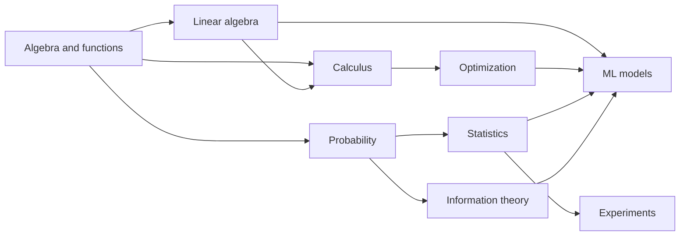

# Part 2 — Mathematical and Statistical Foundations

## Why this part exists

ML uses mathematics as a compact language for four questions:

1. **Representation:** how do we encode examples and transformations?
2. **Learning:** how do parameters change to reduce error?
3. **Uncertainty:** what can be inferred from noisy finite samples?
4. **Information:** how do predictions, distributions, and representations differ?

You do not need to become a pure mathematician before using ML. You do need to
read notation without fear, state assumptions, connect a formula to code, and
understand when a result does not apply.

## Reading tracks

| Track | Focus |
|---|---|
| Beginner | Work every numeric example by hand; read “interpretation” before derivation |
| Practitioner | Derive core results and implement them with NumPy without library shortcuts |
| Advanced/interview | Emphasize assumptions, geometry, numerical stability, estimator behavior, and experiment critique |

## Chapter map

| Order | Chapter | Outcome |
|---:|---|---|
| 1 | [Notation, algebra, functions, and numerical thinking](01-notation-algebra-functions.md) | Read and manipulate ML expressions safely |
| 2 | [Linear algebra and geometry](02-linear-algebra.md) | Understand vectors, matrices, projections, eigenvectors, and SVD |
| 3 | [Calculus and optimization](03-calculus-and-optimization.md) | Derive gradients and reason about optimization |
| 4 | [Probability](04-probability.md) | Model uncertainty and conditional relationships |
| 5 | [Statistics and estimation](05-statistics-and-estimation.md) | Infer population properties from samples |
| 6 | [Hypothesis testing, experiments, and information theory](06-experiments-and-information.md) | Design trustworthy comparisons and understand common ML losses |
| 7 | [Mathematics interview workbook](07-interview-workbook.md) | Check derivations and applied judgment |

## Dependency view

## Portable equation notation

No LaTeX plugin is required. Equations use Unicode and HTML subscripts/superscripts.

| Notation | Read as |
|---|---|
| x² | x squared |
| xi | element i of x |
| Σi=1n xi | sum x from i = 1 to n |
| ∏i=1n pi | product of p values |
| ∂f/∂x | partial derivative of f with respect to x |
| ∇f | gradient of f |
| E[X] | expected value of X |
| Var(X) | variance of X |
| P(A ∣ B) | probability of A given B |
| Aᵀ | transpose of A |
| A⁻¹ | inverse of A, when it exists |
| ‖x‖₂ | Euclidean/L2 norm of x |
| x ∈ ℝᵈ | x is a d-dimensional real vector |

## Exit criteria

You are ready for algorithm-focused notes when you can:

- interpret dimensions before multiplying matrices;
- explain dot products as geometry and computation;
- derive gradients for linear and logistic regression;
- apply Bayes’ theorem and distinguish independence from conditional independence;
- explain expectation, variance, covariance, likelihood, MLE, and MAP;
- construct and critique a confidence interval and A/B test;
- explain entropy, cross-entropy, and KL divergence; and
- identify numerical instability before it becomes a production bug.

