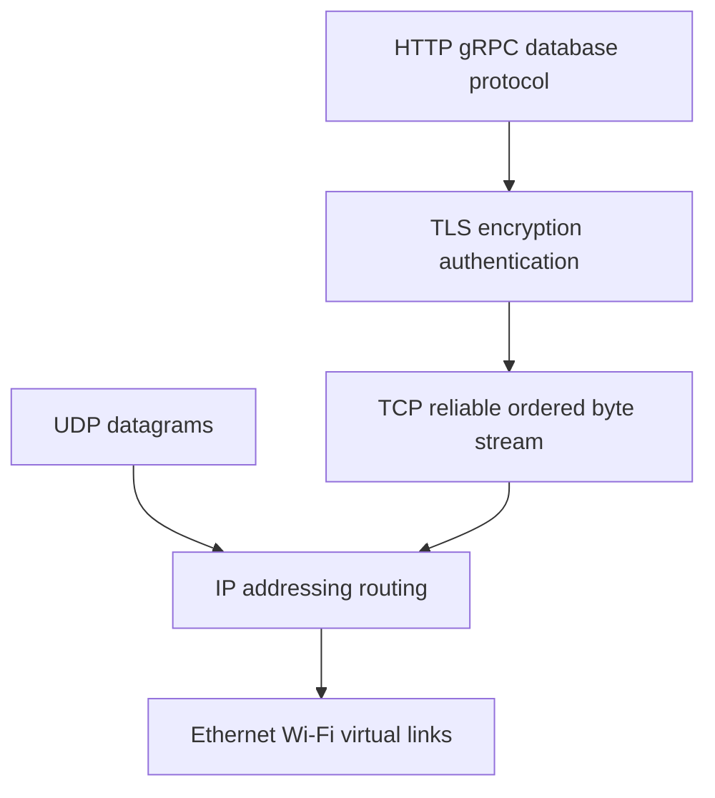

# Chapter 6 — Computer Systems, Operating Systems, and Networking

This chapter supplies the general systems model needed to reason about performance,
services, containers, databases, and distributed ML. It is deliberately independent
of any cloud provider or ML framework.

## 1. Information representation

Computers store bits; meaning comes from representation. Know:

- binary and hexadecimal notation;
- signed integers, two’s complement, overflow and fixed widths;
- floating-point sign/exponent/significand, rounding, NaN and infinity;
- bytes, endianness, alignment and serialization;
- text encodings: ASCII, Unicode code points, UTF-8 variable-length bytes;
- units: bit versus byte, decimal GB versus binary GiB, bandwidth versus latency.

A string length may mean bytes, code points, grapheme clusters, display columns, or
tokens. State the unit. Never slice arbitrary UTF-8 bytes and assume valid text.

## 2. CPU execution and memory hierarchy

Processors execute instructions through cores with registers, pipelines, caches,
vector/SIMD units, branch prediction, and out-of-order machinery. Main memory is
larger/slower; storage/network are further away.

```text
registers -> L1/L2/L3 caches -> DRAM -> local storage -> network storage/service
```

Performance depends on locality, working set, access pattern, branches, parallelism,
compiler/runtime, and contention—not only algorithmic big-O. A linear scan with
contiguous memory can outperform a theoretically attractive pointer-heavy structure.

### Cache locality

- temporal locality: reuse recently accessed data;
- spatial locality: access nearby addresses;
- cache line: transfer/granularity unit;
- false sharing: threads modify distinct values on one line and invalidate it;
- NUMA: memory access cost depends on CPU/socket placement.

Profile before low-level optimization; managed runtimes and libraries may already
vectorize or release interpreter locks.

## 3. Kernel and system calls

Applications run in user mode and request kernel services through system calls:
open/read/write, process/thread creation, memory mapping, sockets, time and more.
Crossing boundaries, copying, context switching, and blocking have costs.

Buffered libraries batch syscalls; memory mapping exposes file-backed pages;
asynchronous/event mechanisms let one thread manage many I/O operations. Exact
semantics differ across operating systems.

## 4. Process versus thread

- process: protected virtual address space and OS resource container;
- thread: independently scheduled execution within a process, sharing address space
  and descriptors with peer threads;
- coroutine/task: language/runtime-scheduled unit, often multiplexed over threads;
- child process: separate process related through creation/inheritance.

Threads make shared-memory communication cheap but introduce races. Processes add
isolation but require IPC/serialization/shared memory. In Python, the interpreter,
native libraries, process start method, serialization and platform affect parallel
behavior; do not repeat “threads are useless for CPU work” as a universal rule.

## 5. Scheduling and context switching

The scheduler shares CPU among runnable threads using priorities/policy and topology.
Too many runnable threads cause context switches/cache disruption. Blocking threads
sleep until I/O/event; busy waiting consumes CPU. Tail latency can arise from queue
delays even with low average utilization.

Measure CPU time, wall time, runnable queue, per-core usage, context switches,
throttling, and steal time in virtualized systems.

## 6. Virtual memory

Each process sees virtual addresses mapped through page tables to physical memory or
backing. Concepts:

- page and page fault;
- resident set versus virtual allocation;
- anonymous versus file-backed mappings;
- copy-on-write after fork/snapshot;
- page cache for filesystem data;
- swap and memory pressure;
- memory-mapped files;
- huge pages and TLB effects;
- cgroup/container limit distinct from host capacity.

An out-of-memory kill can occur at process/cgroup/host level. “Free memory” alone
does not diagnose it. Track allocation peaks and reclaimable cache.

## 7. Filesystems and durability

A filesystem maps names/directories to metadata and data blocks. Understand:

- inode/object identity versus path;
- hard/symbolic links;
- file descriptor/open-file description and offsets;
- buffering, page cache, flush and durability;
- atomicity of writes/rename within documented boundaries;
- journaling and crash recovery;
- mounts, permissions, ACLs and quotas;
- local, network, distributed and object storage semantics.

`write` success may mean bytes reached kernel cache, not durable media. `fsync`
scope, directory metadata, hardware caches and database write-ahead logging matter.
Object storage uses keys/objects/APIs, not ordinary POSIX mutation assumptions.

## 8. Concurrency correctness

A data race occurs when concurrent accesses include a write without required
synchronization under the language memory model. Higher-level race conditions can
occur even with individually atomic operations.

Synchronization tools:

- mutex, read-write lock, semaphore;
- condition variable/event;
- atomic operations and compare-and-swap;
- thread-safe queue/channel and message passing;
- immutable data and ownership confinement;
- transactions/optimistic concurrency for persistent state.

Deadlock classically needs mutual exclusion, hold-and-wait, no forced preemption,
and circular wait. Prevent with ownership, lock ordering, timeouts/cancellation,
avoiding calls while holding locks, or message-passing design. Timeouts detect/bound
some symptoms; they do not establish correctness.

## 9. Networking layers



Layer models are conceptual; real stacks optimize across layers. Know:

- MAC/link connects local segments;
- IP addresses/routing move packets across networks;
- TCP establishes connection, ordered reliable byte stream, flow/congestion control;
- UDP sends datagrams without TCP reliability/order/connection semantics;
- port identifies transport endpoint at a host/address;
- socket is an OS communication endpoint;
- NAT rewrites addresses/ports across boundaries;
- firewall/security group filters flows by policy.

TCP preserves byte order, not application messages. Protocols need framing such as
length prefixes, delimiters, or structured records.

## 10. DNS

DNS is a distributed naming system with recursive resolvers, authoritative servers,
record types, TTL/caching, and negative results. A hostname can map to multiple
addresses and change. Search domains and split-horizon DNS can make environments
behave differently.

Debug stages separately: name resolution, route/connect, TLS, application response.
Do not permanently replace names with observed IPs as a “fix.”

## 11. TCP and connection behavior

Connection setup, loss/retransmission, flow control, congestion control, keepalive,
backlog, idle timeout, and connection pools affect latency/reliability. A connect
timeout, request timeout, idle/read timeout, and total deadline solve different
problems.

Connection reuse reduces handshake cost but pools need size, lifetime, stale
connection, DNS rotation, backpressure, and failure handling.

## 12. TLS and certificates

TLS provides encryption/integrity and authenticates endpoints through certificates
and trust chains; mutual TLS authenticates clients too. Verification checks chain,
hostname, validity and policy. Never disable verification as a production fix.

Operational concerns: key protection, rotation, certificate expiration, SNI, cipher/
protocol support, termination at proxies, and end-to-end trust boundaries.

## 13. HTTP fundamentals

HTTP requests contain method, target, headers and optional body; responses contain
status, headers and optional body. HTTP versions differ in framing/multiplexing and
transport, while semantics remain central.

Method properties:

| Method | Typical meaning | Safe | Idempotent by semantics |
|---|---|---:|---:|
| GET | retrieve representation | yes | yes |
| HEAD | GET metadata without body | yes | yes |
| POST | submit/create/action | no | no |
| PUT | replace resource at URI | no | yes |
| PATCH | partial change | no | not inherently |
| DELETE | request removal | no | yes desired effect |

Idempotent does not mean identical response or no side effects such as logs. APIs
can add idempotency keys for retried non-idempotent business actions.

Status classes: 1xx informational, 2xx success, 3xx redirection, 4xx caller/request/
authorization contract, 5xx server failure. Choose specific codes and documented
error bodies; never hide failure behind 200.

## 14. HTTP caching and proxies

Cache-Control, validators (`ETag`, modification time), freshness, `Vary`, and
conditional requests affect correctness. Shared caches must not mix authenticated/
personalized content. CDNs/reverse proxies terminate connections, route, cache,
compress, rate-limit and observe—but add trust/config/failure boundaries.

## 15. API contracts and evolution

Define schemas, types, units, bounds, defaults, null/missing distinction, ordering,
pagination, errors, authentication/authorization, rate limits, idempotency,
deadlines, versioning and deprecation.

REST is an architectural style; JSON over HTTP alone is not automatically REST.
gRPC commonly uses Protocol Buffers and HTTP/2/3 transports for typed RPC/streaming.
GraphQL lets clients select fields but requires complexity/authorization/caching
controls. Choose for consumers and operational constraints.

Backward-compatible evolution often adds optional fields and tolerant readers, but
semantic changes still break clients. Contract tests and staged deprecation matter.

## 16. Queues and messaging

Queues/logs decouple producers and consumers, absorb bursts, and enable asynchronous
work. Specify delivery (at-most/at-least/effectively-once within scope), ordering
unit, partition key, acknowledgement, visibility timeout, retry/backoff, dead-letter,
retention, replay, deduplication, schema and backpressure.

“Exactly once” is always scoped to protocol/state assumptions. End-to-end business
effects need idempotent consumers or transactional coordination.

## 17. Caching and consistency

Define key, value, TTL, invalidation, eviction, serialization/version, stampede,
negative cache, tenant/auth scope, write strategy and failure mode. Common patterns:

- cache-aside;
- read/write-through;
- write-back (higher durability/consistency risk);
- refresh-ahead;
- request coalescing/locks for stampedes.

Stale data can be acceptable only under a stated product consistency contract.

## 18. Distributed-system fundamentals

Networks delay, drop, duplicate, reorder around retries, and partition. Processes
pause/crash; clocks differ; messages can be observed before/after partial failure.
Design around:

- identities and idempotency;
- timeouts/deadlines/cancellation;
- bounded retry/backoff/jitter;
- replication and consistency;
- leader/election/leases where needed;
- transactions or sagas/compensation;
- monotonic/versioned state and schema evolution;
- backpressure/load shedding;
- observability and repair/reconciliation.

CAP concerns behavior during network partition: a system cannot simultaneously
guarantee every operation sees one linearizable value and every request succeeds
across a partition. It is not a database ranking slogan.

## 19. Systems lab

Build a small HTTP service and client. Add DNS name, TLS in a disposable environment,
connection pooling, request deadline, bounded retry with idempotency key, cache,
queue-backed background job, structured logs and metrics. Inject DNS failure,
connection refusal, slow response, partial body, duplicate delivery, stale cache,
process kill and memory limit. Classify each layer before changing code.

## 20. Interview questions

1. Explain why CPU utilization can be low while latency is high.
2. Compare process, thread, coroutine and container.
3. Trace a URL from DNS through TLS and HTTP to application response.
4. Design timeout/retry budgets across three dependent services.
5. Explain at-least-once delivery and idempotent consumption.
6. Compare strong/eventual consistency for a user profile and bank transfer.
7. Diagnose “disk full” when `du` is small.

