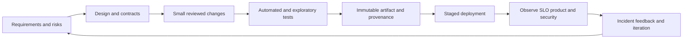

# Chapter 7 — Software Delivery, Cloud, Observability, and Security

## 1. Software delivery lifecycle

A dependable lifecycle connects requirements to operations:



“Agile,” Scrum, Kanban and ticket systems are coordination tools, not substitutes
for clear outcomes, engineering judgment, or technical quality. Keep decisions,
owners, non-goals, risks, and acceptance criteria explicit.

## 2. Requirements and design

Separate functional behavior from non-functional requirements: availability,
latency, throughput, durability, consistency, privacy, security, accessibility,
compliance, cost, operability and maintainability. Identify users, dependencies,
failure boundaries, data lifecycle and rollback before implementation.

Use design documents proportionate to risk. Record alternatives and irreversible/
expensive decisions. APIs/schemas/SLIs are contracts; ownership and migration matter.

## 3. Code organization and dependency direction

Favor cohesive modules with explicit interfaces and limited side effects. Separate
domain logic from transport/storage/framework adapters where useful. Avoid both a
single giant module and abstraction for its own sake.

Dependency injection can improve testing/configuration but service-locator/global
indirection hides dependencies. Use types and contracts, clear error models,
structured configuration, and documented concurrency/ownership.

## 4. Package and dependency management

Understand:

- source package versus built artifact;
- semantic/public version and compatibility policy;
- direct versus transitive dependency;
- version constraints, resolution and lockfile;
- platform markers/optional dependencies;
- private registries and dependency confusion;
- reproducible builds, hashes and signed provenance;
- update/security patch cadence and rollback.

Pinning forever leaves vulnerabilities; floating everything destroys repeatability.
Automate proposed updates, test compatibility, build a new immutable artifact and
promote it.

## 5. Testing strategy

- unit tests isolate deterministic logic;
- property tests check invariants over generated inputs;
- integration tests validate real component boundaries;
- contract tests check producer/consumer compatibility;
- end-to-end tests validate critical journeys;
- load/soak/stress tests characterize capacity and leaks;
- fuzz/security tests explore malformed/adversarial input;
- chaos/failure injection verifies recovery assumptions.

The test pyramid is guidance, not a quota. Prefer the cheapest test that detects a
real risk and keep a small trustworthy end-to-end layer. Track flaky tests as defects.

## 6. Continuous integration

CI validates each proposed change in a clean controlled environment. Typical stages:

1. formatting, linting, types, policy and secret scan;
2. unit/property tests and coverage used diagnostically;
3. integration/contract tests;
4. build immutable packages/images with SBOM/provenance;
5. vulnerability/license scan and signature;
6. platform/performance/security tests by risk;
7. publish only from trusted protected workflow.

Threat-model pull requests: untrusted code must not receive production secrets or
write trusted caches/artifacts. Pin CI actions/images and minimize token permissions.

## 7. Continuous delivery and deployment

Continuous delivery keeps a release deployable; continuous deployment automatically
promotes approved changes. Environments should consume the same artifact digest,
with versioned environment-specific configuration.

Strategies:

- rolling: gradually replace instances;
- blue/green: switch traffic between complete environments;
- canary: expose small traffic and expand on gates;
- shadow: duplicate traffic without user-visible result;
- feature flag: separate code deployment from feature release.

Every strategy needs compatibility, state migration, observation window, abort and
rollback/roll-forward. Database migration may not be reversibly coupled to code.

## 8. Configuration and secrets

Config is a typed/versioned input. Validate at startup, document defaults/units,
separate behavior from secret material, and record effective non-secret config.
Secret managers/workload identity issue scoped credentials; rotate/revoke and audit.

Do not put secrets in source, image layers, build args, command lines, logs, client
apps, URLs, or plaintext state files. Encryption is not authorization.

## 9. Cloud mental model

Cloud provides remotely managed resource APIs and responsibility boundaries, not
infinite/automatically reliable computers. Core categories:

| Category | Concepts to master |
|---|---|
| compute | VM, autoscaling group, container, function, batch, accelerator |
| storage | block, file, object, database, backup/snapshot, lifecycle |
| network | region/zone, virtual network/subnet, route, firewall, LB, private endpoint |
| identity | user, role, workload identity, policy, federation, key rotation |
| data | relational/NoSQL, warehouse/lake, stream/queue, cache |
| operations | logs/metrics/traces, audit, config, secrets, deployment |
| governance | accounts/projects, tags, budgets, quotas, policy, residency |

Regions contain failure domains/zones but provider semantics vary. Multi-zone does
not help if application/storage/control dependencies remain single points.

## 10. Shared-responsibility and IAM

Provider secures underlying services to a documented boundary; customer config,
identity, data, application and usage remain customer responsibilities. IAM policy
should grant least-privilege actions/resources/conditions to human/workload identities,
use federation/short-lived credentials, separate environments, and log decisions.

Administrator for convenience becomes permanent risk. Test both allowed and denied
paths. A public storage bucket or broad role can bypass perfect application code.

## 11. Cloud networking

Virtual networks contain subnets/routes and connect through gateways/endpoints/peering.
Public IP, NAT, load balancer, private endpoint and firewall/security group solve
different flows. DNS and certificate boundaries remain.

Design ingress, egress, east-west service traffic, admin access, data exfiltration
controls, overlapping address ranges, hybrid connectivity, and failure/cost. Egress
fees and cross-zone traffic can dominate system cost.

## 12. Storage and database selection

- object storage: durable key/object blobs, scalable, not POSIX/database transactions;
- block storage: attachable virtual disk, filesystem/database building block;
- network file storage: shared hierarchy/locks with latency/throughput/metadata limits;
- relational DB: schema, transactions, indexes and joins;
- key-value/document/wide-column: access-pattern-focused scaling and consistency;
- warehouse/lakehouse: analytics, columnar storage and snapshot/table metadata;
- cache: fast derived state with eviction/staleness.

Select from access pattern, consistency/transactions, size, throughput, latency,
query, retention, backup/restore, region, security, operations and cost—not branding.

## 13. Infrastructure as code

IaC declares reviewed infrastructure. State maps configuration to real resources;
plans preview but may be stale; providers/APIs evolve. Protect state because it may
contain sensitive values and controls critical resources.

Use modules carefully, pin providers, separate environments/state/blast radius,
policy/CI review, drift detection, import/migration and tested rollback. Never apply
an unreviewed destructive plan to production.

## 14. Observability

- metrics: aggregated numeric time series for trends/alerts;
- logs: discrete contextual events;
- traces: causal request path/spans across services;
- profiles: sampled/recorded resource/code behavior;
- audit logs: security-relevant control/data actions.

Three telemetry types do not guarantee observability. Include stable request/trace
IDs, versions, deployment/config, dependency, error class and tenant-safe context.
Control cardinality, cost, retention, sampling and sensitive data.

## 15. SLI, SLO, SLA, and error budget

- SLI: measured indicator such as valid-request success or p99 latency;
- SLO: target over defined window/population;
- SLA: external agreement with consequences;
- error budget: allowed unreliability implied by SLO.

Define valid events, measurement point, window, exclusions and data quality. Alert
on actionable user-impact/burn rates, not every CPU spike. Averages hide tails.

## 16. Reliability patterns

Timeouts, bounded retries with backoff/jitter, circuit breakers, bulkheads, rate
limits, queues/backpressure, load shedding, redundancy, health/readiness, graceful
degradation, idempotency and reconciliation. Each can worsen incidents if layered
without an end-to-end budget.

Capacity plan normal load, peaks, failure headroom, scaling lag and quotas. Test
dependency and zone loss, not only healthy autoscaling.

## 17. Security engineering

Security goals include confidentiality, integrity, availability, authenticity,
authorization, accountability and privacy. Start with threat model:

```text
assets -> actors -> entry points -> trust boundaries -> abuse cases
-> controls -> detection/response -> residual risk
```

Core practices:

- strong authentication, authorization on every resource/action, least privilege;
- input validation and output encoding; parameterized queries;
- secure session/token/cookie handling and CSRF/CORS knowledge for web systems;
- transport/storage encryption with key lifecycle;
- dependency/container/build supply-chain controls;
- sandbox untrusted files, models, code and deserialization;
- rate/resource limits and abuse monitoring;
- secrets rotation/revocation and audited access;
- patching, penetration/fuzz testing and incident response.

Never deserialize untrusted pickle-like objects or execute generated code without a
designed sandbox. A signed artifact can still be malicious if the signer/build was.

## 18. Privacy engineering

Minimize collection, purpose-limit use, control access, encrypt/pseudonymize where
appropriate, define retention/deletion, respect residency/consent/legal basis, and
audit downstream copies. Logs/backups/caches/features/models complicate deletion.
Anonymization claims require re-identification risk analysis.

## 19. Incident management

During an incident: detect/declare, establish command/communications, assess impact,
contain, preserve evidence, mitigate/rollback, recover/verify, communicate, and
follow up. Avoid speculative blame. A postmortem should document timeline, impact,
technical and organizational contributing conditions, detection gaps, what worked,
and owned prioritized actions.

Runbooks contain triggers, safe diagnostics, mitigations, escalation, validation and
rollback. Exercise them before an emergency.

## 20. Cost engineering

Measure unit economics (request, active user, GB processed, training token), not
only monthly total. Include idle headroom, network egress, storage requests,
replication, observability, licenses and engineering/on-call. Tag/attribute costs,
budgets/alerts and tie optimization to quality/SLO.

## 21. Delivery capstone

Take the Chapter 6 service and add CI, dependency lock, immutable non-root image,
SBOM/scan, IaC for a disposable environment, least-privilege identity, staged
deployment, SLI/SLO dashboard, load/failure test, secret rotation, cost estimate,
runbook and incident postmortem. Demonstrate rollback and one incompatible schema
migration plan.

## 22. Senior interview questions

1. Design secure CI/CD for untrusted contributions and signed production images.
2. Compare rolling, blue/green and canary with database migrations.
3. Define an SLO and burn-rate alerts for a payment or inference API.
4. Design multi-zone service and state; identify correlated failures.
5. Threat-model a file-upload and asynchronous processing platform.
6. Explain when serverless, VM, container and batch are appropriate.
7. Cut cloud cost 40% without violating quality or reliability—what evidence first?

