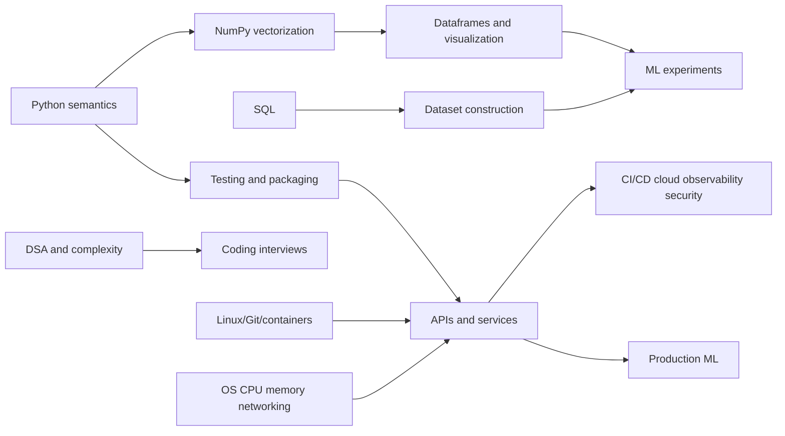

# Part 3 — Python, SQL, DSA, and the Data Stack

## Goal

Become the kind of engineer who can turn a mathematical idea into readable,
tested, profiled, reproducible software and manipulate production-scale data
without hiding mistakes inside notebooks.

## Tracks

| Reader | Emphasis |
|---|---|
| Beginner programmer | execute every code example, draw memory/state, write tests first |
| Working engineer | Python/NumPy semantics, SQL windows, packaging, data correctness |
| SDE-II/SDE-III candidate | complexity, interfaces, concurrency, reliability, trade-offs, debugging |

## Chapters

| Order | Chapter |
|---:|---|
| 1 | [Python foundations and language semantics](01-python-foundations.md) |
| 2 | [NumPy, dataframe work, and visualization](02-numpy-dataframes-visualization.md) |
| 3 | [SQL for analytics and ML](03-sql.md) |
| 4 | [Data structures, algorithms, and complexity](04-dsa-and-complexity.md) |
| 5 | [Engineering foundations: Linux, Git, APIs, concurrency, and containers](05-engineering-foundations.md) |
| 6 | [Computer systems, operating systems, and networking](06-computer-systems-networking.md) |
| 7 | [Software delivery, cloud, observability, and security](07-software-delivery-cloud-security.md) |
| 8 | [Testing, packaging, reproducibility, and interview workbook](08-quality-and-workbook.md) |

## Skill graph

## Environment recommendation

Use a current supported Python 3 release, a virtual environment, and a lockfile.
Prefer `pyproject.toml` for project metadata. Pin direct dependencies deliberately
and capture a reproducible resolved environment. Tools evolve; understand the
principles rather than tying knowledge to one command.

## Exit criteria

- write idiomatic typed Python with clear ownership/mutation behavior;
- reason about time and space complexity;
- use NumPy shapes/broadcasting safely and avoid unnecessary Python loops;
- construct leakage-safe transformations with dataframes/SQL;
- solve medium DSA and advanced SQL problems aloud;
- expose a validated API, test it, containerize it, and debug failures;
- explain processes/threads/memory/filesystems, DNS/TCP/TLS/HTTP, queues and caching;
- design CI/CD, cloud identity/network/storage, observability, SLOs and threat models;
- profile before optimizing and preserve reproducibility.

## Advanced continuation

After completing the core roadmap, continue with:

- [Part 13 Chapters 1–4: general Git and collaboration](../part-13-research-git/README.md);
- [Part 14 Chapters 1–7: Linux, Docker, Compose, Kubernetes, and Slurm](../part-14-containers-clusters/README.md); and
- [Part 15: accelerator programming and profiling](../part-15-accelerators-kernels/README.md).
