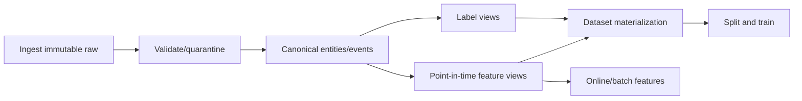

# Chapter 4 — Pipelines, Feature Stores, Lineage, and Governance

## 1. A feature is code plus state plus time semantics

Reusable feature pipelines must produce consistent values in:

- historical training backfill;
- periodic batch scoring;
- streaming/online serving;
- replay and incident investigation.

“Same feature name” is not parity if different defaults, windows, late-data rules,
or source snapshots are used.

## 2. Pipeline stages



Each stage should be idempotent or have explicit update semantics, observable, and
versioned.

## 3. Batch versus streaming features

### Batch

Pros: simpler backfills/reproducibility, large joins, low cost. Cons: staleness.

### Streaming

Pros: fresh state. Cons: ordering, duplicates, late events, state growth, replay,
watermarks, exactly-once claims, and operational complexity.

### Lambda/hybrid

Batch historical baseline plus streaming deltas. Requires reconciliation and can
produce two implementations. Prefer one semantic definition with tested execution
paths.

## 4. Event time, processing time, and watermarks

- Event time: when source event occurred.
- Processing time: when pipeline handles it.
- Availability time: when downstream can use it.
- Watermark: system estimate that most events earlier than time have arrived.

Late-event policy:

- update historical feature/state;
- ignore after allowed lateness;
- emit correction/retraction;
- rebuild affected partitions;
- preserve original served value for audit.

Training must simulate what online serving knew, not a retrospectively corrected
perfect past, unless correction was actually available.

## 5. Idempotency and deduplication

At-least-once delivery is common. Use stable event IDs and state update semantics
so replay does not double counts. If IDs absent, define bounded dedupe key/window
with collision limitations.

Exactly-once processing is an end-to-end property across source, compute, sink,
and side effects—not a single framework checkbox.

## 6. Feature store concepts

A feature store may provide:

- registry/metadata/ownership;
- offline historical store;
- online low-latency store;
- point-in-time joins;
- materialization/synchronization;
- discovery/reuse;
- access control/lineage/monitoring.

It does not automatically fix bad definitions, labels, skew, or ownership. Feature
reuse can spread mistakes widely; contracts and deprecation matter.

### Online key/value design

Define entity key, feature set/version, freshness timestamp, TTL, missing state,
and atomic grouping. Fetching features independently can mix versions/times; store
a coherent feature row/version when consistency matters.

## 7. Offline/online parity tests

1. sample logged prediction entity/timestamp;
2. retain or reconstruct online-served feature values;
3. recompute offline using historical source snapshot;
4. compare exact/tolerance and missing semantics;
5. segment mismatch by feature/source/version/time;
6. alert on material skew.

Golden fixtures cover edge times, late events, unseen categories, source outage,
and unit conversions. Parity must be continuous, not launch-only.

## 8. Dataset versioning and lineage

Reproducible training tuple:

```text
raw snapshot IDs + transformation code commit + config
+ feature/label definitions + split manifest + environment
= dataset version
```

Store immutable manifests/partition checksums and row counts. Mutable “latest” paths
are convenient aliases, not reproducible IDs.

Lineage answers:

- which sources/features/labels trained model M?
- which models consume feature F?
- who owns a broken upstream field?
- which predictions used artifact/policy/data version?
- how does deletion/correction propagate?

## 9. Backfills

Backfills can overload sources, produce duplicates, mix code versions, and rewrite
history. Plan:

- exact time/entity scope;
- immutable output version;
- capacity/rate limits;
- idempotent partition writes;
- late/correction semantics;
- quality comparison and reconciliation;
- consumer notification/promotion;
- rollback/cleanup and audit.

Do not silently replace a training dataset underneath an experiment.

## 10. Data tests and observability

### Structural gates

Schema, key, range, enum, nullability, referential integrity.

### Statistical monitors

Volume, quantiles, category mix, missing/default, correlation, freshness, drift.

### Semantic reconciliation

Totals against source of truth, sampled record trace, business invariants.

### Pipeline operations

Lag, throughput, failed/retried records, watermark, state/storage, cost, backfill.

Alerts must include affected consumers, severity, owner, and mitigation. Freshness
SLO breach may require model fallback rather than merely paging data team.

## 11. Feature freshness and fallback

For each feature:

- maximum acceptable age;
- behavior when stale/missing;
- quality indicator given to model;
- cached/default value safety;
- whether entire request falls back;
- monitoring and owner.

Default zero is dangerous when zero means real absence. Separate `value=0,
quality=unavailable` or explicit missing representation.

## 12. Privacy and governance

- purpose and lawful basis/consent where required;
- minimization and precision reduction;
- role/attribute/row-level access;
- encryption/key management;
- retention and deletion propagation;
- regional residency;
- data sharing/license constraints;
- audit trails;
- sensitive/proxy review;
- incident response.

Derived features and embeddings can remain personal/sensitive. Aggregation does
not guarantee anonymity; sparse groups re-identify.

## 13. Feature deprecation and evolution

Maintain producer/consumer graph. For breaking change:

1. create new version alongside old;
2. backfill and parity/quality test;
3. train/evaluate candidate;
4. migrate consumers gradually;
5. monitor and retain rollback;
6. stop writes after no consumers;
7. delete according to retention.

Changing meaning under same name corrupts comparisons and rollback.

## 14. Build versus buy feature platform

Evaluate:

- latency/freshness/scale;
- point-in-time correctness;
- batch/stream ecosystem compatibility;
- registry/governance;
- operational staffing;
- portability/vendor cost;
- debugging/backfills;
- adoption/migration.

A small team may need versioned SQL and a tested library before a full platform.
Start from concrete duplication/skew/freshness problems.

## 15. Senior design review checklist

- grain and entity identity;
- timestamp/availability/window;
- source contracts and late corrections;
- point-in-time offline computation;
- online consistency/atomicity;
- backfill/replay/idempotency;
- feature/label/split versioning;
- quality/freshness/SLO/fallback;
- lineage/ownership/deprecation;
- privacy/security/cost;
- adoption/migration.

## 16. Exercises

1. Design a streaming 1h/24h transaction velocity feature.
2. Specify watermark, late event, retry, and replay semantics.
3. Create a parity test suite for offline SQL versus online state.
4. Plan a breaking feature unit migration dollars → cents.
5. Design deletion propagation from raw event to datasets/models/logs.

