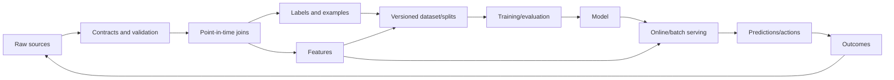

# Part 4 — Data Preparation and Feature Engineering

## Goal

Turn messy observations into a trustworthy, reproducible, point-in-time-correct
training and serving dataset. In practical ML, data/label mistakes usually cause
larger failures than choosing a slightly weaker algorithm.

## Chapters

| Order | Chapter |
|---:|---|
| 1 | [Data lifecycle, EDA, quality, and labels](01-data-lifecycle-and-eda.md) |
| 2 | [Preprocessing, missingness, outliers, and imbalance](02-preprocessing.md) |
| 3 | [Feature engineering by data type](03-feature-engineering.md) |
| 4 | [Leakage-safe pipelines, feature stores, lineage, and governance](04-pipelines-and-governance.md) |
| 5 | [Interview workbook and capstone](05-interview-workbook.md) |

## Beginner-to-advanced lens

- Beginner: understand what each row/column means and why each transformation is
  applied.
- Practitioner: implement transformations inside train-only pipelines and audit
  time/group leakage.
- Advanced: design data contracts, label quality, backfills, feature freshness,
  offline/online parity, privacy, and multi-team ownership.

## Data system map

## Exit criteria

- write a data card and define dataset grain/timestamps;
- distinguish measurement, selection, label, and preprocessing failure;
- choose transformations based on model and distribution;
- engineer temporal/categorical/text/image features without leakage;
- handle imbalance through evaluation, learning, and policy—not one trick;
- build reusable train/serve transformations with lineage and parity tests.

