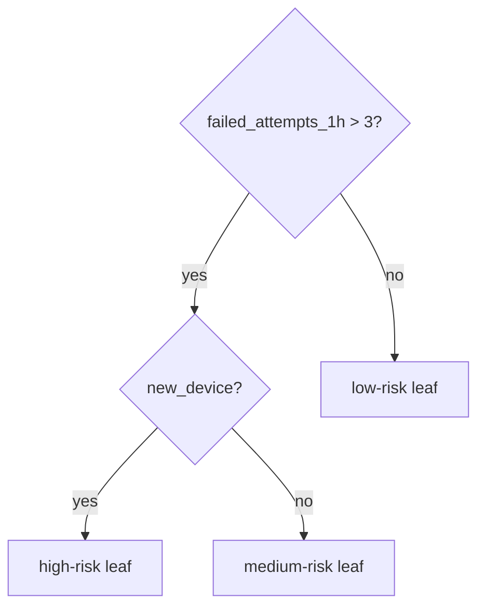

# Chapter 3 — Trees, Bagging, Random Forests, and Boosting

## 1. Decision-tree model

A tree recursively partitions feature space with questions such as
`age < 30?`, then predicts a constant/distribution in each leaf.

Trees naturally model nonlinear thresholds and interactions, need little numeric
scaling, and are readable when shallow. Deep trees are high-variance and not
globally simple.

## 2. Recursive splitting

At node dataset S, consider feature/threshold split into SL, SR.
Choose maximum impurity reduction:

> gain = I(S)
> − (|SL|/|S|)I(SL)
> − (|SR|/|S|)I(SR)

Greedy splitting finds locally best choice; globally optimal tree construction is
hard. Candidate thresholds for sorted numeric feature often lie between distinct
values.

## 3. Classification impurity

For class proportions p₁, …, pK:

### Gini

> Gini = 1 − Σ pk²

Zero for pure node. Interpretable as probability of mismatch under random labels
from node distribution.

### Entropy

> Entropy = −Σ pklog pk

Information gain uses entropy reduction. Gini and entropy often choose similar
splits; Gini is slightly cheaper. Log base scales values, not ranking.

### Misclassification error

> 1 − max pk

Less sensitive for growing trees, more useful as an evaluation concept.

## 4. Regression splitting

Leaf prediction under squared loss is mean. Node impurity can be variance/SSE:

> SSE(S) = Σi in S(yi − ȳS)²

Choose split reducing total child SSE. Under absolute loss, median leaf and
absolute deviation can be used.

Trees produce piecewise constant predictions and cannot naturally extrapolate
beyond observed leaf target range.

## 5. Stopping and pruning

Pre-pruning controls:

- maximum depth;
- minimum samples per split/leaf;
- maximum leaves;
- minimum impurity decrease;
- class/sample weights.

Post-pruning cost-complexity:

> Rα(T) = R(T) + α|leaves(T)|

Grow then prune subtree using validation/CV. Larger α favors smaller tree.

Tiny leaves memorize noise and produce extreme uncalibrated probabilities. Minimum
leaf support is often more important than max depth alone.

## 6. Categorical and missing values

Implementation choices:

- one-hot/ordinal preprocessing;
- native category subset/order splits;
- missing sent one direction, learned default, or separate indicator;
- surrogate splits.

Arbitrary ordinal encoding can impose nonexistent order. High-cardinality categories
offer many split opportunities and overfit. Modern boosting libraries use specialized
methods—understand leakage control, especially target statistics.

## 7. Tree strengths and weaknesses

Strengths:

- nonlinear interactions;
- mixed feature scales;
- minimal scaling;
- fast prediction when bounded depth;
- local rules and missing support in some implementations.

Weaknesses:

- unstable: small data change can alter top split;
- axis-aligned boundaries can approximate diagonal/smooth boundaries inefficiently;
- deep overfit/high variance;
- biased impurity importance;
- piecewise constant/non-smooth;
- poor extrapolation;
- probabilities from small leaves poorly calibrated.

## 8. Bagging

Bootstrap aggregating:

1. draw B bootstrap samples;
2. fit high-variance learner to each;
3. average regression predictions or class probabilities/votes.

> f̂bag(x) = (1/B)Σ f̂b(x)

Averaging reduces variance if errors are not perfectly correlated. For B models
with equal error variance σ² and pairwise correlation ρ, ensemble average variance
roughly:

> ρσ² + [(1 − ρ)/B]σ²

Increasing B removes only uncorrelated component; diversity matters.

### Bootstrap facts

Probability a particular row is omitted from an n-size bootstrap sample:

> (1 − 1/n)ⁿ → e⁻¹ ≈ 36.8%

So about 63.2% unique rows appear on average; omitted rows are out-of-bag for that
tree.

## 9. Random forest

Adds random feature subset at each split to bagged trees. This decorrelates trees,
often lowering ensemble variance even if individual trees are slightly weaker.

Key hyperparameters:

- number of trees;
- max features per split;
- depth/leaves/min leaf;
- bootstrap/subsample;
- class/sample weights;
- split criterion.

### Out-of-bag (OOB) evaluation

For each training example, aggregate only trees whose bootstrap omitted it. Gives
a useful internal estimate without separate validation, but hyperparameter search
can overfit OOB and temporal/group structure can invalidate ordinary bootstrap.

### Extra Trees

Extremely randomized trees choose thresholds/features more randomly, increasing
bias but reducing variance/training cost. Compare empirically.

## 10. Feature importance in forests

### Mean decrease in impurity

Sum weighted split gains. Biased toward continuous/high-cardinality features and
correlated choices; training-derived.

### Permutation importance

Shuffle feature on held-out data and measure performance drop. Correlated
substitutes can mask importance; unrealistic independent shuffling breaks feature
relationships. Group/conditional permutation may help.

Neither is causal. Report stability and feature family ablations.

## 11. Boosting idea

Build learners sequentially so each corrects current ensemble.

> FM(x) = F₀(x) + Σm=1M η fm(x)

η is shrinkage/learning rate. Unlike bagging’s independent parallel learners,
boosting is sequential and primarily reduces bias while regularization controls
variance.

## 12. AdaBoost

For binary labels ±1:

1. start equal sample weights;
2. fit weak classifier;
3. give more weight to misclassified examples;
4. weight learner by accuracy;
5. combine weighted votes.

Equivalent to minimizing exponential loss in a functional view.

Strength: turns weak stumps into strong boundary. Weakness: noisy labels/outliers
can receive escalating weight. Gradient boosting generalizes to arbitrary
differentiable losses.

## 13. Gradient boosting

We optimize loss over function F. At iteration m:

1. compute pseudo-residuals/negative gradients:

> rim = −[∂L(yi, F(xi))/∂F(xi)] at current F

2. fit small tree fm to r;
3. choose leaf/step values;
4. update F ← F + ηfm.

For squared error, negative gradient is proportional to ordinary residual y − F.
For logistic loss it relates to target minus predicted probability.

## 14. Regularizing boosted trees

- learning rate η and number of trees trade off;
- shallow depth/leaves control interactions;
- minimum leaf samples/weight;
- row subsampling (stochastic boosting);
- column subsampling;
- L1/L2 leaf penalties;
- minimum split gain;
- early stopping on validation;
- monotonic constraints;
- class weights/custom objectives.

Small learning rate usually needs more trees. Tune jointly. Early stopping iteration
is selected on validation; refit carefully without using test.

## 15. XGBoost-style second-order view

Approximate objective using gradient gi and Hessian hi for each
example. For leaf with examples I and L2 penalty λ, optimal leaf weight resembles:

> w* = −Σi∈Igi / (Σi∈Ihi + λ)

Split gain compares child versus parent gradient/Hessian scores minus complexity
penalty. This enables efficient regularized boosting for many losses.

## 16. XGBoost, LightGBM, CatBoost concepts

### XGBoost

Regularized second-order tree boosting, sparse/missing handling, column/row
sampling, histogram/exact algorithms, broad ecosystem.

### LightGBM

Histogram-based, leaf-wise growth (often) and efficient large-data/categorical
support. Leaf-wise can overfit small data unless leaf/depth constraints. Techniques
like gradient-based sampling/bundling are implementation concepts.

### CatBoost

Ordered target statistics and boosting designed to reduce categorical target
leakage/prediction shift, strong categorical support. Understand ordered data
construction rather than assuming any category flag is leak-proof.

Exact features/defaults change by version; consult chosen library docs during
implementation.

## 17. Histogram-based tree building

Bin numeric values, accumulate gradient/label statistics per bin, search bin
boundaries. Faster and memory efficient, with quantization approximation. Bin
construction must be training-derived/versioned; distributed algorithms must merge
statistics and handle skew.

## 18. Class imbalance and custom costs

- class/sample weights change objective;
- sampling changes distribution and calibration;
- threshold handles decision cost separately;
- amount/value-weighted losses reflect business magnitude;
- custom differentiable objectives/metrics may be used carefully.

Do not set both aggressive weights and sampling mechanically. Evaluate real
prevalence, calibration, and operating point.

## 19. Probability calibration

Random forests/boosted scores may be uncalibrated due to leaf averaging, bagging,
loss, class weights, and sampling. Use held-out calibration (sigmoid/isotonic) and
evaluate reliability/Brier/log loss. Calibrate after hyperparameter selection with
proper data partition/CV.

## 20. Choosing tree family

| Need | Candidate |
|---|---|
| interpretable compact rules | shallow/pruned tree |
| robust tabular baseline, low tuning | random forest/Extra Trees |
| top tabular predictive quality | gradient-boosted trees |
| categorical-heavy data | CatBoost-style or careful encoding + boosting |
| huge sparse linear text | linear model often better |
| extrapolation | trees poor; add structure/model |
| strict monotonic domain relation | constrained boosting/GLM |

## 21. Complexity and systems

Training costs depend on implementation, bins, depth, features, samples, workers.
Serving per tree roughly O(depth); ensemble O(number of evaluated nodes/trees).

Production considerations:

- model size/cache locality;
- batch vectorization;
- missing/category behavior;
- library/runtime compatibility;
- CPU tail latency;
- explanation cost;
- feature lookup often dominates;
- compress/prune/distill only after quality gates.

## 22. Failure diagnosis

| Symptom | Likely checks |
|---|---|
| train near perfect, validation poor | depth/leaves/min leaf, leakage, duplicates, regularization |
| gain from ID feature | entity overlap/cold start, target encoding, memorization |
| validation strong, temporal weak | stale aggregates, policy era, shift |
| probabilities extreme | small leaves, weighting/sampling, calibration |
| boosting stops improving | learning rate, capacity, labels/features, loss, early stopping |
| one feature dominates | leakage, unit/range, split opportunities, shortcut |
| inference too slow | trees/depth, feature cost, runtime, batching, cascade |

## 23. Exercises

1. Calculate Gini/entropy gain for a small split.
2. Implement a depth-2 CART classifier from scratch.
3. Demonstrate tree instability with bootstrap samples.
4. Compare bagging correlation and ensemble variance empirically.
5. Derive squared-loss gradient boosting residuals.
6. Tune RF and boosting with learning curves, calibration, latency, and slices.

