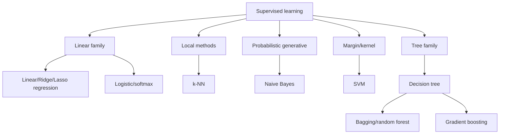

# Part 5 — Classical Supervised Learning

## Goal

Understand each major model family deeply enough to:

- derive its objective or decision rule;
- implement a small correct version;
- know assumptions and inductive bias;
- tune and diagnose it without test leakage;
- compare quality, calibration, latency, interpretability, and maintenance;
- explain trade-offs at SDE-II/SDE-III interviews.

## Chapters

| Order | Chapter |
|---:|---|
| 1 | [Linear regression and regularization](01-linear-regression.md) |
| 2 | [Classification: logistic regression, Naive Bayes, k-NN, and SVM](02-classification-models.md) |
| 3 | [Decision trees, bagging, random forests, and boosting](03-trees-and-ensembles.md) |
| 4 | [Model selection, tuning, calibration, and explainability](04-selection-calibration-explainability.md) |
| 5 | [Interview workbook, from-scratch builds, and capstone](05-interview-workbook.md) |

## Model map

## Recommended order of implementation

1. mean/majority baseline;
2. linear regression closed form + gradient descent;
3. logistic regression;
4. k-NN;
5. decision tree stump then recursive tree;
6. bagging/random forest;
7. small gradient boosting implementation.

## Exit criteria

You can select a baseline/model using dataset size, dimensionality, sparsity,
nonlinearity, interpretability, training/serving constraints, and calibration;
derive core objectives; build leakage-safe CV; and diagnose errors/learning curves.

