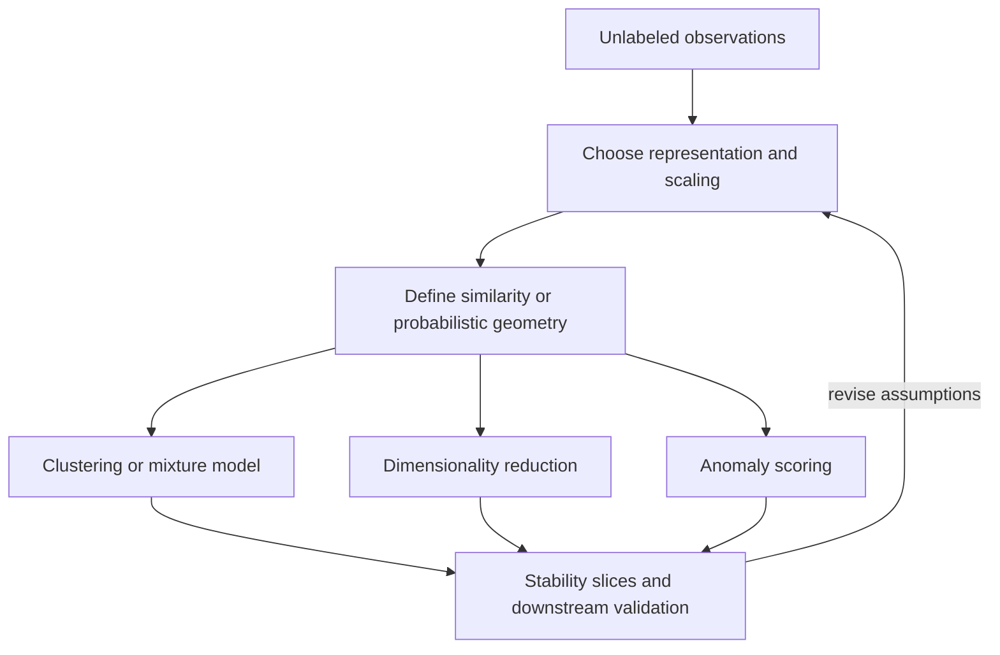

# Part 6 — Unsupervised and Representation Learning

## Goal

Learn structure without ordinary target labels while remaining honest about
subjective objectives, geometry, stability, and evaluation.

## Chapters

| Order | Chapter |
|---:|---|
| 1 | [Distance, similarity, and high-dimensional geometry](01-distance-and-geometry.md) |
| 2 | [Clustering and mixture models](02-clustering.md) |
| 3 | [Dimensionality reduction and visualization](03-dimensionality-reduction.md) |
| 4 | [Anomaly detection and matrix factorization](04-anomaly-and-factorization.md) |
| 5 | [Interview workbook and capstone](05-interview-workbook.md) |

## Central caution

A clustering is an algorithm's partition under a representation, distance,
hyperparameters, and sample. It is not proof of natural human categories. A 2D
embedding is a visualization with distortions, not the original geometry.

## Exit criteria

- choose/normalize distance based on data semantics;
- compare k-means, hierarchical, density-based, spectral, and mixture methods;
- evaluate stability and downstream usefulness without labels;
- explain PCA, t-SNE, UMAP, autoencoders, and their visualization traps;
- design anomaly evaluation with rare/delayed labels;
- derive matrix factorization objective and cold-start limits.
