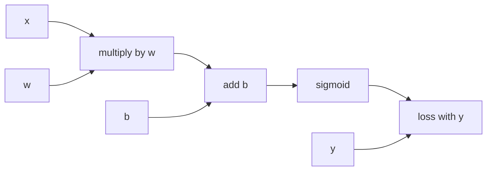

# Chapter 1 — Neural Networks and Backpropagation

## 1. From linear model to multilayer network

One dense layer:

> z = Wx + b  
> a = φ(z)

For batch X shape (B, din) and W shape (dout, din):

> Z = XWᵀ + b, shape (B, dout)

An L-layer multilayer perceptron (MLP):

> a⁰ = x  
> zˡ = Wˡaˡ⁻¹ + bˡ  
> aˡ = φˡ(zˡ)

Without nonlinear φ, composition of linear/affine layers collapses to one affine
transformation. Nonlinearity creates expressive decision surfaces.

## 2. Neuron intuition and limits

A neuron computes weighted evidence plus bias, then activation. Do not interpret
ordinary hidden neurons as human concepts automatically. Representations are
distributed and basis-dependent; individual activation correlation is not causal
semantic proof.

Universal approximation results say sufficiently wide networks can approximate
continuous functions under conditions. They do not guarantee learnability,
efficient size, optimization, generalization, or safety.

## 3. Activations

### Sigmoid

> σ(z) = 1/(1 + e⁻ᶻ)  
> σ′(z) = σ(z)(1 − σ(z))

Good for binary/multilabel output probabilities. Hidden-layer problems: saturates,
gradient ≤ 0.25, non-zero-centered.

### tanh

Range (−1,1), zero-centered, but saturates. Used in recurrent gates/state.

### ReLU

> max(0, z)

Cheap, nonsaturating positive side, sparse activation. Dead ReLU when inputs stay
negative and gradient zero.

### Leaky/PReLU

Small learned/fixed negative slope reduces dead units, changes invariance.

### GELU/SiLU

Smooth gating-like activations common in transformers/modern nets. Slight compute
cost; selection often architecture-established and empirical.

### Softmax/output

Mutually exclusive K-class probabilities. Subtract max logit for stability. Use
framework cross-entropy from logits.

## 4. Losses

Match output/task:

- regression: MSE/MAE/Huber/quantile/distributional NLL;
- binary/multilabel: sigmoid binary cross-entropy per label;
- multiclass: softmax cross-entropy;
- ranking: pairwise/listwise losses;
- metric learning: contrastive/triplet/InfoNCE-like;
- sequence: token cross-entropy with masks;
- segmentation: pixel CE/Dice/focal combinations.

Loss reduction matters: mean per token/example versus sum changes gradient scale
with batch/sequence length. Mask padding correctly and define class weights.

## 5. Computational graph

For ŷ = σ(w x + b), L = BCE(y, ŷ):

Forward computes values. Backward computes local derivatives and combines via
chain rule. Shared values accumulate gradient contributions.

## 6. Reverse-mode backpropagation

If scalar L depends on intermediate z and parameter θ:

> dL/dθ = (dL/dz)(dz/dθ)

For a node feeding multiple paths, derivatives add.

Reverse algorithm:

1. topologically execute forward and store required intermediates;
2. seed dL/dL = 1;
3. traverse graph reverse topological order;
4. multiply upstream gradient by local Jacobian;
5. sum into each parent gradient.

Time is usually comparable constant factor of forward; memory stores activations.

## 7. Dense layer backward

Batch convention:

> Z = XWᵀ + b

Shapes:

- X: B × din
- W: dout × din
- Z and upstream G = ∂L/∂Z: B × dout

Gradients:

> ∂L/∂X = GW  
> ∂L/∂W = GᵀX  
> ∂L/∂b = row-sum of G

If loss mean over batch, upstream G already contains 1/B depending implementation.
Shape-check every gradient.

## 8. Activation backward

Elementwise A = φ(Z):

> ∂L/∂Z = (∂L/∂A) ⊙ φ′(Z)

For ReLU, mask Z > 0. In-place ReLU can destroy Z needed for backward unless
autograd/framework manages saved mask/version.

## 9. Softmax cross-entropy gradient

For one-hot y and probability p:

> ∂L/∂z = p − y

This compact derivative comes from softmax Jacobian plus CE. Do not explicitly
form K × K Jacobian; fused kernels are stable/efficient.

For label smoothing ε, target becomes mixture with uniform (definition varies),
so gradient p − ysmooth. It regularizes confidence but changes calibration
and target semantics.

## 10. Parameters, state, and modes

Trainable parameters: weights/biases/norm affine values.

Non-trainable state: BatchNorm running statistics, vocabulary, masks/config.

Training/evaluation modes change dropout and BatchNorm. Forgetting `eval()` makes
evaluation stochastic/mismatched; forgetting `train()` after validation disables
training behavior.

## 11. Parameter sharing

Same parameter used multiple times accumulates gradients. Examples:

- convolution kernel across spatial locations;
- recurrent cell across time;
- tied input/output embeddings;
- Siamese encoder branches.

Sharing encodes invariance, reduces parameters, and couples learning.

## 12. Initialization symmetry

If all hidden weights initialized identically, units receive identical gradients
and remain identical. Random initialization breaks symmetry. Biases can often start
zero because random incoming weights already differentiate units.

Initialization scale must preserve forward activation and backward gradient
variance across depth.

## 13. Vanishing and exploding gradients

Backprop multiplies Jacobians across layers/time. If typical singular values/
derivatives < 1, gradients vanish; > 1, explode.

Consequences:

- early layers learn slowly;
- unstable loss/NaNs;
- long-range RNN dependence fails;
- optimization sensitive to depth.

Mitigations:

- Xavier/He initialization;
- ReLU-like/non-saturating activations;
- normalization;
- residual connections;
- gated recurrence;
- gradient clipping;
- learning-rate control;
- shorter paths/architecture.

## 14. Residual connections

> y = F(x) + x

Gradient includes identity path:

> ∂y/∂x = ∂F/∂x + I

This improves gradient/information flow and lets layers learn residual changes.
Shapes must match or projection used. Residuals do not guarantee stability without
normalization/scaling.

## 15. Autograd pitfalls

- detaching tensor/using non-autograd operations;
- converting to Python/NumPy in graph;
- in-place mutation of saved values;
- forgetting zero gradients (frameworks accumulate by default);
- backward through freed graph repeatedly;
- retaining graph unnecessarily and leaking memory;
- non-scalar backward without upstream vector;
- missing mask causing padding gradient;
- parameters not registered in module/container;
- gradient computed but optimizer references different parameter object.

## 16. Gradient checking

Central difference per parameter:

> numeric ≈ [L(θ + h) − L(θ − h)]/(2h)

Relative difference:

> |analytic − numeric| / max(1, |analytic|, |numeric|)

Use tiny deterministic network, float64, no dropout/BatchNorm update, moderate h,
and avoid nondifferentiable points. Check random coordinates/directional derivative
for large parameter arrays.

## 17. Tiny autograd design exercise

Implement scalar `Value` containing:

- numeric data;
- gradient;
- parents;
- operation/local backward closure;
- topological backward.

Then implement +, ×, power, exp, tanh/ReLU and train a 2-layer MLP on XOR. Tests:
finite differences, shared-node accumulation, repeated backward policy, zeroing.

## 18. Exercises

1. Derive dense-layer gradients with dimensions.
2. Derive sigmoid + BCE simplification.
3. Draw graph for two-layer MLP and backprop one example numerically.
4. Show why identical initialization preserves symmetry.
5. Build tiny autograd and gradient-check it.

