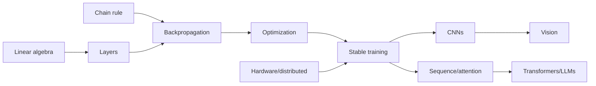

# Part 7 — Deep Learning Foundations

## Goal

Understand neural networks from scalar derivatives to production training:
architecture, initialization, optimization, regularization, convolution, sequence
models, attention, embeddings, hardware, and distributed execution.

## Chapters

| Order | Chapter |
|---:|---|
| 1 | [Neural networks and backpropagation](01-neural-networks-and-backprop.md) |
| 2 | [Training, initialization, normalization, and regularization](02-training-neural-networks.md) |
| 3 | [Convolutional neural networks](03-cnns.md) |
| 4 | [Sequence models, attention, and representation learning](04-sequences-attention-embeddings.md) |
| 5 | [PyTorch, hardware, and distributed training](05-pytorch-and-systems.md) |
| 6 | [Interview workbook and capstone](06-interview-workbook.md) |

## Dependency picture

## Exit criteria

- derive dense-layer/backprop gradients and explain computational graphs;
- choose activation, initialization, normalization, optimizer, and regularization;
- diagnose vanishing/exploding/NaN/overfit/throughput issues;
- calculate convolution shapes/receptive fields;
- explain RNN/LSTM/attention and embeddings;
- write a correct mixed-precision training loop with checkpoints and evaluation;
- reason about data/model parallelism and bottlenecks.

## Advanced continuation

Parts [15](../part-15-accelerators-kernels/README.md),
[17](../part-17-architectures-scaling/README.md), and
[18](../part-18-training-distributed/README.md) deepen accelerator
kernels, modern architectures, low-precision optimization, distributed parallelism,
fault-tolerant checkpointing, and foundation-model training.
