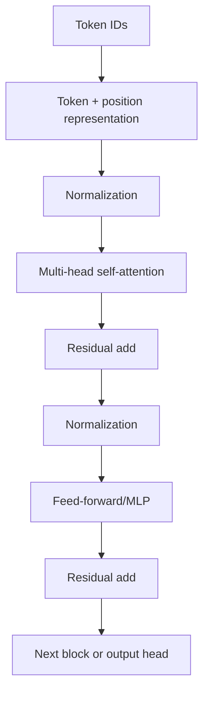

# Chapter 2 — Transformer Architecture

## 1. Transformer block overview

Pre-norm shown. Encoder, decoder, and architecture variants differ.

## 2. Input representations

Token embedding E[token] shape dmodel. Add/compose position and possibly
segment/type embeddings. Scale conventions vary.

Embedding matrix often tied to output projection, saving parameters and coupling
input/output geometry. Vocabulary logits:

> logits = hEᵀ + b (when tied)

## 3. Self-attention dimensions

Input X shape (B, L, dmodel).

> Q = XWQ, K = XWK, V = XWV

Per h heads with dhead usually dmodel/h:

- Q,K,V shape (B,h,L,dhead);
- scores QKᵀ shape (B,h,L,L);
- softmax over key length;
- weighted V → (B,h,L,dhead);
- concatenate and output projection.

> Attention = softmax((QKᵀ/√dhead) + mask)V

## 4. Masks

### Padding

Padded key positions receive −∞-like additive mask before softmax. Query padding
outputs also excluded from loss/possibly zeroed.

### Causal

Position t attends only ≤t. Correct combination with padding and cache offset is
critical.

### Numerical

Use dtype-safe large negative/masked softmax. A row with no valid keys produces
undefined normalization/NaN; ensure sentinel or skip.

## 5. Multi-head attention

Multiple subspaces can attend to different patterns. Parameter count of standard
QKV+output roughly 4dmodel² (ignoring biases), independent of head count
when total dimension fixed.

More heads does not necessarily increase parameter count/capability; too-small head
dimension hurts. Attention weights are not guaranteed faithful explanation.

## 6. Feed-forward network

Applied independently to each token:

> FFN(x) = W₂ φ(W₁x + b₁) + b₂

Expansion dimension often ~4× model (varies). Gated variants (GLU/SwiGLU) combine
two projections elementwise and are common.

Attention mixes tokens; FFN transforms channels/features per token. FFN parameters
often large share.

## 7. Layer normalization and residuals

Pre-norm block:

> x ← x + Attention(LN(x))  
> x ← x + FFN(LN(x))

Post-norm applies LN after add. Pre-norm improves deep gradient path; variants use
RMSNorm, residual scaling, parallel blocks.

## 8. Positional encodings

### Sinusoidal

Alternating sin/cos frequencies; no learned parameters and relative offsets can be
represented linearly. Extrapolation still depends on training.

### Learned absolute

Table per position up to maximum; flexible but extension needs interpolation/new
training.

### Relative position bias

Attention score adds learned/function of query-key distance; often bucketed.

### Rotary (RoPE)

Rotates Q/K components by position-dependent angles so dot product encodes relative
offset. Context extension techniques rescale/interpolate frequencies with trade-offs.

## 9. Encoder, decoder, encoder–decoder

- Encoder-only: bidirectional self-attention, representations/classification/
  retrieval (BERT-style masked objectives).
- Decoder-only: causal self-attention, autoregressive generation (GPT-style).
- Encoder–decoder: encoder bidirectional source, decoder causal with cross-attention
  (T5/translation-style).

Use is not exclusive; decoder models can embed/classify, but architecture/objective
efficiency differs.

## 10. Training objectives

### Causal language modeling

> L = −Σt log P(xt ∣ x&lt;t)

Input shifted so each position predicts next token. Mask prevents future leakage.

### Masked language modeling

Corrupt selected tokens and predict originals using bidirectional context. Train-
inference `[MASK]` mismatch addressed by corruption mix.

### Denoising/span corruption

Corrupt spans and reconstruct, useful encoder–decoder pretraining.

### Contrastive

Align text pairs or text-image, using negatives. Batch composition/temperature.

## 11. Context length and complexity

Per layer approximate:

- projections/FFN: O(Ld²);
- attention scores/value mix: O(L²d);
- attention memory O(L²) naïvely.

Which dominates depends L/d. FlashAttention-like exact algorithms reduce memory
traffic/materialization, not fundamental all-pairs arithmetic.

Long context failure modes:

- quadratic cost/latency;
- position extrapolation;
- “lost in middle” retrieval/use;
- distractors and prompt injection;
- KV cache memory;
- evaluation contamination.

## 12. KV cache

Autoregressive inference reuses prior keys/values per layer instead of recomputing.
At each new token query attends cached K,V plus new.

Approximate cache elements:

> 2 · layers · sequence · KV_heads · head_dim

times bytes and batch. Multi-query attention (one KV head) or grouped-query
attention (fewer KV heads) reduces cache/bandwidth while retaining query heads.

Cache must track position, mask, tenant/request, model version; never leak across
requests.

## 13. Parameter and compute accounting

Dense layer parameters input×output. Embedding vocab×d. Transformer layer roughly:

- attention projections ~4d² for MHA;
- FFN ~2d·dff (or more gated);
- norms/bias small.

Training compute includes forward + backward + optimizer; inference prefilling
processes prompt in parallel, decoding is sequential and often memory-bandwidth/KV
bound.

## 14. Architecture variants

- sparse/local attention;
- encoder sharing/parameter tying;
- Mixture of Experts: route tokens to subset FFNs, more parameters with bounded
  per-token compute; load balance/all-to-all complexity;
- retrieval memory;
- state-space/recurrent/convolutional sequence models;
- multimodal adapters/cross-attention.

Evaluate under task, context, throughput, memory, deployment—not benchmark name.

## 15. Exercises

1. Annotate every tensor shape in multi-head attention.
2. Calculate parameter count and attention memory for a toy transformer.
3. Build causal + padding mask and test no future influence.
4. Explain prefill versus decode bottleneck and KV cache.
5. Compare encoder/decoder/encoder–decoder for five tasks.

