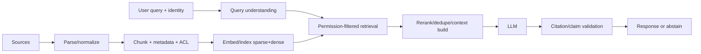

# Chapter 4 — Retrieval-Augmented Generation (RAG)

## 1. What RAG solves—and does not

RAG retrieves external evidence and includes it in model context.

Good for:

- changing/private/domain facts;
- source attribution;
- permission-aware knowledge access;
- reducing context to relevant passages.

Does not guarantee:

- retrieval finds answer;
- model uses evidence correctly;
- source is true/current;
- citations support claims;
- prompt injection is harmless;
- no hallucination;
- access control.

## 2. Architecture



## 3. Ingestion

For each source:

- connector authentication and scope;
- stable document/version ID;
- permissions/tenant/owner;
- created/updated/effective timestamps;
- parser and structure (title/headings/tables/code);
- deletion/tombstone;
- language and content type;
- trust/authority;
- checksum/dedup;
- indexing status/error.

Preserve link from chunk to exact source version. Parser errors are retrieval
errors; inspect text extraction for PDFs, tables, OCR, code, and slides.

## 4. Chunking

Trade-off:

- small chunks: precise retrieval, missing context/references;
- large: more context, diluted embeddings, token cost/distractors.

Strategies:

- fixed tokens with overlap;
- sentence/paragraph;
- heading/semantic structure;
- code function/class;
- table row plus headers;
- parent-child: retrieve small, expand parent;
- proposition/summary indexes with source link.

Overlap can produce duplicate results and inflated recall. Evaluate chunk size,
overlap, boundary answer coverage, retrieval and end answer jointly.

## 5. Sparse retrieval

Inverted index maps term to documents. BM25-like scoring combines term frequency,
inverse document frequency, and length normalization:

> score(q,d) = Σ<sub>t∈q</sub> IDF(t) ·
> [tf(t,d)(k₁+1)]/[tf(t,d)+k₁(1−b+b·|d|/avgdl)]

Exact formulas vary. Strengths: exact identifiers, rare terms, interpretable, fast.
Weaknesses: vocabulary mismatch/semantic paraphrase.

## 6. Dense retrieval

Embed query q and document chunk d; similarity dot/cosine. Train bi-encoder with
positive/negative pairs.

Strengths: semantic paraphrase, multilingual/domain if model supports. Weaknesses:
exact numbers/names, embedding drift, false semantic matches, ANN approximation,
dimension/storage.

Normalize if cosine desired. Version encoder and rebuild/index compatibility.

## 7. Hybrid retrieval and fusion

Combine sparse and dense candidate sets. Scores are not directly comparable.

Reciprocal rank fusion:

> RRF(d) = Σ<sub>retrievers r</sub> 1/(k + rank<sub>r</sub>(d))

Robust to score scales. Alternatively normalize/learn fusion using labels. Apply
ACL before or safely during retrieval—not after untrusted private chunks reach
model/logs.

## 8. Reranking

Cross-encoder scores query–document jointly; more accurate, expensive. Pipeline:

```text
retrieve 100–1000 cheaply -> rerank top 20–100 -> send top evidence to LLM
```

Tune candidate K/rerank N/context budget. Reranker can miss if retriever recall
failed. Batch/cache with permissions/version-aware keys.

## 9. Query understanding

- normalization/spell/identifier recognition;
- intent/routing;
- conversational standalone rewrite;
- decomposition into subqueries;
- multi-query expansion;
- hypothetical document embedding;
- filters (time/product/language/source).

Rewriting can change meaning or drop constraints. Retain original, validate entity/
permission, evaluate rewrite failures. User prompt is untrusted.

## 10. Metadata filters and permissions

Metadata examples: tenant, ACL principals/groups, document type, product, language,
effective dates, region, trust.

Authorization must be enforced by trusted system with current identity and document
permissions. Avoid relying on LLM to obey “do not reveal.” Search engine/vector DB
filter behavior, stale group membership, caches, shared indexes, deleted docs, and
logs all belong to threat model.

## 11. Context construction

- deduplicate/cluster near chunks;
- diversify sources;
- order by relevance/structure/time;
- include title/source/version/section;
- delimit and label untrusted evidence;
- allocate token budget;
- preserve question/instructions;
- compress/summarize carefully;
- include no-answer instruction and citation format.

Retrieved text is **data**, not trusted instruction. System prompts cannot fully
neutralize injection; architecture must restrict tools/secrets/data.

## 12. Citations and grounding

A citation is valid when source passage supports adjacent claim, accessible to
user, correct version, and not contradicted.

Possible pipeline:

1. generate claim with chunk IDs constrained/structured;
2. map IDs to source spans;
3. validate entailment/quote presence with deterministic and model checks;
4. remove/flag unsupported claim or abstain;
5. render links after authorization.

Citation presence rate is not citation correctness.

## 13. RAG evaluation decomposition

### Corpus/ingestion

- source coverage/freshness;
- parse success and structural accuracy;
- ACL/deletion correctness;
- index lag.

### Retrieval

- answer-bearing chunk recall@K;
- MRR/NDCG/precision@K;
- per source/language/query type;
- exact ID/name queries;
- latency and ANN recall.

### Reranking/context

- relevant context precision;
- answer coverage within token budget;
- redundancy/diversity;
- lost-in-middle tests;
- malicious chunk handling.

### Generation

- task success;
- claim-level groundedness/citation support;
- correctness/completeness/relevance;
- correct abstention versus over-refusal;
- safety/security;
- latency/tokens/cost.

End-to-end accuracy alone cannot locate failure. Log trace with permissions-safe
query, candidate IDs/scores, selected context IDs, model/prompt versions, claims.

## 14. Golden evaluation set

For each query:

- user/tenant/permission context;
- expected answer or rubric;
- acceptable sources/chunks and versions;
- required citations;
- unanswerable flag;
- query category/difficulty/language;
- injection/safety expectation;
- freshness timestamp.

Create from real anonymized workflows + expert edge cases + adversarial cases.
Hold out from prompt/chunk/tuning. Refresh as corpus changes while retaining stable
regression slice.

## 15. Common failure diagnosis

| Failure | Likely layer | Fix experiment |
|---|---|---|
| answer doc absent | ingestion/corpus | connector/parser/coverage |
| doc indexed but not top K | retrieval | hybrid, embedding, query, filters |
| retrieved then removed | rerank/context | reranker, K/N, dedupe/budget |
| evidence present, answer wrong | generation | prompt/model/claim validation |
| unsupported citation | citation pipeline | constrained IDs/entailment/abstain |
| private source exposed | authorization architecture | immediate incident; ACL/cache/log fixes |
| stale answer | freshness/version | incremental index/effective-time filters |
| injected tool action | trust boundary | tool permission/input separation/approval |

## 16. Freshness and updates

- change-data capture or scheduled scans;
- content version and effective interval;
- re-chunk/re-embed only changed;
- atomic index alias swap/two-index rollout;
- tombstone deletion quickly;
- reconcile source/index counts;
- cache invalidation;
- monitor index lag and failed docs.

Embedding model upgrade requires dual index or rebuild/migration; query and document
vectors must be compatible.

## 17. Cost and latency

Components: query rewrite, embeddings, sparse/dense search, reranker, document fetch,
prompt tokens, generation, validation.

Optimizations:

- route simple queries to search/template;
- cache public/stable embeddings/results with safe keys;
- batch embedding/reranking;
- reduce candidate/context after recall studies;
- parallel independent retrieval;
- timeouts/fallback;
- smaller model/reranker;
- precompute document metadata/summaries.

Preserve quality/security; cached ACL result must account for permission changes.

## 18. Exercises

1. Build sparse baseline and dense/hybrid retriever; measure recall@K.
2. Sweep chunk size/overlap with answer-boundary dataset.
3. Add cross-encoder rerank and quantify incremental latency/quality.
4. Build claim-citation evaluation.
5. Red-team ACL, deletion, prompt injection, and cache isolation.

