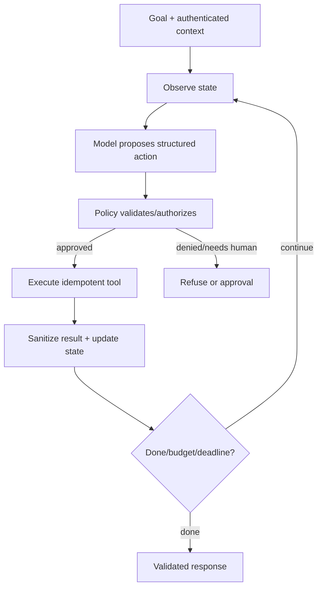

# Chapter 5 — Tool Use, Agents, and Workflow Engineering

## 1. Agent versus workflow

- Workflow: developer-defined sequence/branches.
- Agent: model chooses some next actions/tools/state transitions dynamically.

Use workflow when steps/rules known; agentic choice when task paths vary and can be
evaluated/contained. More autonomy increases nondeterminism, cost, latency, and
attack surface.

## 2. Agent loop

The model proposes. Trusted code enforces.

## 3. Tool contract

A tool needs:

- narrow name/description;
- typed schema with required fields/enums/ranges;
- authenticated identity propagated;
- authorization independent of model;
- timeout, retryability, idempotency;
- bounded output/pagination;
- error taxonomy;
- audit log/redaction;
- side-effect classification;
- version/owner.

Do not expose a generic shell/SQL/HTTP tool when narrow domain action suffices.

## 4. Structured outputs

JSON schema/grammar constrained decoding improves syntax. Still validate:

- semantic ranges and cross-field invariants;
- resource existence/permission;
- stale IDs;
- business policy;
- prompt injection in fields;
- total size/rate;
- confirmation for consequence.

Parsing success is not correctness.

## 5. Tool descriptions and selection

Models choose based on names/descriptions/examples/context. Make tools distinct;
avoid overlapping “search” variants without routing. Include when not to use and
required permissions. Retrieve relevant tool subset for large catalogs, but tool
retrieval itself must not expose unauthorized capabilities.

## 6. State and memory

Types:

- execution state: current step/results/status;
- conversation context: recent interactions;
- working memory/scratch structured facts;
- long-term user preferences/facts;
- external authoritative system state.

Long-term memory requires consent/purpose, provenance, correction/deletion, expiry,
tenant isolation, and protection from malicious stored instructions. Summaries can
distort facts; retain source link/confidence.

## 7. Planning patterns

- ReAct-like interleave reasoning/action;
- plan then execute;
- router → specialist tools/workflows;
- planner–executor–verifier;
- state machine with model-filled transitions;
- map-reduce parallel subtasks;
- human checkpoints.

Avoid exposing private chain-of-thought. Use concise structured rationale/status
and verifiable artifacts. Planning tokens do not guarantee better reasoning.

## 8. Control and termination

Budgets:

- max steps/tool calls;
- wall-clock deadline;
- token/cost;
- per-tool rate/resource;
- repeated-action/cycle detection;
- maximum side effects.

Termination conditions: success verifier, no-progress, denial, timeout, budget,
human escalation. Save resumable state for long work.

## 9. Idempotency and side effects

Classify tools:

- read-only;
- reversible mutation;
- irreversible/high-impact;
- external communication/financial/legal.

For mutation:

- dry-run/preview;
- idempotency key tied to intended operation;
- optimistic concurrency/version precondition;
- confirm exact target;
- human approval when needed;
- record result/receipt;
- compensation/rollback where possible.

Retries after timeout must determine whether first action succeeded.

## 10. Human approval

Approval UI should show:

- exact proposed action/target;
- relevant diff/amount/recipient;
- why and source evidence;
- uncertainty/risk;
- permissions used;
- alternatives;
- approve/modify/reject.

Do not ask blanket approval for an opaque plan. Approval can expire if state changes.

## 11. Prompt injection architecture

Untrusted sources—user text, web pages, emails, retrieved docs, tool outputs—can
contain instructions. Treat them as data.

Defenses:

- deterministic authorization at tool/resource;
- least-privilege short-lived scoped credentials;
- label/delimit untrusted content;
- separate data from control channels;
- allowlisted tools/domains/actions;
- validate args/results;
- sandbox code/browser;
- redact secrets from model context;
- human approval;
- adversarial tests/monitoring.

Prompt wording alone is not boundary. Injection detection classifier is defense in
depth, not sole control.

## 12. Multi-agent systems

Multiple agents may specialize/review/parallelize, but costs:

- duplicated tokens/latency;
- inconsistent state;
- coordination/deadlock/loops;
- amplified hallucination;
- permission spread;
- harder attribution/debugging.

Use only when task decomposition and evaluation show benefit. Give each minimal
context/tools, explicit contract/budget, shared artifact/state, and final verifier.

## 13. Observability

Trace:

- request/task/tenant IDs;
- model/prompt/tool schema versions;
- sanitized inputs/outputs or hashes/references;
- decisions/tool calls/arguments after redaction;
- authorization/approval;
- latency/tokens/cost/retries;
- state transitions/termination;
- final quality/feedback.

Do not log secrets/sensitive raw content by default. Provide replay fixtures with
safe snapshots because live external state changes.

## 14. Agent evaluation

### Task level

- successful end state;
- correctness/completeness;
- side effects match intent;
- no forbidden action;
- user effort/time/cost.

### Trajectory level

- correct tool/args/order;
- unnecessary calls;
- recovery from tool errors;
- loop/no-progress;
- permission/approval compliance;
- state consistency.

### Reliability

Run multiple trials because stochastic trajectories. Test tool timeouts, malformed
responses, stale state, partial success, injection, denied permissions, duplicate
delivery. Score worst-case/high-impact, not average only.

## 15. Deterministic versus model responsibilities

Keep deterministic:

- authentication/authorization;
- money/resource limits;
- schema/constraints;
- idempotency/dedup;
- workflow invariants;
- secret access;
- final policy enforcement;
- audit retention.

Model suitable for:

- intent interpretation;
- flexible planning within bounds;
- extraction/summarization;
- choosing among allowed tools;
- drafting explanations;
- resolving ambiguous language with confirmation.

## 16. Failure patterns

- model repeatedly calls same tool → cycle/no-progress detector;
- wrong entity with same name → stable IDs/disambiguation/confirmation;
- tool says success but partial → transactional status/receipt/verification;
- stale read then write → version/ETag optimistic concurrency;
- excessive fan-out → budgets/bounded concurrency;
- injected document requests exfiltration → permissions/context isolation;
- confident final after tool error → typed error state/required evidence;
- memory stores malicious/incorrect fact → provenance/approval/expiry.

## 17. Exercises

1. Turn an open-ended support agent into bounded state machine.
2. Design typed refund tool with idempotency and approval thresholds.
3. Threat-model retrieved email prompt injection.
4. Build trajectory eval with fault injection.
5. Compare single workflow, single agent, and multi-agent cost/quality.

