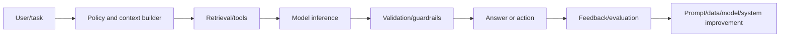

# Part 8 — NLP, Transformers, and LLM Applications

## Goal

Understand language modeling from sparse text baselines to transformer internals
and build evaluated, permission-safe LLM systems rather than demos.

## Chapters

| Order | Chapter |
|---:|---|
| 1 | [Classical NLP, tokenization, and embeddings](01-nlp-foundations.md) |
| 2 | [Transformer architecture](02-transformers.md) |
| 3 | [Pretraining, fine-tuning, alignment, and inference](03-training-and-inference.md) |
| 4 | [Retrieval-augmented generation](04-rag.md) |
| 5 | [Tool use, agents, and workflow engineering](05-agents.md) |
| 6 | [LLM evaluation, safety, and security](06-evaluation-and-safety.md) |
| 7 | [Interview workbook and capstone](07-interview-workbook.md) |

## System view

The base model is one component. Permissions, retrieval quality, structured
validation, fallbacks, evaluation, cost, and observability determine product value.

## Exit criteria

- explain tokenization, embeddings, attention, transformer blocks, training losses;
- reason about context length, KV cache, decoding, batching, quantization;
- choose prompting, RAG, tools, or fine-tuning based on failure evidence;
- design retrieval/chunking/reranking/citation evaluation;
- build agents with deterministic authorization/idempotency/human approval;
- create a representative eval suite and defend against prompt injection/data leak.

## Advanced continuation

For foundation-model roles, continue with:

- [Part 17: modern architectures and scaling](../part-17-architectures-scaling/README.md);
- [Part 19: SFT, PEFT, RLHF, DPO, GRPO, RLAIF, and distillation](../part-19-fine-tuning-post-training/README.md);
- [Part 21: high-performance inference systems](../part-21-inference-systems/README.md); and
- [Part 22: advanced evaluation, safety, security, and interpretability](../part-22-evaluation-safety/README.md).
