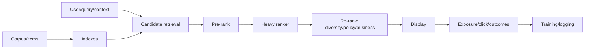

# Track 1 — Recommenders, Search, and Ranking

## 1. Typical multi-stage system

Retrieval maximizes recall under milliseconds over millions/billions. Ranking uses
richer interactions over hundreds. Re-ranking enforces constraints/diversity.

## 2. Problem types

- search: query intent and relevance;
- recommendation: user/context utility without explicit query;
- feed ranking: dynamic content/creators and repeated sessions;
- ads: relevance + value/auction/pacing/policy;
- marketplace: two-sided buyer/seller ecosystem;
- notification: value versus interruption/fatigue.

## 3. Baselines

- global/trending popularity;
- recency;
- category popularity;
- collaborative item–item co-occurrence;
- BM25 sparse retrieval;
- matrix factorization;
- heuristic weighted score.

Popularity is hard to beat and exposes leakage/measurement mistakes.

## 4. Collaborative filtering

User–item matrix factorization:

> score(u,i) = μ + bu + bi + puᵀqi

Implicit feedback needs exposure/confidence/negative sampling. Missing is unknown,
not dislike. Temporal split and new-user/item evaluation.

Item–item similarity based on co-occurrence/cosine; adjust popularity, minimum
support, time decay.

## 5. Two-tower retrieval

User/query encoder f(u), item encoder g(i):

> score = f(u)ᵀg(i)

Precompute item vectors and ANN. Train with sampled softmax/contrastive loss.

Negative sampling options:

- random/popularity;
- in-batch;
- hard retrieved;
- exposed but skipped;
- debiased/importance weighting.

False negatives and sampling distribution shape learned score/calibration. Add
cross-batch memory carefully stale.

## 6. Ranking models

### Pointwise

Predict relevance/click label per item (logistic/regression). Easy, ignores list
competition/order and exposure bias.

### Pairwise

Learn preferred item i over j. RankNet-like logistic:

> L = log(1 + exp(−(si − sj)))

Pair sampling matters and optimizes ordering more directly.

### Listwise

Optimize whole list/list distribution or NDCG surrogate. Better alignment but
complex/bias/compute.

LambdaMART uses boosted trees with gradients weighted by ranking metric change;
strong tabular search baseline.

## 7. Features

- query/user/item embeddings;
- lexical/exact/semantic scores;
- user–item history/affinity;
- freshness/popularity/quality;
- context: time/device/location/session;
- creator/seller reliability;
- cross interactions;
- retrieval source/rank;
- policy/content safety.

All behavior aggregates point-in-time. Upstream rank/exposure creates selection.

## 8. Metrics

- recall@K candidate coverage;
- precision@K, MRR, MAP, NDCG;
- hit rate;
- calibration of click/conversion;
- coverage/catalog/long-tail;
- diversity/novelty/serendipity;
- latency/cost;
- online CTR/conversion/watch but long-term satisfaction/retention and guardrails.

NDCG discounts lower positions and supports graded labels, but gain/discount/cutoff
choices encode values.

## 9. Exposure and position bias

Observed click C depends on examination E and relevance R:

> P(C=1) ≈ P(E=1 ∣ position/context) · P(R=1 ∣ examined,item,user)

Unshown item has no click opportunity. Training on clicks learns old ranker and
position. Approaches:

- randomized swaps/exploration;
- position propensity models/inverse weighting;
- click models;
- counterfactual learning-to-rank;
- interleaving experiments;
- debiased pair construction.

Propensity estimates with tiny probabilities create high variance; clip/analyze.

## 10. Multi-objective ranking

Objectives: relevance, quality, freshness, diversity, creator fairness, revenue,
safety, latency.

Methods:

- weighted score;
- constraints and re-ranking;
- Pareto analysis;
- multi-task model;
- constrained optimization;
- policy/rules for hard safety.

Weighted sum can trade away safety unnoticed. Guardrails/constraints separate.

## 11. Diversity and re-ranking

Maximal marginal relevance concept:

> select item maximizing λ·relevance − (1−λ)·max similarity to selected

Other: category caps, determinantal point processes, submodular objectives,
business/policy constraints. Re-rank must be latency bounded and avoid severe
relevance loss.

## 12. Cold start

- new user: context, onboarding, popularity, exploration;
- new item: content/metadata/creator priors, forced exploration;
- new market: domain transfer/localization;
- sparse history: uncertainty and fallback.

Evaluate cold cohorts separately and avoid historical feature default making them
all identical/unserved.

## 13. Exploration and bandits

Pure exploitation reinforces current winners and lacks counterfactual data.
Bandit methods: ε-greedy, UCB, Thompson sampling, contextual bandits. Constrain
unsafe/low-quality exploration, log action probabilities, monitor user/ecosystem.

## 14. Feedback loops/ecosystem

- popularity concentration/rich-get-richer;
- creator incentives/content homogenization;
- filter bubbles;
- clickbait/short-term proxy;
- inventory/seller effects;
- user fatigue;
- adversarial SEO/spam.

Long-term randomized/holdout, creator/user metrics, exploration and policy needed.

## 15. Serving

- indexes by locale/ACL/availability;
- precomputed item embedding + fresh user tower;
- fanout/ANN with filters;
- feature hydration;
- model scoring batch;
- re-rank;
- cache/fallback popularity;
- logging exposure, position, probability, candidate source, versions.

Budget each stage; candidate recall and feature service often bottlenecks.

## 16. Exercises

1. Build popularity, MF, two-tower, and ranking baselines with temporal split.
2. Evaluate candidate recall and ranking separately.
3. Simulate position bias and inverse propensity variance.
4. Design diversity re-ranker with hard safety constraints.
5. Design feed A/B test with creator ecosystem guardrails.

