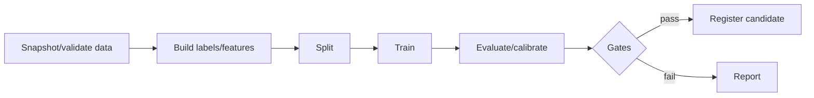

# Chapter 2 — Pipelines, Orchestration, and Continuous Training

## 1. DAG of deterministic tasks

Tasks declare inputs/outputs/resources/retries/timeouts. Avoid hidden shared mutable
paths.

## 2. Idempotency

Rerunning task with same immutable inputs/config should produce same logical output
or safely detect existing. Use run/partition IDs, atomic write then publish,
checksums. Do not append duplicates on retry.

Side effects (registry alias/notifications/deploy) separate and idempotent.

## 3. Caching

Cache task output keyed by complete inputs/code/config. Wrong cache key silently
reuses stale feature/model. Record hit/provenance and allow forced recompute. Do not
cache nondeterministic tasks as deterministic unless seed/state included.

## 4. Retries and failure semantics

Retry transient I/O/worker failure with backoff. Do not retry deterministic bad
schema/config indefinitely. Categorize errors:

- data validation;
- user code;
- resource/OOM;
- dependency transient;
- orchestration;
- quality gate.

Preserve logs/artifacts for diagnosis and clean partial outputs safely.

## 5. Backfills

Parameterize partition/time/entity. Rate-limit, isolate from live, idempotent,
version output. Recompute downstream lineage. Handle late/corrected data and avoid
mixing code versions. Validate sample/aggregate and promote explicitly.

## 6. Scheduling and event triggers

- time schedule;
- data availability event;
- label maturity/volume;
- drift/quality trigger;
- manual approved.

Dependency sensor should verify completeness/version, not just file existence.
Use SLA/deadline and missed-run policy.

## 7. Data validation

At source and stage boundaries:

- schema/type/range/key;
- volume/freshness/partitions;
- distributions/missing/category;
- label prevalence/maturity;
- split overlap/leakage;
- point-in-time;
- reconciliation.

Compare to appropriate season/reference with severity. Quarantine/stop on contract
violations; warn on expected drift. Default coercion can poison model.

## 8. Pipeline testing

- unit transform/model;
- DAG/static config validation;
- small fixture end-to-end;
- idempotency/retry/resume;
- backfill overlap;
- missing partition/schema change;
- deterministic artifact checksum/tolerance;
- staging integration;
- load/scale/cost.

Avoid production-only untested code paths; use same container/entrypoint.

## 9. Resource management

Declare CPU/GPU/memory/storage/network, node affinity, max runtime. Profile and
right-size; OOM retries with same size waste cost. Spot/preemptible workers require
checkpoint/idempotency and expected savings analysis.

Queue fairness/quotas prevent one team/training sweep from starving critical jobs.

## 10. Distributed training orchestration

- gang scheduling/all workers;
- rendezvous/network topology;
- elastic versus fixed;
- per-rank logs/health;
- checkpoint frequency/durability;
- preemption/restart/data sampler state;
- artifact merge/shard;
- NCCL/collective timeout;
- security/isolation.

Detect stragglers and stalled collectives. Retry entire distributed stage often
safer than partial workers unless framework supports elasticity.

## 11. Continuous training (CT)

CT is automated candidate creation/validation, not automatic production overwrite.

Flow:

1. trigger with mature valid data;
2. build immutable dataset;
3. train candidates/baseline;
4. validate offline/safety/operational;
5. compare champion;
6. approval as risk requires;
7. shadow/canary/experiment;
8. promote/rollback;
9. monitor delayed outcome.

## 12. Champion/challenger

Champion current; challengers candidates. Define metric gates, minimum improvement,
non-inferiority guardrails, uncertainty, compute/latency, data window.

The newest model need not win. Registry should preserve rejection reason.

## 13. Pipeline ownership

For each stage: code owner, data owner, on-call, SLA, downstream consumers, runbook,
deprecation. ML scientist may own model logic; platform owns orchestration;
product team owns decision outcome—interfaces explicit.

## 14. Exercises

1. Build idempotent daily training DAG with immutable outputs.
2. Inject schema/OOM/transient/quality failures and verify policy.
3. Plan 2-year backfill without production impact.
4. Design CT gates for high-impact fraud model.
5. Handle preempted distributed training and sharded checkpoint.

