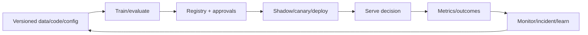

# Part 11 — MLOps and Production ML

## Goal

Make ML behavior reproducible, deployable, scalable, observable, secure, and
maintainable over years. MLOps is not one tool; it is the operating model around
data, code, artifacts, decisions, and owners.

## Chapters

| Order | Chapter |
|---:|---|
| 1 | [Experiments, lineage, registries, and reproducibility](01-experiments-and-lineage.md) |
| 2 | [Pipelines, orchestration, validation, and continuous training](02-pipelines.md) |
| 3 | [Inference serving and deployment](03-serving-and-deployment.md) |
| 4 | [Monitoring, drift, incidents, and retraining](04-monitoring-and-retraining.md) |
| 5 | [ML platform, cloud/distributed systems, security, and cost](05-platform-and-cost.md) |
| 6 | [Interview workbook and production capstone](06-workbook.md) |

## Production loop

## Exit criteria

- reproduce any production model and trace its data/code/config;
- design idempotent training/backfill/promotion pipelines;
- choose batch/online/stream inference and capacity/fallback;
- deploy via shadow/canary/A-B with compatibility/rollback;
- monitor service/data/model/product/safety and handle delayed labels;
- design platform self-service with guardrails, security, and cost allocation.

## Advanced continuation

Parts [13](../part-13-research-git/README.md),
[14](../part-14-containers-clusters/README.md),
[16](../part-16-foundation-model-data/README.md),
[18](../part-18-training-distributed/README.md),
[21](../part-21-inference-systems/README.md), and
[22](../part-22-evaluation-safety/README.md) deepen experiment lineage, cluster
operations, foundation-model data, distributed training, inference engines, and
evaluation.
