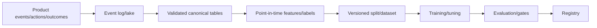

# Chapter 1 — ML System-Design Framework and Estimation

## 1. Time allocation for 45-minute interview

Approximate:

- 5–8 min clarify requirements and metrics;
- 3–5 min scale estimates and baseline;
- 10–15 min high-level data/train/serve architecture;
- 10–15 min deep dive chosen bottleneck;
- 5–8 min reliability/monitoring/safety/rollout/evolution.

Adapt to interviewer. Keep a requirement/assumption list and offer deep-dive choices.

## 2. Step 1: clarify product decision

Ask:

- user and workflow;
- prediction/generation/action;
- online/batch and deadline;
- success KPI and current baseline;
- false-positive/negative harm;
- human review/fallback;
- geographic/tenant/privacy/safety;
- v1/non-goals.

Convert “design recommendations” into “rank up to 500 candidates for home feed in
150ms p99 to improve long-term satisfied sessions while bounding harmful content
and creator concentration.”

## 3. Step 2: ML formulation

- unit and prediction timestamp;
- target/label/proxy/window/delay;
- features available;
- output/uncertainty;
- training loss;
- offline metric/operating constraint;
- product KPI/guardrails;
- split and bias/leakage;
- feedback/exposure.

State simple baseline before advanced model.

## 4. Step 3: scale estimation

Estimate order of magnitude, label assumptions, and identify dominant term.

### Traffic

> average QPS = daily requests / 86,400  
> peak QPS = average × peak factor

Example 100M/day ≈ 1,157 average QPS; peak factor 5 → ~5.8k QPS.

### Storage

> daily bytes = events/day × bytes/event × replication/overhead

1B events × 500 bytes ≈ 500 GB raw/day before replication/index/compression.

### Bandwidth

> bytes/s = QPS × request/response bytes

### Compute

> replicas ≈ peak work/s / sustainable work/replica/s × headroom

For LLM include input/output tokens, prefill/decode throughput, KV memory.

### Latency budget

```text
network 20ms + auth 5 + features 35 + retrieval 25
+ model 40 + policy 10 + serialization 5 = 140ms p99 target allocation
```

Budgets are not simply averages; parallel branches use max plus overhead.

## 5. Step 4: data/training architecture



Explain event IDs/timestamps, selection, label delay, data quality, retraining,
lineage, privacy.

## 6. Step 5: serving architecture


Choose batch/online/hybrid, caches, stores, indexes, model server, versioning,
fallback, latency. Separate score from policy.

## 7. Step 6: offline/online consistency

- shared definitions;
- point-in-time training retrieval;
- logged served features;
- golden parity tests;
- feature/model/schema versions;
- availability/freshness simulation;
- transformation bundled with model.

Mention training-serving skew proactively.

## 8. Step 7: evaluation and rollout

Offline baseline/metric/slices/calibration/robustness; shadow for live compatibility;
canary risk; A/B causal KPI; ramp/kill switch/rollback. Define gates and experiment
unit. High-impact needs human/domain approval.

## 9. Step 8: monitoring

- service SLI/SLO;
- schema/freshness/skew/drift;
- score/action/output;
- delayed label quality/calibration/slices;
- product/safety/fairness/cost;
- feedback/review;
- owner/runbook.

## 10. Step 9: failures

Use table:

| Failure | Detection | Immediate mitigation | Long-term prevention |
|---|---|---|---|
| feature store timeout | latency/error/freshness | cached/default/fallback model | redundancy/circuit/capacity |
| corrupt unit | range/score shift | rollback/quarantine | semantic contract/test |
| model quality drift | mature metric/slice | threshold/fallback/champion | fresh data/reframe/retrain |
| overload | queue/tail/saturation | shed/batch/fallback | capacity/autoscale |
| unsafe output | classifier/report | block/escalate/kill | eval/data/architecture |

## 11. Step 10: evolution

Offer staged plan:

- V0 instrument/current rules;
- V1 simple model/batch/safe action;
- V2 fresh features/online/experiment;
- V3 advanced model/personalization;
- V4 platform reuse/automation.

Each stage has measurable trigger; no speculative complexity.

## 12. Estimation patterns

### Feature store

Entities × feature bytes × versions/replication; QPS per request × features; cache
hit/freshness; hot keys.

### Embedding index

> vector bytes = items × dimension × bytes/value

100M × 768 × 2 bytes ≈ 153.6 GB raw vectors, before graph/index/metadata/replication.

### Model size

> parameters × bytes/parameter plus runtime overhead

Training includes gradients/optimizer/activations; inference weights + KV/cache.

### Logs

Sampling/retention/privacy. Full prompts/images may dominate cost and risk.

## 13. Common trade-offs

- freshness versus consistency/cost;
- quality versus latency;
- precompute versus personalization;
- batch versus online;
- exact versus approximate retrieval;
- single versus multi-stage model;
- shared platform versus team autonomy;
- global versus regional model;
- automation versus human oversight;
- exploration versus user risk;
- observability versus privacy.

State criteria and reversibility.

## 14. Common mistakes

- name model before goal/data;
- skip baseline/label/split;
- draw only serving, not training/feedback;
- say “Kafka/Redis/Kubernetes” without requirement;
- no estimates/tail latency/failure;
- metric without threshold/cost/KPI;
- retrain as answer to every incident;
- security/fairness as final sentence;
- no rollback/migration/owner;
- overengineer v1.

## 15. Practice template

```text
Goal/users/non-goals:
Functional + nonfunctional requirements:
Scale assumptions/estimates:
Baseline:
ML formulation/data/labels/split:
High-level offline + online design:
Deep dive:
Evaluation/rollout:
Reliability/monitoring:
Privacy/security/fairness/human:
Cost/ownership:
Evolution/open questions:
```

