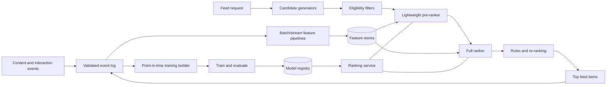
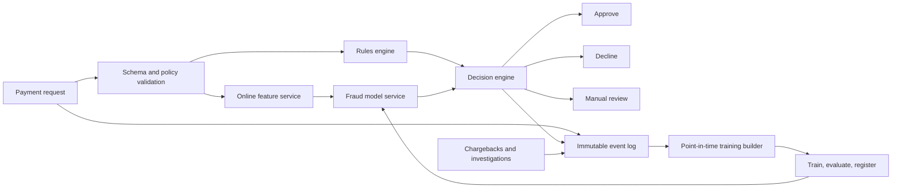
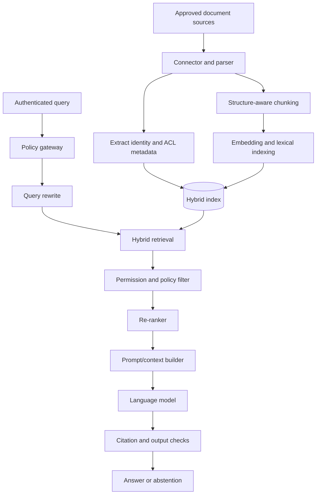

# Case Studies, Question Bank, and Final Capstone

This chapter turns the earlier framework into complete interview narratives. Do
not memorize the architectures as fixed answers. Memorize the reasoning order,
then adapt the design to the requirements you are given.

## 1. How to use a worked case study

Read each case in three passes:

1. **Beginner pass:** follow the request from product goal to prediction and
   notice why every component exists.
2. **Practitioner pass:** reproduce the estimates, metrics, data split, feature
   choices, deployment plan, and failure handling without looking.
3. **Senior pass:** challenge the assumptions, propose an incremental launch,
   identify organizational ownership, and explain which trade-off you would
   revisit at ten times the traffic.

In an interview, explicitly separate facts supplied by the interviewer from
assumptions you introduce. A useful phrase is: “I will assume X for the first
estimate; if that assumption changes, component Y is the first thing I would
redesign.”

---

## 2. Case study A — personalized home-feed ranking

### 2.1 Problem statement

Design a system that ranks a personalized home feed. The system should improve
meaningful engagement while respecting freshness, creator diversity, safety,
latency, and infrastructure cost.

### 2.2 Clarify the contract

Before drawing boxes, ask:

- Who are the users, and what objects can appear in the feed?
- Is this pull-on-open, continuously precomputed, or a hybrid?
- What is “meaningful engagement”: click, dwell time, save, reply, or long-term
  retention?
- How fresh must new content be?
- What content is ineligible because of privacy, blocks, policy, or geography?
- Are advertisements mixed into the same ranking surface?
- What are the peak request rate, catalog size, and latency SLO?

Assume:

| Quantity | Working assumption |
|---|---:|
| Daily active users | 20 million |
| Feed opens per active user per day | 10 |
| Average request rate | about 2,315 requests/second |
| Peak-to-average factor | 5 |
| Peak request rate | about 11,600 requests/second |
| Initial candidate pool | 10,000 items |
| Expensive-model candidates | 500 items |
| Returned items | 50 items |
| Server latency objective | p99 below 200 ms |

The average request estimate is:

> **Average RPS = 20,000,000 × 10 ÷ 86,400 ≈ 2,315**

Estimates need not be exact. Their purpose is to expose which operations cannot
be performed synchronously for every request.

### 2.3 Define objectives as a constrained optimization problem

A single click-through metric is vulnerable to clickbait. Define a model score
that predicts several useful outcomes, then constrain the result:

> **utility(item, user) = w₁P(click) + w₂E[dwell] + w₃P(save) − w₄P(hide)**

The weights encode product values and should be tuned using experiments, not
treated as natural constants. The serving policy also enforces:

- safety and privacy eligibility;
- blocked-author and already-seen filters;
- diversity across creators and topics;
- freshness or inventory constraints;
- advertisement contracts, if applicable; and
- a latency and compute budget.

Online primary metrics might include meaningful sessions per user or retained
users. Guardrails include hides, reports, creator concentration, sensitive-
content exposure, latency, error rate, and compute cost. Offline metrics such as
NDCG, recall at K, calibration, and slice metrics are diagnostic gates—not final
proof of product value.

### 2.4 Architecture

Candidate generation may union several sources:

- recent content from followed creators;
- approximate-nearest-neighbor retrieval using user and item embeddings;
- popular content within region or topic;
- exploration candidates for new creators or new content; and
- continued-session candidates cached from an earlier request.

Each generator returns an item ID, source, and generator score. Deduplication and
hard eligibility filters happen before expensive ranking. A lightweight model
reduces thousands of items to hundreds; a richer model ranks the survivors.

### 2.5 Training data and leakage control

For each historical request, reconstruct what was knowable at request time:

| Field | Example |
|---|---|
| Context | user, device, locale, time, request ID |
| Candidate | item ID, creator ID, retrieval source |
| Position/exposure | displayed position and whether actually visible |
| Features | point-in-time user, item, and interaction features |
| Outcomes | click, dwell, save, hide, report within defined windows |

Do not label every unseen item as a negative; many were never exposed. Position
and selection policies bias the logged observations. Randomized exploration,
propensity-aware evaluation, or carefully designed interleaving can make data
more informative.

Leakage examples:

- using an item’s lifetime click rate computed after the training example;
- using a user profile updated by the very click being predicted;
- randomly splitting repeated users and future interactions across train/test;
- training on content later removed for policy violations without reproducing
  serving-time eligibility.

A time-based split better approximates deployment. Keep group leakage in mind
when users, creators, or near-duplicate items appear repeatedly.

### 2.6 Modeling strategy

Start with popularity plus recency and business rules. It establishes the data
pipeline, observability, and experiment machinery before model complexity.

A practical progression is:

1. logistic regression or boosted trees on explicit features;
2. two-tower retrieval for large-catalog personalization;
3. multi-task ranker for clicks, dwell, hides, and saves;
4. sequence-aware user representations; and
5. constrained or learned re-ranking for list-level quality.

The retrieval model optimizes recall; the ranker optimizes precision and utility.
Using the expensive ranker across the full catalog would violate latency and
cost constraints.

### 2.7 Serving path and graceful degradation

The hot path should have strict deadlines. Fetch user/context features in
parallel, place timeouts around candidate sources, and avoid synchronously
calling dependencies that are not essential.

Fallback ladder:

1. full personalized retrieval and ranker;
2. cached candidates with the full or smaller ranker;
3. followed-creator content ordered by recency;
4. safe regional popularity feed; and
5. static safe content if dependencies are broadly unavailable.

Load shedding can reduce candidate count, skip the most expensive features, or
disable nonessential generators. It must not disable safety or privacy filters.

### 2.8 Monitoring and feedback loops

Monitor four layers:

- **system:** traffic, errors, saturation, p50/p95/p99 latency, cache hit rate;
- **data:** missingness, freshness, schema changes, distribution drift;
- **model:** score distribution, calibration, slice quality, candidate recall;
- **product/safety:** meaningful engagement, retention, hides, reports,
  diversity, and creator concentration.

Ranking changes what gets exposed, which changes future training data. Without
exploration, the system can repeatedly reinforce already-popular content.
Reserve controlled exploration traffic, log propensities when appropriate, and
audit long-term concentration and new-item coverage.

### 2.9 Rollout and ownership

Use offline gates, shadow traffic, a tiny employee or internal cohort, a small
randomized user cohort, and then gradual ramping. Define automatic rollback for
latency, error, safety, and primary product regressions.

At senior level, name owners:

- ranking team: model and online ranking service;
- feature/data platform: event contracts and feature freshness;
- trust and safety: policies, review processes, and incident escalation;
- product/experimentation: objectives and decision rules;
- infrastructure: capacity and common serving platform.

### 2.10 Follow-up questions

How would you handle a new user?

Ask for minimal interests if the product permits, use contextual signals and
safe regional popularity, deliberately diversify early results, and update a
short-term representation as interactions arrive. Measure time to first useful
action and avoid assuming that globally popular content is universally safe or
relevant.

Why not optimize only watch time?

Watch time is an incomplete proxy and can reward low-quality or compulsive
consumption. Use multi-objective outcomes plus explicit safety, satisfaction,
diversity, and long-term retention guardrails. Audit metric gaming and segment
effects.

---

## 3. Case study B — real-time payment fraud detection

### 3.1 Requirements and asymmetry

For each payment authorization, return approve, decline, or send-to-review under
a strict latency budget. Fraud is rare, labels arrive late, attackers adapt,
and false positives harm legitimate users.

The cost of a threshold can be expressed as:

> **expected cost = FN × cost(FN) + FP × cost(FP) + review count × review cost**

False-negative cost includes losses and regulatory exposure. False-positive cost
includes abandonment, support work, and loss of trust. These costs differ across
payment value, geography, customer history, and payment method, so one global
threshold may be inappropriate.

### 3.2 Architecture

Feature groups include:

- transaction: value, currency, merchant, device, channel;
- velocity: counts and amounts in 1-minute, 1-hour, and 24-hour windows;
- identity/device: account age, device changes, verification status;
- graph: shared instruments, devices, addresses, or coordinated clusters;
- behavior: deviation from the account’s normal location or spend pattern;
- merchant/network: recent dispute rates and risk signals.

Every aggregation must be computed using information available before the
decision timestamp. The online and offline implementations must agree on window
boundaries, deduplication, late events, and default values.

### 3.3 Labels and evaluation

A chargeback may arrive weeks later and is not a perfect fraud label. Some fraud
is never reported; some chargebacks are non-fraud disputes. Store label source,
confidence, and maturity. Train only on cohorts whose observation windows have
mostly matured, or explicitly model censoring.

Accuracy is nearly useless for a rare event. Evaluate:

- precision-recall curve and area under it;
- recall at a fixed false-positive or decline rate;
- dollar-weighted fraud capture;
- expected financial cost at candidate thresholds;
- approval rate and review queue volume;
- calibration within transaction-value and regional slices; and
- temporal robustness against emerging attack patterns.

For a threshold τ:

> **precision(τ) = true fraud blocked ÷ all transactions blocked**
>
> **recall(τ) = true fraud blocked ÷ all labeled fraud transactions**

### 3.4 Decision policy

The model outputs a risk estimate; a policy turns risk and business constraints
into an action. For example:

- hard policy violations decline regardless of model score;
- low-risk transactions approve;
- medium-risk, high-value transactions receive step-up authentication;
- uncertain cases enter review while queue capacity remains available;
- high-risk transactions decline, with region-specific legal requirements.

Keep policy configuration versioned separately from the model. This allows an
incident response team to change thresholds or rules without retraining.

### 3.5 Adversarial reliability

Attackers react to the deployed system. Protect feature endpoints, rate-limit
probing, avoid revealing precise decline reasons, monitor coordinated attempts,
and red-team obvious bypasses. Restrict access to sensitive attributes and log
administrative actions.

Graceful degradation is risk-aware. If nonessential behavioral features are
missing, use a smaller model and conservative policy. If identity or mandatory
compliance checks are unavailable, fail according to an explicit risk policy;
availability alone must not override legal obligations.

### 3.6 Drift, retraining, and incidents

Track:

- input and score shifts by merchant, region, device, and payment method;
- feature freshness and velocity-store lag;
- eventual fraud capture by decision cohort;
- false-positive appeals and customer-support signals;
- novel rule-trigger patterns and concentrated attack campaigns.

Use time-window backtests and champion/challenger evaluation. Do not automatically
retrain and promote solely because drift is detected; drift can represent an
instrumentation defect or active attack. Promotion still requires data-quality,
performance, policy, and safety gates.

### 3.7 Senior-level discussion

An SDE-III answer should address the boundary among the model, rules, review
operations, security response, and compliance. It should also propose a migration
path from scattered synchronous database queries to a versioned online feature
service, including shadow comparison and reconciliation before cutover.

---

## 4. Case study C — enterprise retrieval-augmented assistant

### 4.1 Requirements

Employees ask questions over internal documents. Answers must respect each
requesting user’s permissions, cite evidence, decline unsupported questions,
remain within a latency/cost budget, and be auditable.

Critical clarifications:

- Which sources and file types are in scope?
- How quickly must edits and revocations become effective?
- Can data be sent to an external model provider?
- Are citations mandatory for every factual claim?
- Is the assistant read-only, or can it take actions?
- What languages, traffic, context length, and response-time SLO apply?

### 4.2 Threat model before architecture

Documents are untrusted input. They may contain prompt injection, malicious
links, secrets, or instructions that conflict with system policy. Users must not
retrieve documents they cannot access. Logs and model-provider payloads must not
silently become a new data-exfiltration path.

Treat permission enforcement as a mandatory security boundary, not a relevance
feature. Re-check authorization at query time because access can change after a
document is indexed.

### 4.3 Ingestion and query architecture

The ingestion pipeline preserves document ID, version, source URL, section,
timestamps, tenant, security labels, and access-control metadata. Chunk by
semantic structure when possible; fixed token windows can split tables,
procedures, and headings from their meaning.

Hybrid retrieval combines lexical matching, which is strong for exact terms and
identifiers, with embedding retrieval, which is strong for paraphrases. A
cross-encoder or other re-ranker can improve the top results after inexpensive
retrieval.

### 4.4 Retrieval and generation metrics

Evaluate components separately so failures are diagnosable.

Retrieval metrics:

- recall at K: was supporting evidence retrieved?
- mean reciprocal rank: how high did the first relevant result appear?
- permission correctness: was every returned chunk authorized?
- freshness: how quickly are edits and revocations reflected?

Generation metrics:

- claim-level faithfulness to retrieved evidence;
- answer relevance and completeness;
- citation correctness and coverage;
- abstention quality when evidence is inadequate;
- safety-policy adherence;
- latency and cost per successful task.

End-to-end metrics include task completion, escalation rate, repeat-question
rate, user-rated usefulness, and serious security incidents. A fluent answer is
not automatically a correct one.

### 4.5 Latency and cost budget

Decompose the deadline rather than promising one opaque number:

| Stage | Illustrative p95 budget |
|---|---:|
| Authentication and policy | 40 ms |
| Query rewrite | 100 ms |
| Retrieval and filtering | 180 ms |
| Re-ranking | 120 ms |
| First model token | 900 ms |
| Remaining streamed generation | depends on answer length |

Cost is approximately driven by model calls and tokens:

> **request cost ≈ input tokens × input price + output tokens × output price + retrieval/compute cost**

Reduce cost with query-result caches scoped by identity and document version,
smaller routing models, context compression, strict output limits, and a smaller
model for easy questions. Never share cached private answers across incompatible
authorization scopes.

### 4.6 Failure and fallback behavior

| Failure | Safe behavior |
|---|---|
| Embedding service unavailable | lexical search, clearly marked degraded mode |
| Re-ranker timeout | use retrieval ordering |
| Generation timeout | show relevant source excerpts or ask user to retry |
| Evidence insufficient | abstain and offer the closest authorized sources |
| ACL service uncertain | fail closed for protected content |
| Index update lag | display source freshness and prioritize revocation path |
| Suspected prompt injection | isolate instructions, omit unsafe content, log event |

### 4.7 Evaluation dataset and rollout

Build a versioned evaluation set from real task categories, expert-authored hard
questions, unanswerable questions, permission-boundary tests, multilingual
queries, outdated documents, and adversarial prompts. Store acceptable evidence,
not merely one canonical answer.

Run deterministic component tests on every change, periodic human review on a
stratified sample, shadow evaluation of candidate configurations, and staged
online rollout. Version the connector, parser, chunker, embedding model, index,
retriever, re-ranker, prompt, language model, and policy together in traces.

### 4.8 If the assistant can take actions

Adding actions changes the risk class. Separate planning from execution; define
typed tools with narrow permissions; validate arguments; require confirmation
for consequential operations; use idempotency keys; record an audit trail; and
cap loops, time, and spend. Retrieved text must never directly grant authority
to call a tool.

---

## 5. Comparing the three cases

| Dimension | Feed ranker | Fraud detection | Enterprise RAG |
|---|---|---|---|
| Core output | ordered list | risk/action | grounded text |
| Main data problem | exposure bias and feedback | rare, delayed, noisy labels | permissions, freshness, evidence |
| Main metric tension | engagement vs quality/diversity | fraud recall vs false decline | usefulness vs faithfulness/security |
| Typical latency tactic | multi-stage ranking | precomputed velocity features | hybrid retrieval and streaming |
| Critical fallback | safe popularity/recency | rules and risk policy | search excerpts or abstention |
| Dominant long-term risk | concentration loop | adaptive attacker | unauthorized or unsupported answer |

The reusable lesson is that the model is one decision component. Data contracts,
policy, serving, evaluation, fallbacks, and feedback determine whether the
overall system is useful.

---

## 6. System-design question bank

For every prompt, practice requirements, estimates, baseline, data/labels,
modeling, serving, evaluation, monitoring, failures, rollout, and evolution.

### Ranking, retrieval, and recommendation

1. Design a personalized short-video feed.
2. Design search ranking for an e-commerce marketplace.
3. Design “people you may know.”
4. Design job recommendations with fairness constraints.
5. Design a music recommender that handles new users and new songs.
6. Design a learning-to-rank system for support articles.

### Classification, anomaly detection, and forecasting

7. Design email spam and phishing detection.
8. Design abusive-content detection with a human-review queue.
9. Design account-takeover detection.
10. Design delivery-time estimation.
11. Design demand forecasting for inventory planning.
12. Design predictive maintenance for industrial sensors.
13. Design duplicate-listing detection in a marketplace.

### Generative AI

14. Design a permission-aware enterprise knowledge assistant.
15. Design a customer-support copilot with citations.
16. Design a repository coding assistant.
17. Design safe natural-language-to-SQL.
18. Design a meeting summarizer with action-item extraction.
19. Design an agent that can issue refunds under policy.

### Platform and infrastructure

20. Design an online feature store.
21. Design a shared model-serving platform.
22. Design a training-data validation and lineage platform.
23. Design a company-wide experimentation platform.
24. Design continuous evaluation for hundreds of models.
25. Design an embedding and vector-search platform.

### Follow-up axes interviewers commonly use

- Traffic or catalog grows by 10× or 100×.
- Labels arrive a month late.
- A required feature source becomes unavailable.
- The system must support multiple regions and residency constraints.
- The model appears better offline but worse online.
- The model harms one slice while improving the average.
- You must cut cost by half without losing more than a small quality budget.
- A privacy deletion must take effect quickly across derived artifacts.
- An attacker can adapt after observing decisions.
- You inherit a legacy system and cannot replace it all at once.

---

## 7. Final capstone

Choose one question from each group above: one predictive/ranking system, one
generative system, and one platform system. Produce the following for each.

### 7.1 Required artifacts

1. **One-page requirements brief:** user, decision, exclusions, success metric,
   guardrails, traffic, latency, consistency, privacy, and cost assumptions.
2. **Back-of-the-envelope estimates:** requests, storage, bandwidth, compute,
   index size, and the bottleneck those estimates reveal.
3. **Data specification:** event schemas, labels, observation windows, lineage,
   split strategy, leakage threats, quality checks, and retention.
4. **Model card:** baseline, candidates, objective, metrics, slices,
   calibration/thresholding, limitations, and approval criteria.
5. **Architecture:** training and serving paths, stores, queues, caches,
   interfaces, versioning, and security boundaries.
6. **Reliability plan:** SLOs, alerts, overload behavior, fallbacks, rollback,
   incident owner, and recovery verification.
7. **Rollout plan:** offline gate, shadow/canary/A/B phases, decision rule,
   migration, compatibility, and rollback triggers.
8. **Evolution memo:** what changes at 10× scale, how cost is controlled, and
   how another team can safely onboard.

### 7.2 Self-scoring rubric

Score each dimension from 0 to 4.

| Dimension | 0 | 2 | 4 |
|---|---|---|---|
| Requirements | jumps to technology | basic functional goals | quantified goal, constraints, non-goals, risks |
| Estimates | none | rough traffic only | traffic, data, compute, and bottleneck linked to design |
| Data/labels | vague dataset | sources and simple split | point-in-time semantics, bias, lineage, delayed labels |
| Modeling | names a complex model | baseline and metric | objective, alternatives, calibration, slices, error analysis |
| Architecture | disconnected boxes | coherent happy path | interfaces, state, scaling, versioning, security boundaries |
| Reliability | says “monitor it” | metrics and fallback | SLOs, overload, incident detection, rollback, recovery |
| Responsible AI | generic fairness mention | identifies one harm | threat model, slice criteria, privacy, governance, ownership |
| Evolution | no migration story | simple staged launch | adoption, compatibility, cost, 10× redesign, team boundaries |
| Communication | unstructured | understandable | prioritized, assumption-driven, responds to new constraints |

Interpretation:

- **0–14:** revisit the framework and make requirements measurable.
- **15–24:** credible intermediate answer; deepen data and failure reasoning.
- **25–31:** strong SDE-II/ML engineer signal.
- **32–36:** strong senior signal when the reasoning is interactive, not
  memorized.

The rubric is a practice tool, not a hiring guarantee. Different interviews
weight coding, ML theory, experimentation, leadership, or distributed systems
differently.

---

## 8. Final rapid-review checklist

Before ending any ML system-design interview, verify that you covered:

- [ ] user, decision, scope, and non-goals;
- [ ] primary metric, guardrails, and important slices;
- [ ] scale and latency/cost estimates;
- [ ] label definition, observation time, bias, and leakage;
- [ ] simple baseline and reason for added model complexity;
- [ ] training-serving consistency and artifact versioning;
- [ ] online path, deadlines, caching, and load shedding;
- [ ] safety, privacy, access control, and abuse resistance;
- [ ] monitoring across system, data, model, and product layers;
- [ ] fallback, rollback, and incident ownership;
- [ ] feedback loops and delayed outcomes;
- [ ] staged rollout and the next likely scaling bottleneck.

If time is running out, summarize the three highest risks and how you would
validate them. Seniority is demonstrated by prioritization: a complete list is
less valuable than recognizing which assumption can invalidate the entire
system.

---

## 9. Closing perspective

The complete curriculum moves through one continuous chain:

> **problem → data → representation → objective → optimization → evaluation → deployment → monitoring → learning**

Weak systems break when one arrow is assumed rather than measured. Strong
engineers can zoom into the mathematics or code and zoom back out to product,
reliability, safety, and organizational consequences. That ability—not the
number of model names remembered—is the durable target of these notes.
