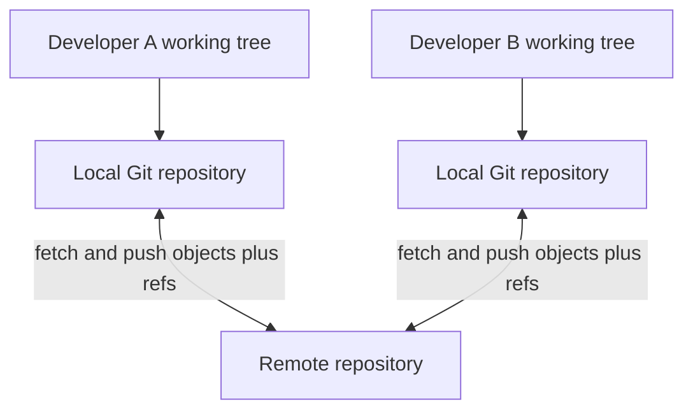
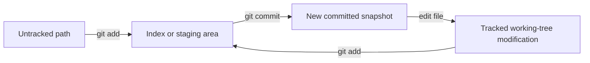

# Chapter 1 — Git Fundamentals: From First Repository to Confident Daily Use

Git is a distributed version-control system. It records snapshots of a directory,
connects those snapshots into a history graph, and lets many people exchange and
integrate changes. Learn the state model before memorizing commands.

## 1. What version control solves

Without version control, teams create filenames such as `final-v2-fixed-really.py`,
lose the reason for a change, overwrite each other, and cannot reliably identify
which source produced a release. Version control provides:

- history: inspect and restore earlier states;
- attribution: record who authored and committed a change and why;
- branching: develop lines of work without copying the whole project manually;
- collaboration: exchange commits and review proposed changes;
- comparison: see content differences between states;
- release identity: name a known snapshot;
- debugging: locate when behavior changed.

Git versions source and small text assets well. It is not automatically a database,
backup service, access-control system, artifact registry, or large-dataset store.

## 2. Centralized versus distributed version control

In a centralized system, clients typically depend on a central server for history.
In Git, each ordinary clone contains repository objects and history, so most reads,
commits, branches, and comparisons work locally. A hosting service is a collaboration
hub, not the definition of Git itself.



“Distributed” does not mean every clone has permission to publish every branch or
contains every large-file object. Server policy and partial/shallow clones can
limit behavior.

## 3. Install and identify the tool

Verify the executable and version:

```bash
git --version
git help --all
git help config
```

Use the operating system’s trusted package mechanism or the official Git guidance.
Commands and defaults evolve, so record relevant versions in reproducibility or
support reports.

## 4. Configuration scopes

Git reads configuration from system, global/user, local repository, worktree, and
command-specific sources with precedence rules. Inspect origin, not only value:

```bash
git config --list --show-origin
git config --show-scope --list
git config --global user.name "Example Developer"
git config --global user.email "developer@example.invalid"
git config --global init.defaultBranch main
```

Author name/email are commit metadata, not authentication. Use an address allowed
by organizational/privacy policy. Important settings include editor, pager, line-
ending behavior, pull/rebase policy, signing, credential helper, aliases, and merge/
diff drivers. Do not copy a global configuration you do not understand.

## 5. Create or obtain a repository

Initialize an existing directory:

```bash
git init
git status
```

Clone an existing repository:

```bash
git clone REMOTE_URL project-name
```

`git init` creates repository metadata; it does not commit files. `clone` obtains
objects and refs, configures a remote usually named `origin`, and checks out an
initial branch. `origin` is a conventional remote name, not a special server.

Never initialize or clone into a directory with important overlapping files unless
you have inspected and planned the result.

## 6. The four states you must distinguish



- untracked: path is present in the working tree but absent from the current index;
- tracked and unmodified: working content matches the selected/indexed snapshot;
- modified: working content differs;
- staged: the index contains content proposed for the next commit;
- committed: content is reachable from a commit object.

A file can be both staged and modified when it is edited again after staging. The
index contains the earlier staged bytes; the working tree contains newer bytes.

## 7. The inspection loop

Run inspection before mutation:

```bash
git status
git status --short
git diff
git diff --staged
git diff HEAD
```

- ordinary `diff`: working tree versus index;
- `diff --staged`: index versus `HEAD`;
- `diff HEAD`: overall working/index result versus selected commit.

Read a short-status code as two columns: index state then working-tree state.
Do not build automation by parsing colorized human output if a stable plumbing or
machine format exists.

## 8. Stage intentionally

Stage paths:

```bash
git add README.md src/app.py
git add --patch src/app.py
git diff --staged
```

`git add` copies the current content into the index. It is used for new, modified,
and resolved paths. Patch mode selects hunks interactively and helps separate
unrelated changes. Always review the staged diff before committing.

Removing and moving tracked paths:

```bash
git rm obsolete.txt
git mv old_name.py new_name.py
```

Git ultimately records snapshots; rename detection is usually inferred later from
content similarity rather than stored as a permanent “rename object.” Ordinary
filesystem move plus correct staging can represent the same final snapshot.

## 9. Make a useful commit

```bash
git commit -m "fix(parser): preserve empty trailing field"
git show --stat --oneline HEAD
git show HEAD
```

A commit records a root tree, parent commit(s), author/committer metadata, and
message. It does not automatically include every working-tree modification—only
the index snapshot.

A strong commit is coherent, builds/tests where practical, and explains motivation
or behavior not obvious from the diff. Avoid messages such as “changes” or “fix.”
The first line should be concise; the body can explain context, alternatives,
compatibility, migration, and issue references.

## 10. Ignore generated and local files

`.gitignore` patterns prevent untracked paths from being offered by ordinary add
operations. Common candidates include virtual environments, caches, build output,
editor state, logs, local secrets, datasets, and checkpoints.

```gitignore
.venv/
__pycache__/
*.py[cod]
.env
build/
dist/
```

Rules may come from repository `.gitignore`, per-directory files, `.git/info/exclude`,
and global excludes. Diagnose a rule:

```bash
git check-ignore -v path/to/file
```

Ignore rules do not untrack an already committed file and do not erase history.
Never use `.gitignore` as the response to an exposed secret—rotate/revoke it.

## 11. Read history

```bash
git log --oneline --decorate --graph --all
git log -- path/to/file
git show COMMIT_OR_TAG
git diff COMMIT_A COMMIT_B
```

Revisions can be object IDs, refs, tags, relative expressions such as `HEAD~2`, or
ranges. Inspect the resolved commit before using an unfamiliar expression in a
destructive or release command.

Useful history search:

```bash
git log -S 'exact_string' --all --source
git log -G 'regular_expression' -- path/to/file
```

Pickaxe `-S` finds commits changing occurrence count of a string; `-G` searches
patch lines matching a regular expression. Neither proves causal responsibility.

## 12. Branch basics

A branch is a movable reference, normally pointing at a commit. Create/switch:

```bash
git switch -c feature/better-errors
git branch --show-current
git branch -vv
git switch main
```

Committing moves the current branch reference forward. Switching changes `HEAD`,
index, and working tree to the selected snapshot, subject to protection of local
changes. Do not force a switch over work you have not saved or inspected.

Merge a completed branch:

```bash
git switch main
git merge feature/better-errors
```

A fast-forward moves the target ref when no divergent commits exist. A three-way
merge uses both tips and their merge base, possibly creating a commit with two
parents. A conflict means Git cannot safely select final content; human semantic
resolution and tests are required.

## 13. Safe everyday undo ladder

Undo depends on where the change lives and whether history is shared:

| Situation | First inspect | Typical safe action |
|---|---|---|
| unwanted unstaged edit | `git diff -- path` | restore path only after deciding bytes may be lost |
| wrong content staged | `git diff --staged` | unstage while preserving working copy |
| unshared latest commit needs correction | `git show HEAD` | amend or make another commit |
| shared commit is wrong | history and dependent state | revert with a new auditable commit |
| branch/reference moved | `git reflog` and `git show` | create recovery branch at verified object |

Before commands involving `--hard`, force, clean, or path replacement, make a
commit/branch/patch/copy when uncertain. `git clean` can permanently remove
untracked files that Git cannot recover.

## 14. Stash: temporary state, not durable collaboration

```bash
git stash push -u -m "wip: parser experiment"
git stash list
git stash show -p stash@{0}
git stash apply stash@{0}
```

A stash records working/index state in repository objects and is local by default.
It can conflict on apply and is easy to forget. Prefer small work-in-progress
commits on a private branch or a worktree for important/long-running work.

## 15. Tags and releases

Lightweight tags are refs; annotated tags have a tag object with message, tagger,
and optional signature. For releases, annotated/signed tags plus immutable build
provenance are often preferable:

```bash
git tag -a v1.0.0 -m "Release 1.0.0"
git show v1.0.0
```

A tag can technically be moved, so hosting policy, signing, and protected release
process matter. A source tag alone does not identify dependencies, container,
database schema, model, or deployment configuration.

## 16. Text, binaries, line endings, and attributes

`.gitattributes` controls path-specific text/binary classification, end-of-line
normalization, diff/merge drivers, linguist/archive behavior, and LFS filters.
Line-ending changes can create repository-wide noisy diffs. Decide policy before
mass normalization and test cross-platform scripts.

Git stores arbitrary bytes but cannot meaningfully line-merge most binary files;
large/frequently changing binaries inflate clone and history. Use LFS or artifact
storage according to retention, access, and reproducibility needs.

## 17. First repository lab

1. Initialize a disposable repository and configure local test identity.
2. Create two files; inspect untracked, stage one, and compare all three diffs.
3. Commit, edit the staged file again, and explain the two versions.
4. Create a feature branch and make two focused commits.
5. Make a conflicting edit on the main branch; merge and resolve semantically.
6. Add an ignore rule and diagnose it with `check-ignore`.
7. Create an annotated tag and draw the commit/ref graph.
8. Make an accidental local branch move and recover it only after Chapter 4.

## 18. Beginner exit questions

1. What is the difference between working tree, index, `HEAD`, and branch?
2. Why can a file be staged and modified simultaneously?
3. Does Git store deltas or snapshots as its core object model?
4. What does `.gitignore` not do?
5. What changes during a fast-forward merge?
6. When is revert safer than rewriting history?

