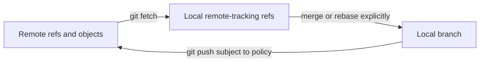

# Chapter 3 — Git Remotes, Collaboration, Reviews, and Releases

## 1. Local refs versus remote collaboration

Git stores local branches, tags, remote-tracking refs, and other references. A
remote is a named set of URLs/configuration used to exchange objects and refs.

```bash
git remote -v
git remote show origin
git branch -vv
git ls-remote origin
```

`origin/main` is a local remote-tracking ref representing the last fetched state
of `main` from `origin`; it is not a live network pointer. Your local `main` is a
separate movable ref.

## 2. Fetch, pull, and push



`git fetch` downloads advertised objects and updates configured remote-tracking
refs without integrating them into the current branch. Inspect after fetching:

```bash
git fetch --prune origin
git log --left-right --graph --oneline HEAD...origin/main
git diff HEAD...origin/main
```

`git pull` is fetch followed by an integration action (merge or rebase depending
on options/config). Set policy deliberately; implicit defaults create confusion.

`git push` asks a remote to update refs and transfers required objects. It may be
rejected because the update is not a fast-forward or server policy requires a
pull request/checks. Never solve a rejection with blind force.

## 3. Upstream/tracking branches

An upstream relation lets status/pull/push infer a remote branch:

```bash
git push -u origin feature/parser-errors
git branch --set-upstream-to=origin/main main
git branch -vv
```

“Tracking” here means ref/config relationship, not automatic synchronization.
Check ahead/behind counts after fetch; stale remote-tracking refs mislead.

## 4. Authentication and transport

Common transports are HTTPS with a credential/token mechanism and SSH with keys.
Authentication proves identity; repository/branch authorization determines allowed
actions. Prefer short-lived/managed credentials, protected private keys, host-key
verification, least privilege, and organizational SSO/policy.

Do not embed tokens in remote URLs, shell history, CI logs, images, or repository
config. Rotate compromised credentials and inspect access logs.

Signed commits/tags provide verifiable signer evidence when correctly configured;
they do not prove code correctness or that a workstation was uncompromised.

## 5. Forks and multiple remotes

In a fork workflow, `origin` commonly names your fork and `upstream` the canonical
repository:

```bash
git remote add upstream CANONICAL_URL
git fetch upstream
git switch -c fix/issue-123 upstream/main
```

Remote names are conventions. Verify URLs before pushing. Fetch permissions and
push permissions may differ; Git also supports separate fetch/push URLs.

## 6. Pull requests and code review

A pull/merge request is a hosting-platform review workflow around Git refs/commits.
It may include discussion, checks, approvals, code owners, merge queues, and policy.
It is not a native Git object stored identically in every clone.

A reviewable proposal should contain:

- problem, non-goals, approach, alternatives and risk;
- focused commits/diff and tests;
- migrations/compatibility/rollout/rollback;
- screenshots or measurements where relevant;
- security/privacy/data effects;
- ownership and follow-up.

Review the merge-base-to-tip change, generated/config/schema changes, dependency
updates, and failure behavior. Do not equate “CI green” with correctness.

## 7. Integration strategies

| Strategy | Result | Strength | Cost/risk |
|---|---|---|---|
| merge commit | preserves branch topology | audit/context for shared branches | noisier graph if used for every tiny sync |
| squash merge | one target commit for proposal | concise target history | loses individual commit identities/topology |
| rebase then fast-forward | linear replayed commits | clean bisectable commits when disciplined | rewrites IDs; unsafe for shared dependency |

Choose team policy based on review, release, bisect, compliance, and collaboration.
There is no universally superior graph aesthetic.

## 8. Force updates and leases

Rebasing a published branch requires coordination. If policy allows updating your
own review branch, `--force-with-lease` is safer than blind force because it refuses
when the remote ref no longer matches the expected observed state. It still
rewrites history and can invalidate collaborators, review comments, CI artifacts,
or experiment provenance.

Protected branches should reject direct/force updates and require reviewed checks.

## 9. Conflict resolution in collaboration

Before resolving, identify operation, merge base, our/their commits, and intended
combined behavior. Marker removal is not completion. Run focused and integration
tests, inspect the staged resolution, and consider changes to data/schema/config.

For recurring mechanical conflicts, reduce change coupling, establish ownership,
use generated-file policy/custom merge drivers carefully, or redesign the file.

## 10. Branching models

### Trunk-based development

Small, short-lived branches merge frequently to a protected mainline. Feature flags
and backward-compatible increments separate deployment from release. This reduces
long divergence but demands strong CI and disciplined small changes.

### Release branches

Useful when supported releases require stabilization/backports. Define which fixes
flow forward/back, version ownership, test matrix, and end-of-life. Cherry-picking
without lineage can create divergent fixes.

### Git Flow-style long-lived branches

May fit scheduled/multiple releases but creates integration overhead and ambiguity
for continuous deployment. Do not adopt it merely because a diagram exists.

### Environment branches

Using branches as mutable deployment environments often causes drift and promotion
ambiguity. Prefer immutable artifacts promoted through environments with declarative
config where possible.

## 11. Tags, versions, changelogs, and release commits

Semantic Versioning can express compatibility for public interfaces, but version
numbers do not replace a compatibility policy. Generate a changelog from reviewed
intent, not raw commit messages alone. A release should connect:

```text
source commit/tag -> dependency lock -> build provenance -> artifact digest
-> configuration/schema migration -> deployment record -> rollback target
```

Protect and sign release refs/artifacts according to threat model. Reproducible
builds can strengthen evidence but do not eliminate compromised-source risk.

## 12. Hooks and automation

Client hooks can format, lint, scan secrets, or validate messages, but ordinary Git
does not clone hooks automatically and clients can bypass them. Treat server-side
CI/policy as authoritative enforcement; keep fast client checks for feedback.

Common hooks include pre-commit, commit-msg, pre-push, and server receive/update
hooks. Hooks execute code: review their source and dependencies.

## 13. CI integration

CI should checkout the intended commit/ref safely, use least-privilege credentials,
pin third-party actions/images, isolate untrusted pull requests, cache without
cross-trust poisoning, and publish immutable results connected to commit identity.

Run tiers: formatting/types/unit tests; integration/build; security/license scans;
platform matrices; deployment/evaluation gates. Required checks should be stable,
owned, and diagnostically useful—not an ignored wall of flaky jobs.

## 14. Monorepo, multirepo, submodule, subtree, and packages

- monorepo: atomic cross-project changes and shared tooling; requires scalable
  ownership, build/test selection, access and performance tooling;
- multirepo: independent boundaries/releases/access; cross-repo changes require
  interface/version coordination;
- submodule: parent records another repository commit; exact boundary but complex
  initialization, detached states, permissions and recursive operations;
- subtree/vendor copy: easier checkout, harder upstream synchronization;
- package/artifact dependency: strong versioned interface, publishing overhead.

Choose from ownership and change coupling. Do not use submodules as a substitute
for understanding dependencies.

## 15. Large repositories

Shallow clones omit history beyond depth; partial clones defer some objects; sparse
checkout limits working-tree paths. These improve transfer/worktree cost but change
which history/objects are locally available. Maintenance includes commit-graph,
multi-pack index, garbage collection, and server features; use supported platform
guidance before manual repository surgery.

## 16. Collaboration lab

Create two local clones and a bare repository to simulate two developers:

1. push branches and inspect remote-tracking refs;
2. make the remote advance and compare fetch with pull;
3. produce a non-fast-forward push rejection and resolve without blind force;
4. open a simulated review with atomic commits and squash/merge alternatives;
5. rebase a private branch, compare old/new IDs, then use a lease-protected update;
6. tag a release and connect it to a built artifact checksum;
7. configure a safe local pre-commit check and prove server checks remain required.

## 17. Senior interview questions

1. Design Git policy for a monorepo with 1,000 developers and regulated releases.
2. A force push invalidated release provenance. How do you contain and redesign?
3. Compare merge queue, trunk development, and release branches under flaky tests.
4. How do you securely run CI for untrusted external pull requests?
5. When do partial clone and sparse checkout help, and what assumptions change?

