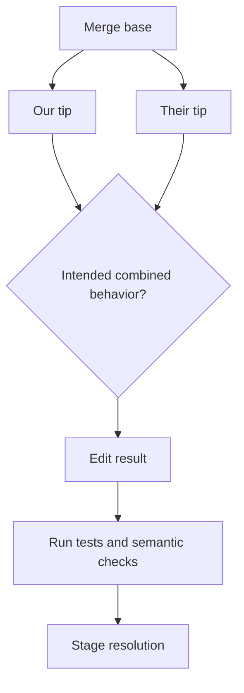

# Chapter 4 — Advanced Git Workflows, Review, and Recovery

This chapter is deliberately operational. Read every command as a state
transition, inspect before changing state, and practice in a disposable repository.

## 1. A state-first command map

| Intent | Read-only inspection | Typical mutation | Main risk |
|---|---|---|---|
| See local changes | `git status`, `git diff` | none | overlooking untracked data |
| Select next snapshot | `git diff --staged` | `git add -p`, `git restore --staged` | mixing unrelated intent |
| Record snapshot | `git diff --staged` | `git commit` | vague/non-reproducible commit |
| Change visible branch | `git branch -vv` | `git switch` | hiding dirty changes |
| Integrate work | `git log --graph --all` | merge/rebase/cherry-pick | rewriting shared identities |
| Undo shared change | inspect target and dependents | `git revert` | incomplete semantic rollback |
| Recover moved ref | `git reflog` | create branch at old object ID | reflog is local and expires |

`status`, `diff`, `log`, `show`, `branch --contains`, and `reflog` are diagnostic
instruments. Use them before reaching for a command that overwrites a file or
moves a reference.

## 2. Create reviewable changes

A commit should express one reason. A scientific change often needs multiple
commits: refactor with invariant tests, introduce treatment, add evaluation, and
document results. That lets a reviewer distinguish mechanism from measurement.

```bash
git switch -c experiment/new-loss origin/main
git add --patch src/model.py
git diff --staged --check
git commit -m "refactor(loss): isolate token mask construction"
git add tests src/model.py
git commit -m "feat(loss): add length-normalized objective"
```

Good commit messages state why and observable consequences. Do not claim a quality
improvement in a source commit unless the reproducible evaluation record supports
it; link the immutable run/result instead.

### Split a mixed local commit

If the commit is not shared, move `HEAD` while keeping its changes, then select
coherent hunks:

```bash
git reset HEAD^
git add --patch
git commit -m "refactor(data): isolate sharding iterator"
git add --patch
git commit -m "fix(data): avoid duplicate final shard"
```

This example changes history and is safe only when the old identity is not relied
upon. Inspect remaining changes between commits.

## 3. Merge conflict reasoning

A conflict means Git lacks enough information to construct the intended result.
It is not a request to choose whichever side is newer.



For a training configuration conflict, ask whether the two branches changed the
same assumption, whether both fields may coexist, and whether the resulting
combination is legal. A syntactically clean YAML merge can silently double the
global batch size or mix incompatible tokenizer/model revisions.

Resolution protocol:

1. record the operation and conflicted paths with `git status`;
2. inspect base and both variants;
3. articulate the desired behavior in one sentence;
4. edit and remove markers;
5. run focused tests plus config/schema validation;
6. inspect the staged resolution, then continue or abort.

## 4. Merge versus rebase versus squash

| Operation | Identity/topology | Appropriate use | Avoid when |
|---|---|---|---|
| Merge | preserves both lines; may add merge commit | shared branch history or meaningful topology | policy requires linear history and topology adds no value |
| Rebase | creates new commits on a new base | cleaning unshared local work | commits are published or referenced by runs |
| Squash merge | one target-branch commit | noisy intermediate history has little enduring value | individual commits encode useful bisect/research evidence |
| Revert | adds inverse change | auditable undo on shared history | dependent migrations make the inverse unsafe |

“Linear” is not automatically “clean.” A history is useful when it supports
review, archaeology, rollback, and causal debugging.

## 5. Regression search with bisect

`git bisect` reduces a range of commits approximately by half per test. With
`N` candidate commits, binary search needs about `ceil(log2 N)` classifications.

```bash
git bisect start
git bisect bad HEAD
git bisect good v0.4.0
git bisect run ./scripts/check_mask_invariant.sh
git bisect reset
```

Exit 0 means good, 1–127 (except 125) means bad, and 125 means untestable/skip.
For noisy model quality, do not classify on a single full training metric. Prefer
a deterministic invariant or fixed tiny fixture. If a statistical test is
unavoidable, specify repetitions, tolerance, and handling of inconclusive results.

## 6. Recovery playbook

### Wrong file modified, not staged

Inspect `git diff -- path` and restore only if you intentionally want the worktree
copy replaced by the index copy. Save a patch first when unsure.

### Wrong content staged

Use `git restore --staged path`, which changes index selection while keeping the
working copy. Verify with both ordinary and staged diffs.

### Wrong commit message or omitted file

For an unshared tip, stage the correction and amend. Once shared, prefer an
additional commit unless team policy explicitly coordinates history rewrite.

### Deleted local branch or accidental reset

```bash
git reflog --date=iso
git show OLD_OBJECT_ID
git branch recovered/experiment OLD_OBJECT_ID
```

Confirm the object before creating the recovery ref. A reflog is machine-local,
subject to garbage collection, and absent from other clones; it is not a backup.

### Bad commit already merged

Assess operational rollback separately from source rollback. Revert may restore
code while leaving migrated schemas, checkpoints, indexes, or emitted data
incompatible. Design a forward fix or coordinated migration when inverse changes
are unsafe.

## 7. Secrets incident procedure

If a credential enters Git:

1. revoke or rotate it immediately;
2. identify access and possible use through provider audit logs;
3. remove it from current code and use secret references/workload identity;
4. decide whether coordinated history rewriting is worthwhile;
5. invalidate caches/artifacts where exposure may remain;
6. add client and server-side scanning and document the incident.

History removal does not recall existing clones, forks, CI logs, screenshots, or
published packages. Treat exposure from the first push, not from discovery time.

## 8. Pull-request review for ML

Review more than Python style:

- sample identity, time boundaries, labels, masks, padding, and ignored tokens;
- tensor shape/dtype/device and reduction semantics;
- loss scale, gradient accumulation, global batch and schedule units;
- deterministic sharding and distributed collective order;
- checkpoint schema and backward/forward compatibility;
- evaluation dataset/evaluator/decoding identities;
- privacy, licensing, prompt injection, unsafe deserialization, and secrets;
- memory, latency, throughput, cost, rollout, observability, and rollback.

Ask “what test would fail if this line were wrong?” If the answer is none, the
change may need a property, metamorphic, differential, or tiny end-to-end test.

## 9. Interview drills

1. A rebase changed the commit stored in 200 experiment records. What is broken?
2. Why can a merge conflict resolution pass unit tests yet invalidate a study?
3. Design a branch and artifact policy for 500 daily experiments.
4. A model regressed between two releases, but training is stochastic. How do you
   make bisect useful?
5. Compare reverting code, rolling back an image digest, and restoring a model
   alias. Which other state may remain changed?
