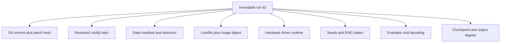

# Chapter 6 — ML Reproducibility Laboratory

## 1. Reproducibility is a spectrum

- **Repeatability:** same team and setup obtains the result again.
- **Reproducibility:** an independent setup obtains a materially equivalent result
  from the documented procedure.
- **Replicability:** an independent implementation/data collection supports the
  scientific conclusion.

Bitwise equality is sometimes achievable for a tiny CPU fixture and often neither
portable nor necessary for a distributed accelerator run. Define the contract:
which outputs must be exact, tolerance-bounded, distributionally consistent, or
only directionally replicated.

## 2. The run identity graph



A seed without RNG implementation/state, data order, worker count, and algorithm
settings is not a complete randomness record. A container without the host driver,
device architecture, or external service versions is not a complete environment.

## 3. Required repository contract

```text
project/
  README.md                 # one clean-room command and expectations
  pyproject.toml + lock     # language and dependency contract
  configs/                  # human-authored configs
  src/                      # importable implementation
  tests/                    # unit, property, integration, numerical checks
  scripts/                  # stable entry points, not notebook-only logic
  schemas/                  # config/data/checkpoint contracts
  manifests/                # small metadata; large bytes live elsewhere
  reports/                  # decisions and result summaries
```

Generated datasets and checkpoints should not silently enter ordinary Git. Store
an immutable URI/digest, byte size, schema, producer, access/license policy, and
retention status in a manifest.

## 4. Lab sequence

### Lab A — Clean-checkout repeat

1. Create a fresh checkout in a new directory.
2. Install only from the lock; do not reuse an active environment.
3. Verify input checksums and materialize the fully resolved config.
4. Run format/lint/tests and a tiny training job.
5. Compare output against the declared exact/tolerance contract.
6. Record wall time, platform, warnings, and deviations.

Passing inside the developer’s old environment does not count.

### Lab B — Dirty-worktree evidence

Modify one source line without committing, then launch a run. The launcher should
either refuse or record the commit plus a patch/content hash. Prove that the run
can be reconstructed. Merely recording `dirty=true` is insufficient.

### Lab C — Data identity fault

Change one input shard behind a stable path. The manifest verification must fail
before training. If it succeeds, path names—not content—are controlling evidence.

### Lab D — Evaluator drift

Score identical predictions with two evaluator revisions. The report must keep
both results distinct and never overwrite the old score under the same key.

### Lab E — Regression and recovery

Introduce a masking bug across a sequence of commits. Create a deterministic tiny
test, locate the first bad commit with bisect, delete the branch, recover its tip
from the reflog, and explain which recovery steps would fail on another clone.

## 5. Reproduction report template

| Field | Required answer |
|---|---|
| Claim | What exact result was tested? |
| Identity | Which commit, config, data, environment, evaluator, and artifact digests? |
| Procedure | Which command and resource requirements? |
| Contract | Exact equality, tolerance, confidence interval, or qualitative criterion? |
| Outcome | Matched, partially matched, failed, or inconclusive? |
| Deviations | Hardware, dependency, data access, or undocumented steps? |
| Diagnosis | Smallest evidence-backed cause? |
| Next action | Fix, rerun, narrow claim, or reject? |

## 6. Ruthless audit checklist

Fail the project if any answer is “unknown”:

- Can every reported number be joined to a concrete evaluator and predictions?
- Can every artifact be joined to the producing run and exact bytes?
- Is the resolved configuration stored, not only defaults and overrides?
- Are failed/preempted runs retained rather than silently excluded?
- Can an unauthorized user access training examples through logs or artifacts?
- Does CI test checkpoint save/load and a clean environment?
- Are mutable aliases resolved to immutable versions at use time?
- Can someone reproduce the result without the author’s shell history?

## 7. Senior interview prompt

Design experiment lineage for a lab with several repositories, petabytes of
licensed data, preemptible multi-cluster training, evaluator releases, and model
aliases. State consistency model, immutable IDs, access control, deletion/retention,
failure recovery, and how a paper table is reconstructed six months later.
