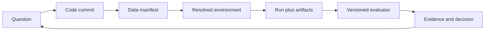

# Part 13 — Git, Collaboration, Research Engineering, and Reproducibility

This part first teaches Git as a general software-engineering system, from a first
repository through distributed collaboration and release workflows. It then applies
that knowledge to research method and reproducible ML experiments.

## Prerequisites and outcome

Complete Part 3 first. Parts 7 and 11 are needed for the final ML/research chapters.
At the end, you should be
able to recover damaged Git state, design reviewable experiment history, connect
a metric to immutable code/data/config/environment identities, and reproduce a
tiny training run from a clean checkout.

## Read in this order

| Chapter | Why it exists | Proof of mastery |
|---:|---|---|
| 1 | [Git fundamentals](01-git-fundamentals.md) | Create, inspect, stage, commit, branch, merge, ignore, tag, and safely undo |
| 2 | [Git internals and reproducibility](02-git-and-reproducibility.md) | Explain blobs/trees/commits/index/refs and environment identity |
| 3 | [Remotes, collaboration, reviews, and releases](03-remotes-collaboration-releases.md) | Fetch/push safely, run reviews, choose integration and release policy |
| 4 | [Advanced workflows, review, and recovery](04-git-workflows-review-recovery.md) | Resolve conflicts, split commits, bisect regressions, and recover lost tips |
| 5 | [Research engineering and experimental method](05-research-engineering.md) | Write a falsifiable claim, controls, stopping rule, and analysis plan |
| 6 | [ML reproducibility laboratory](06-ml-reproducibility-lab.md) | Produce an independently repeatable run bundle and audit it |

## Depth ladder

- Beginner: make snapshots, inspect differences, branch, merge, and ignore files.
- Working engineer: create atomic changes, review a pull request, resolve
  conflicts, tag releases, and recover common mistakes.
- Senior/research engineer: preserve experiment lineage, design CI evidence,
  separate code from large artifacts, manage schema/checkpoint compatibility,
  and define reproducibility boundaries honestly.

## Part project

Build a tiny model repository with a locked environment, dataset manifest,
resolved config, tests, a run record, and a deliberately injected regression.
Use automated `git bisect` to find the first bad commit, recover a deleted local
branch via the reflog, and write a short incident note explaining why neither a
branch name nor an experiment-dashboard URL is immutable provenance.

## Exit gate

Do not continue if you cannot answer all of these without notes:

1. How do working tree, index, `HEAD`, local branches, and remote-tracking refs differ?
2. What bytes and metadata determine a commit ID?
3. What do fetch, pull, push, merge, rebase, squash, revert, and restore each change?
4. Why does rebase change identities, and when is that dangerous?
5. How do you revoke a committed secret, and why is `.gitignore` insufficient?
6. Which identities are required to reproduce a model metric?
7. How would you distinguish a code regression from data/evaluator drift?
