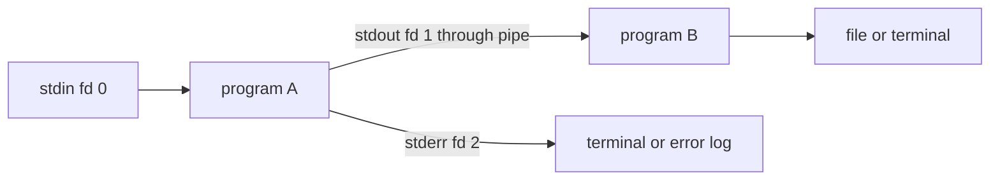

# Chapter 1 — Linux and Shell Fundamentals

Linux knowledge is not a list of commands. It is a mental model of paths, files,
processes, users, permissions, streams, services, packages, and the kernel resources
that programs share. Commands are observations or state transitions over that model.

## 1. Kernel, user space, distribution, and shell

- Linux kernel manages processes, virtual memory, filesystems, networking, devices,
  scheduling, and security primitives.
- User space contains libraries, commands, services, language runtimes, and apps.
- A distribution combines kernel, package repositories/manager, init/service system,
  filesystem conventions, and supported software.
- A terminal is an interface; a shell such as Bash or Zsh parses commands and runs
  programs. Do not confuse the terminal, shell, and operating system.

Containers normally share the host kernel. Docker Desktop on macOS/Windows commonly
runs Linux containers through a managed Linux VM, so host and container paths,
networking, permissions, and performance are not identical to native Linux.

## 2. Filesystem tree and paths

Linux uses a single tree rooted at `/`. Common locations vary by distribution but
typically include:

| Path | General role |
|---|---|
| `/etc` | system/service configuration |
| `/var` | changing service state, logs, caches, spools |
| `/usr` | installed user-space programs, libraries, shared data |
| `/bin`, `/sbin` | essential commands; often linked into `/usr` |
| `/home` | ordinary user home directories |
| `/root` | root user’s home, not filesystem root |
| `/tmp` | temporary files with system-specific cleanup/security behavior |
| `/dev` | device nodes and pseudo-devices |
| `/proc` | process/kernel virtual information |
| `/sys` | devices/kernel attributes virtual filesystem |
| `/run` | volatile runtime state since boot |
| `/opt`, `/srv` | optional/site software or served data by convention |

An absolute path begins at `/`; a relative path begins at the process current
directory. `.` is current and `..` parent. Normalize and validate untrusted paths;
symlinks and `..` can escape an intended directory.

## 3. Navigate and inspect safely

```bash
pwd
ls -la
stat path/to/file
file path/to/file
find . -maxdepth 2 -type f
rg 'pattern' src tests
```

`ls` output is for humans and has tricky quoting/newlines; avoid parsing it in
programs. Prefer structured APIs, null-delimited output where supported, or a
language filesystem library.

Use `du` for directory/file usage and `df` for filesystem free space. A deleted
file held open can consume blocks without appearing at its old path. Inodes, quota,
reserved space, mounts, and container layers can explain “no space” despite a
misleading single metric.

## 4. Create, copy, move, link, and remove

```bash
mkdir -p project/src
cp -- source destination
mv -- old new
ln -s target link-name
```

`--` ends options for commands that support it, preventing a filename starting
with `-` from becoming an option. Copy semantics for symlinks, permissions,
timestamps, sparse files, devices, and recursive trees depend on flags/tool.

A hard link is another directory entry for the same inode/filesystem object and
normally cannot cross filesystems. A symbolic link stores a target path and can be
dangling or cross filesystems.

Removal is not a beginner experiment on broad paths. Resolve exact targets, inspect
them, avoid untrusted globs/variables, and prefer recoverable trash/versioned storage
when practical. Git cannot recover untracked files removed by shell commands.

## 5. Globbing, quoting, and expansion

The shell performs expansions before launching a program. Important categories:

- parameter expansion: `$name` or `${name}`;
- command substitution: output of another command;
- pathname expansion/globbing: `*`, `?`, bracket patterns;
- word splitting (shell-specific rules);
- quote removal and redirection.

Use double quotes around variable expansions representing one argument:

```bash
printf '%s\n' "$project_path"
```

Single quotes preserve literal characters. Double quotes allow selected expansions.
Unquoted values can split or expand into paths; filenames can contain spaces,
newlines, wildcard characters, and leading dashes. Never build shell commands by
concatenating untrusted input; use argument arrays or direct process APIs.

## 6. Standard streams, redirection, and pipes

Each process conventionally starts with file descriptors:

- 0: standard input;
- 1: standard output;
- 2: standard error.



Redirection is performed by the shell before execution. `>` truncates/creates;
`>>` appends; `<` provides input; exact descriptor syntax varies by shell.
Pipelines connect stdout of one process to stdin of the next. Without a pipefail
policy, a pipeline may report only the last command’s status, hiding earlier
failure. Do not log secrets or mix machine output with progress/error text.

## 7. Environment and command lookup

Environment variables are inherited string key/value data. Shell variables need
exporting to become environment for children. Inspect deliberately:

```bash
printenv
command -v python
type git
```

`PATH` is an ordered list of command-search directories. Putting a writable or
untrusted directory early can execute the wrong program. Current directory is not
automatically safe. Use absolute paths in privileged automation where appropriate.

Environment variables are convenient configuration, not a secret vault: they can
leak through diagnostics, child processes, crash reports, or orchestration views.

## 8. Users, groups, ownership, and mode bits

Every process has user/group identities and capabilities/credentials. Inspect:

```bash
id
ls -l path
namei -l path
```

Read/write/execute apply to owner, group, and other. For directories, read lists
entries, write modifies entries, and execute permits traversal/search. Effective
access also depends on parent directories, ACLs, mount options, security modules,
capabilities, namespaces, and remote filesystem policy.

`sudo` executes with delegated privilege according to policy; it is not a general
fix for permissions. Prefer correct ownership/group/ACL and least privilege. Audit
privileged actions.

## 9. Processes and jobs

```bash
ps -ef
ps -o pid,ppid,user,stat,etime,pcpu,pmem,command -p PID
jobs
fg %1
bg %1
```

A shell can run foreground/background jobs; a process has PID, parent, credentials,
current directory, environment, descriptors, address space, threads, and signal
state. Shell `&` starts a background job but does not make a reliable service.
Terminal hangup/session behavior, output, restarts, and lifecycle still matter.

Signals request/notify conditions. `SIGTERM` is handleable graceful termination;
`SIGKILL` cannot be handled. `Ctrl-C` typically sends `SIGINT` to the foreground
process group. Identify exact PID/process group before signaling.

## 10. Exit status and shell scripting

Exit 0 conventionally means success; nonzero communicates failure categories.
Check status immediately or use conditional constructs. A robust script should:

- declare its intended shell;
- validate arguments, paths, required commands, and preconditions;
- quote values and use arrays for arguments;
- handle temporary files/directories safely;
- propagate meaningful failures and clean up with traps where appropriate;
- avoid printing secrets;
- be idempotent or document side effects;
- be tested with edge-case filenames and interrupted execution.

Shell is excellent for small orchestration. Use a tested language when parsing,
complex state, concurrency, data structures, or security boundaries grow.

## 11. Packages, services, logs, and scheduled work

Distribution package managers install signed repository packages, track files and
dependencies, and apply updates. Do not mix system packages, manual `/usr` writes,
language environments, and copied binaries without knowing precedence/ownership.

Many distributions use systemd:

```bash
systemctl status SERVICE
journalctl -u SERVICE --since today
```

A service unit defines executable, identity, environment, dependencies, restart,
limits, and sandboxing. Repeated auto-restart can hide crash loops; inspect exit
reason and logs.

Cron/systemd timers schedule commands, but jobs need explicit environment, paths,
locking/overlap policy, timeout, idempotency, output/alerting, and missed-run policy.

## 12. Archives, compression, and integrity

Tar groups filesystem entries; gzip/zstd-like tools compress streams. Archive
extraction is a security boundary: paths, symlinks, permissions, devices, and
resource expansion can escape/overwhelm a destination. Inspect and extract untrusted
archives with safe library/runtime controls.

Checksums such as SHA-256 detect byte changes when compared to a trusted expected
digest. They do not authenticate an untrusted digest. Signatures bind content to a
key/identity under a trust model.

## 13. Network and resource commands

Useful read-only starting points:

```bash
ip address
ip route
ss -lntup
getent hosts example.com
curl -v https://example.com/
df -h
df -i
free -h
uptime
```

Availability differs by OS/container. Understand scope: host or namespace, physical
or virtual interface, process or cgroup, filesystem or directory. Chapter 2 builds
the diagnostic model.

## 14. Linux fundamentals lab

1. Draw `/`, current directory, home, mount, hard link, and symlink relationships.
2. Create files containing spaces/dashes; operate on them safely with quoting/`--`.
3. Send stdout and stderr to separate destinations and detect pipeline failure.
4. Create users/groups in an authorized disposable environment and predict access.
5. Launch a process, inspect parent/descriptors, send TERM, and observe exit status.
6. Create a service-like script with validation, logs, timeout, and clean shutdown.
7. Diagnose disk blocks versus inodes and a deleted-open-file scenario conceptually.

## 15. Exit questions

Explain terminal versus shell, absolute versus relative path, hard versus symbolic
link, working directory versus home, mode bits on directories, stdout versus stderr,
pipe versus redirection, shell variable versus environment, process versus thread,
TERM versus KILL, package versus language environment, and checksum versus signature.

