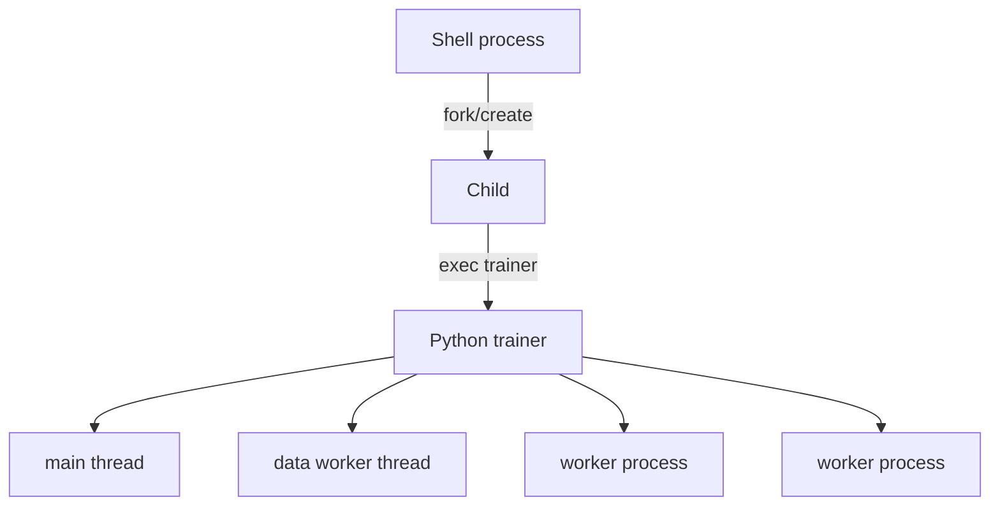

# Chapter 2 — Linux Systems, Resources, and Diagnostics

## 1. Why ML engineers need operating-system literacy

Training and inference failures often appear in Python but originate below it:
file descriptors, virtual memory, page cache, process signals, DNS, sockets,
permissions, cgroup limits, device visibility, or storage/network saturation.
Senior engineers form a layered hypothesis before restarting the job.

## 2. Processes, threads, and exit status

A process has an address space, open file descriptors, credentials, environment,
signal dispositions, and one or more threads. A parent may create a child; an
`exec`-family call replaces the process program while retaining selected process
state. A thread shares its process address space and descriptors.



Exit 0 conventionally signals success; nonzero signals failure. Shell pipelines,
wrappers, schedulers, and orchestrators must preserve meaningful exit status.
Catching every exception and exiting 0 turns a failed experiment into false
success.

### Signals and graceful termination

`SIGTERM` requests termination and can be handled; `SIGKILL` cannot. On a
preemption notice, stop admitting new work, coordinate ranks, publish an atomic
checkpoint if time permits, flush critical metadata, and exit. A handler must not
start a checkpoint that cannot finish before the scheduler deadline.

PID 1 has special signal/reaping behavior in a container. Prefer exec-form
entrypoints so the application receives signals, and use an init when child
reaping is required.

## 3. Files, descriptors, and permissions

An open file descriptor is a process-local integer referring to an open file,
pipe, socket, or device. Data loaders can exhaust the per-process limit through
many shards/workers. Diagnose the count and pattern; raising a limit without
closing leaks only postpones failure.

Linux discretionary permissions distinguish owner, group, and other read/write/
execute bits. Directories require execute permission for traversal. Container
bind mounts use host ownership/IDs; “permission denied” may arise from UID/GID
mismatch, read-only mounts, security modules, or parent directory traversal.

Never solve an unexplained permission problem with world-writable paths or a
privileged container.

## 4. Virtual memory and OOM reasoning

Virtual addresses are mapped to physical pages or backing storage. Important
measurements differ:

- virtual size includes mappings that may not be resident;
- RSS approximates resident pages but includes shared/accounting subtleties;
- page cache accelerates file I/O and is reclaimable under pressure;
- anonymous memory holds heaps/stacks and is not simply a file cache;
- cgroup memory may be lower than host memory;
- GPU device memory is a separate allocator/domain.

```text
model parameters + gradients + optimizer state + activations + temporary buffers
+ dataloader/prefetch + framework/runtime overhead <= effective memory limit
```

A process can be killed despite `free` showing host memory because its cgroup
limit is exceeded. Conversely, high used memory may be healthy page cache.
Distinguish kernel/cgroup OOM from Python `MemoryError` and accelerator OOM.

## 5. CPU scheduling and oversubscription

Data-loader processes, BLAS/OpenMP threads, tokenizers, compression, and the
trainer may each create concurrency. Multiplying them can produce hundreds of
runnable threads, context switching, cache contention, and worse throughput.

Measure runnable load and per-core utilization. Set thread pools and worker count
from experiments, CPU affinity/topology, and I/O behavior—not “all available
cores.” In distributed jobs multiply settings by processes per node.

## 6. Storage and I/O

Separate throughput, latency, IOPS, and metadata rate. Millions of tiny files can
overload metadata operations while byte throughput remains low. Shared storage may
perform well for sequential shards and poorly under synchronized checkpoints.

Atomic publication pattern:

1. write to a unique temporary/versioned object;
2. flush/close and verify expected size or checksum;
3. publish a final manifest/pointer only after all components succeed;
4. readers consume only complete manifests.

Rename atomicity depends on filesystem and boundary; object storage is not a
POSIX filesystem. Verify the system’s documented semantics.

## 7. Networking essentials

DNS maps names to addresses; TCP provides an ordered byte stream, not message
boundaries; listening binds a socket; a connection involves local/remote address
and port. Timeouts should cover connect, request/idle, and total operation as
appropriate. Retries require bounded backoff, jitter, deadline propagation, and
idempotency.

For distributed training, every rank must agree on rendezvous endpoint, world
size, rank, network interface, and collective sequence. One crashed rank can leave
peers blocked. A timeout is diagnostic containment, not a root-cause fix.

## 8. Read-only diagnostic sequence

Start from evidence:

```bash
ps -eo pid,ppid,stat,pcpu,pmem,etime,command
df -h
df -i
ss -lntp
ulimit -a
```

Use `top`/`htop`, `pidstat`, `iostat`, `vmstat`, `lsof`, `strace`, `perf`, and
accelerator/vendor tools when installed and authorized. Know the measurement
scope: host, namespace, process, cgroup, filesystem, or device.

### Symptom-to-hypothesis table

| Symptom | First distinctions |
|---|---|
| GPU idle, CPU busy | input preprocessing, Python/launch overhead, compilation |
| GPU idle, CPU idle | storage/network wait, barrier, dead process, throttling |
| abrupt exit 137 | investigate SIGKILL/OOM/preemption; code alone is insufficient |
| no space despite free bytes | inode exhaustion, quota, deleted-open files |
| connection refused | address reachable but no listener/wrong port |
| timeout | DNS, route/firewall, overloaded server, lost peer, deadline too short |
| permission denied | UID/GID/mode, mount options, security policy, credential scope |

## 9. Lab and interview checks

Run a CPU/data-loading toy workload. Vary process workers and numerical-library
threads; plot examples/second and context switches. Constrain memory with a safe
local runtime, observe failure evidence, and explain the difference between
host-level and cgroup-level readings.

Interview prompt: eight GPU workers are at 20% utilization after a dataloader
change. Give an ordered diagnostic plan, required telemetry, hypotheses that each
observation eliminates, and a rollback criterion.
