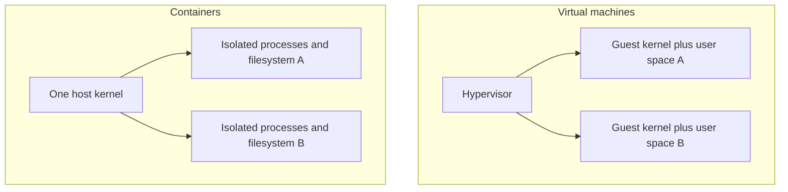
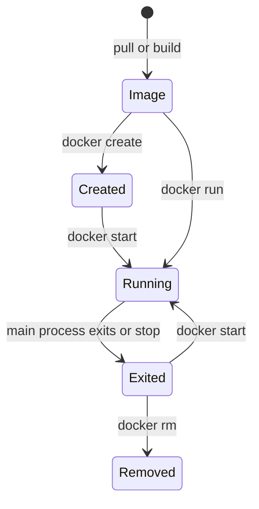

# Chapter 3 — Containers and Docker Fundamentals

## 1. The problem containers solve

Applications depend on filesystem content, process configuration, users, network,
resource limits, and runtime libraries. Containers package an image and run its
processes in isolated resource views with controlled host integration. This makes
distribution and deployment more repeatable, but does not package the host kernel,
hardware, physical network/storage, or every external dependency.

## 2. Container versus virtual machine



VMs virtualize hardware and run guest kernels; ordinary Linux containers isolate
processes sharing a kernel. Containers often start faster/use fewer resources, but
the shared-kernel security boundary differs. Desktop products may place all Linux
containers inside a VM on non-Linux hosts.

## 3. Kernel mechanisms and OCI roles

- namespaces isolate views of process IDs, mounts, network, hostnames, IPC, users;
- cgroups account/control CPU, memory, I/O, process counts and devices;
- capabilities split traditional root privilege;
- seccomp/security modules restrict system calls and access;
- layered filesystems provide image layers plus a writable container layer.

OCI specifications define image format/distribution/runtime interfaces. Docker is
an ecosystem and user interface around standards and components; containerd/CRI-O
and low-level runtimes are used in other stacks. A “Docker image” is generally an
OCI-compatible image, but feature/platform compatibility still requires testing.

## 4. Docker architecture

The Docker client sends API requests to a daemon; the daemon manages images,
containers, networks, volumes, and registry exchange. Docker Compose is a client
for multi-container application definitions. Docker contexts can target different
daemons—verify context before commands that mutate or publish resources.

```bash
docker version
docker info
docker context ls
docker context show
```

Client and server versions may differ. `docker info` can contain operational
details; sanitize before sharing.

## 5. Image, container, registry, repository, tag, digest

| Term | Meaning |
|---|---|
| image | immutable content-addressed layers plus runtime configuration |
| container | created/running/stopped instance of an image plus runtime config/state |
| registry | service storing/distributing image manifests and blobs |
| repository | named collection of image versions in a registry |
| tag | mutable human-readable reference such as `1.4` |
| digest | content identity such as a manifest SHA-256 digest |

Tags can move; digests support exact promotion/rollback. Multi-platform image
indexes may resolve to platform-specific manifests. Record the resolved digest and
platform used.

## 6. Pull, create, start, run, stop, remove



`docker run` combines pull-if-needed, create, and start. Container life is tied to
its main process. Exiting an interactive shell stops a container if that shell is
PID 1. `--rm` removes it after exit; use only when output is stored elsewhere.

```bash
docker pull alpine:3
docker image ls
docker run --rm alpine:3 cat /etc/os-release
docker container ls --all
```

Examples are educational; pin verified digests for promoted artifacts.

## 7. Interactive, attached, and detached execution

- `-i` keeps stdin open;
- `-t` allocates a pseudo-terminal;
- `-d` starts detached;
- attach connects to the main process streams;
- exec launches an additional process in a running container.

```bash
docker run --name demo -d nginx:alpine
docker logs demo
docker exec demo nginx -T
docker stop demo
docker rm demo
```

`docker exec` changes/debugs a live instance but does not update the image or a
declarative deployment. Avoid “fixing production” interactively without capturing
the actual source/config change.

## 8. Inspecting containers

```bash
docker inspect CONTAINER
docker logs --timestamps CONTAINER
docker top CONTAINER
docker stats CONTAINER
docker diff CONTAINER
docker port CONTAINER
```

Logs show stdout/stderr according to logging driver and retention. Inspect shows
configuration and can include sensitive values. Stats provide scoped resource
signals, not a complete profiler. `docker diff` shows writable-layer filesystem
changes, not mounted-volume content.

## 9. Environment, command, entrypoint, and working directory

Image configuration defines default `ENTRYPOINT`, `CMD`, environment, user,
working directory, and metadata. At run time, arguments may replace/append according
to Docker semantics. Prefer exec-form JSON for main processes so signals are
delivered directly and shell expansion is not accidentally introduced.

Configuration precedence can span image, Compose, environment files, CLI, and
application defaults. Materialize/inspect the effective configuration without
exposing secrets.

## 10. Port publishing

A process listens inside the container network namespace. `EXPOSE` documents an
intended port; it does not publish it. `-p HOST:CONTAINER` creates host mapping:

```bash
docker run --rm -p 127.0.0.1:8080:80 nginx:alpine
```

Binding to loopback limits host exposure; binding all interfaces may expose the
service to the network. Firewall/desktop/VM/cloud rules still apply. Do not confuse
container port, host port, and remote service address.

## 11. Persistent state

Container writable layer is coupled to the instance and is not durable application
storage. Use named volumes, bind mounts, or external storage deliberately:

```bash
docker volume create app-data
docker run --rm -v app-data:/data IMAGE
docker run --rm --mount type=bind,src=/absolute/host/path,dst=/input,readonly IMAGE
```

Bind mounts expose host paths/permissions and can overwrite image paths. Named
volumes are runtime-managed but still need backup/restore/ownership policy.
Never mount the host root or Docker socket into untrusted containers.

## 12. Resource limits and process behavior

Set memory, CPU, process, shared-memory, and device controls based on measured
requirements. A container sees namespaced/cgroup-limited resources, but libraries
may incorrectly infer host CPU/memory. Test under real limits.

Docker stop normally sends a configurable termination signal then kills after a
timeout. The main process must handle termination and reap children where needed.

## 13. Registries and login

```bash
docker login REGISTRY
docker tag local-image REGISTRY/namespace/app:version
docker push REGISTRY/namespace/app:version
```

Use credential helpers or workload identity; do not pass passwords on command
lines or store plaintext config. Registries need access control, retention,
immutability, vulnerability scanning, signing/provenance, replication, and audit.
Pull by digest for exact deployment.

## 14. Cleanup without data loss

Images, stopped containers, build cache, networks, and volumes consume space.
Inspect exact resources and references before removal. Broad prune commands can
delete caches or unused volumes needed for recovery. A volume being “unused by a
container” is not evidence that its data is disposable.

## 15. Rootful, rootless, and Docker socket risk

A rootful daemon has high host privilege. Membership/access to its Unix socket can
effectively grant host-root capabilities because a client can request privileged
mounts/containers. Restrict access. Rootless mode reduces daemon/runtime privilege
but has networking, storage, cgroup/device limitations depending on setup.

Containers are not safe sandboxes for arbitrary hostile code by default. Add VM/
microVM/sandbox isolation and strict resource/network/filesystem controls as needed.

## 16. Fundamentals lab

1. Pull an image and distinguish tag, manifest digest, config, and layers.
2. Run attached/detached; inspect lifecycle, logs, exit code, PID 1 and signals.
3. Compare writable layer, named volume, bind mount, and read-only root.
4. Publish a loopback-only port and explain every address/port.
5. set CPU/memory limits and observe scoped metrics/failure.
6. push to an authorized disposable registry and deploy by digest.
7. inspect cleanup candidates without removing unknown data.

## 17. Exit questions

Explain container versus VM, image versus container, registry versus repository,
tag versus digest, create versus run, attach versus exec, `EXPOSE` versus publish,
volume versus bind mount, rootfs versus persistent storage, root versus rootless,
and why Docker-socket access is privileged.

