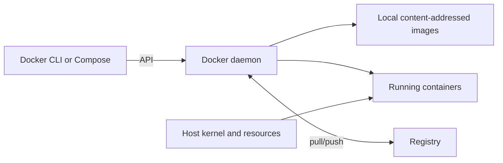

# Chapter 4 — Docker Images, Builds, Runtime Security, and GPU Practice

## 1. Client, daemon, registry, image, container


*Web visual: [Docker overview](https://docs.docker.com/get-started/docker-overview/).
The diagram below is an offline conceptual fallback.*



The CLI requests an operation. The daemon/runtime creates namespaces, cgroups,
mounts, networking, and processes. A registry stores image manifests and blobs.
An image is immutable content plus configuration; a container is a runtime
instance with mutable process and writable-layer state.

## 2. Image identity and layers

A tag such as `trainer:latest` is a movable name. A digest identifies specific
manifest content. Record and deploy the resolved digest. Layer caching is based on
instruction inputs; it can accelerate a build but must never be required for its
correctness.

Deleting a secret in a later Dockerfile instruction does not remove it from an
earlier layer. Keep secrets outside build context and use supported ephemeral
secret mounts for authenticated dependency access.

## 3. Build a production-shaped image

Principles:

- pin a compatible base digest and locked dependencies;
- copy dependency manifests before frequently changing source;
- use multi-stage builds to separate compilers from runtime;
- create a non-root numeric UID/GID;
- use exec-form entrypoint and unbuffered structured logs;
- include only runtime code; exclude `.git`, data, keys, checkpoints, and caches;
- label source revision and build provenance without treating labels as truth;
- scan vulnerabilities/licenses and produce SBOM/provenance evidence.

```dockerfile
# syntax=docker/dockerfile:1
FROM python:3.12-slim AS wheels
WORKDIR /build
COPY requirements.lock ./
RUN --mount=type=cache,target=/root/.cache/pip \
    pip wheel --wheel-dir /wheels -r requirements.lock

FROM python:3.12-slim
RUN groupadd --system --gid 10001 app \
    && useradd --system --uid 10001 --gid 10001 app
WORKDIR /app
COPY --from=wheels /wheels /wheels
COPY requirements.lock ./
RUN pip install --no-index --find-links=/wheels -r requirements.lock \
    && rm -rf /wheels
COPY --chown=10001:10001 src/ ./src/
USER 10001:10001
ENV PYTHONUNBUFFERED=1 PYTHONPATH=/app/src
ENTRYPOINT ["python", "-m", "trainer.main"]
```

For real promotion, replace floating bases with verified compatible digests.
Rebuild regularly for security fixes; immutability means make and promote a new
artifact, not leave vulnerable bytes forever.

## 4. Build context and cache lab

Create `.dockerignore` before building. Inspect context size, image history, final
packages, user, entrypoint, exposed files, and digest. Then change only source and
observe which steps reuse cache; change the lock and observe dependency rebuild.

Acceptance checks:

```bash
docker build --tag tiny-trainer:test .
docker image inspect tiny-trainer:test
docker history tiny-trainer:test
docker run --rm --read-only tiny-trainer:test --help
```

A read-only root may require explicit writable temporary/checkpoint mounts. That
failure is useful: it reveals an undeclared state dependency.

## 5. Runtime storage

- writable container layer: ephemeral, poor place for checkpoints;
- named volume: runtime-managed persistent data;
- bind mount: host path exposed directly, convenient but couples permissions and
  layout;
- object/shared storage: external durability and scaling with separate semantics.

Treat models/configs as read-only inputs and checkpoints/results as explicit
outputs. Never infer success merely because bytes exist; publish a verified
completion manifest.

## 6. Networking and ports

`EXPOSE` documents an intended port; it does not publish it. Port publishing maps
a host address/port to the container. Services on a user-defined network should
use service discovery names and container ports. Binding to `127.0.0.1` inside a
container may prevent peers from reaching the service; binding broadly requires
access control and safe publication.

## 7. GPU compatibility contract

```text
host GPU + kernel driver
        ↕ runtime device/library injection
container user-space CUDA/ROCm + framework + kernels
        ↕ model shapes/dtypes and communication library
```

Validate device visibility, framework allocation, a small compute result, and
multi-device collective behavior. `nvidia-smi` alone does not prove framework,
kernel, NCCL, topology, shared-memory, or numeric correctness.

For each promoted GPU image record supported accelerator architecture, minimum
driver/runtime, framework build, collective library, precision behavior, and test
matrix. Use Docker’s current [GPU support documentation](https://docs.docker.com/compose/how-tos/gpu-support/)
for version-specific Compose syntax.

## 8. Runtime hardening

Run non-root, drop unnecessary capabilities, avoid privileged mode and the host
Docker socket, use a read-only root, scope mounts/devices, set resource and PID
limits, use workload identity or secret mounts, restrict egress, and define
termination behavior. Containers share the host kernel; use stronger sandbox/VM
isolation for hostile generated code or untrusted models.

## 9. Failure drills

1. Put a key in an early build layer and delete it later. Prove why history still
   exposes it, then rotate the key and repair the build.
2. Run with an unwritable checkpoint mount. Diagnose UID/GID and mount mode without
   making the directory world-writable.
3. Send SIGTERM during a batch. Verify the main process receives it and publishes
   at most one complete checkpoint.
4. Limit CPU/memory and compare host readings with container-scoped evidence.
5. Replace a tag after recording it. Show why the digest is required for rollback.
