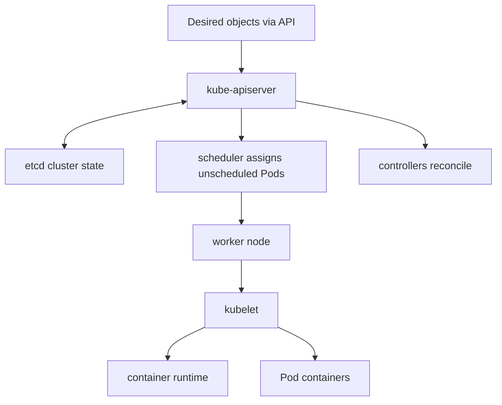

# Chapter 6 — Kubernetes Fundamentals

Kubernetes is an API-driven control system that continuously reconciles declared
desired state with observed cluster state. It schedules Pods and manages resources;
it does not automatically make applications stateless, secure, correct, or highly
available.

## 1. Cluster architecture

Control-plane components include API server, persistent cluster state store,
scheduler, and controllers. Each worker runs a node agent and container runtime;
network/storage/device plugins integrate infrastructure.



The API server is the primary control-plane interface. Controllers are level-
triggered reconciliation loops; temporary differences are expected.

## 2. Objects and manifests

Objects have `apiVersion`, `kind`, metadata, desired `spec`, and observed `status`.
Names identify within scope; UIDs distinguish incarnations. Labels are indexed
selection/grouping metadata; annotations store non-identifying metadata.

Declarative configuration enables review and reconciliation, but last-writer/
field ownership, defaults, mutating admission, and server version affect effective
objects. Inspect server-side result.

## 3. Namespaces and multi-tenancy

Namespaces scope many names/resources and policy. They are not complete hostile-
tenant isolation. Combine RBAC, quotas, network policies, Pod security, node/runtime
isolation, secrets, admission policy, and possibly separate clusters.

## 4. Pods

A Pod is the scheduling unit containing one or more tightly coupled containers
sharing network namespace and configured volumes. Containers in one Pod address
each other through localhost. Pods are replaceable; their IP and local writable
state are ephemeral.

Use init containers for ordered setup that must finish; sidecars for true supporting
lifecycle. Too many unrelated containers in one Pod couple scaling and failure.

Pod phases/conditions and container states/reasons differ. A Pod may be Running
while not Ready or while one container repeatedly restarts.

## 5. Workload controllers

- Deployment: stateless replicated rolling application via ReplicaSets;
- StatefulSet: stable identities and ordered/storage-aware management, not a
  replacement for database consensus/replication;
- DaemonSet: one/selected Pod per node for agents;
- Job: finite successful completion with retry semantics;
- CronJob: schedules Jobs; overlapping/missed/time-zone/idempotency policy matters.

Choose controller from lifecycle/state, not template familiarity.

## 6. Services and discovery

A Service selects endpoints and provides a stable virtual access abstraction.
ClusterIP is internal; NodePort exposes on nodes; LoadBalancer integrates external
load balancing; headless services expose endpoint DNS for direct discovery.

Selectors must match intended Pods. EndpointSlice state proves selected ready
endpoints. Ingress historically routes HTTP via a controller; Gateway API provides
newer expressive traffic APIs. Installing an API object without a corresponding
controller/infrastructure does nothing useful.

NetworkPolicy behavior requires a supporting network plugin and policies for both
ingress/egress. Default allow can surprise.

## 7. ConfigMaps and Secrets

ConfigMaps hold non-secret configuration. Secrets are API objects for sensitive
bytes but base64 is encoding, not encryption. Protect through RBAC, encryption at
rest, external secret/workload identity, rotation, audit, namespace/pod isolation,
and avoiding logs/environment leakage.

Mounted and environment-based updates have different refresh/restart behavior.
Version behavior-affecting configuration and make rollout explicit.

## 8. Volumes and persistent storage

Pod volumes share data among containers and live according to volume type. Persistent
Volumes/Claims decouple requested storage from provisioning; StorageClasses control
dynamic provisioning. Access modes describe capabilities under a driver, not every
application consistency guarantee.

Understand reclaim policy, snapshots, topology/zone, filesystem permissions,
expansion, backup/restore, performance, attachment limits, and what happens when a
Pod moves nodes.

## 9. Requests, limits, QoS, and scheduling

Scheduler places Pods using resource requests and constraints against allocatable
capacity. Limits constrain runtime according to resource. CPU may throttle; memory
limit can OOM-kill. Requests affect placement/QoS and cluster capacity.

Node selectors/affinity, anti-affinity, taints/tolerations, topology spread,
priority/preemption, quotas, and device resources express policy. An overly narrow
request may remain Pending even when aggregate resources appear free.

## 10. Probes and lifecycle

- startup: allow initialization before liveness/readiness;
- readiness: whether endpoint should receive traffic;
- liveness: whether local process should restart;
- termination grace and preStop: bounded shutdown coordination.

Bad probes cause cascading failure. Liveness should not fail just because a remote
dependency is down. Readiness can remove traffic while recovery occurs.

## 11. RBAC and service accounts

Subjects receive verbs on resources through Roles/ClusterRoles and bindings. Use
dedicated service accounts, least privilege, short-lived projected tokens, namespace
scope where possible, and audit. Permission to create powerful Pods/workloads can
be privilege escalation even without explicit secret-read rights.

## 12. Deployment and rollout

Deployments use rolling updates controlled by surge/unavailable and readiness.
Image tag movement and `imagePullPolicy` can make replicas run different bytes;
use immutable digests for promotion. Schema/API/data migrations need compatibility
across old/new replicas and rollback planning.

## 13. Observability and debugging ladder

```bash
kubectl get pods -A -o wide
kubectl describe pod POD
kubectl logs POD --all-containers --previous
kubectl get events --sort-by=.metadata.creationTimestamp
kubectl get endpointslice
kubectl auth can-i VERB RESOURCE
```

Start with object status/reason/events, then container logs, effective config,
network endpoints/DNS, resources/cgroup, node/runtime/storage. Ephemeral debug
containers help when images are minimal, subject to authorization.

## 14. Kubernetes lab

Deploy a small API using Namespace, Deployment, Service, ConfigMap, Secret reference,
requests/limits, probes, security context, and network policy in an authorized local
cluster. Inject bad image, unschedulable request, failed readiness, missing config,
wrong selector, denied egress, OOM, and rollout regression. Diagnose each from
status/events/logs and demonstrate rollback.

## 15. Exit questions

Explain desired versus observed state, Pod versus container, Deployment versus Job
versus StatefulSet, labels versus annotations, Service versus Ingress/Gateway,
request versus limit, readiness versus liveness, ConfigMap versus Secret, RBAC
versus network policy, and why namespace alone is not strong multi-tenancy.

