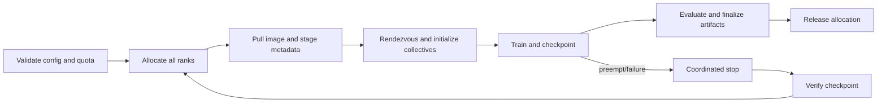

# Chapter 8 — Container and Cluster Operations Reference

> **Placement:** Use after Chapters 1–7 as the consolidated ML operations reference.

## 1. The environment stack

An ML job executes across layers:

```text
source/config
-> language packages
-> container filesystem and process config
-> host kernel and device runtime
-> accelerator driver/firmware
-> scheduler allocation
-> network/storage services
```

A container does not package the host kernel, physical GPU driver, network fabric,
or scheduler. “It works in the image” is therefore insufficient for distributed
reproducibility.

## 2. Linux primitives behind containers

Containers use operating-system mechanisms such as:

- namespaces for isolated views of processes, mounts, networking, users, etc.;
- cgroups for accounting and limits on CPU, memory, I/O, and devices;
- capabilities to divide root privileges;
- seccomp and security modules to constrain system calls/access;
- layered/union filesystems for image layers and writable container state.

Sharing a host kernel means a container is not automatically a strong hostile-
tenant security boundary. Use appropriate sandboxing/VM isolation for untrusted
model code, datasets, or generated programs.

## 3. OCI image mental model

An image is content-addressed layers plus configuration. A container adds a
writable layer and runtime resources.

- registry tag is movable; digest is immutable content identity;
- every Dockerfile instruction may create/cache a layer;
- removing a file later does not erase it from an earlier layer;
- build context contents can invalidate cache or leak if not ignored;
- image portability does not guarantee hardware/runtime compatibility.

Promote the same tested image digest across environments. Do not rebuild from a
floating tag separately in staging and production.

## 4. A production-shaped training Dockerfile

```dockerfile
# syntax=docker/dockerfile:1
FROM python:3.12-slim@sha256:REPLACE_WITH_VERIFIED_DIGEST AS build

ENV PIP_DISABLE_PIP_VERSION_CHECK=1 \
    PYTHONDONTWRITEBYTECODE=1

WORKDIR /build
COPY pyproject.toml uv.lock ./
RUN --mount=type=cache,target=/root/.cache \
    pip install --no-cache-dir uv && \
    uv export --frozen --no-dev --output-file requirements.txt && \
    pip wheel --wheel-dir /wheels -r requirements.txt

FROM python:3.12-slim@sha256:REPLACE_WITH_VERIFIED_DIGEST
RUN groupadd --system app && useradd --system --gid app --uid 10001 app
WORKDIR /app
COPY --from=build /wheels /wheels
COPY --from=build /build/requirements.txt /tmp/requirements.txt
RUN pip install --no-cache-dir --no-index --find-links=/wheels \
      -r /tmp/requirements.txt && \
    rm -rf /wheels /tmp/requirements.txt
COPY --chown=app:app src/ ./src/
USER 10001:10001
ENV PYTHONPATH=/app/src PYTHONUNBUFFERED=1
ENTRYPOINT ["python", "-m", "training.launch"]
```

The digest placeholders must be replaced with verified compatible images. For GPU
training, use a trusted CUDA/framework base matched to driver requirements and
apply the same pinning/scanning principles. Avoid copying credentials or private
package tokens into layers; use BuildKit secret mounts and ensure outputs do not
persist secrets.

## 5. Build quality and caching

### `.dockerignore`

Exclude `.git`, datasets, checkpoints, secrets, virtual environments, caches, and
unrelated build output. The build context is an input boundary.

### Multi-stage builds

Keep compilers/headers in build stage and runtime dependencies in final stage.
This reduces attack surface and transfer size, but extremely small images can make
debugging and compatibility harder. Optimize from measured requirements.

### Cache strategy

Copy lock/manifests before frequently changing source so dependency layers reuse.
BuildKit cache mounts accelerate downloads without baking cache into the image.
Cache is a performance feature, not correctness; a reproducible clean build must
still succeed.

### Supply-chain evidence

- pinned base digest and dependency hashes;
- vulnerability and license scans;
- SBOM and provenance attestation;
- signed image/artifact where policy requires;
- minimal package repository and network access;
- repeatable rebuild and patch cadence.

## 6. Container runtime hardening

- run as non-root and avoid privileged mode;
- drop unneeded Linux capabilities;
- read-only root filesystem with explicit writable mounts;
- no host Docker socket or broad host mounts;
- resource requests/limits and process limits;
- secret mounts or workload identity, never baked credentials;
- network egress policy and metadata-service protection;
- health/readiness only for services, not a substitute for task success;
- graceful SIGTERM handling within scheduler deadline.

Training jobs should catch termination at safe boundaries, request a checkpoint,
write atomically/versioned, verify completion, and exit with meaningful status.

## 7. GPU containers

The host owns the kernel driver. Container tooling injects device nodes and needed
driver libraries; the image includes user-space CUDA/framework libraries.

Compatibility questions:

- does the host driver support the container CUDA runtime?
- was the framework built for the GPU architecture?
- are NCCL/RCCL and network plugins compatible?
- are shared memory and pinned-memory limits sufficient?
- are all ranks using the same image and libraries?
- is device visibility mapped correctly?

Smoke test the exact image on every cluster class:

```bash
nvidia-smi
python -c "import torch; print(torch.cuda.is_available(), torch.cuda.get_device_name())"
```

This only verifies access; it does not validate multi-GPU communication or
numerical correctness.

## 8. Docker Compose for local integration

Compose defines multi-container development/tests: training API, tracker, object-
store emulator, database, and observability. It is not automatically a production
orchestrator.

```yaml
services:
  trainer:
    build:
      context: .
    volumes:
      - checkpoints:/checkpoints
    deploy:
      resources:
        reservations:
          devices:
            - driver: nvidia
              count: 1
              capabilities: [gpu]
    environment:
      CHECKPOINT_DIR: /checkpoints
volumes:
  checkpoints: {}
```

Pin images and keep secrets outside the file. GPU syntax and runtime prerequisites
depend on host configuration; verify with current Docker documentation.

## 9. Scheduler concepts

A cluster scheduler maps job resource requests onto machines subject to:

- capacity and topology;
- queue, quota, priority, and fairness;
- gang/co-scheduling for distributed jobs;
- accelerator type/memory/interconnect constraints;
- preemption and checkpointability;
- data/image locality;
- failure domains and maintenance;
- reservation/backfill and utilization.

Requesting too little causes OOM/eviction; too much wastes scarce capacity and can
increase queue time. Measure peak and declare intentional headroom.

## 10. Kubernetes job model

Kubernetes schedules Pods. Batch work commonly uses Jobs, plus an operator or queue
controller for coordinated distributed training. GPUs are exposed through vendor
device plugins as schedulable resources.

Illustrative single-worker Job:

```yaml
apiVersion: batch/v1
kind: Job
metadata:
  name: tiny-train
spec:
  backoffLimit: 2
  template:
    spec:
      restartPolicy: Never
      containers:
        - name: trainer
          image: registry.example/train@sha256:IMMUTABLE_DIGEST
          args: ["--config", "/configs/tiny.yaml"]
          resources:
            requests:
              cpu: "8"
              memory: 64Gi
              vendor.example/gpu: "1"
            limits:
              vendor.example/gpu: "1"
          volumeMounts:
            - name: config
              mountPath: /configs
              readOnly: true
      volumes:
        - name: config
          configMap:
            name: tiny-train-config
```

The generic resource name must match the installed device plugin. Production
considerations:

- node labels, affinity, taints/tolerations, topology spread;
- priority class and preemption policy;
- service account and least-privilege access;
- init/sidecar lifecycle and log/checkpoint completion;
- ephemeral versus persistent/object storage;
- active deadline, retries, and idempotent resume;
- queue/gang scheduling for all ranks;
- disruption budgets apply to services, not as a magic batch guarantee.

## 11. Slurm mental model

Slurm is common in HPC/research clusters.

- `sbatch`: submit a batch script and receive a job allocation later;
- `salloc`: obtain an interactive allocation;
- `srun`: launch a job step/tasks within an allocation;
- `squeue`: inspect queued/running jobs;
- `sacct`: inspect accounting/history;
- `scancel`: request cancellation;
- partition/QOS/account: policy and resource pools;
- job array: many related independent parameter/data jobs;
- dependency: start after another job reaches a specified state.

Illustrative script (cluster flags vary):

```bash
#!/usr/bin/env bash
#SBATCH --job-name=ddp-smoke
#SBATCH --nodes=2
#SBATCH --ntasks-per-node=1
#SBATCH --gpus-per-node=8
#SBATCH --cpus-per-task=64
#SBATCH --time=02:00:00
#SBATCH --output=logs/%x-%j.out

set -euo pipefail
export MASTER_ADDR
mapfile -t SLURM_HOSTS < <(scontrol show hostnames "${SLURM_JOB_NODELIST}")
MASTER_ADDR="${SLURM_HOSTS[0]}"
export MASTER_PORT=29500

srun bash -lc 'python -m torch.distributed.run \
  --nnodes="${SLURM_NNODES}" \
  --nproc-per-node=8 \
  --node-rank="${SLURM_NODEID}" \
  --rdzv-backend=c10d \
  --rdzv-endpoint="${MASTER_ADDR}:${MASTER_PORT}" \
  -m training.launch --config configs/smoke.yaml'
```

Do not copy this blindly. Clusters differ in how Slurm exports rank, master address,
ports, GPU binding, containers, network interfaces, and launchers. Start from the
site’s supported template and verify rank/device mapping in a smoke job. This
example deliberately starts one `torchrun` launcher per node; starting one launcher
per GPU while also asking each launcher to spawn eight processes would multiply the
worker count incorrectly.

## 12. Job arrays and sweeps

Job arrays efficiently submit many similar tasks. Map array index to an immutable
configuration table rather than embedding fragile shell arithmetic.

Avoid an unbounded hyperparameter sweep that occupies the cluster without a
decision rule. Use quotas, early stopping, successive halving/Bayesian search when
appropriate, and record failed/preempted states separately from poor metrics.

## 13. Distributed-job lifecycle



All ranks must agree on world size, rank mapping, process groups, model/data
partitioning, and checkpoint version. One failed rank often blocks peers inside a
collective. Timeouts should produce diagnostic dumps and coordinated termination,
not endless retries that burn accelerators.

## 14. Storage for training

### Local NVMe

High throughput, ephemeral, node-specific. Good as a cache or shuffle/staging area.

### Shared POSIX filesystem

Convenient semantics, but metadata storms and simultaneous checkpoint writes can
become bottlenecks.

### Object storage

Durable and scalable for immutable shards/artifacts; not a POSIX filesystem.
Design multipart upload, manifests, eventual/listing semantics where relevant, and
atomic publication using a final manifest/pointer.

### Data-loader behavior

Shard files sufficiently for parallelism but not into millions of tiny objects.
Use sequential reads, prefetch, local cache, bounded retries, and deterministic
rank/worker sharding. Measure whether GPU idle time is data wait.

## 15. Cluster networking

Distributed training performance depends on topology and collectives:

- within-node PCIe/NVLink-like links;
- between-node Ethernet/InfiniBand/RDMA-like fabric;
- network interface selection;
- collective algorithm and message size;
- oversubscription and cross-rack placement;
- contention from other jobs.

Run a supported collective benchmark before blaming the model. Compare measured
bandwidth/latency with topology expectation and inspect per-link/rank outliers.

## 16. Observability and runbooks

Collect per rank/node:

- job/step/rank identity and image/config/model/data versions;
- GPU utilization, memory, power, temperature, clocks, errors;
- CPU, RAM, disk, network, filesystem/object-store throughput;
- dataloader wait, forward/backward/optimizer/collective/checkpoint time;
- loss, gradients, updates, skipped/non-finite steps;
- restarts, preemption, node health, and reason for termination.

Use Prometheus/Grafana/DCGM-like metrics, logs, traces, and profiler artifacts as
appropriate. Sampling must not overwhelm the system or log private training data.

## 17. Common incidents

### Pending forever

Inspect requested resources, quota, gang size, node selector/taint, image pull,
priority, and cluster fragmentation.

### One rank hangs

Find last collective/step per rank; inspect earlier exception, rank divergence,
data-loader exhaustion, firewall/interface, and timeout dump. Killing only one rank
may leave the rest consuming GPUs.

### Repeated OOM after restart

Check changed sequence/batch distribution, allocator fragmentation, checkpoint
resume state, rank-specific shard, evaluation batch, and concurrent processes.

### Slow multi-node but fast single-node

Profile collectives, topology placement, network bandwidth, bucket sizes, overlap,
stragglers, CPU/data wait, and synchronized logging/checkpointing.

### Checkpoint corrupt/incomplete

Write versioned temporary shard set, checksums/metadata, and publish final manifest
only after every rank succeeds. Test restore regularly on a fresh allocation.

## 18. Practical labs

1. Build a pinned non-root image and produce SBOM plus vulnerability report.
2. Run a one-GPU smoke test and verify signals/checkpoint under SIGTERM.
3. Launch a two-node collective benchmark; diagram topology and bottleneck.
4. Schedule the same tiny DDP job with local Compose and either Kubernetes or
   Slurm, documenting semantic differences.
5. Inject one-rank failure and prove the allocation terminates and resumes safely.

## 19. Primary references

- [Docker multi-stage builds](https://docs.docker.com/build/building/multi-stage/)
- [Docker Compose GPU support](https://docs.docker.com/compose/how-tos/gpu-support/)
- [Kubernetes GPU scheduling](https://kubernetes.io/docs/tasks/manage-gpus/scheduling-gpus/)
- [Slurm overview and manuals](https://slurm.schedmd.com/overview.html)
- [PyTorch distributed documentation](https://docs.pytorch.org/docs/stable/distributed.html)

Use your cluster’s supported launch guide as the final authority for scheduler and
network configuration.
