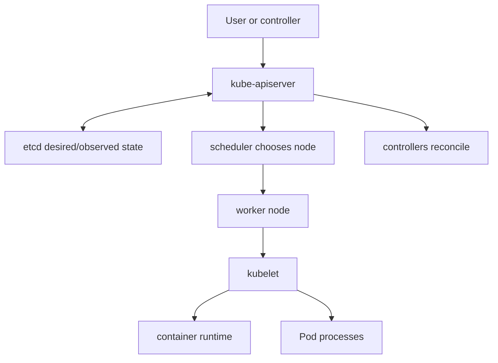
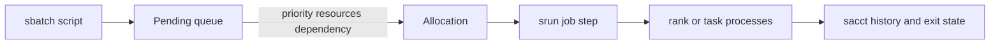
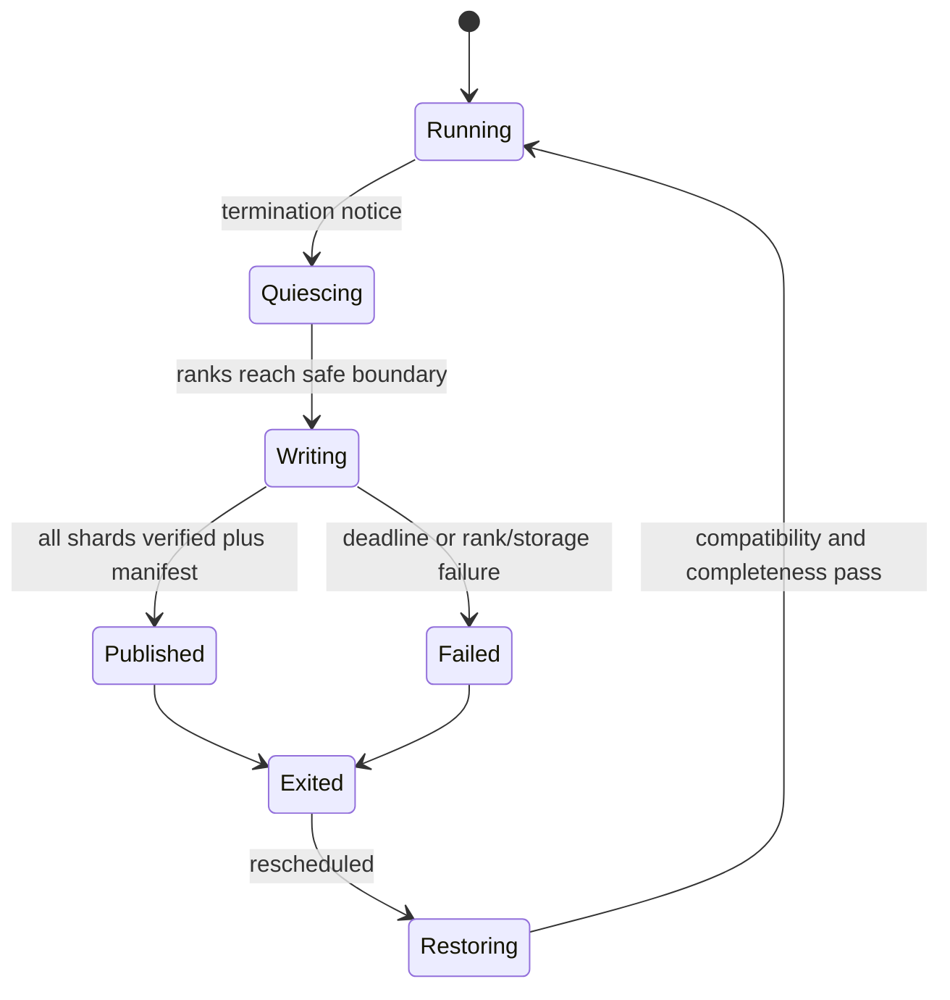

# Chapter 9 — Kubernetes and Slurm Operations Laboratory

## 1. Scheduler versus runtime

A scheduler decides where and when a workload may run under resources and policy.
The container runtime realizes the container on an assigned node. Neither decides
whether the ML experiment is scientifically valid.


*Web visual: [Kubernetes components](https://kubernetes.io/docs/concepts/overview/components/).
The compact diagram below remains readable when remote images are unavailable.*



## 2. Kubernetes workload reasoning

A Pod is the basic scheduling unit and may contain cooperating containers sharing
network/storage namespaces. A Job manages Pods expected to terminate successfully.
A Deployment targets continuously available replicated services. Distributed
training often needs an operator/controller plus gang scheduling so partial ranks
do not reserve GPUs while waiting indefinitely.

### Resource semantics

- request informs placement and reserves schedulable capacity;
- limit constrains runtime use where supported;
- GPU/device resources are exposed by a device plugin or dynamic allocation;
- labels/affinity select properties; taints/tolerations control admission;
- priority/preemption expresses policy, not job importance in human terms;
- topology constraints influence locality and failure spread.

CPU request/limit behavior differs from memory failure behavior. GPU resources
are commonly integral and not overcommitted. Consult cluster policy and current
API docs; do not cargo-cult a manifest from another environment.

## 3. Read a failed Kubernetes Job

Ordered evidence:

```bash
kubectl get job,pod -o wide
kubectl describe pod POD_NAME
kubectl logs POD_NAME --all-containers=true
kubectl get events --sort-by=.metadata.creationTimestamp
```

Distinguish Pending (placement/image/volume), container waiting, running but
unhealthy, application nonzero exit, OOMKilled, eviction/preemption, and controller
retry exhaustion. Logs can be absent after node loss; centralize important logs
and write result/checkpoint artifacts independently.

## 4. Slurm workload reasoning

Slurm allocates nodes/resources to jobs and launches steps/tasks inside an
allocation. Learn the site’s meanings of partition, account, QOS, constraints,
GRES, reservation, preemption, and container integration.



Use `squeue` for current state and `sacct` for accounting/history. A job may wait
because of priority, dependencies, unavailable topology, reservation, QOS, or
requested resources—not just total free GPUs.

## 5. Distributed launch invariants

Before model code, log one line per process with hostname, process ID, global/local
rank, world size, selected device, rendezvous endpoint, image digest, and network
interface. Assert unique global ranks, expected world size, and one intended
process per device.

Common launch error: Slurm starts one launcher per GPU while each launcher also
spawns one worker per GPU, multiplying processes. Decide whether the scheduler or
framework launcher creates local workers and verify with a smoke job.

## 6. Checkpoint/preemption state machine



Only the published manifest makes a distributed checkpoint eligible for restore.
Object existence alone does not prove all rank shards and metadata agree.

## 7. Hands-on drills

### Drill A — Unschedulable request

Create a hypothetical Pod or Slurm job asking for an unavailable accelerator/
topology. Identify which status/event/reason proves the cause and what smaller or
alternative request preserves the experiment.

### Drill B — Image-pull failure

Differentiate missing tag/digest, registry authentication, DNS/network, rate limit,
platform architecture mismatch, and corrupt content. State retry policy; infinite
retry wastes allocation and hides the incident.

### Drill C — Rank failure

Kill one worker in a toy distributed job. Verify peers time out, diagnostics are
captured, processes terminate coherently, incomplete checkpoint is rejected, and
retry resumes idempotently.

### Drill D — Data bottleneck

Measure accelerator duty cycle, loader wait, storage throughput/IOPS, CPU work,
and per-rank skew. Compare local staging, larger sequential shards, prefetch depth,
and worker count one change at a time.

## 8. Incident matrix

| Evidence | Likely class | Next discriminating check |
|---|---|---|
| Pending with no fitting node | resource/topology/quota | scheduler event/reason and node allocatable |
| `ImagePullBackOff` | registry/auth/name/network | exact image ref, credential scope, node pull |
| exit 137 / OOMKilled | memory or external kill | cgroup peak/events, scheduler reason, node event |
| all ranks stop at collective | dead/slow/mismatched rank | per-rank last event, topology, collective trace |
| periodic long steps | checkpoint/eval/storage/GC | correlate phase markers with I/O and CPU |
| one rank slower | data skew, topology, throttling | per-rank batch bytes/timing and placement |

## 9. Senior design prompt

Design a shared accelerator platform for interactive debugging, batch sweeps, and
multi-node training. Cover quotas, fairness, gang scheduling, preemption,
checkpoint contracts, data locality, image provenance, secrets, network policy,
observability, cost attribution, utilization, and noisy-neighbor isolation.
