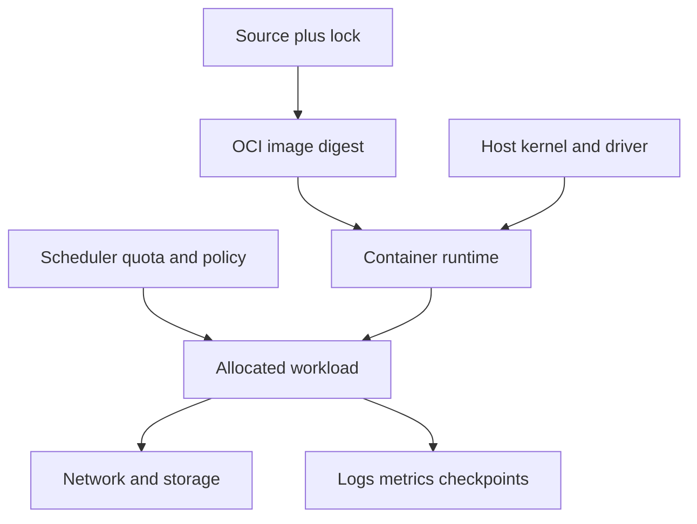

# Part 14 — Linux, Containers, Docker, Compose, Kubernetes, and Slurm

This part begins with general Linux, container, Docker, Kubernetes, and Slurm
knowledge. Only after those foundations does it apply them to GPU and distributed
ML workloads.

## Prerequisites

Read Chapters 1–7 immediately after Part 3; they are general engineering
foundations. Read Chapters 8–9 after Parts 11–13 for ML cluster application. You
need a shell and Docker-compatible runtime for local labs; Kubernetes, Slurm, and
a GPU are optional because manifests and failure reasoning can be practiced without
administering a production cluster.

## Read in this order

| Chapter | Scope | Deliverable |
|---:|---|---|
| 1 | [Linux and shell fundamentals](01-linux-shell-fundamentals.md) | Navigate, script, control processes, permissions, streams, packages, and services safely |
| 2 | [Linux systems, resources, and diagnostics](02-linux-systems-and-diagnostics.md) | Diagnose processes, memory, CPU, storage, networking, and cgroup failures |
| 3 | [Containers and Docker fundamentals](03-container-docker-fundamentals.md) | Explain architecture and operate the complete image/container lifecycle |
| 4 | [Docker images, builds, runtime security, and GPU practice](04-docker-build-runtime.md) | Build and inspect a reproducible non-root image |
| 5 | [Docker networking, storage, Compose, and operations](05-docker-networking-storage-compose.md) | Operate and diagnose a multi-container application |
| 6 | [Kubernetes fundamentals](06-kubernetes-fundamentals.md) | Deploy, expose, configure, secure, update, and debug Kubernetes workloads |
| 7 | [Slurm and HPC fundamentals](07-slurm-hpc-fundamentals.md) | Request, launch, observe, and troubleshoot scheduled HPC jobs |
| 8 | [Container and cluster ML operations reference](08-container-cluster-operations-reference.md) | Connect OCI, GPUs, schedulers, storage, networking, and distributed lifecycle |
| 9 | [Kubernetes and Slurm operations lab](09-kubernetes-slurm-operations-lab.md) | Submit, observe, fail, resume, and postmortem a training job |

## Exit gate

You must be able to operate a shell safely; explain Linux files/processes/resources;
distinguish container from VM and image from container; build, run, network, store,
compose, secure, and debug Docker workloads; explain Kubernetes reconciliation,
Pods/controllers/Services/storage/RBAC/scheduling; use Slurm jobs/steps/tasks/arrays;
and diagnose image failure, node failure, OOM, data stall, and collective hang.
