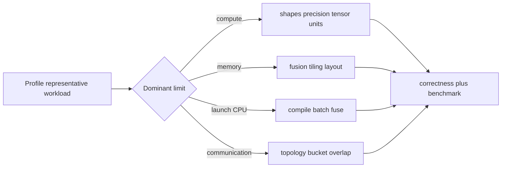

# Part 15 — Accelerators, Kernels, Compilation, and Profiling

This part teaches performance as measurement and data movement, not folklore.
Read it after Parts 7, 14, and basic linear algebra from Part 2.

## Chapters

1. [Accelerator architecture, CUDA, Triton, and profiling](01-accelerators-and-kernels.md)
   covers execution hierarchy, memory, matrix multiplication, fusion, precision,
   compilation, communication, and kernel correctness.
2. [Profiling and kernel laboratory](02-profiling-kernel-lab.md) turns the reference
   into repeatable bottleneck, correctness, and optimization experiments.

## Part project

Profile a transformer block, identify its top bottleneck, implement or select one
optimization, verify outputs/gradients over adversarial shapes and dtypes, and
report warm/cold latency, throughput, memory, numerical error, and regression
conditions. A faster incorrect kernel fails the project.

## Exit gate

Explain arithmetic intensity and roofline reasoning, GPU thread/block/warp and
memory hierarchy, coalescing/tiling/fusion, synchronization, occupancy trade-offs,
stable reductions/softmax, compilation graph breaks, and why asynchronous timing
requires synchronization or accelerator events.

