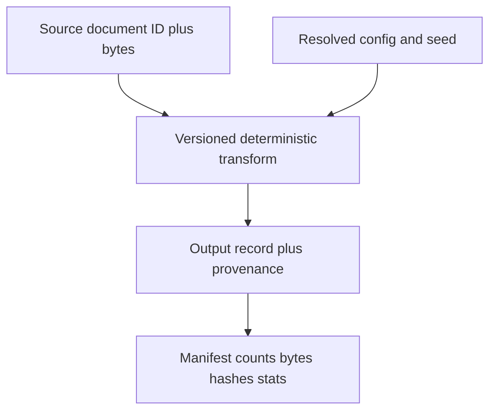

# Chapter 2 — Data-Pipeline and Tokenizer Laboratory

## 1. Data contract

Every dataset version needs source/version/time, lawful basis or permission status,
content digest, schema, parser/filter/tokenizer code identity, statistics, known
limitations, access policy, retention/deletion procedure, and downstream runs.
“Downloaded on Tuesday” is not an identity.

## 2. Deterministic transform rule

A transform should be a versioned function of immutable inputs, resolved config,
and declared randomness. Distributed execution may change ordering unless record
identity and partition/merge rules are explicit. Test the same corpus under one
worker and many workers for equal output set and intended order.

## 3. Exact dedup lab

Normalize only according to stated semantics, hash content, group equal hashes,
and select a representative deterministically. Measure raw versus normalized
duplicates separately: aggressive normalization can collapse distinct code,
tables, identifiers, or Unicode text.

Tests: input order permutation, distributed partition count, hash collision
handling, source-priority tie break, and provenance of every removed record.

## 4. Near-dedup lab

Tokenize into shingles; estimate Jaccard similarity using MinHash; use LSH buckets
to generate candidates; verify candidates with an exact/suitable similarity. Audit
false positive and false negative pairs across languages, code, templated pages,
and short documents.

If sets `A` and `B` contain shingles:

> `J(A,B) = |A ∩ B| / |A ∪ B|`

MinHash estimates this set similarity; it does not establish semantic equivalence
or copyright status. Keep threshold/shingle/normalization versions in lineage.

## 5. Decontamination lab

Create held-out benchmark items and variants. Search exact strings, normalized
forms, n-grams, and task-specific structures. Perform contamination checks before
final mixture selection and separately audit post-training/evaluator prompts.

False confidence risks:

- benchmark paraphrases or solutions appear without question text;
- code tests or answers leak through derived repositories;
- timestamps/provenance are incomplete;
- a benchmark itself was derived from training-like public data;
- model selection repeatedly adapts to a public leaderboard.

Report detection method and residual risk; never write “zero contamination” based
only on exact matching.

## 6. Tokenizer analysis

For each domain/language slice compute tokens per character/byte/word, unknown or
byte-fallback rate, length distribution, special-token handling, round-trip
behavior, normalization effects, and compression/sequence-cost implications.

A tokenizer is part of model architecture and checkpoint compatibility. Changing
vocabulary IDs invalidates embeddings/output heads unless explicitly migrated.

Tests include empty string, whitespace, Unicode normalization forms, combining
marks, emoji, right-to-left text, invalid bytes per contract, code indentation,
special-token injection, and encode/decode round-trip expectations.

## 7. Packing and masks

Packing multiple documents into fixed sequences reduces padding. It also risks
cross-document attention or targets if boundaries are mishandled. Specify:

- separator/end token insertion;
- whether attention crosses document boundaries;
- which positions contribute to loss;
- position-ID reset policy;
- handling of overlong documents and final partial packs;
- deterministic assignment across workers/ranks.

Test a tiny packed batch by printing token IDs, document IDs, position IDs,
attention mask, and loss mask. Verify every supervised token by hand.

## 8. Mixture accounting

If source `i` has sampling weight `w_i`, log both intended probability and realized
token counts. Sampling with replacement, temperature reweighting, exhaustion, and
document-length differences make “30% source A” ambiguous unless the unit is named.

Measure quality/capability impact through controlled ablations. A filter can
improve a proxy while removing dialects, minority languages, rare expertise, or
adversarial examples needed for robustness.

## 9. Loader correctness and performance

Assert that global sample IDs are unique when intended, resume restores the exact
cursor/order contract, all ranks receive expected token counts, padding/packing
statistics are logged, corrupt shards fail with actionable identity, and retries
do not duplicate consumption. Profile storage wait, decode/tokenize CPU, queue
depth, pinned-memory transfer, and per-rank skew.

## 10. Data card and go/no-go review

Before training, review rights, privacy/secrets, harmful content handling,
decontamination, slice representation, tokenizer performance, filter ablations,
realized mixture, loader repeatability, deletion/retention, and artifact access.
Compute availability is not permission to train.

