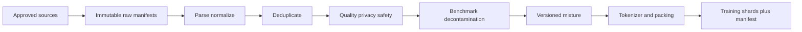

# Part 16 — Foundation-Model Data and Tokenization

This part treats data as a governed, versioned component of the model—not a folder
of text files. Complete Parts 4, 11, 13, and 14 first.

## Chapters

1. [Foundation-model data engineering](01-foundation-model-data.md): rights,
   manifests, parsing, exact/near deduplication, quality/privacy filtering,
   decontamination, mixtures, tokenization, packing, sharding, and deletion.
2. [Data-pipeline and tokenizer laboratory](02-data-tokenizer-lab.md): implement
   deterministic transforms, leakage checks, mixture accounting, and loader tests.

## Exit gate

You can explain source licensing/consent boundaries, content-addressed manifests,
exact versus near deduplication, MinHash/LSH intuition, decontamination limits,
tokenizer fertility and byte fallback, document-boundary masks, mixture sampling,
deterministic distributed sharding, data deletion limits, and dataset lineage.

