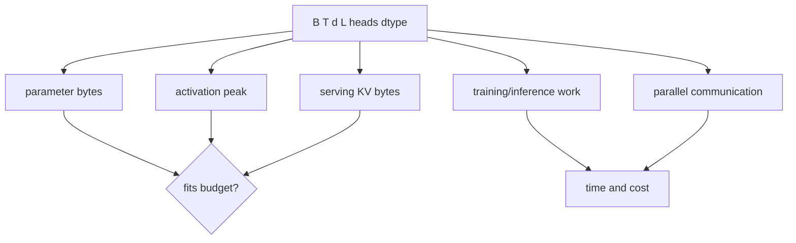

# Chapter 2 — Architecture Accounting and Ablation Workbook

## 1. Dense decoder parameter estimate

Let vocabulary `V`, model width `d`, layers `L`, and feed-forward hidden width `m`.
Ignoring biases/norm parameters and assuming tied input/output embeddings:

> embeddings approximately `V × d`

> attention projections per layer approximately `4d²` for ordinary MHA

> two-matrix MLP per layer approximately `2dm`; gated MLP approximately `3dm`

> total approximately `Vd + L(4d² + 3dm)` for gated dense blocks

Exact counts depend on GQA/MQA dimensions, biases, untied head, expert count,
shared experts, and implementation. Write a script that enumerates parameter names
and reconciles estimate to exact count.

## 2. Attention scaling

For batch `B`, sequence length `T`, width `d`, ordinary attention score work/memory
contains a quadratic `T²` term; projections/MLP scale roughly linearly in `T` and
quadratically in width. At shorter sequences/large width, projections and MLP can
dominate; “attention is quadratic” does not mean it dominates every workload.

## 3. KV-cache comparison

For decoder inference, cache K and V for each layer/token. With `h_kv` KV heads,
head dimension `d_h`, element bytes `b`, batch of active sequences `B`, and cached
tokens `T`, a first-order estimate is:

> `KV bytes ≈ 2 × L × B × T × h_kv × d_h × b`

MHA uses `h_kv = h_query`; GQA uses fewer KV heads; MQA uses one. Include allocator
fragmentation, block metadata, speculative branches, prefix sharing, and sharding
when capacity planning.

## 4. MoE accounting

Distinguish total parameters from active parameters/tokens and realized compute.
For top-`k` routing among `E` experts, each token activates `k` expert paths, but
router, shared layers, capacity padding/dropped tokens, all-to-all communication,
and load imbalance add cost.

Record router entropy, per-expert token counts, capacity utilization, overflow,
auxiliary loss, expert gradients, and communication. A high total parameter count
does not imply dense-equivalent FLOPs, memory placement, or quality.

## 5. Scaling-law discipline

Fit loss against compute/data/model scale only inside a measured regime. Report
functional form, estimation data, uncertainty/residuals, held-out validation,
and changes in tokenizer, data mixture, architecture, or optimizer. Extrapolation
across regime changes is a hypothesis, not a fact.

Compute-optimal estimates guide allocation under assumptions; downstream quality,
inference budget, data scarcity/quality, and future post-training may favor a
different point.

## 6. Fair ablation design

For each architecture comparison choose what is held equal:

- parameter count (total or active?);
- training tokens and data order;
- training FLOPs or wall-clock/money;
- optimizer/tuning budget;
- context distribution and tokenizer;
- serving latency/memory/cost;
- evaluation and statistical replication.

No single fairness definition answers every product question. State the resource
constraint the decision actually faces.

## 7. Long-context experiment

Evaluate more than maximum accepted length:

- retrieval position and distractor count;
- multi-hop integration and order sensitivity;
- effective use versus copying;
- perplexity/calibration by position;
- prefill time, memory, KV capacity, and throughput;
- behavior beyond training length and positional rescaling;
- prompt-injection/hidden-instruction risk in large contexts.

A “needle” success alone does not prove general long-context reasoning.

## 8. Architecture design case

Design a multilingual code model with a fixed training-compute budget and strict
serving KV memory. Compare dense versus MoE, MHA versus GQA, tokenizer sizes,
context length distribution, retrieval, and model width/depth. Produce parameter,
FLOP, memory, communication, data, evaluation, and operational-risk tables.

## 9. Interview prompts

1. Why might GQA improve serving capacity with limited quality loss?
2. When can increasing context length reduce throughput without improving tasks?
3. Compare dense and MoE under fixed active compute and limited network bandwidth.
4. Why are model-size comparisons confounded by tokenizer and data mixture?
5. How would you detect that a scaling trend has entered a new regime?

