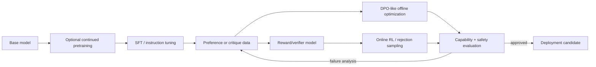
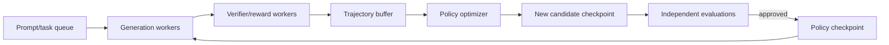

# Chapter 1 — Fine-Tuning, Preference Learning, and Post-Training

## 1. Post-training is behavior engineering

Pretraining learns broad representations and next-token behavior. Post-training
uses narrower data/objectives to make a model follow instructions, specialize,
use tools, reason in target domains, and satisfy safety/product policies.

This is not a mandatory linear recipe. Sometimes SFT is enough; sometimes RAG or a
deterministic tool is better than changing weights.

## 2. Decide whether to change weights

| Need | First approach to test |
|---|---|
| changing private facts | retrieval/database/tool |
| strict output syntax | constrained decoding + validator |
| a few instructions | prompt/few-shot examples |
| stable style/task behavior | SFT or adapter |
| domain language distribution | continued pretraining, then instruction recovery |
| human/AI preferences | preference objective or reward/RL |
| lower serving cost | distillation, smaller model, quantization, routing |
| permissions/safety boundary | deterministic architecture and policy |

Fine-tuning cannot make authorization probabilistically safe and is a poor database
for rapidly changing facts.

## 3. Continued pretraining

Train the base causal/denoising objective on a domain mixture. Useful for vocabulary,
style, knowledge, or representations absent from instruction data.

Risks:

- catastrophic forgetting of general capability;
- domain overfit and reduced safety behavior;
- tokenizer mismatch;
- contaminated/evaluation-leaking corpus;
- poor domain data overwhelming high-quality base distribution;
- learning-rate/step budget too aggressive.

Use replay/general mixture, lower rates, checkpoint trajectories, broad evaluation,
and a subsequent instruction-tuning stage when needed.

## 4. Supervised fine-tuning (SFT)

Given prompt x and desired response y = (y₁…yT):

> **L_SFT = −Σₜ mₜ log πθ(yₜ | x, y<t) ÷ Σₜmₜ**

mₜ normally includes assistant response tokens and excludes padding; whether to
train on system/user text is an explicit recipe choice. For multi-turn chat, decide
which assistant turns receive loss.

### Data details that often dominate

- chat template and role/control tokens;
- truncation side and preservation of the answer;
- loss mask and example/token weighting;
- duplicate prompts or templated synthetic answers;
- task/domain/language/safety mixture;
- sequence packing and cross-example attention;
- answer quality, factual grounding, and tool trace validity;
- train/evaluation decontamination.

Decode a batch into a table of token, role, label, and mask before any long run.

## 5. Full fine-tuning

Updates all parameters.

Advantages:

- greatest adaptation capacity;
- no adapter routing at inference;
- can alter representations throughout model.

Costs/risks:

- parameter, gradient, optimizer, and checkpoint memory;
- one large artifact per variant;
- broader catastrophic forgetting/safety regression;
- distributed training complexity;
- merging multiple specializations is not trivial.

Use when the behavior change is substantial, sufficient high-quality data exists,
and evaluation justifies the operational cost.

## 6. Parameter-efficient fine-tuning (PEFT)

Freeze most base weights and train a small set of parameters.

### LoRA

For base matrix W ∈ ℝdout×din, learn low-rank update:

> **W′ = W + (α ÷ r)BA**

where A ∈ ℝr×din, B ∈ ℝdout×r, and rank r is small.

Trainable parameters per targeted matrix:

> **r(din + dout)**

instead of din×dout. Common initialization makes the initial update zero so the
adapter begins as the base model.

Tune:

- target modules (attention, FFN, all linear, embeddings/head);
- rank r and scaling α;
- dropout;
- learning rate/decay;
- modules that must remain trainable/saved;
- adapter merge or dynamic routing strategy.

LoRA saves optimizer/gradient memory for frozen weights, but base forward and
activations still consume memory. Low rank is a capacity assumption, not a
guarantee.

### QLoRA-style training

Store the frozen base in a low-bit quantized representation, compute through
dequantized/higher-precision kernels, and train LoRA adapters. It reduces base
weight memory. Important details:

- quantizer and group/block scales;
- compute dtype;
- double/nested quantization where used;
- target modules, often all linear layers;
- paging/offload behavior;
- quantization calibration/error;
- adapter save/merge and serving compatibility.

Do not update quantized frozen integers as if they were ordinary trainable weights.
Evaluate rare tokens, long context, numerical tasks, safety, and target domains.

### Other PEFT categories

- bottleneck adapters inserted between layers;
- prefix/prompt tuning learns virtual prompt representations;
- IA3-like vectors rescale activations;
- selective layer/norm/bias tuning;
- adaptive-rank/orthogonal/structured low-rank variants.

Tool libraries expose many methods. Choose a simple baseline and compare capacity,
quality, memory, training time, serving complexity, and artifact governance.

## 7. Adapter operations

Many adapters create a multi-tenant model platform problem:

- base and tokenizer compatibility;
- adapter identity/version/signature;
- merge versus runtime composition;
- per-request adapter loading and cache;
- batch fragmentation when requests use different adapters;
- untrusted adapter code/weights;
- deletion and access control;
- evaluation for adapter combinations.

An adapter is a model artifact and must have lineage/model-card controls.

## 8. Preference data

A pair contains prompt x, preferred response y⁺, and rejected y⁻. Record:

- response-generating policies and decoding parameters;
- presentation order randomized;
- rubric and policy version;
- annotator/judge expertise;
- tie, strength, confidence, and disagreement;
- task, risk, language, and source slices;
- whether preference reflects correctness, style, safety, or multiple criteria.

Length and verbosity are common shortcuts. Include adversarial pairs where a longer
answer is worse and separate rubric dimensions.

## 9. Reward modeling

A scalar reward model rφ(x,y) can be trained with Bradley–Terry/logistic pairwise
loss:

> **L_RM = −log σ(rφ(x,y⁺) − rφ(x,y⁻))**

Only reward differences are identified by this loss; absolute scale/offset require
calibration conventions. Validate pair accuracy by slice, calibration of margins,
out-of-distribution behavior, length/style correlations, and adversarial gaming.

Reward models are learned proxies, not ground truth. Ensemble/disagreement can
surface uncertainty but does not remove shared bias.

### Outcome and process reward models

- outcome reward judges final result;
- process reward judges intermediate steps;
- verifier checks an executable/formal/property-based result.

Process labels offer denser credit but are costly and can reward plausible-looking
steps. Verifiable rewards are powerful for code/math/tool tasks but require secure,
correct test environments and hidden cases.

## 10. Classical RLHF with PPO

The language model is a policy; prompt/context is state, generated token is action,
and sequence receives reward. A common pipeline keeps:

- trainable policy;
- frozen reference policy for KL regularization;
- reward model/verifiers;
- value/critic model;
- rollout generation engine;
- old-policy log probabilities used by PPO.

A shaped sequence objective often resembles:

> **reward_total = reward_model(x,y) − β × KL(policy || reference)**

Tokenwise estimators may use sampled log-probability difference as KL signal.

PPO ratio for token/action t:

> **ρₜ(θ) = πθ(aₜ|sₜ) ÷ πold(aₜ|sₜ)**

Clipped policy term:

> **min[ρₜAₜ, clip(ρₜ, 1−ε, 1+ε)Aₜ]**

plus value loss, entropy bonus, and possibly explicit KL control. See the RL chapter
for advantage/GAE derivation.

Failure modes:

- reward overoptimization and distribution shift;
- critic/value error and high-variance advantages;
- stale rollouts or incorrect old/reference log probabilities;
- token/sequence masks and length bias;
- policy collapse or excessive KL;
- reward normalization hiding scale changes;
- actor/critic/reference/reward memory and synchronization cost;
- evaluator exploit rather than task improvement.

## 11. Direct Preference Optimization (DPO)

DPO uses preference pairs and reference-policy log-probabilities without a separate
deployed reward-model/PPO loop. A common loss is:

> **L_DPO = −log σ(β[(log πθ(y⁺|x) − log πref(y⁺|x))
> − (log πθ(y⁻|x) − log πref(y⁻|x))])**

Interpretation: increase the preferred response’s relative log-probability more
than the rejected response’s, measured against reference. β controls strength/
implicit KL trade-off under the derivation’s assumptions.

Implementation details:

- sum versus length-normalized response log-probabilities;
- correct prompt/response masks and shared truncation;
- frozen reference or reference-free implementation semantics;
- label smoothing/ties/noisy preferences;
- numerical stability of log-sigmoid;
- chosen/rejected tokenization consistency;
- broad evaluation for overfit and probability collapse.

DPO is simpler than online PPO but is still offline, preference-data-dependent, and
not universally superior.

## 12. Other offline preference objectives

Families include IPO-, KTO-, ORPO-, CPO-, SimPO-like and ranking/classification
variants. They differ in reference use, data format (pairs versus desirable/
undesirable), margins, normalization, and theoretical assumptions.

Do not create a vocabulary checklist. For any method derive:

1. what data it consumes;
2. what probability ratio/margin it changes;
3. where reference or KL enters;
4. how length and noise affect it;
5. whether it is online/offline;
6. what baseline it should be compared with.

## 13. Rejection sampling and best-of-N

Generate N candidates, score with verifier/reward, then use the best directly or as
new SFT data.

Advantages: conceptually simple and parallel generation. Costs/risks:

- inference cost grows with N;
- selection amplifies reward-model exploits;
- candidate diversity and temperature affect gains;
- repeated self-training can narrow distribution;
- training on selected data changes future generator distribution.

Always evaluate selected outputs with independent judges/tests.

## 14. GRPO-style online optimization

For each prompt, sample a group of responses and compute relative advantages from
their rewards, commonly by centering/scaling within group:

> **Aᵢ = (rᵢ − group mean) ÷ (group standard deviation + ε)**

Then optimize a clipped policy-ratio objective with KL/reference regularization,
without a separate learned value model in the original motivation.

Benefits: removes critic memory/learning and works well with verifiable grouped
rewards. Risks:

- no learning signal when group rewards are identical;
- relative normalization discards absolute scale across prompts;
- reward sparsity and group size/temperature drive sample efficiency;
- estimator/implementation variants differ;
- same reward hacking, KL, stale-policy, and rollout cost issues as online RL.

GRPO was introduced as a PPO variant; it does not replace the need to understand
policy gradients and clipping.

## 15. Leave-one-out and related baselines

RLOO-style estimators use rewards of other samples for the same prompt as a baseline
for one sample, reducing variance without a learned critic under assumptions. More
generally, baselines must not introduce action-dependent bias into the policy-
gradient estimator. Compare variance, compute, and robustness, not acronym novelty.

## 16. RLAIF and constitutional feedback

AI feedback can generate critiques, revisions, preferences, or reward labels under
a written constitution/rubric. A typical pattern:

1. model drafts answer;
2. critic identifies violations using principles;
3. model revises;
4. revised data supports SFT;
5. AI comparisons train preference/reward model;
6. preference/RL training follows.

This scales oversight but inherits evaluator capability/bias and prompt injection.
Humans still define/approve principles, audit difficult cases, and own consequences.

## 17. Reasoning and agent post-training

Verifiable tasks can reward final answers, tests, proofs, or environment outcomes.
Agent rollouts include tool calls and environment state, requiring:

- deterministic typed tool interface;
- sandbox and least privilege;
- resettable versioned environment;
- idempotent/reversible actions;
- trajectory masks and action log probabilities;
- bounded horizon/time/cost;
- outcome and process traces;
- resistance to reward/test leakage;
- evaluation on hidden environments.

Long trajectories intensify credit assignment and policy lag. The reward must not
be exploitable by editing tests, reading hidden answers, or claiming success.

## 18. Rollout and training architecture

Systems decisions:

- colocated versus disaggregated generation/training;
- synchronous on-policy batches versus bounded staleness;
- weight transfer/checkpoint frequency;
- inference engine compatibility with training model;
- deterministic log-prob recomputation;
- task/reward balancing;
- queue backpressure and failed trajectory handling;
- replay policy and provenance;
- GPU allocation among generation, reward, actor, critic, reference.

Throughput without policy freshness/correct log probabilities can invalidate the
algorithm.

## 19. Distillation

### Logit distillation

Match teacher distribution q at temperature T with student p:

> **L_KD = T² × KL(q_T || p_T)**

Often combine with hard-label loss. The T² factor convention compensates gradient
scale in a common formulation.

### Response/rationale/tool-trace distillation

Train on teacher-generated targets. Cheaper to store than logits but discards dark
probability information and can reproduce teacher errors.

### On-policy distillation

Teacher feedback is collected on student-generated states, reducing distribution
mismatch but increasing online cost.

Evaluate student independently. Distillation can transfer style, bias, hallucination,
and reward hacks; it does not grant teacher capability automatically.

## 20. Post-training evaluation

Evaluate:

- target tasks and hard/rare slices;
- general capability and catastrophic forgetting;
- calibration, uncertainty, and abstention;
- safety compliance and over-refusal;
- factuality, citation, and tool correctness;
- reward-model and independent human/executable metrics;
- multiple generation temperatures/seeds;
- long context and adversarial prompts;
- latency, output length, and cost;
- contamination/memorization.

Plot reward against independent quality over optimization steps. Reward rising while
independent quality plateaus/falls is an overoptimization warning.

## 21. Data flywheel risks

Deployed preference data is selected by the current model, UI, users, and policy.
Thumbs-up is not a random unbiased label. Strong models produce fewer obvious errors,
making future feedback sparser and concentrated. Synthetic-model loops can reduce
diversity.

Use targeted audits, exploration, fresh expert tasks, disagreement sampling, hidden
benchmarks, and versioned policy. Do not train blindly on all positive feedback.

## 22. Tools

- Hugging Face Transformers/Datasets for accessible model/data workflows;
- PEFT for LoRA and other parameter-efficient methods;
- TRL for SFT, reward, DPO, GRPO, PPO/RLOO-like trainers;
- distributed stacks such as FSDP/DeepSpeed/Megatron/NeMo;
- vLLM/SGLang-like generation engines for scalable rollouts;
- experiment trackers and evaluation harnesses.

Tools do not guarantee algorithmic correctness. Inspect masks, log probabilities,
reference policy, reward scaling, KL, generated samples, and version compatibility.

## 23. Practical labs

1. Build SFT labels/masks and visually audit ten sequences.
2. Compare full fine-tuning, LoRA, and QLoRA-style adaptation on memory/time/quality.
3. Implement pairwise reward loss and audit length bias.
4. Implement DPO loss from token log probabilities and compare framework output.
5. Run a toy PPO or GRPO verifiable task; plot reward, KL, entropy, and independent
   success.
6. Red-team the reward and demonstrate at least one exploit plus mitigation.
7. Design a rollout architecture with checkpoint/policy-version guarantees.

## 24. Primary references

- [InstructGPT / RLHF](https://arxiv.org/abs/2203.02155)
- [LoRA](https://arxiv.org/abs/2106.09685)
- [QLoRA](https://arxiv.org/abs/2305.14314)
- [Direct Preference Optimization](https://arxiv.org/abs/2305.18290)
- [DeepSeekMath / GRPO](https://arxiv.org/abs/2402.03300)
- [Constitutional AI / RLAIF](https://arxiv.org/abs/2212.08073)
- [Hugging Face TRL documentation](https://huggingface.co/docs/trl/index)
- [Hugging Face PEFT LoRA guide](https://huggingface.co/docs/peft/main/conceptual_guides/lora)

Post-training methods evolve quickly. State the exact paper/objective and library
version rather than using a broad acronym as if all implementations were identical.
